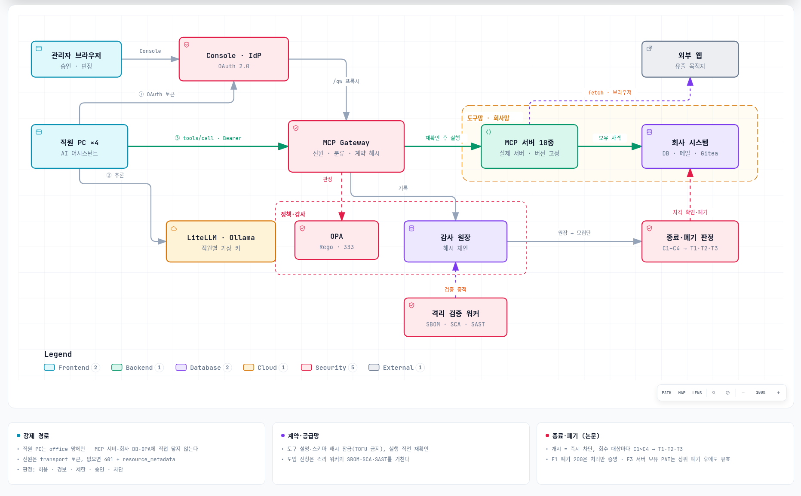

# MCP Governance Security Gateway

직원들이 **자기 PC에서 Claude Code·Codex CLI·Gemini CLI·OpenCode 같은 AI 하네스를 평소처럼 쓸 때** 오가는 MCP 통신을
한곳으로 모아, 모든 도구 호출을 **실행 전에** 판정하는 게이트웨이와, MCP 이용 관계를 **끝냈다고 말할 수 있는지**
판정하는 종료·폐기 절차를 한 저장소에서 재현하는 보안 테스트베드입니다.

> **범위:** 합성 계정과 합성 회사(BoB Corp) 데이터를 쓰는 재현용 랩입니다. 운영망의 SSO, 키 관리,
> TLS, 호스트 방화벽과 중앙 로그 보존을 대신하지 않습니다.

## 무엇이 들어 있나 (v3)

- **직원 PC 4대**(ws-ysg·ws-jwj·ws-pse·ws-nkk): 사내망(`office`)의 컨테이너에 **실제 하네스**를 공식 패키지 그대로
  설치했습니다 — Claude Code 2.1.282, Codex CLI 0.157.0, Gemini CLI 0.61.0, OpenCode 1.18.32. 회사가 더한 것은 IT 부서가 더하는
  것뿐입니다: 레지스트리에서 생성한 **관리형 MCP 설정**(서버마다 Gateway의 `/mcp/<server>/`), SSO 자격 도우미(`bob-sso`),
  단말 에이전트. 하네스의 LLM은 회사 LLM 게이트웨이(LiteLLM, 직원별 가상 키) 뒤의 로컬 모델이고, LiteLLM이 하네스마다 다른
  API 형식(Anthropic·Responses·Gemini·Chat)을 번역합니다. 협력사 직원 PC에는 Gateway를 우회하는 섀도 MCP 설정이 있습니다.
- **BoB Corp**: 회사 DB(PostgreSQL)·Redis·메일(GreenMail)·코드 저장소(Gitea)·인트라넷·공유 드라이브, 그리고 "외부 인터넷" 모사.
  시드 데이터에 개인정보·급여·유출된 비밀·프롬프트 주입 페이지가 있습니다.
- **실제 MCP 서버 10종**: filesystem · git · fetch · memory · desktop-commander · postgres-mcp · redis · mcp-email-server ·
  gitea-mcp · @playwright/mcp (버전 고정, 계약 해시 잠금). 직원 PC는 이 서버들에 직접 닿지 못합니다.
- **Gateway**: 신원(transport 토큰) → 자원 분류(경로·SQL·URL·수신자·키) → 승인 스키마 검증 → **Presidio 개인정보 검사** →
  OPA/Rego(권한 번들 + SSRF·DLP·민감정보 반출·열람→반출 연쇄·계약·공급망·섀도·종료 통제) → 같은 연결에서 계약 재확인 → 실행 →
  **결과 개인정보 마스킹** → 해시 체인 감사. 어느 하네스(clientInfo)가 어느 서버를 불렀는지도 함께 기록합니다(판정에는 쓰지 않음).
- **Console**(웹): 개요·활동 로그·승인·MCP 서버·직원·단말·도입 신청·종료·폐기·정책. 화면마다 페이지 내 탭과 차트
  (시간대별 판정, 하네스 → 서버 → 판정 흐름, 판정 행렬 등). 웹에서 MCP를 호출하지는 않습니다.
- **논문 구현**: 「원격 MCP 서비스 종료 시 권한 회수의 구조적 한계 및 종료 판정 기준 제안」(CISC-W'26)의 이용 관계 단위 판정
  (C1 모집단·C2 수행 권한·C3 연속성·C4 증거 접근 → T1/T2/T3)과 실험 E1~E3.

## 빠른 시작

Docker Engine이 있는 Linux 또는 WSL2에서:

~~~bash
git clone https://github.com/MCP-governance/mcp-gateway.git
cd mcp-gateway/full_stack_lab
./console.sh up          # 첫 실행은 이미지 빌드(하네스 설치)와 모델 다운로드로 수십 분 (LLM 없이: --no-llm)
./console.sh harnesses   # 각 PC의 하네스 4종이 Gateway의 MCP 서버 10개에 붙는지 (모델 없이)
./console.sh workday     # 네 직원이 각자의 하네스로 하루 업무 (모델이 도구를 고름)
./console.sh ask ws-ysg "공유 드라이브의 /shared/team/platform/deploy-checklist.md 를 요약해 줘" --servers filesystem
./console.sh watch       # 다른 창에서: Gateway 판정을 한 줄씩
./console.sh test        # 전체 검증
~~~

- Console: <http://localhost:8000> — `kkg@bob.local` / `test-password` (관리자)
- 포트가 겹치면 `.env`에 `CONSOLE_PORT`·`GATEWAY_PORT`·`GITEA_PORT`를 지정합니다.
- PC 안에서 직접: `docker compose exec ws-ysg bash -l` 뒤 `claude -p "…"`, `codex exec "…"`, `gemini -p "…"`, `opencode run "…"`.
- 로컬 모델은 CPU로 돕니다. 기본 `qwen3.5:2b-q4_K_M`(적재 1.7GB), 메모리가 넉넉하면 `.env`에 `LOCAL_LLM_MODEL=qwen3.5:4b`.
  하네스의 첫 턴은 CPU에서 수십 초~2분 걸립니다.

### Docker 네트워크 주소 풀이 소진된 경우

`all predefined address pools have been fully subnetted`는 Docker가 새 Compose 네트워크에 배정할 주소 대역을 찾지 못했다는
뜻입니다. 이 랩은 격리를 위해 네트워크를 12개 만듭니다. 그래서 `console.sh`는 처음 실행할 때 다른 Docker 망·호스트 라우트와
겹치지 않는 `10.200.0.0/16`~`10.249.0.0/16` 중 하나를 골라 `.env`의 `MCP_NET_PREFIX`에 고정하고, 망마다 그 아래 `/24`를
명시합니다(D-24). 후보 대역이 모두 겹치면 오류로 멈춥니다. 그때는 쓰지 않는 **자기** 복제본만 내리세요.

## 검증

`./console.sh test`가 한 번에 돌리는 것: 망 대역 선택기 self-check · 콘솔 상태 모듈 node 시험 7건 · Rego 단위 시험 · 분류기
self-check · Gateway 인수 시험 15건(서버별 엔드포인트, 협력사에게 숨긴 도구의 직접 호출, 권한 번들, 개인정보 마스킹, 반출 차단,
열람→반출 연쇄 포함) · **하네스 연결 점검 16조합**(PC 4대 × 하네스 4종 × 서버 10개, 모델 없이) · 직원 업무 시나리오 21건의
기대 판정 대조(공식 MCP Inspector CLI가 같은 URL·SSO 토큰으로 호출) · 종료 판정 흐름 · 보안 회귀 54건(망 분리 실제 소켓,
loopback 게시, 토큰 없는 읽기 API, 역할 경계, 로그아웃 즉시 효력, OPA·상위 서버·Presidio 장애 시 실패 안전, 감사 변조 탐지,
계약 잠금) · 정책 재생 · 논문 실험 E1~E3. CI([`.github/workflows/verify.yml`](.github/workflows/verify.yml))가 `main`·`feat/**`
푸시와 PR마다 같은 명령을 실행합니다. 상세: [docs/ai/TESTING.md](docs/ai/TESTING.md).

## 권한 모델

**역할 3 × 데이터 등급 3 × 행위 3 = 27칸**에서 어떤 조합을 허용할지는 Rego 코드가 아니라 배포된 **권한 번들**
(`opa/data.json`의 `authorization.grants`)이 정합니다. 번들에 없는 조합은 `P-AUTHZ-DENY-001`로 차단되고, 번들이 비면 전부
차단됩니다. 행위는 도구 이름이 아니라 인자에서 정합니다(`SELECT`=r, `UPDATE`=w, DDL·외부 메일·외부 목적지=x). 모르는 자원은
important로 봅니다. 아래는 예시 번들로 OPA에 물은 결과입니다(Console 정책 → 판정 행렬과 같음).

| 역할 \ 등급 | 공개 r/w/x | 내부 r/w/x | 중요 r/w/x |
| --- | --- | --- | --- |
| 협력사 직원 | 허용/차단/차단 | 차단/차단/차단 | 차단/차단/차단 |
| 직원 | 허용/차단/차단 | 허용/허용/차단 | 경보/차단/차단 |
| 관리자 | 허용/허용/경보 | 허용/허용/경보 | 허용/허용/승인 |

27칸은 출발점입니다. 그 위에 계약·레지스트리·SSRF·DLP·섀도·종료·예외·누적 접근 정책이 우선순위로 겹칩니다
→ [docs/ai/POLICY.md](docs/ai/POLICY.md). 정책마다 `risk_ids`·`requirement_ids`·`control_ids`·`pac_candidate_id`가
**MCP 보안 통합관리대장 V1.0**의 실제 행을 가리킵니다.

## 종료·폐기 판정

서비스를 "껐다"는 것은 권한 회수가 끝났다는 뜻이 아닙니다. 케이스를 여는 순간 Gateway가 그 이용 관계의 호출을 모두 막고
(차단이 회수보다 먼저), 회수 대상(강제 경로·이용 주체·단말 설정 — 하네스 설정 파일 포함 — ·**제공자가 하위 시스템에 보유한
자격**)마다 증거를 모아 네 기준으로 판정합니다. RFC 7009 폐기 응답(200)은 처리 사실만 증명하므로 상태 증거로 치지 않고,
제공자가 보유 자격을 고지하지 않으면 모집단을 열거할 수 없어 **T3(판단 불가)**이며 위험 수용 없이 종결되지 않습니다.
→ [docs/ai/TERMINATION_MODEL.md](docs/ai/TERMINATION_MODEL.md)

## 저장소 안내

| 경로 | 용도 |
| --- | --- |
| [full_stack_lab/](full_stack_lab/README.md) | 통합 랩 전체(Compose·Gateway·Console·MCP 서버·회사·직원 PC·시험) |
| [docs/ai/](docs/ai/README.md) | **설계·운영·시험 문서** (정본 설계는 [ARCHITECTURE.md](docs/ai/ARCHITECTURE.md), 결정은 [DECISIONS.md](docs/ai/DECISIONS.md)) |
| [endpoint-agent/](endpoint-agent/README.md) | 실제 사용자 PC(Linux·Windows)에 설치하는 단말 관측 에이전트. 하네스 설정 파일을 인벤토리. 랩의 직원 PC도 같은 파일 |
| [docs/API.md](docs/API.md) | API 요약. `./console.sh openapi`가 기계용 명세 생성 |
| [docs/architecture/](docs/architecture/hardening.md) | 실행 경로·실행 상태·DB 권한·검사 환경의 단계적 분리 제안(검토 문서) |
| [docs/design/](docs/design/) | v1 시기 설계 배경(통제 평면 분리, 망 경계) |
| [AGENTS.md](AGENTS.md) | AI 에이전트 작업 규칙과 깨면 안 되는 불변식 |
| [research/](research/README.md) | 레퍼런스 조사 |

v1(모의 MCP 서버·웹에서 도구 실행, `2026-09-v1.*`)과 v2(손으로 짠 사내 에이전트, `2026-09-v2.0-workforce-real-mcp`)는
태그로 보존되어 있습니다. v3(`2026-09-v3.0-harness-gateway`)는 직원 PC의 호출 주체를 실제 하네스로 바꾸고, Gateway를 하네스의
관리형 설정이 가리키는 서버별 MCP 엔드포인트로 만들었습니다.

## 검토·브랜치 원칙

- 독립 작업은 `feat/YYYY-MM-vX.Y-내용`, 통합 후보는 `release/YYYY-MM-vX.Y-내용`. 병합이 끝난 브랜치는 지웁니다.
- 병합된 기준점은 annotated tag로 남깁니다(`YYYY-MM-vX.Y-내용`).

## 운영으로 옮기기 전에

- 이 저장소는 강제 경로 **안의** 호출을 통제합니다. 섀도 MCP는 발견·증적 강화까지이고, 실제 차단은 네트워크 평면
  (egress 허용목록·DNS)과 하네스의 관리형 설정 잠금(Claude Code `managed-mcp.json`의 배타적 제어 등)의 몫입니다
  → [docs/design/CONTROL_PLANES.md](docs/design/CONTROL_PLANES.md).
- 하네스의 MCP 토큰은 랩에서 `bob-sso`(password grant)가 받습니다. 실제 PC에서는 하네스의 MCP OAuth 로그인(인가 코드 +
  PKCE)을 조직 IdP에 연결하고, 사내망이라도 Gateway·LLM 게이트웨이에 TLS를 씌우세요 → [docs/ai/ROADMAP.md](docs/ai/ROADMAP.md).
- 합성 로그인은 조직 SSO가 아니고, Compose 내부망은 호스트 방화벽이나 tailnet ACL이 아닙니다
  → [docs/design/NETWORK.md](docs/design/NETWORK.md).
- 계약 잠금(`registry/contracts.lock.json`)은 한 빌드의 값입니다. 서버 버전을 올리면 diff를 검토하고
  `./console.sh contracts --update`로 갱신합니다. 기동 시 자동 승인(TOFU)은 하지 않습니다.
- AI 코드 감사(mcp-scan)는 저장소 코드를 설정한 LLM endpoint로 보냅니다. 코드 반출이 불가한 조직은 로컬 모델만 연결해야 합니다.
