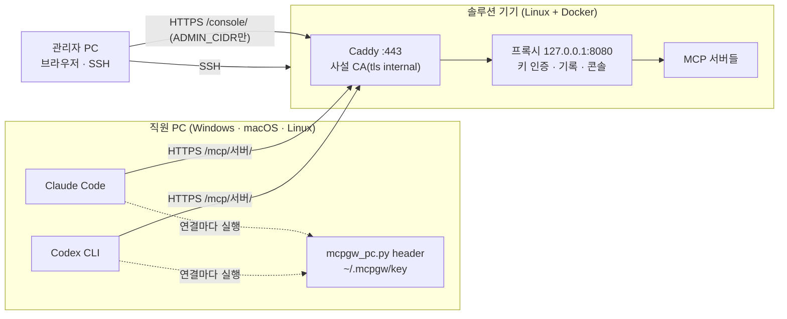

# MCP Gateway — Proxy

`proxy` 브랜치는 MCP 서버 앞에 두는 작은 **HTTP 리버스 프록시**입니다.
클라이언트는 `/mcp/<서버 이름>/`에 연결하고, 프록시는 설정에 적힌 upstream MCP 엔드포인트로 통신을 전달합니다.

```text
MCP 클라이언트 → /mcp/demo/ → HTTP 스트리밍 프록시 → 실제 MCP 서버 /mcp
```

JSON-RPC를 재직렬화하거나 MCP 서버를 다시 구현하지 않습니다. 도구 이름·스키마·결과·이미지·리소스·프롬프트,
초기화 응답과 오류는 upstream이 보낸 그대로 전달됩니다. GET/POST/DELETE와 SSE 스트림, `Mcp-Session-Id`,
`MCP-Protocol-Version`, `Last-Event-ID`를 유지하며 세션의 생성·종료·재개는 upstream이 담당합니다.
세션 헤더와 GET 스트림·DELETE 종료는 2025-03-26~2025-11-25 개정판의 방식이고, 세션이 없는 2026-07-28 개정판의
요청도 같은 경로로 전달합니다. 시험은 두 방식을 모두 공식 SDK로 확인합니다.

프록시가 더하는 것은 중계의 **앞과 옆**에만 있고, 전달하는 바이트는 바꾸지 않습니다.

| 어디 | 무엇 | 기본값 |
| --- | --- | --- |
| 전달 전 | 미등록 서버·Origin 거부, 클라이언트 인증(프록시 키 또는 LiteLLM 가상 키), 키별 서버 허용, 분당 한도 | 인증 없음 |
| 전달 중 | 요청·응답 **사본**에서 JSON-RPC 메서드·도구 이름·결과(성공·도구 오류·프로토콜 오류)를 읽어 SQLite에 기록 | 예시 설정에서 켬 |
| 옆 | 웹 콘솔(`/console/`), 관리 API, Prometheus 지표, upstream 도달 확인 | 관리자 토큰이 있을 때만 |

정책 엔진(OPA)·개인정보 검사·승인·해시 체인 감사 원장·직원 PC 실습은 없습니다. 그것은 `main`의 거버넌스 테스트베드입니다.
`research/`는 멘토님 디렉터리라 그대로 둡니다.

사내망에서 **솔루션 기기 · 관리자 PC · 직원 PC**(실제 노트북의 Claude Code·Codex CLI)로 나눠 쓰는 절차는
[실제 기기로 배치하기](#실제-기기로-배치하기--솔루션-기기--관리자-pc--직원-pc)에 있습니다.

## 로컬에서 실행

Python 3.12 이상과 [uv](https://docs.astral.sh/uv/)가 필요합니다. Windows, Linux, WSL에서 같은 명령을 사용합니다.

```bash
git clone --branch proxy https://github.com/MCP-governance/mcp-gateway.git
cd mcp-gateway
uv sync --frozen
uv run --frozen python examples/demo_server.py
```

다른 터미널에서:

```bash
uv run --frozen mcp-gateway --config proxy.toml --port 8080
```

- 클라이언트 MCP URL: `http://127.0.0.1:8080/mcp/demo/`
- 프록시 생존 확인: `http://127.0.0.1:8080/api/health` (upstream 정상 여부를 뜻하지 않음)
- 준비 확인: `/api/ready` — 도달 확인에서 `down`인 서버가 있으면 503
- 콘솔: 아래 [콘솔](#콘솔) 참고. `MCP_PROXY_ADMIN_TOKEN`(16자 이상)을 주고 실행하면 `http://127.0.0.1:8080/console/`
- 기본 바인딩은 `127.0.0.1`. 데모 서버에는 `echo` 도구, 리소스, 프롬프트가 있습니다.

클라이언트 설정 예시(HTTP MCP를 지원하는 클라이언트):

```json
{
  "mcpServers": {
    "demo": {
      "type": "http",
      "url": "http://127.0.0.1:8080/mcp/demo/"
    }
  }
}
```

프로덕션 프록시만 설치할 때는 `uv sync --frozen --no-dev`를 사용합니다.
MCP SDK는 데모·호환성 시험에만 필요하며 프록시 런타임에는 포함되지 않습니다.

## 서버 연결 설정

`proxy.toml`에 서버별 URL을 적고 재시작합니다. `/mcp/demo`와 `/mcp/demo/` 모두 같은 URL로 전달되며
뒤에 임의 경로를 붙일 수 없습니다. 미등록 서버는 404입니다. 설정 오류는 기동 전에 실패합니다.

```toml
[proxy]
connect_timeout_seconds = 10
read_timeout_seconds = 0  # 0: SSE 읽기 대기 제한 없음; 양수: 읽기 사이의 대기 시간
write_timeout_seconds = 30
shutdown_timeout_seconds = 5       # 종료 시 열린 SSE를 기다리는 최대 시간; 지나면 끊음
max_connections_per_server = 100   # 서버별 upstream 연결 수; 열려 있는 SSE도 하나씩 차지
allowed_origins = []     # Origin 없는 네이티브 클라이언트 허용; 브라우저는 정확한 Origin을 등록

[servers.filesystem]
url = "http://127.0.0.1:9001/mcp"

[servers.remote]
url = "https://mcp.example.com/mcp"
[servers.remote.headers]
Authorization = { env = "REMOTE_MCP_AUTHORIZATION" }
X-Api-Key = { env = "REMOTE_MCP_API_KEY" }
```

환경 변수의 Authorization 값은 `Bearer ...`까지 포함합니다. 변수는 실행 환경에 직접 주입합니다.
`.env` 파일을 자동으로 읽지 않습니다. 컨테이너에서 자격이 필요하면 Compose의 `environment` 또는 `env_file`로 주입하세요.
설정 파일 경로는 `--config` 또는 `MCP_PROXY_CONFIG`로 지정할 수 있습니다.

클라이언트의 `Authorization`은 upstream에 넘기지 않습니다. upstream 자격은 해당 서버 설정의 별도 헤더로 공급합니다.
설정된 헤더는 같은 이름의 클라이언트 헤더보다 우선합니다. `Host`는 목적지에 맞게 만들고 hop-by-hop 헤더는 제거합니다.
응답의 중복 헤더와 압축 본문을 보존하며, 연결 풀의 쿠키를 다른 요청에 자동으로 재사용하지 않습니다.
본문 없이 온 GET·DELETE는 본문 없이 전달합니다(빈 chunked 본문을 만들지 않습니다).

연결 풀은 서버마다 따로 둡니다. MCP 클라이언트는 보통 세션마다 GET SSE 스트림을 하나씩 열어 두므로,
한 서버의 스트림이 `max_connections_per_server`에 닿으면 그 서버의 새 요청만 `connect_timeout_seconds`만큼
빈 연결을 기다린 뒤 503을 받고, 다른 서버는 영향을 받지 않습니다.

TLS는 앞단에서 구성합니다. upstream이 요구하는 자격은 서버별 헤더로 따로 공급합니다.
OAuth 로그인·메타데이터 URL을 프록시 경로로 바꾸는 기능은 없습니다(본문을 새로 만드는 일이라 프록시의 선 밖입니다).

## 클라이언트 인증

`[auth] providers`가 비어 있으면 누구나 쓸 수 있으므로 기본 바인딩이 loopback입니다. 공유 배포에서는 인증을 켭니다.
클라이언트는 `Authorization: Bearer <키>` 또는 `x-litellm-api-key`로 키를 보내고, **이 헤더는 어느 upstream에도 전달되지 않습니다**
(인증을 끈 상태에서도 제거합니다 — LiteLLM 키가 실수로 MCP 서버에 새지 않게).

```toml
[auth]
providers = ["keys", "litellm"]        # 둘 중 하나만 써도 됩니다
litellm_url = "http://127.0.0.1:4000"
litellm_cache_seconds = 60
litellm_default_servers = []           # 메타데이터에 서버가 없는 LiteLLM 키가 쓸 서버("*" = 전부)
default_rate_per_minute = 0            # 0 = 무제한
```

- **프록시 키**(`mcpp_…`): 콘솔 "클라이언트 키"에서 발급합니다. 원문은 발급 응답에만 있고 저장소에는 SHA-256만 남습니다.
  키마다 쓸 수 있는 서버, 분당 한도, 만료를 정하고 사용 중지하면 다음 요청부터 거부됩니다. `[store] path`가 필요합니다.
- **LiteLLM 가상 키**(`sk-…`): 프록시가 그 키로 LiteLLM `GET /key/info`를 불러 검증합니다. 직원은 모델과 MCP에 **같은 키 하나**를
  쓰고, 키 발급·차단·만료는 LiteLLM 관리 화면에서 합니다. 쓸 수 있는 서버는 키 메타데이터 `mcp_proxy_servers`(예: `["demo"]`),
  분당 한도는 `mcp_proxy_rate_per_minute`로 정합니다. LiteLLM에 닿지 못하면 **거부(503)**합니다. 가상 키에는 DB가 있는 LiteLLM이 필요합니다.
- 없는 키·중지된 키·만료된 키는 401(`WWW-Authenticate: Bearer`), 허용되지 않은 서버는 403, 한도 초과는 429(`Retry-After`)입니다.
  거부는 전부 전달 **전**에 일어나고, 콘솔에 사유와 함께 기록됩니다.

## 호출 기록

`[store] path`를 두면 중계한 요청마다 한 행을 SQLite(WAL)에 남깁니다. 기록은 관찰용입니다: 큐가 넘치거나 디스크 쓰기에
실패하면 요청을 막지 않고 기록을 버리며, 버린 건수를 콘솔과 지표가 보여줍니다.

- 요청 사본(256KiB까지): JSON-RPC 메서드, `tools/call`의 도구 이름, `resources/read`의 URI, `prompts/get`의 이름,
  `initialize`의 clientInfo(이후 같은 세션의 행에도 클라이언트 이름을 붙임), 프로토콜 버전
- 응답 사본(JSON·SSE, gzip·deflate 해제): 요청 id에 대한 결과 — 성공, `isError` 도구 오류, JSON-RPC 오류(코드·메시지),
  응답이 오기 전에 끊긴 미완료. SSE 이벤트 수와 서버가 보낸 요청·알림 메서드
- 그 밖: 사용자(키 이름·LiteLLM 키 별칭, 인증이 없으면 IP), HTTP 상태, 응답 시작·전체 시간, 주고받은 바이트
- **남기지 않는 것**: 세션 ID 원문(해시만), 헤더 값, 응답 본문. 도구 인자는 개인정보를 담을 수 있어
  `record_arguments = true`일 때만 4KB까지 남깁니다. 보관 기간은 `retention_days`(기본 14일).

결과 분류: 성공 · 도구 오류 · 프로토콜 오류 · 미완료 · upstream 오류(HTTP 4xx·5xx, 스트림 도중 끊김) · 프록시 오류(502·503·504,
LiteLLM 불능) · 거부(401·403·404·429).

## 콘솔

`[admin] token`(예시 설정은 `{ env = "MCP_PROXY_ADMIN_TOKEN" }`)이 있을 때만 `/console/`과 관리 API(`/admin/api/*`),
지표(`/admin/metrics`)가 생깁니다. 토큰이 없으면 이 경로들은 404입니다. 화면은 `main`의 거버넌스 콘솔과 같은 디자인
시스템(토큰·차트 래퍼·안전한 HTML 템플릿·탭·드로어)을 가져왔고, 콘솔은 **MCP를 호출하지 않습니다**.

| 화면 | 보는 것 |
| --- | --- |
| 개요 | 요청·성공률·도구 호출·거부·진행 중·서버 정상·응답 시작 p95, 시간대별 결과, 결과 비율, 메서드·도구 상위, 서버별 결과와 지연, 사용자 → 서버 → 결과 흐름, 클라이언트 비율 |
| 활동 로그 | 3초 실시간(일시정지 가능), 서버·결과·사용자 필터와 검색, 시간 분포, 행을 누르면 요약·요청·응답·원본 |
| MCP 서버 | 도달 확인 상태·지연 추이, 24시간 요청·실패율·p95, 연결 사용량, 서버별 도구와 최근 실패, 즉시 확인 |
| 클라이언트 키 | 발급(원문은 한 번만 표시)·서버 권한·분당 한도·만료·사용 중지, 24시간 요청·거부 |
| 설정 | 적용된 설정(자격 값과 URL 쿼리는 가림), 기록 파일 크기 |

- 관리자 토큰은 브라우저 탭의 `sessionStorage`에만 둡니다. 모든 관리 응답은 CSP(`script-src 'self'; style-src 'self'`),
  `frame-ancestors 'none'`, `nosniff`, `no-store`를 붙이고, 기록 문자열은 이스케이프하며 차트 툴팁은 캔버스로 그립니다.
- 도달 확인은 `[health] interval_seconds`마다 upstream URL에 JSON을 요청하는 **HTTP GET**입니다(MCP 요청이 아님).
  500 미만의 응답이면 정상으로 봅니다. 기본값은 꺼짐이고 예시 설정에서 30초입니다.
- 지표는 Prometheus 텍스트: `mcp_proxy_requests_total{server,outcome}`, `mcp_proxy_active_requests`, `mcp_proxy_upstream_up`,
  `mcp_proxy_records_dropped_total`. 설정에 없는 서버 이름은 `(unknown)` 한 라벨로 묶습니다.

## Docker로 실행

```bash
MCP_PROXY_ADMIN_TOKEN=$(python -c "import secrets; print(secrets.token_urlsafe(24))") docker compose up --build --wait
```

토큰 없이 실행하면 콘솔만 꺼집니다. 기록은 `proxy-data` 볼륨에 남고 `docker compose down -v`로 지웁니다.
프록시와 데모 upstream 두 컨테이너만 실행합니다. 프록시는 호스트 `127.0.0.1:8080`에 게시되며 데모는 호스트에 게시하지 않습니다.
다른 랩과 포트가 겹치면 `MCP_PROXY_PORT`를 바꿉니다. Compose의 TOML은 `proxy.docker.toml`입니다.

실제 서버를 연결하는 경우 `MCP_PROXY_CONFIG_FILE`에 자체 TOML 경로를 설정하고 프록시만 실행합니다.
컨테이너 안의 `127.0.0.1`은 컨테이너 자신을 뜻하므로, upstream 주소는 컨테이너에서 접근 가능한 주소여야 합니다.

```bash
docker compose up --build --wait proxy
docker compose down
```

## 실제 기기로 배치하기 — 솔루션 기기 · 관리자 PC · 직원 PC

위의 실행 방법은 한 대 안에서 loopback으로만 동작합니다. 사내망에서 직원 노트북의 **실제** Claude Code·Codex CLI가
프록시를 쓰게 하려면 기기 세 종류로 나눕니다. 사내망에 여는 것은 솔루션 기기의 **HTTPS 443 하나**이고,
프록시 자체는 그대로 기기의 `127.0.0.1`에만 있습니다.



| 역할 | 기기 | 설치할 것 | 네트워크 |
| --- | --- | --- | --- |
| 솔루션 기기 | Linux(Ubuntu 24.04 등) 미니 PC·서버·남는 노트북. Windows 노트북이면 WSL2 | Docker Engine + Compose v2, git, python3, curl | 사내망 고정 IP. 443/tcp를 사내 대역에, 22/tcp를 관리자 PC에 |
| 관리자 PC | Windows·macOS 노트북 | 브라우저, SSH 클라이언트 | 기기의 443·22 |
| 직원 PC | Windows·macOS·Linux 노트북 | Python 3.9 이상, Claude Code, Codex CLI 0.148 이상(npm 설치에 Node.js LTS) | 기기의 443 |

- 하네스의 **모델 로그인은 각자의 벤더 계정 그대로**입니다(Claude 구독·Console 키, ChatGPT·OpenAI 키). 이 프록시는
  MCP 경로만 다룹니다. 모델과 MCP에 같은 키를 쓰려면 LiteLLM 가상 키 방식([클라이언트 인증](#클라이언트-인증))을 켭니다.
- 두 하네스 모두 서버에 연결할 때마다 키트의 `header` 명령을 실행해 키를 받습니다(Claude Code `headersHelper`,
  Codex CLI `http_headers_helper`). 키 원문은 직원 PC의 `~/.mcpgw/key` 한 곳에만 있고 하네스 설정 파일에는 들어가지 않습니다.
- 아래 예시 이름은 `mcp-gw.internal`(`.internal`은 사설용 최상위 도메인), 기기 IP `192.168.0.10`, 관리자 PC `192.168.0.20`입니다.

### ① 솔루션 기기

1. [Docker Engine](https://docs.docker.com/engine/install/)과 Compose v2를 설치하고 저장소를 받습니다.

   ```bash
   git clone --branch proxy https://github.com/MCP-governance/mcp-gateway.git
   cd mcp-gateway
   cp field/field.env.example .env
   ip -4 -brief addr          # APPLIANCE_BIND에 적을 사내망 IP 확인
   python3 -c "import secrets; print(secrets.token_urlsafe(24))"   # MCP_PROXY_ADMIN_TOKEN
   ```

2. `.env`를 채웁니다. `APPLIANCE_HOST`(직원이 접속할 이름), `APPLIANCE_BIND`(이 기기의 사내망 IP — `0.0.0.0`은 쓰지 않음),
   `ADMIN_CIDR`(콘솔을 열어 줄 관리자 PC 대역), `MCP_PROXY_ADMIN_TOKEN`(16자 이상). `.env`는 커밋하지 않습니다.
3. 실제 MCP 서버를 붙이려면 `field/proxy.field.toml`을 `field/proxy.local.toml`로 복사해 `[servers.<이름>]`을 더하고
   `.env`에 `MCP_PROXY_FIELD_CONFIG=./field/proxy.local.toml`을 적습니다. 주소는 **컨테이너 안에서** 닿는 주소여야 합니다
   (`127.0.0.1`은 프록시 컨테이너 자신이므로, 기기에서 도는 다른 서비스도 기기의 사내망 IP로 적습니다). upstream 자격은
   [서버 연결 설정](#서버-연결-설정)처럼 `{ env = "…" }`로 두고 그 변수를 `compose.field.yaml`의 `proxy.environment`에 더합니다.
   stdio 서버는 HTTP 어댑터를 앞에 두고 등록합니다.
4. 기동합니다. 첫 실행에서 Caddy가 사설 CA를 만들고, 스크립트가 루트 인증서를 꺼내 지문을 보여 줍니다.

   ```bash
   ./field/appliance.sh up        # = docker compose -f compose.yaml -f compose.field.yaml up -d --build --wait → ca → status
   ./field/appliance.sh ca        # 다시 꺼내기: field/ca/mcp-gw-root.crt 와 SHA-256 지문
   ./field/appliance.sh status    # {"status":"ready",…} 이면 정상
   ```

5. 방화벽에서 SSH는 관리자 PC에만, 443은 사내 대역에만 엽니다. Docker가 게시한 포트는 ufw 규칙을 거치지 않으므로
   443 제한은 `DOCKER-USER` 체인에 둡니다([Docker 문서](https://docs.docker.com/engine/network/packet-filtering-firewalls/)).
   원격으로 작업 중이면 `ufw enable` 전에 지금 접속한 주소가 허용되는지 먼저 확인합니다.

   ```bash
   sudo ufw allow from 192.168.0.20 to any port 22 proto tcp
   sudo ufw enable
   sudo iptables -I DOCKER-USER -p tcp --dport 443 ! -s 192.168.0.0/24 -j DROP   # 재부팅 뒤 유지: iptables-persistent
   ```

<details>
<summary>솔루션 기기가 Windows 노트북(WSL2)일 때</summary>

- Windows 11 22H2 이상에서 `%UserProfile%\.wslconfig`에 미러 네트워킹을 켜면 WSL이 Windows의 사내망 IP를 그대로 씁니다.
  `APPLIANCE_BIND`에는 Windows의 사내망 IP를 적습니다. WSL이 유휴 상태에서 꺼지지 않게 시간 제한도 끕니다.

  ```ini
  [wsl2]
  networkingMode=mirrored
  vmIdleTimeout=-1

  [general]
  instanceIdleTimeout=-1
  ```

- 관리자 PowerShell에서 Hyper-V 방화벽과 Windows 방화벽의 443 인바운드를 엽니다
  ([WSL 네트워킹 문서](https://learn.microsoft.com/windows/wsl/networking#mirrored-mode-networking)).

  ```powershell
  New-NetFirewallHyperVRule -Name "mcp-gw-443" -DisplayName "MCP gateway 443" -Direction Inbound -VMCreatorId '{40E0AC32-46A5-438A-A0B2-2B479E8F2E90}' -Protocol TCP -LocalPorts 443
  New-NetFirewallRule -DisplayName "MCP gateway 443" -Direction Inbound -Protocol TCP -LocalPort 443 -RemoteAddress 192.168.0.0/24 -Action Allow
  wsl --shutdown
  ```

- Docker Desktop을 엔진으로 쓰면 컨테이너가 보는 접속 주소가 실제 PC IP가 아닐 수 있어 `ADMIN_CIDR`로 관리자 PC를 가려낼 수
  없습니다. 그때는 `ADMIN_CIDR`를 Docker 내부 대역으로 두고 Windows 방화벽으로 관리자 PC만 들어오게 하거나, 콘솔은
  SSH 터널(② 7번)로만 씁니다. 콘솔은 어느 경우에도 관리자 토큰이 있어야 열립니다.

</details>

### ② 관리자 PC

1. 루트 인증서를 받아 지문을 확인합니다. 지문은 기기 화면(`./field/appliance.sh ca`)에서 본 값과 같아야 합니다.

   ```bash
   scp admin@192.168.0.10:mcp-gateway/field/ca/mcp-gw-root.crt .
   ```

2. 인증서를 신뢰시킵니다.

   ```powershell
   # Windows (현재 사용자)
   Import-Certificate -FilePath .\mcp-gw-root.crt -CertStoreLocation Cert:\CurrentUser\Root
   ```

   ```bash
   # macOS
   sudo security add-trusted-cert -d -r trustRoot -k /Library/Keychains/System.keychain mcp-gw-root.crt
   ```

3. 사내 DNS가 없으면 hosts 파일에 `192.168.0.10 mcp-gw.internal`을 한 줄 더합니다(Windows는 관리자 권한 메모장으로
   `C:\Windows\System32\drivers\etc\hosts`, macOS·Linux는 `sudo nano /etc/hosts`).
4. 브라우저에서 `https://mcp-gw.internal/console/`을 열고 `MCP_PROXY_ADMIN_TOKEN`으로 로그인합니다.
5. **클라이언트 키**에서 직원마다 키를 발급합니다. 이름은 직원을 알아볼 수 있게(예: `ysg-laptop`), 쓸 서버, 분당 한도,
   만료일을 정합니다. 키 원문은 발급 직후 한 번만 보입니다.
6. 직원에게 넘길 것: `field/pc/mcpgw_pc.py`, `mcp-gw-root.crt`, 그 **지문**, 주소(`https://mcp-gw.internal`), 서버 이름, 키.
   키와 지문은 인증서 파일과 **다른 경로**(사내 메신저 DM 등)로 보냅니다.
7. 사무실 밖이나 `ADMIN_CIDR` 밖에서 콘솔을 볼 때는 SSH 터널을 씁니다: `ssh -L 8080:127.0.0.1:8080 admin@192.168.0.10` 뒤
   `http://127.0.0.1:8080/console/`.
8. (선택) 직원이 다른 MCP 서버를 더하지 못하게 잠그려면 관리형 파일을 만들어 MDM·그룹 정책으로 배포합니다.

   ```bash
   python3 field/pc/mcpgw_pc.py managed --url https://mcp-gw.internal --servers demo --out managed/
   ```

   `managed-mcp.json`은 Claude Code의 시스템 경로(macOS `/Library/Application Support/ClaudeCode/`, Linux `/etc/claude-code/`,
   Windows `C:\Program Files\ClaudeCode\`)에 두면 **그 파일의 서버만** 쓰이고, 직원은 키를 `MCPGW_PROXY_KEY` 사용자 환경
   변수로 줍니다(③ 5번). `requirements.toml`은 Codex의 시스템 경로(Unix `/etc/codex/`, Windows
   `%ProgramData%\OpenAI\Codex\`)에 두면 목록 밖 MCP 서버가 켜지지 않습니다. 이 잠금이 없으면 직원이 게이트웨이를 거치지 않는
   서버를 직접 추가하는 것은 막지 못합니다.

### ③ 직원 PC

1. 관리자에게 받은 인증서를 신뢰시키고 이름을 등록합니다(② 2·3번과 같음). Linux는 다음과 같습니다.

   ```bash
   sudo cp mcp-gw-root.crt /usr/local/share/ca-certificates/mcp-gw-root.crt && sudo update-ca-certificates
   ```

   Claude Code(네이티브 설치본)와 Codex CLI는 OS 인증서 저장소를 신뢰합니다. npm으로 설치한 Claude Code가 Node 22.15 미만에서
   돌면 `NODE_EXTRA_CA_CERTS`, Codex가 인증서를 찾지 못하면 `CODEX_CA_CERTIFICATE`에 이 파일 경로를 줍니다.

2. 하네스를 공식 방법으로 설치하고 각자 로그인합니다.

   ```powershell
   # Windows
   irm https://claude.ai/install.ps1 | iex
   npm install -g @openai/codex
   winget install Python.Python.3.12
   ```

   ```bash
   # macOS · Linux
   curl -fsSL https://claude.ai/install.sh | bash
   npm install -g @openai/codex
   ```

   `claude`를 한 번 실행해 로그인하고, `codex login`으로 Codex에 로그인합니다.

3. 키트로 두 하네스를 연결합니다. 지문이 관리자가 알려 준 값과 다르면 멈춥니다. 키는 입력해도 화면에 보이지 않습니다.

   ```powershell
   py -3 mcpgw_pc.py setup --url https://mcp-gw.internal --servers demo --ca mcp-gw-root.crt
   py -3 $HOME\.mcpgw\mcpgw_pc.py doctor
   ```

   ```bash
   python3 mcpgw_pc.py setup --url https://mcp-gw.internal --servers demo --ca mcp-gw-root.crt
   python3 ~/.mcpgw/mcpgw_pc.py doctor
   ```

   `setup`이 하는 일: 키를 `~/.mcpgw/key`에 저장(POSIX 0600), 키트를 `~/.mcpgw/`에 복사, Claude Code 사용자 범위에
   `claude mcp add-json --scope user`로 서버 추가, `~/.codex/config.toml` 끝에 표식으로 감싼 블록 추가(다른 설정은 그대로).
   같은 이름의 서버를 직원이 이미 만들어 두었으면 덮어쓰지 않고 멈춥니다. `--dry-run`은 쓸 내용만 보여 줍니다.
   `doctor`는 이름 해석, TLS, 서버별 `initialize`, 하네스 설치·설정, 헬퍼 실행을 한 줄씩 `OK`/`FAIL`로 보여 줍니다.

4. 평소처럼 씁니다. Claude Code에서 `/mcp`, Codex에서 `/mcp`를 열면 `demo`가 보입니다. VS Code의 Claude Code·Codex 확장도
   같은 사용자 설정을 읽습니다. 관리자가 새 키를 주면 `python3 ~/.mcpgw/mcpgw_pc.py key`로 바꿉니다.

5. ② 8번의 관리형 파일이 배포된 PC에서는 Claude Code의 서버를 관리형 파일이 정하므로 키트는 `setup --harness codex`로만
   실행하고, Claude Code가 읽을 키를 사용자 환경 변수로 둡니다.

   ```powershell
   [Environment]::SetEnvironmentVariable("MCPGW_PROXY_KEY", (py -3 $HOME\.mcpgw\mcpgw_pc.py token), "User")
   ```

   ```bash
   echo "export MCPGW_PROXY_KEY=\"\$(python3 ~/.mcpgw/mcpgw_pc.py token)\"" >> ~/.zshrc   # bash는 ~/.bashrc
   ```

### ④ 동작 확인

1. 직원 PC의 Claude Code에 "demo 서버의 echo 도구로 hello를 보내 줘"라고 시킵니다. Codex도 같은 요청을 합니다.
2. 관리자 PC 콘솔의 **활동 로그**에 두 줄이 보여야 합니다: 사용자 = 키 이름, 클라이언트 = `claude-code`·`codex-mcp-client`,
   도구 = `echo`, 결과 = 성공. **개요**의 사용자 → 서버 → 결과 흐름에도 나타납니다.
3. 막히는지 확인합니다. 콘솔에서 그 키를 **사용 중지**하면 다음 요청부터 401로 거부되고(`doctor`가
   `MCP demo initialize: HTTP 401`), 키의 서버 목록에서 `demo`를 빼면 403입니다. 거부도 활동 로그에 사유와 함께 남습니다.

### ⑤ 문제 해결

| 증상 | 원인과 조치 |
| --- | --- |
| `doctor`: 이름 해석 FAIL | 사내 DNS 또는 hosts 파일에 `<기기 IP> mcp-gw.internal`. VPN이 DNS를 바꾸는지 확인 |
| `doctor`: TLS FAIL, 하네스의 `certificate`·`UnknownIssuer` 오류 | 루트 인증서를 OS 저장소에 넣었는지, `setup --ca`로 지정했는지. 기기에서 `down -v`로 CA가 바뀌었으면 새 인증서를 다시 배포 |
| `doctor`: 프록시 도달 FAIL | 기기의 `APPLIANCE_BIND`가 실제 IP인지, 443 방화벽, WSL2면 미러 네트워킹과 Hyper-V 방화벽 |
| HTTP 401 | 키가 없거나 중지·만료. 콘솔에서 상태 확인 후 새 키면 `mcpgw_pc.py key` |
| HTTP 403 | 키에 그 서버 권한이 없음. 콘솔에서 키의 서버를 고침 |
| HTTP 429 | 분당 한도. 키의 한도나 `default_rate_per_minute` |
| HTTP 502 | 기기의 프록시가 upstream MCP 서버에 닿지 못함. `./field/appliance.sh logs`, 컨테이너 안에서 닿는 주소인지 |
| 콘솔이 404 | `ADMIN_CIDR` 밖에서 접속. 대역을 고치거나 SSH 터널 |
| Claude Code `claude mcp add-json` 실패: enterprise MCP configuration | 관리형 `managed-mcp.json`이 배포된 PC. ③ 5번 방식 |
| Codex에서 서버가 안 보임 | Codex 0.148 미만(`http_headers_helper` 없음) → 업데이트. `codex mcp get demo`로 설정 확인 |

### ⑥ 되돌리기

```bash
python3 ~/.mcpgw/mcpgw_pc.py uninstall      # 직원 PC: 키트가 쓴 Claude·Codex 설정과 키만 지움
./field/appliance.sh down                    # 솔루션 기기: 멈춤(기록·CA 볼륨은 유지)
docker compose -f compose.yaml -f compose.field.yaml down -v   # 기록과 CA까지 지움 — 모든 PC가 새 CA를 다시 신뢰해야 함
```

직원 PC의 루트 인증서는 Windows `certmgr.msc`(신뢰할 수 있는 루트 인증 기관), macOS 키체인 접근, Linux는 파일을 지우고
`sudo update-ca-certificates --fresh`로 뺍니다. hosts 줄도 지웁니다. 퇴사·분실이면 콘솔에서 키를 먼저 사용 중지합니다.

### 보안 주의

- 이 브랜치는 **중계·키 인증·기록**까지입니다. 도구 호출을 정책으로 판정하거나 개인정보를 검사하지 않습니다(그것은 `main`).
- 키는 bearer 자격입니다. 가진 사람이 쓸 수 있으므로 만료를 두고, 유출되면 콘솔에서 바로 사용 중지합니다.
- 사설 CA의 개인키는 기기의 `caddy-data` 볼륨에 있습니다. 기기에 SSH·Docker 권한이 있는 사람은 인증서를 낼 수 있습니다.
- `ADMIN_CIDR`는 심층 방어일 뿐, 콘솔의 본 통제는 관리자 토큰입니다. 토큰은 비밀번호 관리자에 두고 공유하지 않습니다.
- 도구 인자는 기본으로 기록하지 않습니다(`record_arguments = false`). 켜면 개인정보가 기록에 남을 수 있습니다.
- 관리형 잠금(② 8번)과 사내망 egress 통제가 없으면 직원은 게이트웨이를 거치지 않는 MCP 서버를 직접 쓸 수 있습니다.

## 검증

```bash
uv sync --frozen
uv run --frozen python -m pyflakes mcp_gateway tests examples field
uv run --frozen pytest -q
node --test tests/console-state.test.mjs          # 콘솔의 DOM 없는 상태 모듈
# Compose 데모가 실행 중인 경우(토큰을 주면 콘솔과 기록까지 확인):
uv run --frozen python tests/container_smoke.py --url http://127.0.0.1:8080 --admin-token "$MCP_PROXY_ADMIN_TOKEN"
```

시험은 공식 MCP SDK 2.2.0의 handshake 연결과 자동 협상 연결에서 tools/resources/prompts를 확인합니다.
실제 소켓에서 동시 세션, SSE 즉시 전달·클라이언트 연결 해제, 요청 스트리밍과 timeout을 확인하고,
회귀 시험은 원문·상태·세션 헤더·압축·중복 헤더·별도 자격·오류·재시도 없음·설정 검증을 확인합니다.
서버별 연결 풀 분리, 본문 없는 요청, 열린 SSE가 있을 때의 종료 시간도 실제 소켓으로 확인합니다.
기록을 켠 상태에서도 요청·응답 바이트가 같은지, 결과 분류·키 인증·LiteLLM 키(가짜 LiteLLM)·장애 시 거부·속도 제한,
관리 API의 토큰·가림·CSP·JavaScript MIME, 지표 라벨, 도달 확인을 시험합니다.
실기기 배치는 `tests/test_field.py`가 오버라이드 Compose의 게시 주소(사내망은 Caddy 443 하나), Caddyfile의 콘솔 울타리,
키트의 설정 기록·멱등성·사용자 설정 보존·키 원문 미기록·제거, 실제 프록시에 대한 `doctor`(정상 키 200, 중지 키 401)를 시험합니다.
CI는 `proxy`와 `proxy-*` 브랜치의 Python 시험 및 컨테이너 데모, CodeQL 분석을 실행하고, `field` 작업에서 오버라이드를 실제로 띄워
사설 CA 추출 → HTTPS 관리 API로 키 발급 → 키트 `setup`·`doctor` → 실제 Claude Code `claude mcp list`(연결됨)·Codex CLI
`codex mcp get` → 키 중지 뒤 401 → `uninstall`까지 확인합니다.
작업 브랜치는 `proxy-<주제>`로 만듭니다. `proxy/<주제>`는 Windows·macOS처럼 대소문자를 구분하지 않는
파일 시스템에서 `proxy` ref와 경로가 겹쳐 `git fetch`가 실패합니다.

## 범위

HTTP(S) MCP upstream과 Streamable HTTP의 SSE 응답을 지원합니다.
stdio 변환, 2024-11-05의 별도 `/sse`·메시지 엔드포인트 변환, 여러 서버를 하나로 합치는 `/mcp/`, WebSocket은 제공하지 않습니다.
stdio 서버는 별도 HTTP 어댑터를 앞에 두고 등록할 수 있습니다.

upstream HTTP 오류·리다이렉트는 원래 상태와 본문을 반환합니다. 프록시 자체의 연결 실패는 502, 응답 헤더를 받기 전의
시간 초과는 504, 해당 서버의 연결 한도 초과는 503입니다. 자동 재시도와 리다이렉트 추적은 하지 않습니다.
이미 시작된 스트림의 오류는 연결을 종료합니다. 연결이 끊긴 요청의 실행 여부는 upstream에서 확인해야 합니다.
프록시를 멈추면 열린 SSE를 `shutdown_timeout_seconds`까지 기다린 뒤 끊고 upstream 연결을 닫습니다.
클라이언트는 다시 연결해야 합니다.

구현은 [mcp_gateway/](mcp_gateway/), 설정은 [proxy.toml](proxy.toml), 설계 결정은 [docs/ai/DECISIONS.md](docs/ai/DECISIONS.md)에 있습니다.
