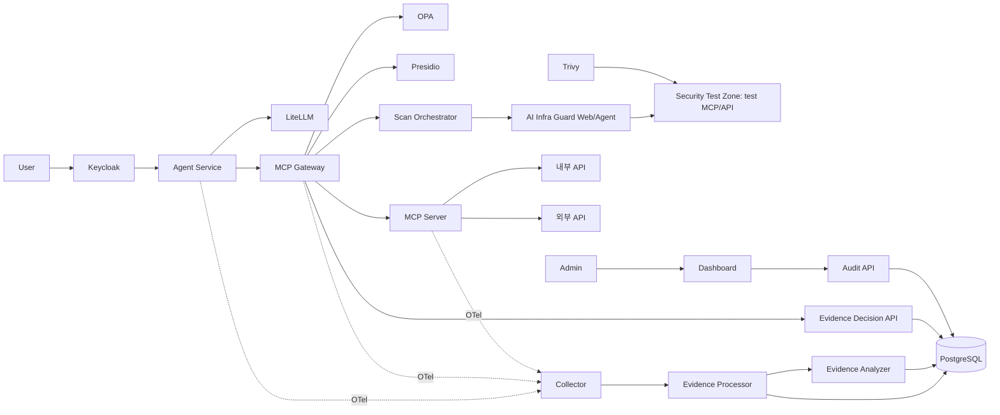
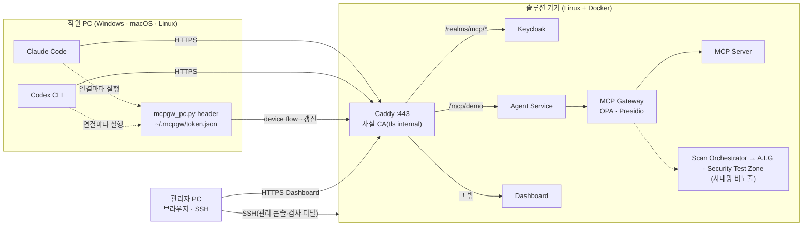

# MCP Gateway — 구조도 2안

사용자가 제공한 [draw.io 원본](https://drive.google.com/file/d/1i3WloSS4OpMtd_CuGsfouBLo5AzyG4VS/view)의 **제2안**을 서비스 경계에 맞춰 구현한 브랜치입니다. 원본의 초안과 기존 `main`의 직원 PC 실습은 이 런타임에 포함하지 않습니다.



구조도 안의 Agent Service·LiteLLM은 AI Agent Gateway, OPA·Presidio는 MCP Gateway, Collector·Processor·Analyzer·Decision API는 Runtime Analyzer 경계에 속합니다. 서비스별 실행 프로세스를 분리했습니다. MCP 서버 옆의 OTel은 사용자 확인에 따라 포함했습니다.

## 실행

```bash
git clone --branch architecture/plan-2 https://github.com/MCP-governance/mcp-gateway.git
cd mcp-gateway
cp .env.example .env
# .env의 비밀번호/내부 토큰을 설정하고 필요한 LLM 접속 정보를 입력합니다.
python3 prepare.py
docker compose up -d --build
uv sync --frozen
uv run --frozen python tests/container_smoke.py
```

사내망에서 **솔루션 기기 · 관리자 PC · 직원 PC**(실제 노트북의 Claude Code·Codex CLI)로 나눠 쓰는 절차는
[실제 기기로 배치하기](#실제-기기로-배치하기--솔루션-기기--관리자-pc--직원-pc)에 있습니다.

기본 주소는 Keycloak `http://127.0.0.1:18081`, Agent Service `http://127.0.0.1:18082`, Dashboard `http://127.0.0.1:18083`입니다. MCP 클라이언트는 Agent Service의 `/mcp/demo`에 연결하고 Keycloak access token을 전송합니다. Dashboard는 Keycloak Authorization Code + PKCE로 로그인하며 도구를 실행하지 않습니다. 기본 로컬 계정은 `user`와 `admin`이며 비밀번호는 `.env`에서 설정합니다. `prepare.py`는 신규 Keycloak 볼륨에 import할 realm과 Dashboard 로그인 주소를 생성합니다. 기존 realm 사용 중에는 Keycloak에서 사용자/클라이언트를 갱신해야 합니다.

도구는 최초 발견 시 차단 상태입니다. 관리자가 Dashboard에서 허용하면 다음 호출부터 OPA 판정과 Presidio 검사를 거쳐 실행됩니다. 도구 정의가 달라지면 허용이 초기화됩니다. Gateway는 매 실행 전 도구를 다시 발견하고 Decision API의 해시/허용 상태를 조회합니다. 본문 원문을 전달하고 직원 토큰은 MCP 서버에 보내지 않습니다. 민감한 인자가 발견되면 실행 전에 차단합니다.

Agent Service의 `/v1/chat/completions`는 사용자 신원을 확인한 뒤 별도 서비스 키로 LiteLLM에 연결합니다. 실제 모델 추론에는 `LLM_MODEL`, `LLM_API_BASE`, `LLM_API_KEY` 설정이 필요합니다. 모델 계정이 없는 상태에서도 MCP·인증·증적 통합 시험은 실행할 수 있습니다.

## 실제 기기로 배치하기 — 솔루션 기기 · 관리자 PC · 직원 PC

위의 실행은 한 대의 Docker 호스트 안에서 loopback(`127.0.0.1`)으로만 동작합니다. 같은 런타임을 사내망의 실제 기기 세 종류로
나누면, 직원 노트북의 **실제** Claude Code·Codex CLI가 부르는 MCP 도구도 Keycloak 신원 → Agent Service → MCP Gateway(OPA·Presidio)
경로를 똑같이 거칩니다. 2안의 Scan Orchestrator·A.I.G·Security Test Zone은 사내망에 열지 않고, 관리자가 SSH 터널로만
검사를 요청합니다. 사내망에 여는 것은 솔루션 기기의 **HTTPS 443 하나**(Caddy)이고, 기본 실행과 CI의 loopback 구성은
바뀌지 않습니다.



| 역할 | 기기 | 설치할 것 | 네트워크 |
| --- | --- | --- | --- |
| 솔루션 기기 | Linux(Ubuntu 24.04 등) 미니 PC·서버·남는 노트북. Windows 노트북이면 WSL2 | Docker Engine + Compose v2, git, python3, curl | 사내망 고정 IP. 443/tcp를 사내 대역에, 22/tcp를 관리자 PC에 |
| 관리자 PC | Windows·macOS 노트북 | 브라우저, SSH 클라이언트 | 기기의 443·22 |
| 직원 PC | Windows·macOS·Linux 노트북 | Python 3.9 이상, Claude Code, Codex CLI 0.148 이상(npm 설치에 Node.js LTS), 브라우저 | 기기의 443 |

- 직원은 Keycloak에 **브라우저로** 로그인합니다(OAuth 2.0 Device Authorization Grant — 비밀번호가 키트를 거치지 않음). 키트
  (`field/pc/mcpgw_pc.py`)는 리프레시 토큰으로 짧은 접근 토큰을 갱신하고, 두 하네스는 연결할 때마다 키트의 `header`를 실행해
  토큰을 받습니다(Claude Code `headersHelper`, Codex CLI `http_headers_helper` — 둘 다 401이면 다시 부름). 토큰은 하네스 설정
  파일에 들어가지 않습니다. 이를 위해 realm에 device grant만 켠 공개 클라이언트 `mcp-cli`(aud `mcp-gateway`)가 있습니다.
- 하네스의 **모델 로그인은 각자의 벤더 계정 그대로**입니다(Claude 구독·Console 키, ChatGPT·OpenAI 키). Agent Service의
  `/v1/chat/completions`(OpenAI Chat 형식, Keycloak 토큰)는 그 형식을 쓰는 클라이언트용 선택지이고, Claude Code·Codex CLI의
  모델 연결은 검증하지 않았습니다.
- A.I.G로 MCP 검사를 실제로 돌리려면 `.env`의 `AIG_SCAN_MODEL`·`AIG_SCAN_MODEL_TOKEN`(외부 LLM, 과금)이 필요합니다(선택 —
  [2안 보안 검사](#2안-보안-검사)).
- 예시 이름은 `mcp-gw.internal`(`.internal`은 사설용 최상위 도메인), 기기 IP `192.168.0.10`, 관리자 PC `192.168.0.20`입니다.

### ① 솔루션 기기

1. [Docker Engine](https://docs.docker.com/engine/install/)과 Compose v2를 설치하고 저장소를 받습니다.

   ```bash
   git clone --branch architecture/plan-2 https://github.com/MCP-governance/mcp-gateway.git
   cd mcp-gateway
   cp .env.example .env
   ip -4 -brief addr      # APPLIANCE_BIND에 적을 사내망 IP 확인
   ```

2. `.env`의 비밀번호·토큰(`POSTGRES_PASSWORD`, `SERVICE_TOKEN`, `KEYCLOAK_ADMIN_PASSWORD`, `USER_PASSWORD`, `ADMIN_PASSWORD`,
   `LITELLM_MASTER_KEY`)을 추측할 수 없는 값으로 바꾸고(검사를 쓸 거면 `AIG_SCAN_MODEL`·`AIG_SCAN_MODEL_TOKEN`도), `APPLIANCE_HOST=mcp-gw.internal`, `APPLIANCE_BIND=192.168.0.10`을
   채웁니다. `APPLIANCE_BIND`에 `0.0.0.0`은 쓰지 않습니다(모든 인터페이스가 열림). `.env`는 커밋하지 않습니다.
3. 기동합니다. `prepare.py --field`가 realm import와 Dashboard의 issuer·리다이렉트를 `https://mcp-gw.internal` 기준으로
   `outputs/`에 렌더링하고, Caddy가 사설 CA를 만들면 루트 인증서와 지문을 보여 줍니다.

   ```bash
   ./field/appliance.sh up       # = prepare.py --field → docker compose -f compose.yaml -f compose.field.yaml up → ca → status
   ./field/appliance.sh ca       # 다시 꺼내기: outputs/ca/mcp-gw-root.crt 와 SHA-256 지문
   ./field/appliance.sh status   # "issuer: https://mcp-gw.internal/realms/mcp" 이면 정상
   ```

   realm은 **Keycloak 볼륨이 비어 있을 때만** import됩니다. 이미 loopback으로 띄운 적이 있는 기기라면 옛 리다이렉트 주소와
   `mcp-cli` 클라이언트 없는 realm이 남아 있으니, 데이터가 필요 없으면 `docker compose down -v`로 지우고 다시 `up`합니다.
4. 방화벽에서 SSH는 관리자 PC에만, 443은 사내 대역에만 엽니다. Docker가 게시한 포트는 ufw 규칙을 거치지 않으므로
   443 제한은 `DOCKER-USER` 체인에 둡니다([Docker 문서](https://docs.docker.com/engine/network/packet-filtering-firewalls/)).
   원격으로 작업 중이면 `ufw enable` 전에 지금 접속한 주소가 허용되는지 먼저 확인합니다.

   ```bash
   sudo ufw allow from 192.168.0.20 to any port 22 proto tcp
   sudo ufw enable
   sudo iptables -I DOCKER-USER -p tcp --dport 443 ! -s 192.168.0.0/24 -j DROP   # 재부팅 뒤 유지: iptables-persistent
   ```

<details>
<summary>솔루션 기기가 Windows 노트북(WSL2)일 때</summary>

- Windows 11 22H2 이상에서 `%UserProfile%\.wslconfig`에 미러 네트워킹을 켜면 WSL이 Windows의 사내망 IP를 그대로 씁니다.
  `APPLIANCE_BIND`에는 Windows의 사내망 IP를 적습니다. WSL이 유휴 상태에서 꺼지지 않게 시간 제한도 끕니다.

  ```ini
  [wsl2]
  networkingMode=mirrored
  vmIdleTimeout=-1

  [general]
  instanceIdleTimeout=-1
  ```

- 관리자 PowerShell에서 Hyper-V 방화벽과 Windows 방화벽의 443 인바운드를 엽니다
  ([WSL 네트워킹 문서](https://learn.microsoft.com/windows/wsl/networking#mirrored-mode-networking)).

  ```powershell
  New-NetFirewallHyperVRule -Name "mcp-gw-443" -DisplayName "MCP gateway 443" -Direction Inbound -VMCreatorId '{40E0AC32-46A5-438A-A0B2-2B479E8F2E90}' -Protocol TCP -LocalPorts 443
  New-NetFirewallRule -DisplayName "MCP gateway 443" -Direction Inbound -Protocol TCP -LocalPort 443 -RemoteAddress 192.168.0.0/24 -Action Allow
  wsl --shutdown
  ```

</details>

### ② 관리자 PC

1. 루트 인증서를 받아 지문을 확인하고 신뢰시킵니다. 지문은 기기에서 `./field/appliance.sh ca`가 보여 준 값과 같아야 합니다.

   ```bash
   scp admin@192.168.0.10:mcp-gateway/outputs/ca/mcp-gw-root.crt .
   ```

   ```powershell
   # Windows (현재 사용자)
   Import-Certificate -FilePath .\mcp-gw-root.crt -CertStoreLocation Cert:\CurrentUser\Root
   ```

   ```bash
   # macOS
   sudo security add-trusted-cert -d -r trustRoot -k /Library/Keychains/System.keychain mcp-gw-root.crt
   ```

2. 사내 DNS가 없으면 hosts 파일에 `192.168.0.10 mcp-gw.internal`을 한 줄 더합니다(Windows는 관리자 권한 메모장으로
   `C:\Windows\System32\drivers\etc\hosts`, macOS·Linux는 `sudo nano /etc/hosts`).
3. 브라우저에서 `https://mcp-gw.internal/`을 열고 `admin` 계정(`.env`의 `ADMIN_PASSWORD`)으로 Dashboard에 로그인합니다
   (Authorization Code + PKCE). 도구는 처음 발견되면 차단 상태이고, 여기서 허용해야 다음 호출부터 실행됩니다.
4. 직원 계정을 만듭니다. 임시 비밀번호가 한 번 출력되고, 직원이 처음 로그인할 때 바꾸게 됩니다. 직원에게는 인증서 파일과
   다른 경로로 알립니다.

   ```bash
   ssh admin@192.168.0.10 "cd mcp-gateway && ./field/appliance.sh add-employee ysg ysg@corp.example user"
   ```

5. Keycloak 관리 콘솔(세션 강제 종료, 계정 잠금 등)은 사내망에 열지 않았습니다. SSH 터널로만 씁니다:
   `ssh -L 18081:127.0.0.1:18081 admin@192.168.0.10` 뒤 `http://127.0.0.1:18081/admin/` (`bootstrap-admin` /
   `KEYCLOAK_ADMIN_PASSWORD`).
6. 보안 검사(Scan Orchestrator)는 MCP Gateway의 loopback 게시(`SCAN_API_PORT`, 기본 18084)로만 받습니다. 관리자 PC도 키트로
   `admin` 계정에 로그인해(하네스 설정 없이) 그 토큰으로 요청합니다. 검사 결과가 도구를 자동 승인하지는 않습니다.

   ```bash
   python3 field/pc/mcpgw_pc.py setup --url https://mcp-gw.internal --ca mcp-gw-root.crt --harness none   # admin 계정으로 로그인
   ssh -N -L 18084:127.0.0.1:18084 admin@192.168.0.10 &
   token="$(python3 ~/.mcpgw/mcpgw_pc.py token)"
   curl -X POST http://127.0.0.1:18084/scans -H "Authorization: Bearer $token" -H "Content-Type: application/json" -d '{"target":"demo"}'
   curl http://127.0.0.1:18084/scans/<돌려받은 UUID> -H "Authorization: Bearer $token"
   ```

   Trivy는 기기에서 `docker compose -f compose.yaml -f compose.field.yaml --profile scan run --rm trivy`로 돌립니다.
7. 직원에게 넘길 것: `field/pc/mcpgw_pc.py`, `mcp-gw-root.crt`, 그 **지문**, 주소(`https://mcp-gw.internal`), 계정과 임시 비밀번호.
8. (선택) 직원이 게이트웨이를 거치지 않는 MCP 서버를 더하지 못하게 잠그려면 관리형 파일을 만들어 MDM·그룹 정책으로
   배포합니다. 파일에는 토큰이 없고, 모든 PC에서 키트와 파이썬이 같은 경로에 있어야 합니다.

   ```bash
   python3 field/pc/mcpgw_pc.py managed --url https://mcp-gw.internal --out managed/ \
     --python "C:\Program Files\Python312\python.exe" --kit "C:\ProgramData\mcpgw\mcpgw_pc.py"
   ```

   `managed-mcp.json`은 Claude Code 시스템 경로(macOS `/Library/Application Support/ClaudeCode/`, Linux `/etc/claude-code/`,
   Windows `C:\Program Files\ClaudeCode\`)에 두면 **그 파일의 서버만** 쓰이고, `requirements.toml`은 Codex 시스템 경로
   (Unix `/etc/codex/`, Windows `%ProgramData%\OpenAI\Codex\`)에 두면 목록 밖 MCP 서버가 켜지지 않습니다. 이 PC의 직원은
   ③ 3번을 `--harness codex`로 실행합니다.

### ③ 직원 PC

1. 관리자에게 받은 인증서를 신뢰시키고 이름을 등록합니다(② 1·2번과 같음). Linux는 다음과 같습니다.

   ```bash
   sudo cp mcp-gw-root.crt /usr/local/share/ca-certificates/mcp-gw-root.crt && sudo update-ca-certificates
   ```

   Claude Code(네이티브 설치본)와 Codex CLI는 OS 인증서 저장소를 신뢰합니다. npm으로 설치한 Claude Code가 Node 22.15 미만에서
   돌면 `NODE_EXTRA_CA_CERTS`, Codex가 인증서를 찾지 못하면 `CODEX_CA_CERTIFICATE`에 이 파일 경로를 줍니다.

2. 하네스를 공식 방법으로 설치하고 각자 벤더 계정으로 로그인합니다(`claude`를 한 번 실행, `codex login`).

   ```powershell
   # Windows
   irm https://claude.ai/install.ps1 | iex
   npm install -g @openai/codex
   winget install Python.Python.3.12
   ```

   ```bash
   # macOS · Linux
   curl -fsSL https://claude.ai/install.sh | bash
   npm install -g @openai/codex
   ```

3. 키트로 로그인하고 두 하네스를 연결합니다. 브라우저가 Keycloak 로그인 화면을 엽니다 — 계정으로 로그인하고(처음이면 비밀번호
   변경), 화면의 코드가 터미널에 나온 코드와 같은지 확인한 뒤 승인합니다. 인증서 지문이 관리자가 알려 준 값과 다르면 멈춥니다.

   ```powershell
   py -3 mcpgw_pc.py setup --url https://mcp-gw.internal --ca mcp-gw-root.crt
   py -3 $HOME\.mcpgw\mcpgw_pc.py doctor
   ```

   ```bash
   python3 mcpgw_pc.py setup --url https://mcp-gw.internal --ca mcp-gw-root.crt
   python3 ~/.mcpgw/mcpgw_pc.py doctor
   ```

   `setup`이 하는 일: device flow로 로그인해 리프레시 토큰을 `~/.mcpgw/token.json`에 저장(POSIX 0600), 키트를 `~/.mcpgw/`에
   복사, Claude Code 사용자 범위에 `claude mcp add-json --scope user`로 `demo` 추가, `~/.codex/config.toml` 끝에 표식으로 감싼
   블록 추가(다른 설정은 그대로). 직원이 이미 만든 같은 이름의 서버가 있으면 아무 것도 쓰지 않고 멈춥니다. 브라우저가 없는
   환경이면 `--no-browser`로 주소만 출력합니다. `doctor`는 이름 해석·TLS·Keycloak issuer·로그인·`/mcp/demo`의 `initialize`·하네스
   설정·헬퍼 실행을 한 줄씩 `OK`/`FAIL`로 보여 줍니다.

4. 평소처럼 씁니다. Claude Code·Codex에서 `/mcp`를 열면 `demo`가 보입니다. VS Code의 Claude Code·Codex 확장도 같은 사용자
   설정을 읽습니다. Keycloak 세션이 끝나면(realm 설정 SSO Session Idle 8시간·Max 10시간) 하네스가 연결에 실패하고, 그때는
   `python3 ~/.mcpgw/mcpgw_pc.py login`으로 다시 로그인합니다.

### ④ 동작 확인

1. 직원 PC의 Claude Code에 "demo 서버의 도구 목록을 보여 줘"라고 시킵니다. 목록이 나오면 신원 → Agent Service → Gateway
   경로가 이어진 것입니다.
2. 도구를 한 번 부르게 하면 처음에는 **차단**됩니다(최초 발견 도구는 차단 상태). 관리자 PC의 Dashboard에서 그 도구를 허용한
   뒤 다시 부르면 실행됩니다. 두 호출의 증적(차단·허용, 주체 `sub`, 도구 해시)이 Dashboard의 감사 화면에 남아야 합니다.
3. 민감한 인자(주민등록번호·카드 번호 같은 값)를 넣어 부르게 하면 Presidio 검사에서 실행 전에 차단됩니다.

### ⑤ 문제 해결

| 증상 | 원인과 조치 |
| --- | --- |
| `doctor`: 이름 해석 FAIL | 사내 DNS 또는 hosts 파일에 `<기기 IP> mcp-gw.internal`. VPN이 DNS를 바꾸는지 확인 |
| `doctor`: TLS FAIL, 하네스의 `certificate`·`UnknownIssuer` 오류 | 루트 인증서를 OS 저장소에 넣었는지, `setup --ca`로 지정했는지. 기기에서 볼륨을 지워 CA가 바뀌었으면 새 인증서를 다시 배포 |
| `doctor`: issuer가 기대값과 다름 | 기기의 `.env` `APPLIANCE_HOST`와 접속 주소가 다름. 기기에서 `./field/appliance.sh up`을 다시 |
| "장치 코드를 받지 못했다" | realm에 `mcp-cli` 클라이언트가 없음(옛 Keycloak 볼륨). ① 3번의 realm import 주의 |
| `/mcp/demo` HTTP 401 | 토큰 만료·issuer 불일치. `mcpgw_pc.py login`, 안 되면 서비스들의 `OIDC_ISSUER`가 `https://mcp-gw.internal/realms/mcp`인지 |
| 하네스가 연결 실패, `doctor`에 "로그인이 필요하다" | Keycloak 세션 만료·관리자가 종료. `mcpgw_pc.py login` |
| 접근 토큰이 금방 만료됨 | 두 기기의 시계를 NTP로 맞춤(Keycloak 토큰 기본 5분) |
| `claude mcp add-json` 실패: enterprise MCP configuration | 관리형 `managed-mcp.json`이 배포된 PC. ② 8번대로 `--harness codex` |
| 사내망 주소의 `/scans`가 404 | 의도한 것. 검사는 ② 6번의 SSH 터널로 요청 |
| Codex에서 서버가 안 보임 | Codex 0.148 미만(`http_headers_helper` 없음). 업데이트 후 `codex mcp get demo` |

### ⑥ 되돌리기

```bash
python3 ~/.mcpgw/mcpgw_pc.py uninstall      # 직원 PC: 키트가 쓴 Claude·Codex 설정과 토큰을 지우고 Keycloak에 리프레시 토큰 폐기 요청
./field/appliance.sh down                    # 솔루션 기기: 멈춤(DB·Keycloak·CA 볼륨 유지)
docker compose -f compose.yaml -f compose.field.yaml down -v   # 볼륨까지 삭제 — 모든 PC가 새 CA를 다시 신뢰해야 함
```

직원 PC의 루트 인증서는 Windows `certmgr.msc`(신뢰할 수 있는 루트 인증 기관), macOS 키체인 접근, Linux는 파일을 지우고
`sudo update-ca-certificates --fresh`로 뺍니다. hosts 줄도 지웁니다. 퇴사·분실이면 Keycloak 관리 콘솔(② 5번)에서 그 사용자를
끄고 세션을 종료합니다.

### 보안 주의

- 이 브랜치의 Keycloak은 `start-dev`로 돕니다. 실제 도입 전에는 운영 모드(`start`)·외부 DB·조직 IdP 연동을 따로 구성해야 합니다.
- Caddy는 TLS를 끝낼 뿐 Caddy와 서비스 사이는 Docker 내부망의 평문입니다. 사설 CA 개인키는 기기의 `caddy-data` 볼륨에 있으므로
  기기에 SSH·Docker 권한이 있는 사람은 인증서를 낼 수 있습니다. 배포하는 것은 루트 인증서(공개)뿐입니다.
- 사내망에는 mcp realm의 사용자 경로만 열립니다. 관리 콘솔과 master realm(부트스트랩 관리자 로그인)은 SSH 터널로만 닿습니다.
- A.I.G v4.6.3 OSS 서버는 API 키로 사용자를 인증하지 않습니다. 그래서 A.I.G 포트는 어디에도 게시하지 않고, Gateway의 admin
  JWT 검증을 유일한 검사 진입점으로 둡니다([docs/SCANNING.md](docs/SCANNING.md)).
- 관리형 잠금(② 8번)과 사내망 egress 통제가 없으면 직원은 게이트웨이를 거치지 않는 MCP 서버를 직접 쓸 수 있습니다.

## 증적과 범위

세 곳의 OTel은 중앙 Collector에 모이고, Processor가 원문 인자/결과/토큰을 제외한 메타데이터와 Presidio 발견 수를 정규화합니다. Analyzer는 이 증적의 차단·실패·민감정보 발견 위험을 분류해 PostgreSQL에 저장합니다. 학습 모델이나 추가 보안 엔진은 포함하지 않습니다. 증적 수집은 비동기 관측이며 네트워크 단절 시 완전한 전달을 보장하지 않습니다.

내부/외부 API는 실행 가능한 예제이며 실제 GitHub 계정이나 업무 API를 복제한 서비스가 아닙니다. 원하는 API를 MCP 도구에서 연결하면 됩니다. 서비스/원본 연결은 [docs/topology.json](docs/topology.json), 편집 가능한 원본은 [docs/source.drawio](docs/source.drawio)입니다. `research/`는 그대로 보존했습니다.

```bash
uv run --frozen pytest -q
uv run --frozen python -m pyflakes services tests prepare.py field/pc/mcpgw_pc.py
docker compose config --quiet
docker compose down # 자기 프로젝트만 종료; DB 볼륨은 유지
```

`main`은 기존 거버넌스 실습, `proxy`는 HTTP 프록시와 관제, `architecture/plan-1`·`architecture/plan-2`는 각각 구조도의 1안·2안입니다. 실제 기기 배치는 같은 서비스 구성에 Caddy 오버라이드(`compose.field.yaml`, `deploy/Caddyfile`)와 직원 PC 키트(`field/pc/`)만 더합니다. 2안의 Scan Orchestrator는 MCP Gateway 내부에 있고, 실제 A.I.G Web/Agent 4.6.3와 Security Test Zone 검사 복제본을 사용합니다. Syft와 Semgrep은 포함하지 않습니다. 사용한 제품 버전은 원본 표를 따릅니다. Collector(0.153.0)와 LiteLLM(v1.102.1)은 원본에 버전이 없어 실행 가능한 고정 버전을 사용합니다. Python 의존성은 `uv.lock`으로 고정합니다.

Collector JSON 전송 설정은 [OTel 공식 문서](https://github.com/open-telemetry/opentelemetry-collector/blob/main/exporter/otlphttpexporter/README.md), Keycloak import/hostname은 [Keycloak 공식 문서](https://www.keycloak.org/server/containers)를 기준으로 구성했습니다.

## 2안 보안 검사

실제 A.I.G 이미지 `zhuquelab/aig-server:v4.6.3`와 `zhuquelab/aig-agent:v4.6.3`를 실행합니다. 검사 대상은 `TEST_TARGETS`에 등록된 테스트 구역의 복제본입니다. 운영 도구나 DB는 검사 컨테이너에 연결하지 않습니다. A.I.G/Trivy 검사 결과가 도구를 자동 승인하지 않습니다.

관리자는 Keycloak 토큰으로 `http://127.0.0.1:18084/scans`에 `{"target":"demo"}`를 POST하고, 반환된 UUID를 `/scans/<UUID>`에서 조회합니다. 실제 MCP 스캔에는 `.env`의 `AIG_SCAN_MODEL`·`AIG_SCAN_MODEL_TOKEN` 또는 A.I.G에 미리 구성한 기본 모델이 필요합니다. 외부 LLM 호출이 발생하므로 배포한 모델의 과금 정책이 적용됩니다. 자격 증명 없이 검사 완료를 표시하지 않습니다.

Trivy는 `docker compose --profile scan run --rm trivy`로 실행합니다. 자기 프로젝트의 새 보고서 볼륨으로 실행해 이전 결과와 구분하고, Gateway 내부에서 서비스 토큰으로 `POST /scans/trivy-result`를 호출하면 정규화된 발견 수가 중앙 OTel 경로로 저장됩니다. 자세한 배선·API·제품 요구사항은 [docs/SCANNING.md](docs/SCANNING.md)에 있습니다. A.I.G의 자체 SQLite 작업 DB는 제품 내부 저장소이며, Runtime Analyzer의 증적 DB는 PostgreSQL입니다.

2안 기본 네트워크 대역은 `MCP_NETWORK_PREFIX=10.247`이며, 동시 배포 시 포트와 대역을 분리합니다. 검사 API 연결과 Trivy 결과 수집은 `uv run --frozen python tests/container_scan_smoke.py --trivy`로 확인할 수 있습니다.
