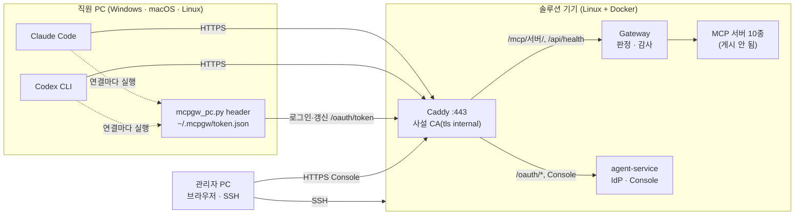

# MCP Governance Security Gateway

직원들이 **자기 PC에서 Claude Code·Codex CLI·Gemini CLI·OpenCode 같은 AI 하네스를 평소처럼 쓸 때** 오가는 MCP 통신을
한곳으로 모아, 모든 도구 호출을 **실행 전에** 판정하는 게이트웨이와, MCP 이용 관계를 **끝냈다고 말할 수 있는지**
판정하는 종료·폐기 절차를 한 저장소에서 재현하는 보안 테스트베드입니다.

> **범위:** 합성 계정과 합성 회사(BoB Corp) 데이터를 쓰는 재현용 랩입니다. 운영망의 SSO, 키 관리,
> TLS, 호스트 방화벽과 중앙 로그 보존을 대신하지 않습니다.


## 무엇이 들어 있나 (v3)

- **직원 PC 4대**(ws-ysg·ws-jwj·ws-pse·ws-nkk): 사내망(`office`)의 컨테이너에 **실제 하네스**를 공식 패키지 그대로
  설치했습니다 — Claude Code 2.1.282, Codex CLI 0.157.0, Gemini CLI 0.61.0, OpenCode 1.18.32. 회사가 더한 것은 IT 부서가 더하는
  것뿐입니다: 레지스트리에서 생성한 **관리형 MCP 설정**(서버마다 Gateway의 `/mcp/<server>/`), SSO 자격 도우미(`bob-sso`),
  단말 에이전트. 하네스의 LLM은 회사 LLM 게이트웨이(LiteLLM, 직원별 가상 키) 뒤의 로컬 모델이고, LiteLLM이 하네스마다 다른
  API 형식(Anthropic·Responses·Gemini·Chat)을 번역합니다. 협력사 직원 PC에는 Gateway를 우회하는 섀도 MCP 설정이 있습니다.
- **BoB Corp**: 회사 DB(PostgreSQL)·Redis·메일(GreenMail)·코드 저장소(Gitea)·인트라넷·공유 드라이브, 그리고 "외부 인터넷" 모사.
  시드 데이터에 개인정보·급여·유출된 비밀·프롬프트 주입 페이지가 있습니다.
- **실제 MCP 서버 10종**: filesystem · git · fetch · memory · desktop-commander · postgres-mcp · redis · mcp-email-server ·
  gitea-mcp · @playwright/mcp (버전 고정, 계약 해시 잠금). 직원 PC는 이 서버들에 직접 닿지 못합니다.
- **Gateway**: 신원(transport 토큰) → 자원 분류(경로·SQL·URL·수신자·키) → 승인 스키마 검증 → **Presidio 개인정보 검사** →
  OPA/Rego(권한 번들 + SSRF·DLP·민감정보 반출·열람→반출 연쇄·계약·공급망·섀도·종료 통제) → 같은 연결에서 계약 재확인 → 실행 →
  **결과 개인정보 마스킹** → 해시 체인 감사. 어느 하네스(clientInfo)가 어느 서버를 불렀는지도 함께 기록합니다(판정에는 쓰지 않음).
- **Console**(웹): 개요·활동 로그·승인·MCP 서버·직원·단말·도입 신청·종료·폐기·정책. 화면마다 페이지 내 탭과 차트
  (시간대별 판정, 하네스 → 서버 → 판정 흐름, 판정 행렬 등). 웹에서 MCP를 호출하지는 않습니다.
- **논문 구현**: 「원격 MCP 서비스 종료 시 권한 회수의 구조적 한계 및 종료 판정 기준 제안」(CISC-W'26)의 이용 관계 단위 판정
  (C1 모집단·C2 수행 권한·C3 연속성·C4 증거 접근 → T1/T2/T3)과 실험 E1~E3.

## 빠른 시작

Docker Engine이 있는 Linux 또는 WSL2에서:

~~~bash
git clone https://github.com/MCP-governance/mcp-gateway.git
cd mcp-gateway/full_stack_lab
./console.sh up          # 첫 실행은 이미지 빌드(하네스 설치)와 모델 다운로드로 수십 분 (LLM 없이: --no-llm)
./console.sh harnesses   # 각 PC의 하네스 4종이 Gateway의 MCP 서버 10개에 붙는지 (모델 없이)
./console.sh workday     # 네 직원이 각자의 하네스로 하루 업무 (모델이 도구를 고름)
./console.sh ask ws-ysg "공유 드라이브의 /shared/team/platform/deploy-checklist.md 를 요약해 줘" --servers filesystem
./console.sh watch       # 다른 창에서: Gateway 판정을 한 줄씩
./console.sh test        # 전체 검증
~~~

- Console: <http://localhost:8000> — `kkg@bob.local` / `test-password` (관리자)
- 포트가 겹치면 `.env`에 `CONSOLE_PORT`·`GATEWAY_PORT`·`JAEGER_PORT`·`GITEA_PORT`를 지정합니다.
- PC 안에서 직접: `docker compose exec ws-ysg bash -l` 뒤 `claude -p "…"`, `codex exec "…"`, `gemini -p "…"`, `opencode run "…"`.
- 로컬 모델은 CPU로 돕니다. 기본 `qwen3.5:2b-q4_K_M`(적재 1.7GB), 메모리가 넉넉하면 `.env`에 `LOCAL_LLM_MODEL=qwen3.5:4b`.
  하네스의 첫 턴은 CPU에서 수십 초~2분 걸립니다.

### Docker 네트워크 주소 풀이 소진된 경우

`all predefined address pools have been fully subnetted`는 Docker가 새 Compose 네트워크에 배정할 주소 대역을 찾지 못했다는
뜻입니다. 이 랩은 격리를 위해 네트워크를 12개 만듭니다. 그래서 `console.sh`는 처음 실행할 때 다른 Docker 망·호스트 라우트와
겹치지 않는 `10.200.0.0/16`~`10.249.0.0/16` 중 하나를 골라 `.env`의 `MCP_NET_PREFIX`에 고정하고, 망마다 그 아래 `/24`를
명시합니다(D-24). 후보 대역이 모두 겹치면 오류로 멈춥니다. 그때는 쓰지 않는 **자기** 복제본만 내리세요.

## 실제 기기로 배치하기 — 솔루션 기기 · 관리자 PC · 직원 PC

위의 빠른 시작은 직원 PC 4대가 컨테이너이고 모든 게시가 `127.0.0.1`입니다. 같은 Gateway·IdP·정책·Console을
사내망의 실제 기기 세 종류로 나누면, 직원 노트북의 **실제** Claude Code·Codex CLI가 호출하는 MCP 도구도 똑같이
실행 전에 판정됩니다. 사내망에 여는 것은 솔루션 기기의 **HTTPS 443 하나**(Caddy)이고, 랩의 기본 동작과
`./console.sh up`은 바뀌지 않습니다 — 실기기용 명령은 전부 `./console.sh field …`입니다(D-42~D-44).



| 역할 | 기기 | 설치할 것 | 네트워크 |
| --- | --- | --- | --- |
| 솔루션 기기 | Linux(Ubuntu 24.04 등) 미니 PC·서버·남는 노트북, 메모리 8GB 이상. Windows 노트북이면 WSL2 | Docker Engine + Compose v2, git, python3, curl, openssl | 사내망 고정 IP. 443/tcp를 사내 대역에, 22/tcp를 관리자 PC에 |
| 관리자 PC | Windows·macOS 노트북 | 브라우저, SSH 클라이언트 | 기기의 443·22 |
| 직원 PC | Windows·macOS·Linux 노트북 | Python 3.9 이상, Claude Code, Codex CLI 0.148 이상(npm 설치에 Node.js LTS) | 기기의 443 |

- 하네스의 **모델 로그인은 각자의 벤더 계정 그대로**입니다(Claude 구독·Console 키, ChatGPT·OpenAI 키). 이 배치가
  통제하는 것은 MCP 경로(Gateway)뿐이고, 랩의 회사 LLM 게이트웨이(LiteLLM)는 사내망에 열지 않습니다(D-44).
- 직원 PC의 키트(`full_stack_lab/field/pc/mcpgw_pc.py`)가 랩의 `bob-sso`와 같은 일을 합니다. IdP에 합성 계정으로
  한 번 로그인하고, 두 하네스가 서버에 연결할 때마다 키트의 `header`를 실행해 10분짜리 접근 토큰을 받습니다
  (Claude Code `headersHelper`, Codex CLI `http_headers_helper` — 둘 다 401이면 다시 부름). 비밀번호는 저장하지 않고,
  토큰은 하네스 설정 파일에 들어가지 않습니다.
- 예시 이름은 `mcp-gw.internal`(`.internal`은 사설용 최상위 도메인), 기기 IP `192.168.0.10`, 관리자 PC `192.168.0.20`입니다.

### ① 솔루션 기기

1. [Docker Engine](https://docs.docker.com/engine/install/)과 Compose v2를 설치하고 저장소를 받습니다.

   ```bash
   git clone https://github.com/MCP-governance/mcp-gateway.git
   cd mcp-gateway/full_stack_lab
   cp .env.example .env
   ip -4 -brief addr      # APPLIANCE_BIND에 적을 사내망 IP 확인
   ```

2. **처음 기동하기 전에** `.env`를 고칩니다. 합성 계정은 첫 기동 때 모두 `MOCK_SSO_PASSWORD` 하나로 심어지므로,
   사내망에 열 배치에서는 이 값과 `*_PASSWORD`들을 추측할 수 없는 값으로 바꿉니다(이미 띄웠다면 ② 3번으로 계정마다 바꿉니다).

   ```ini
   APPLIANCE_HOST=mcp-gw.internal
   APPLIANCE_BIND=192.168.0.10
   MOCK_SSO_PASSWORD=<추측할 수 없는 값>
   POSTGRES_PASSWORD=<추측할 수 없는 값>
   ```

   `APPLIANCE_BIND`에는 기기의 사내망 IP를 적습니다(`0.0.0.0`은 모든 인터페이스를 엽니다). 두 값이 없으면
   오버라이드가 기동을 거부합니다.

3. 기동합니다. 회사 시스템·MCP 서버 10종·Gateway·Console을 띄우고(로컬 LLM과 컨테이너 직원 PC 4대는 끔 — 실제 PC가
   대신합니다. 같이 보려면 `--with-lab-workstations`), 마지막에 Caddy를 올려 사설 루트 인증서와 지문을 보여 줍니다.

   ```bash
   ./console.sh field up       # = docker compose -f compose.yaml -f compose.field.yaml …
   ./console.sh field ca       # 다시 꺼내기: field/ca/root.crt 와 SHA-256 지문
   ./console.sh field status   # 사설 CA로 검증하며 https://mcp-gw.internal/api/health 확인
   ```

4. 방화벽에서 SSH는 관리자 PC에만, 443은 사내 대역에만 엽니다. Docker가 게시한 포트는 ufw 규칙을 거치지 않으므로
   443 제한은 `DOCKER-USER` 체인에 둡니다([Docker 문서](https://docs.docker.com/engine/network/packet-filtering-firewalls/)).
   원격으로 작업 중이면 `ufw enable` 전에 지금 접속한 주소가 허용되는지 먼저 확인합니다.

   ```bash
   sudo ufw allow from 192.168.0.20 to any port 22 proto tcp
   sudo ufw enable
   sudo iptables -I DOCKER-USER -p tcp --dport 443 ! -s 192.168.0.0/24 -j DROP   # 재부팅 뒤 유지: iptables-persistent
   ```

<details>
<summary>솔루션 기기가 Windows 노트북(WSL2)일 때</summary>

- Windows 11 22H2 이상에서 `%UserProfile%\.wslconfig`에 미러 네트워킹을 켜면 WSL이 Windows의 사내망 IP를 그대로 씁니다.
  `APPLIANCE_BIND`에는 Windows의 사내망 IP를 적습니다. WSL이 유휴 상태에서 꺼지지 않게 시간 제한도 끕니다.

  ```ini
  [wsl2]
  networkingMode=mirrored
  vmIdleTimeout=-1

  [general]
  instanceIdleTimeout=-1
  ```

- 관리자 PowerShell에서 Hyper-V 방화벽과 Windows 방화벽의 443 인바운드를 엽니다
  ([WSL 네트워킹 문서](https://learn.microsoft.com/windows/wsl/networking#mirrored-mode-networking)).

  ```powershell
  New-NetFirewallHyperVRule -Name "mcp-gw-443" -DisplayName "MCP gateway 443" -Direction Inbound -VMCreatorId '{40E0AC32-46A5-438A-A0B2-2B479E8F2E90}' -Protocol TCP -LocalPorts 443
  New-NetFirewallRule -DisplayName "MCP gateway 443" -Direction Inbound -Protocol TCP -LocalPort 443 -RemoteAddress 192.168.0.0/24 -Action Allow
  wsl --shutdown
  ```

- 이 랩의 [환경 주의](AGENTS.md)대로 WSL은 유휴 시 꺼질 수 있으니, 설정이 먹지 않는 환경이면
  `wsl.exe -d <배포판> -- sleep infinity`를 백그라운드로 하나 띄워 둡니다. 서비스는 모두 `restart: unless-stopped`입니다.

</details>

### ② 관리자 PC

1. 루트 인증서를 받아 지문을 확인하고 신뢰시킵니다. 지문은 기기에서 `./console.sh field ca`가 보여 준 값과 같아야 합니다.

   ```bash
   scp admin@192.168.0.10:mcp-gateway/full_stack_lab/field/ca/root.crt mcp-gw-root.crt
   ```

   ```powershell
   # Windows (현재 사용자)
   Import-Certificate -FilePath .\mcp-gw-root.crt -CertStoreLocation Cert:\CurrentUser\Root
   ```

   ```bash
   # macOS
   sudo security add-trusted-cert -d -r trustRoot -k /Library/Keychains/System.keychain mcp-gw-root.crt
   ```

2. 사내 DNS가 없으면 hosts 파일에 `192.168.0.10 mcp-gw.internal`을 한 줄 더합니다(Windows는 관리자 권한 메모장으로
   `C:\Windows\System32\drivers\etc\hosts`, macOS·Linux는 `sudo nano /etc/hosts`). 브라우저에서 `https://mcp-gw.internal`을
   열고 관리자 계정(`kkg@bob.local`)으로 Console에 로그인합니다.
3. 직원에게 줄 계정의 비밀번호를 **계정마다** 바꿉니다(합성 디렉터리의 계정 — 아래 "보안 주의"). 비밀번호는 입력해도
   보이지 않고, 직원에게는 인증서 파일과 다른 경로로 알립니다.

   ```bash
   ssh -t admin@192.168.0.10 "cd mcp-gateway/full_stack_lab && ./console.sh field set-password ysg@bob.local"
   ssh -t admin@192.168.0.10 "cd mcp-gateway/full_stack_lab && ./console.sh field set-password kkg@bob.local"
   ```

4. 직원이 실행할 명령을 만듭니다. 서버 목록은 레지스트리(`registry/catalog.toml`)에서 읽으므로 손으로 옮기지 않습니다.

   ```bash
   ssh admin@192.168.0.10 "cd mcp-gateway/full_stack_lab && ./console.sh field pc-command"
   # python3 mcpgw_pc.py setup --url https://mcp-gw.internal --servers desktop,email,…,redis --ca root.crt --workstation <이 PC의 이름>
   ```

   직원에게 넘길 것: `full_stack_lab/field/pc/mcpgw_pc.py`, `mcp-gw-root.crt`, 그 **지문**, 위 명령, 계정·비밀번호.
5. (선택) 단말 관측 에이전트: `./console.sh field register-pc ysg-laptop emp-ysg windows`가 장치 키를 한 번 출력합니다.
   설치는 [endpoint-agent/README.md](endpoint-agent/README.md)를 따릅니다. 에이전트가 하네스 설정 파일을 인벤토리하므로
   종료·폐기 때 이 PC의 "단말 설정" 회수 증거가 됩니다.
6. (선택) 직원이 게이트웨이를 거치지 않는 MCP 서버를 더하지 못하게 잠그려면 관리형 파일을 만들어 MDM·그룹 정책으로
   배포합니다. 파일에는 토큰이 없고, 모든 PC에서 키트와 파이썬이 같은 경로에 있어야 합니다.

   ```bash
   python3 full_stack_lab/field/pc/mcpgw_pc.py managed --url https://mcp-gw.internal --servers desktop,email,fetch,filesystem,git,gitea,memory,playwright,postgres,redis \
     --out managed/ --python "C:\Program Files\Python312\python.exe" --kit "C:\ProgramData\mcpgw\mcpgw_pc.py"
   ```

   `managed-mcp.json`은 Claude Code 시스템 경로(macOS `/Library/Application Support/ClaudeCode/`, Linux `/etc/claude-code/`,
   Windows `C:\Program Files\ClaudeCode\`)에 두면 **그 파일의 서버만** 쓰이고, `requirements.toml`은 Codex 시스템 경로
   (Unix `/etc/codex/`, Windows `%ProgramData%\OpenAI\Codex\`)에 두면 목록 밖 MCP 서버가 켜지지 않습니다. 이 PC의 직원은
   ③ 3번을 `--harness codex`로 실행합니다(Claude Code 서버는 관리형 파일이 정함).

### ③ 직원 PC

1. 관리자에게 받은 인증서를 신뢰시키고 이름을 등록합니다(② 1·2번과 같음). Linux는 다음과 같습니다.

   ```bash
   sudo cp mcp-gw-root.crt /usr/local/share/ca-certificates/mcp-gw-root.crt && sudo update-ca-certificates
   ```

   Claude Code(네이티브 설치본)와 Codex CLI는 OS 인증서 저장소를 신뢰합니다. npm으로 설치한 Claude Code가 Node 22.15 미만에서
   돌면 `NODE_EXTRA_CA_CERTS`, Codex가 인증서를 찾지 못하면 `CODEX_CA_CERTIFICATE`에 이 파일 경로를 줍니다.

2. 하네스를 공식 방법으로 설치하고 각자 벤더 계정으로 로그인합니다(`claude`를 한 번 실행, `codex login`).

   ```powershell
   # Windows
   irm https://claude.ai/install.ps1 | iex
   npm install -g @openai/codex
   winget install Python.Python.3.12
   ```

   ```bash
   # macOS · Linux
   curl -fsSL https://claude.ai/install.sh | bash
   npm install -g @openai/codex
   ```

3. 관리자가 준 명령으로 키트를 실행합니다. 인증서 지문이 관리자가 알려 준 값과 다르면 멈춥니다. 회사 계정과 비밀번호를
   물으면 입력합니다(비밀번호는 화면에 보이지 않고 저장되지 않습니다).

   ```powershell
   py -3 mcpgw_pc.py setup --url https://mcp-gw.internal --servers desktop,email,fetch,filesystem,git,gitea,memory,playwright,postgres,redis --ca mcp-gw-root.crt --workstation ysg-laptop
   py -3 $HOME\.mcpgw\mcpgw_pc.py doctor
   ```

   ```bash
   python3 mcpgw_pc.py setup --url https://mcp-gw.internal --servers desktop,email,fetch,filesystem,git,gitea,memory,playwright,postgres,redis --ca mcp-gw-root.crt --workstation ysg-laptop
   python3 ~/.mcpgw/mcpgw_pc.py doctor
   ```

   `setup`이 하는 일: 로그인해 리프레시 토큰을 `~/.mcpgw/token.json`에 저장(POSIX 0600), 키트를 `~/.mcpgw/`에 복사,
   Claude Code 사용자 범위에 `claude mcp add-json --scope user`로 서버 추가, `~/.codex/config.toml` 끝에 표식으로 감싼
   블록 추가(다른 설정은 그대로). 직원이 이미 만든 같은 이름의 서버가 있으면 아무 것도 쓰지 않고 멈춥니다.
   `--dry-run`은 쓸 내용만 보여 줍니다. `doctor`는 이름 해석·TLS·로그인·서버별 `initialize`·하네스 설정·헬퍼 실행을
   한 줄씩 `OK`/`FAIL`로 보여 줍니다. `--workstation`은 IdP의 `client_id`로, 리프레시 토큰 계열을 이 PC에 묶습니다.

4. 평소처럼 씁니다. Claude Code·Codex에서 `/mcp`를 열면 서버 10개가 보입니다. VS Code의 Claude Code·Codex 확장도 같은
   사용자 설정을 읽습니다. 리프레시 토큰이 만료·폐기되면 하네스가 연결에 실패하고, 그때는
   `python3 ~/.mcpgw/mcpgw_pc.py login`으로 다시 로그인합니다.

### ④ 동작 확인

1. 직원 PC의 Claude Code에 "공유 드라이브의 /shared/team/platform/deploy-checklist.md 를 읽고 배포 전에 할 일을 세 줄로
   요약해 줘"라고 시킵니다. 관리자 Console의 **활동 로그**에 그 호출이 사람(`양승권`)·서버(`filesystem`)·판정(허용)과
   하네스(`claude-code`)로 남아야 합니다. Codex에도 같은 요청을 해 하네스 이름이 `codex-mcp-client`로 남는지 봅니다.
2. 막히는지 확인합니다. "partner@analytics-vendor.example 로 이번 주 매출 요약을 메일로 보내 줘"는 직원의 외부 반출이라
   실행 전에 **차단**되고, 활동 로그에 정책 ID와 함께 남습니다(랩의 `ws-jwj` 시나리오와 같은 판정).
3. 계정을 끄면 즉시 막히는지 봅니다. Console의 **직원**에서 그 계정을 정지하면 다음 호출부터 거부되고, 직원 PC의
   `doctor`가 `FAIL`을 보여 줍니다.

### ⑤ 문제 해결

| 증상 | 원인과 조치 |
| --- | --- |
| `doctor`: 이름 해석 FAIL | 사내 DNS 또는 hosts 파일에 `<기기 IP> mcp-gw.internal`. VPN이 DNS를 바꾸는지 확인 |
| `doctor`: TLS FAIL, 하네스의 `certificate`·`UnknownIssuer` 오류 | 루트 인증서를 OS 저장소에 넣었는지, `setup --ca`로 지정했는지. 기기에서 볼륨을 지워 CA가 바뀌었으면 새 인증서를 다시 배포 |
| `doctor`: Gateway 도달 FAIL | 기기의 `APPLIANCE_BIND`가 실제 IP인지, 443 방화벽, WSL2면 미러 네트워킹과 Hyper-V 방화벽 |
| 로그인 실패(합성 계정과 비밀번호…) | 비밀번호가 바뀌었는지(② 3번), 계정이 정지됐는지 Console에서 확인 |
| 하네스가 연결 실패, `doctor`에 "로그인이 필요하다" | 리프레시 토큰 만료·폐기. `mcpgw_pc.py login` |
| MCP 서버별 HTTP 403 | 그 계정 역할에 허용되지 않은 서버(협력사 계정 등). 권한 번들은 Console의 정책에서 확인 |
| 접근 토큰이 금방 만료됨 | 두 기기의 시계를 NTP로 맞춤(토큰 10분) |
| `claude mcp add-json` 실패: enterprise MCP configuration | 관리형 `managed-mcp.json`이 배포된 PC. ② 6번대로 `--harness codex` |
| Codex에서 서버가 안 보임 | Codex 0.148 미만(`http_headers_helper` 없음). 업데이트 후 `codex mcp get filesystem` |

### ⑥ 되돌리기

```bash
python3 ~/.mcpgw/mcpgw_pc.py uninstall   # 직원 PC: 키트가 쓴 Claude·Codex 설정과 토큰을 지우고 IdP에 리프레시 토큰 폐기 요청
./console.sh field down                  # 솔루션 기기: Caddy(사내망 게시)만 멈춤
./console.sh down                        # 스택 전체 중지(데이터 유지)
./console.sh reset                       # DB·모델 볼륨까지 삭제
```

`uninstall`의 폐기 요청(RFC 7009)은 처리 사실만 뜻합니다. PC를 반납·분실했다면 [종료·폐기 판정](docs/ai/TERMINATION_MODEL.md)대로
Console에서 그 이용 관계의 케이스를 열어 회수 증거(IdP 토큰 계열, 단말 설정 — 하네스 설정 파일 포함)를 확인합니다.
직원 PC의 루트 인증서는 Windows `certmgr.msc`(신뢰할 수 있는 루트 인증 기관), macOS 키체인 접근, Linux는 파일을 지우고
`sudo update-ca-certificates --fresh`로 뺍니다. hosts 줄도 지웁니다.

### 보안 주의

- 직원 계정은 **합성 디렉터리**(`principals` 테이블)의 계정입니다. 조직 SSO가 아니고, 계정 추가는 이 랩의 시드로만
  됩니다. 실제 도입 전에는 조직 IdP(OIDC)로 바꿔야 합니다(ROADMAP 10번).
- 키트가 IdP에 보내는 `client_id`(`--workstation`)는 허용 목록으로 검증되지 않습니다. 리프레시 토큰 계열을 PC별로 나누는
  이름표일 뿐, 등록되지 않은 PC의 로그인을 막지 않습니다. PC 단위 통제는 단말 관측 에이전트(② 5번)와 조직 IdP의 몫입니다.
- Caddy는 TLS를 끝낼 뿐 Caddy와 서비스 사이는 Docker 내부망의 평문입니다. 사설 CA 개인키는 기기의 `caddy_data` 볼륨에
  있으므로 기기에 SSH·Docker 권한이 있는 사람은 인증서를 낼 수 있습니다. 배포하는 것은 `field/ca/root.crt`(공개 인증서)뿐입니다.
- 관리형 잠금(② 6번)과 사내망 egress 통제가 없으면 직원은 게이트웨이를 거치지 않는 MCP 서버를 직접 쓸 수 있습니다
  ([CONTROL_PLANES](docs/design/CONTROL_PLANES.md)). 이 배치는 조직 SSO·키 관리·중앙 로그 보존을 대신하지 않습니다.

## 검증

`./console.sh test`가 한 번에 돌리는 것: 망 대역 선택기 self-check · 콘솔 상태 모듈 node 시험 7건 · Rego 단위 시험 · 분류기
self-check · Gateway 인수 시험 15건(서버별 엔드포인트, 협력사에게 숨긴 도구의 직접 호출, 권한 번들, 개인정보 마스킹, 반출 차단,
열람→반출 연쇄 포함) · **하네스 연결 점검 16조합**(PC 4대 × 하네스 4종 × 서버 10개, 모델 없이) · 직원 업무 시나리오 21건의
기대 판정 대조(공식 MCP Inspector CLI가 같은 URL·SSO 토큰으로 호출) · 종료 판정 흐름 · 보안 회귀 54건(망 분리 실제 소켓,
loopback 게시, 토큰 없는 읽기 API, 역할 경계, 로그아웃 즉시 효력, OPA·상위 서버·Presidio 장애 시 실패 안전, 감사 변조 탐지,
계약 잠금) · 정책 재생 · 논문 실험 E1~E3. CI([`.github/workflows/verify.yml`](.github/workflows/verify.yml))가 `main`·`feat/**`
푸시와 PR마다 같은 명령을 실행합니다. 상세: [docs/ai/TESTING.md](docs/ai/TESTING.md).

## 권한 모델

**역할 3 × 데이터 등급 3 × 행위 3 = 27칸**에서 어떤 조합을 허용할지는 Rego 코드가 아니라 배포된 **권한 번들**
(`opa/data.json`의 `authorization.grants`)이 정합니다. 번들에 없는 조합은 `P-AUTHZ-DENY-001`로 차단되고, 번들이 비면 전부
차단됩니다. 행위는 도구 이름이 아니라 인자에서 정합니다(`SELECT`=r, `UPDATE`=w, DDL·외부 메일·외부 목적지=x). 모르는 자원은
important로 봅니다. 아래는 예시 번들로 OPA에 물은 결과입니다(Console 정책 → 판정 행렬과 같음).

| 역할 \ 등급 | 공개 r/w/x | 내부 r/w/x | 중요 r/w/x |
| --- | --- | --- | --- |
| 협력사 직원 | 허용/차단/차단 | 차단/차단/차단 | 차단/차단/차단 |
| 직원 | 허용/차단/차단 | 허용/허용/차단 | 경보/차단/차단 |
| 관리자 | 허용/허용/경보 | 허용/허용/경보 | 허용/허용/승인 |

27칸은 출발점입니다. 그 위에 계약·레지스트리·SSRF·DLP·섀도·종료·예외·누적 접근 정책이 우선순위로 겹칩니다
→ [docs/ai/POLICY.md](docs/ai/POLICY.md). 정책마다 `risk_ids`·`requirement_ids`·`control_ids`·`pac_candidate_id`가
**MCP 보안 통합관리대장 V1.0**의 실제 행을 가리킵니다.

## 종료·폐기 판정

서비스를 "껐다"는 것은 권한 회수가 끝났다는 뜻이 아닙니다. 케이스를 여는 순간 Gateway가 그 이용 관계의 호출을 모두 막고
(차단이 회수보다 먼저), 회수 대상(강제 경로·이용 주체·단말 설정 — 하네스 설정 파일 포함 — ·**제공자가 하위 시스템에 보유한
자격**)마다 증거를 모아 네 기준으로 판정합니다. RFC 7009 폐기 응답(200)은 처리 사실만 증명하므로 상태 증거로 치지 않고,
제공자가 보유 자격을 고지하지 않으면 모집단을 열거할 수 없어 **T3(판단 불가)**이며 위험 수용 없이 종결되지 않습니다.
→ [docs/ai/TERMINATION_MODEL.md](docs/ai/TERMINATION_MODEL.md)

## 저장소 안내

| 경로 | 용도 |
| --- | --- |
| [full_stack_lab/](full_stack_lab/README.md) | 통합 랩 전체(Compose·Gateway·Console·MCP 서버·회사·직원 PC·시험) |
| [docs/ai/](docs/ai/README.md) | **설계·운영·시험 문서** (정본 설계는 [ARCHITECTURE.md](docs/ai/ARCHITECTURE.md), 결정은 [DECISIONS.md](docs/ai/DECISIONS.md)) |
| [endpoint-agent/](endpoint-agent/README.md) | 실제 사용자 PC(Linux·Windows)에 설치하는 단말 관측 에이전트. 하네스 설정 파일을 인벤토리. 랩의 직원 PC도 같은 파일 |
| [docs/API.md](docs/API.md) | API 요약. `./console.sh openapi`가 기계용 명세 생성 |
| [docs/architecture/](docs/architecture/hardening.md) | 실행 경로·실행 상태·DB 권한·검사 환경의 단계적 분리 제안(검토 문서) |
| [docs/design/](docs/design/) | v1 시기 설계 배경(통제 평면 분리, 망 경계) |
| [AGENTS.md](AGENTS.md) | AI 에이전트 작업 규칙과 깨면 안 되는 불변식 |
| [research/](research/README.md) | 레퍼런스 조사 |

v1(모의 MCP 서버·웹에서 도구 실행, `2026-09-v1.*`)과 v2(손으로 짠 사내 에이전트, `2026-09-v2.0-workforce-real-mcp`)는
태그로 보존되어 있습니다. v3(`2026-09-v3.0-harness-gateway`)는 직원 PC의 호출 주체를 실제 하네스로 바꾸고, Gateway를 하네스의
관리형 설정이 가리키는 서버별 MCP 엔드포인트로 만들었습니다.

## 검토·브랜치 원칙

- 독립 작업은 `feat/YYYY-MM-vX.Y-내용`, 통합 후보는 `release/YYYY-MM-vX.Y-내용`. 병합이 끝난 브랜치는 지웁니다.
- 병합된 기준점은 annotated tag로 남깁니다(`YYYY-MM-vX.Y-내용`).

## 운영으로 옮기기 전에

- 이 저장소는 강제 경로 **안의** 호출을 통제합니다. 섀도 MCP는 발견·증적 강화까지이고, 실제 차단은 네트워크 평면
  (egress 허용목록·DNS)과 하네스의 관리형 설정 잠금(Claude Code `managed-mcp.json`의 배타적 제어 등)의 몫입니다
  → [docs/design/CONTROL_PLANES.md](docs/design/CONTROL_PLANES.md).
- 하네스의 MCP 토큰은 랩에서 `bob-sso`(password grant)가 받습니다. 실제 PC에서는 하네스의 MCP OAuth 로그인(인가 코드 +
  PKCE)을 조직 IdP에 연결하고, 사내망이라도 Gateway·LLM 게이트웨이에 TLS를 씌우세요 → [docs/ai/ROADMAP.md](docs/ai/ROADMAP.md).
- 합성 로그인은 조직 SSO가 아니고, Compose 내부망은 호스트 방화벽이나 tailnet ACL이 아닙니다
  → [docs/design/NETWORK.md](docs/design/NETWORK.md).
- 계약 잠금(`registry/contracts.lock.json`)은 한 빌드의 값입니다. 서버 버전을 올리면 diff를 검토하고
  `./console.sh contracts --update`로 갱신합니다. 기동 시 자동 승인(TOFU)은 하지 않습니다.
- AI 코드 감사(mcp-scan)는 저장소 코드를 설정한 LLM endpoint로 보냅니다. 코드 반출이 불가한 조직은 로컬 모델만 연결해야 합니다.
