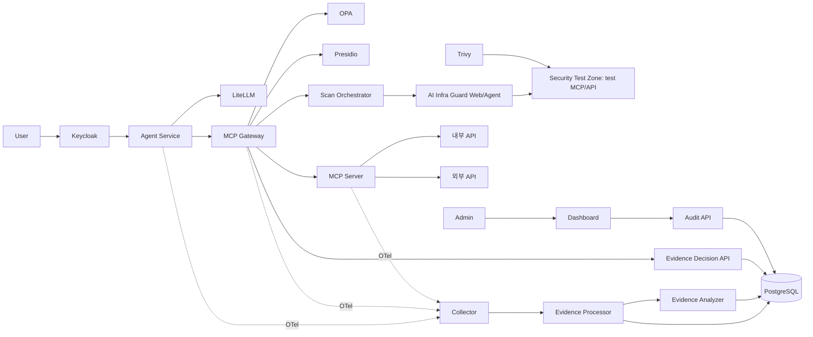

# MCP Gateway — 구조도 2안

사용자가 제공한 [draw.io 원본](https://drive.google.com/file/d/1i3WloSS4OpMtd_CuGsfouBLo5AzyG4VS/view)의 **제2안**을 서비스 경계에 맞춰 구현한 브랜치입니다. 원본의 초안과 기존 `main`의 직원 PC 실습은 이 런타임에 포함하지 않습니다.



구조도 안의 Agent Service·LiteLLM은 AI Agent Gateway, OPA·Presidio는 MCP Gateway, Collector·Processor·Analyzer·Decision API는 Runtime Analyzer 경계에 속합니다. 서비스별 실행 프로세스를 분리했습니다. MCP 서버 옆의 OTel은 사용자 확인에 따라 포함했습니다.

## 실행

```bash
git clone --branch architecture/plan-2 https://github.com/MCP-governance/mcp-gateway.git
cd mcp-gateway
cp .env.example .env
# .env의 비밀번호/내부 토큰을 설정하고 필요한 LLM 접속 정보를 입력합니다.
python3 prepare.py
docker compose up -d --build
uv sync --frozen
uv run --frozen python tests/container_smoke.py
```

기본 주소는 Keycloak `http://127.0.0.1:18081`, Agent Service `http://127.0.0.1:18082`, Dashboard `http://127.0.0.1:18083`입니다. MCP 클라이언트는 Agent Service의 `/mcp/demo`에 연결하고 Keycloak access token을 전송합니다. Dashboard는 Keycloak Authorization Code + PKCE로 로그인하며 도구를 실행하지 않습니다. 기본 로컬 계정은 `user`와 `admin`이며 비밀번호는 `.env`에서 설정합니다. `prepare.py`는 신규 Keycloak 볼륨에 import할 realm과 Dashboard 로그인 주소를 생성합니다. 기존 realm 사용 중에는 Keycloak에서 사용자/클라이언트를 갱신해야 합니다.

도구는 최초 발견 시 차단 상태입니다. 관리자가 Dashboard에서 허용하면 다음 호출부터 OPA 판정과 Presidio 검사를 거쳐 실행됩니다. 도구 정의가 달라지면 허용이 초기화됩니다. Gateway는 매 실행 전 도구를 다시 발견하고 Decision API의 해시/허용 상태를 조회합니다. 본문 원문을 전달하고 직원 토큰은 MCP 서버에 보내지 않습니다. 민감한 인자가 발견되면 실행 전에 차단합니다.

Agent Service의 `/v1/chat/completions`는 사용자 신원을 확인한 뒤 별도 서비스 키로 LiteLLM에 연결합니다. 실제 모델 추론에는 `LLM_MODEL`, `LLM_API_BASE`, `LLM_API_KEY` 설정이 필요합니다. 모델 계정이 없는 상태에서도 MCP·인증·증적 통합 시험은 실행할 수 있습니다.

## 증적과 범위

세 곳의 OTel은 중앙 Collector에 모이고, Processor가 원문 인자/결과/토큰을 제외한 메타데이터와 Presidio 발견 수를 정규화합니다. Analyzer는 이 증적의 차단·실패·민감정보 발견 위험을 분류해 PostgreSQL에 저장합니다. 학습 모델이나 추가 보안 엔진은 포함하지 않습니다. 증적 수집은 비동기 관측이며 네트워크 단절 시 완전한 전달을 보장하지 않습니다.

내부/외부 API는 실행 가능한 예제이며 실제 GitHub 계정이나 업무 API를 복제한 서비스가 아닙니다. 원하는 API를 MCP 도구에서 연결하면 됩니다. 서비스/원본 연결은 [docs/topology.json](docs/topology.json), 편집 가능한 원본은 [docs/source.drawio](docs/source.drawio)입니다. `research/`는 그대로 보존했습니다.

```bash
uv run --frozen pytest -q
uv run --frozen python -m pyflakes services tests prepare.py
docker compose config --quiet
docker compose down # 자기 프로젝트만 종료; DB 볼륨은 유지
```

`main`은 기존 거버넌스 실습, `proxy`는 HTTP 프록시와 관제, `architecture/plan-1`·`architecture/plan-2`는 각각 구조도의 1안·2안입니다. 2안의 Scan Orchestrator는 MCP Gateway 내부에 있고, 실제 A.I.G Web/Agent 4.6.3와 Security Test Zone 검사 복제본을 사용합니다. Syft와 Semgrep은 포함하지 않습니다. 사용한 제품 버전은 원본 표를 따릅니다. Collector(0.153.0)와 LiteLLM(v1.102.1)은 원본에 버전이 없어 실행 가능한 고정 버전을 사용합니다. Python 의존성은 `uv.lock`으로 고정합니다.

Collector JSON 전송 설정은 [OTel 공식 문서](https://github.com/open-telemetry/opentelemetry-collector/blob/main/exporter/otlphttpexporter/README.md), Keycloak import/hostname은 [Keycloak 공식 문서](https://www.keycloak.org/server/containers)를 기준으로 구성했습니다.

## 2안 보안 검사

실제 A.I.G 이미지 `zhuquelab/aig-server:v4.6.3`와 `zhuquelab/aig-agent:v4.6.3`를 실행합니다. 검사 대상은 `TEST_TARGETS`에 등록된 테스트 구역의 복제본입니다. 운영 도구나 DB는 검사 컨테이너에 연결하지 않습니다. A.I.G/Trivy 검사 결과가 도구를 자동 승인하지 않습니다.

관리자는 Keycloak 토큰으로 `http://127.0.0.1:18084/scans`에 `{"target":"demo"}`를 POST하고, 반환된 UUID를 `/scans/<UUID>`에서 조회합니다. 실제 MCP 스캔에는 `.env`의 `AIG_SCAN_MODEL`·`AIG_SCAN_MODEL_TOKEN` 또는 A.I.G에 미리 구성한 기본 모델이 필요합니다. 외부 LLM 호출이 발생하므로 배포한 모델의 과금 정책이 적용됩니다. 자격 증명 없이 검사 완료를 표시하지 않습니다.

Trivy는 `docker compose --profile scan run --rm trivy`로 실행합니다. 자기 프로젝트의 새 보고서 볼륨으로 실행해 이전 결과와 구분하고, Gateway 내부에서 서비스 토큰으로 `POST /scans/trivy-result`를 호출하면 정규화된 발견 수가 중앙 OTel 경로로 저장됩니다. 자세한 배선·API·제품 요구사항은 [docs/SCANNING.md](docs/SCANNING.md)에 있습니다. A.I.G의 자체 SQLite 작업 DB는 제품 내부 저장소이며, Runtime Analyzer의 증적 DB는 PostgreSQL입니다.

2안 기본 네트워크 대역은 `MCP_NETWORK_PREFIX=10.247`이며, 동시 배포 시 포트와 대역을 분리합니다. 검사 API 연결과 Trivy 결과 수집은 `uv run --frozen python tests/container_scan_smoke.py --trivy`로 확인할 수 있습니다.
