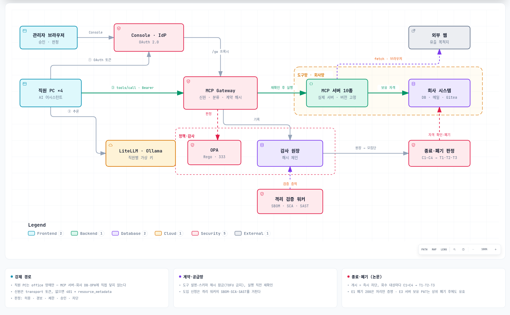

# MCP Governance Security Gateway

직원들이 **자기 PC에서 Claude Code·Codex CLI·Gemini CLI·OpenCode 같은 AI 하네스를 평소처럼 쓸 때** 승인된 MCP 연결을
한곳으로 모아, Gateway를 통과하는 도구 호출을 **실행 전에** 판정하는 게이트웨이와, MCP 이용 관계를 **끝냈다고 말할 수 있는지**
판정하는 종료·폐기 절차를 한 저장소에서 재현하는 보안 테스트베드입니다.

> **범위:** 합성 계정과 합성 회사(BoB Corp) 데이터를 쓰는 재현용 랩입니다. 운영망의 SSO, 키 관리,
> TLS, 호스트 방화벽과 중앙 로그 보존을 대신하지 않습니다.



2026-10-01 개편은 [작업·증거 관리표](docs/ai/REMASTER_2026-10-01.md)에서 추적합니다.
미등록 연결 거부의 감사 공백과 관리자 직접 등록 우회를 수정하고, 원격 서비스의 실제 계약 검토·독립 승인·활성화,
조직 초대와 운영 Console을 개편하고 있습니다. 단말 집행과 PAC 전환의 미완료 상태도 같은 표에 기록합니다.

## 무엇이 들어 있나 (v3.1)

- **직원 PC 4대**(ws-ysg·ws-jwj·ws-pse·ws-nkk): 사내망(`office`)의 컨테이너에 **실제 하네스**를 공식 패키지 그대로
  설치했습니다 — Claude Code 2.1.282, Codex CLI 0.157.0, Gemini CLI 0.61.0, OpenCode 1.18.32. 회사가 더한 것은 IT 부서가 더하는
  것뿐입니다: 레지스트리에서 생성한 **관리형 MCP 설정**(서버마다 Gateway의 `/mcp/<server>/`), SSO 자격 도우미(`bob-sso`),
  단말 에이전트. 하네스의 LLM은 회사 LLM 게이트웨이(LiteLLM, 직원별 가상 키) 뒤의 로컬 모델이고, LiteLLM이 하네스마다 다른
  API 형식(Anthropic·Responses·Gemini·Chat)을 번역합니다. 협력사 직원 PC에는 Gateway를 우회하는 섀도 MCP 설정이 있습니다.
- **BoB Corp**: 회사 DB(PostgreSQL)·Redis·메일(GreenMail)·코드 저장소(Gitea)·인트라넷·공유 드라이브, 그리고 "외부 인터넷" 모사.
  시드 데이터에 개인정보·급여·유출된 비밀·프롬프트 주입 페이지가 있습니다.
- **실제 MCP 서버 10종**: filesystem · git · fetch · memory · desktop-commander · postgres-mcp · redis · mcp-email-server ·
  gitea-mcp · @playwright/mcp (버전 고정, 계약 해시 잠금). 직원 PC는 이 서버들에 직접 닿지 못합니다.
- **Gateway**: 신원(transport 토큰) → 자원 분류(경로·SQL·URL·수신자·키) → 승인 스키마 검증 → **Presidio 개인정보 검사** →
  OPA/Rego(권한 번들 + SSRF·DLP·민감정보 반출·열람→반출 연쇄·계약·공급망·섀도·종료 통제) → 같은 연결에서 계약 재확인 → 실행 →
  **결과 개인정보 마스킹** → 해시 체인 감사. 어느 하네스(clientInfo)가 어느 서버를 불렀는지도 함께 기록합니다(판정에는 쓰지 않음).
- **Console**(웹): 개요·활동 로그·승인 대기·MCP 서버·직원·단말(가입 승인 포함)·도입 신청(검증 보고서·A.I.G 검사)·
  종료·폐기·정책. 화면마다 페이지 내 탭과 차트(시간대별 판정, 하네스 → 서버 → 판정 흐름, 판정 행렬 등).
  웹에서 MCP를 호출하지는 않습니다.
- **도입 신청 자동 검증**: 신청하면 격리 워커가 저장소를 받아 SBOM(Syft)·취약점(Trivy)·코드 규칙(Semgrep)을 돌리고
  제공자 문서에서 종료 조건(C1·C2·C4)의 **결론과 예상 등급(T1~T3)**을 냅니다(규칙, 키가 있으면 TypeSafe Jev). 모델이 연결돼
  있으면 AI-Infra-Guard(A.I.G) `mcp-scan` 코드 감사도 겁니다(로컬 소형 모델 또는 OpenRouter).
- **하네스 기본 커넥터**: 직원 PC의 claude.ai 계정 커넥터·플러그인 서버, Codex의 ChatGPT 앱·웹 검색 같은 기본 기능을 섀도와
  따로 모아 관리자가 승인·거부하고, 거부한 것은 하네스가 스스로 끄게 합니다(D-51).
- **실기기 배치(field)**: 같은 스택을 솔루션 기기 한 대에 올리고 Tailscale IP에만 게시합니다. 관리자·직원은 같은
  로그인 화면을 쓰고, 직원 PC의 Claude Code·Codex CLI는 Console에서 받는 키트 한 파일(`field/pc/mcpgw_pc.py`)로 Gateway에
  붙습니다. 기본 설치는 MCP 서버 0개에서 시작합니다. 승인한 저장소는 내부 Gitea(같은 계정으로 로그인)로 가져오고, 승인한
  서버는 Console에서 도구별 권한·데이터 등급·사용 기한을 정해 Gateway에 등록합니다.
- **논문 구현**: 「원격 MCP 서비스 종료 시 권한 회수의 구조적 한계 및 종료 판정 기준 제안」(CISC-W'26)의 이용 관계 단위 판정
  (C1 모집단·C2 수행 권한·C3 연속성·C4 증거 접근 → T1/T2/T3)과 실험 E1~E3.

## 빠른 시작

Docker Engine이 있는 Linux 또는 WSL2에서:

~~~bash
git clone https://github.com/MCP-governance/mcp-gateway.git
cd mcp-gateway/full_stack_lab
./console.sh up          # 첫 실행은 이미지 빌드(하네스 설치)와 모델 다운로드로 수십 분 (LLM 없이: --no-llm)
./console.sh harnesses   # 각 PC의 하네스 4종이 Gateway의 MCP 서버 10개에 붙는지 (모델 없이)
./console.sh workday     # 네 직원이 각자의 하네스로 하루 업무 (모델이 도구를 고름)
./console.sh ask ws-ysg "공유 드라이브의 /shared/team/platform/deploy-checklist.md 를 요약해 줘" --servers filesystem
./console.sh watch       # 다른 창에서: Gateway 판정을 한 줄씩
./console.sh test        # 전체 검증
~~~

- Console: <http://localhost:8000> — `kkg@bob.local` / `test-password` (관리자)
- 포트가 겹치면 `.env`에 `CONSOLE_PORT`·`GATEWAY_PORT`·`JAEGER_PORT`·`GITEA_PORT`를 지정합니다.
- PC 안에서 직접: `docker compose exec ws-ysg bash -l` 뒤 `claude -p "…"`, `codex exec "…"`, `gemini -p "…"`, `opencode run "…"`.
- 로컬 모델은 CPU로 돕니다. 기본 `qwen3.5:2b-q4_K_M`(적재 1.7GB), 메모리가 넉넉하면 `.env`에 `LOCAL_LLM_MODEL=qwen3.5:4b`.
  하네스의 첫 턴은 CPU에서 수십 초~2분 걸립니다.

### Docker 네트워크 주소 풀이 소진된 경우

`all predefined address pools have been fully subnetted`는 Docker가 새 Compose 네트워크에 배정할 주소 대역을 찾지 못했다는
뜻입니다. 이 랩은 격리를 위해 네트워크를 12개 만듭니다. 그래서 `console.sh`는 처음 실행할 때 다른 Docker 망·호스트 라우트와
겹치지 않는 `10.200.0.0/16`~`10.249.0.0/16` 중 하나를 골라 `.env`의 `MCP_NET_PREFIX`에 고정하고, 망마다 그 아래 `/24`를
명시합니다(D-24). 후보 대역이 모두 겹치면 오류로 멈춥니다. 그때는 쓰지 않는 **자기** 복제본만 내리세요.

## 실제 기기로 배치하기 — Tailscale 내부망

솔루션 기기의 Tailscale IP 하나에만 Console·Gateway를 게시합니다. 접속 주소는
`http://<솔루션 기기 Tailscale IP>:443`입니다. 전송은 Tailscale 터널에서 암호화되며,
브라우저와 직원 PC에 `root.crt`, hosts 항목, 별도 관리자 인증서를 설치하지 않습니다.
웹 관리자와 직원은 **같은 로그인 화면에서 각자 ID/PW로 로그인**합니다. 관리자 권한은
계정의 역할로 판정합니다. 일반 LAN IP에는 이 HTTP 모드를 게시하지 않습니다.

### 솔루션 기기(WSL/Linux)

Tailscale과 Docker Compose가 작동하는 기기에서 다음을 실행합니다.

```bash
git clone https://github.com/MCP-governance/mcp-gateway.git
cd mcp-gateway/full_stack_lab
./console.sh field up
./console.sh field status
./console.sh field pc-command
```

`field up`은 Tailscale IP를 자동으로 찾고 필수 내부 비밀값을 `.env`에 생성합니다.
field 전용 DB·Gitea 볼륨을 사용하므로 기존 실습 데이터는 보존하면서 실습용 개인 이름과 MCP 10종이 기본 화면에 나타나지 않습니다. 이 기기에는
Tailscale IP가 있어야 하고, 직원·관리자 PC도 같은 tailnet에서 접속할 수 있어야 합니다.
`field status`는 현재 공개 주소의 `/api/health`를 확인합니다. 기본 `./console.sh up`은
종전의 loopback 실습용입니다.

첫 설치의 시험 계정은 **관리자 `root` / `root`**, **직원 `user` / `user`**입니다. 로그인 화면에는 계정 목록이나 미리 입력된 비밀번호가 없습니다. 별도 계정은 `/signup`에서 신청하고, 관리자가 **직원·단말 → 가입 승인**에서 처리합니다. 시험이 끝나면 `field set-password`로 비밀번호를 바꿉니다(12자 이상, 화면에 보이지 않는 입력).

```bash
./console.sh field set-password root
./console.sh field set-password user
```

관리자 PC에서 `http://<Tailscale IP>:443/login`에 로그인합니다. 직원도 같은 URL에
자기 계정으로 로그인해 **도입 신청 → 새 신청**에서 MCP 이름이나 GitHub 주소를 먼저 검색합니다. 기존 신청의 신청자·상태를 보고, 승인된 항목은 내부 저장소를 바로 열어 클론할 수 있습니다. 새 신청은 저장소·연결 방식·목적을 제출합니다.
접수 즉시 검증 대기열에 저장되고 관리자 목록은 열어 둔 상태에서도 5초마다 데이터만 갱신됩니다(차트는 다시 만들지 않습니다).
활동 로그의 MCP 도구 사용 기록은 도입 신청을 대신하지 않습니다.

기본 field 프로필에는 **MCP 서버가 0개**입니다(`registry/field/`). 예전 회사 시스템·MCP 10종이 필요한 실습만 `./console.sh field up --with-lab-mcp`로 켭니다. 이때는 별도 볼륨에 랩 계정(`kkg@bob.local` 등, 비밀번호는 `.env`의 `MOCK_SSO_PASSWORD`, 없으면 `test-password`)을 씁니다. 실습 직원 PC까지 필요하면 `--with-lab-workstations`를 사용합니다. 일반 field 실행은 실습 컨테이너를 중지합니다.

### 내부 Git(Gitea)

검증을 통과한 공개 GitHub 저장소는 관리자가 승인할 때 같은 솔루션의 Gitea `mcp` 조직으로 가져옵니다. 가져온 기본 브랜치 HEAD가 검증 커밋과 같을 때만 승인이 완료되며 내부 저장소 주소가 신청 목록과 검색 결과에 표시됩니다. Console 왼쪽 메뉴 **바로가기 → 내부 저장소**는 개인 홈이 아니라 조직의 저장소 목록(`http://<Tailscale IP>:443/git/mcp`)을 엽니다.

- 로그인은 솔루션 계정 하나입니다. Console에 로그인한 브라우저는 그대로 Gitea에 들어가고, 아니면 로그인 화면을 거쳐 돌아옵니다. 계정을 중지하면 Gitea도 다음 요청부터 막힙니다.
- `root`를 포함한 솔루션 계정은 `mcp` 조직의 전체 저장소 읽기 팀에 동기화됩니다. 새 계정은 가입 승인 즉시 가입하며, 기존 계정은 서비스 기동 때 보정합니다. 관리자 역할은 Gitea 관리자입니다. 풀 리퀘스트는 끕니다. 고친 코드는 도입 신청을 다시 거칩니다.
- 클론은 같은 ID/PW로 합니다: `git clone http://<Tailscale IP>:443/git/mcp/<저장소>.git`. Gitea 관리 자격은 솔루션 내부에만 둡니다.

### 승인한 MCP를 Gateway에 등록

도입 신청이 **승인**되면 관리자가 목록의 **Gateway 등록**을 누릅니다. MCP 엔드포인트(사내가 아니면 HTTPS)를 넣으면 서버가 지금 광고하는 도구를 불러오고, 도구마다 읽기·쓰기·외부전송·실행 또는 미승인을, 서버에는 데이터 등급과 사용 기한(30일~1년)을 고릅니다. 등록하면 `/mcp/<id>/`로 바로 쓸 수 있고 직원의 **내 PC 연결** 명령에도 들어갑니다.

- 관리자가 본 도구 계약(해시)과 등록 순간 서버의 계약이 다르면 등록을 거부합니다. 고정한 계약은 이후 호출마다 다시 대조합니다.
- 도구 설명에 모델을 조종하는 문구(`<IMPORTANT>` 태그, "사용자에게 말하지 마라", `~/.ssh` 같은 경로, 보이지 않는 문자 등)가 보이면 도구 옆에 경고가 붙고, 그 도구를 고를 때는 설명을 읽고 확인했다고 표시해야 등록됩니다(D-52).
- 사용 기한이 지나면 호출이 `P-APPROVAL-EXPIRY-001`로 막힙니다. 기한을 늘리거나 도구 계약을 바꾸려면 새 도입 신청·승인이 필요합니다(D-57·D-59, 제자리 연장 없음). **MCP 서버** 화면에서는 등록 해제를 합니다. 해제한 서버는 기록과 함께 사용 중지로 남고, 이용 관계 `UR-<ID>`는 **종료·폐기** 절차에 올릴 수 있습니다.
- 등록은 승인된 도입 신청을 통해서만 됩니다. 신청자와 승인자는 달라야 하고, 승인 1건은 등록 1개이며, 운영 중인 다른 서버 id를 덮어쓰지 않습니다. 공급자 호스팅 서비스는 계약 검토 때 지정한 사용자만 쓰고(`MCP-REGISTRY-003`), 신청 기록이 없는 예전 직접 등록은 실행되지 않습니다.
- 등록에는 신청의 GitHub 저장소와 검증 커밋이 실리므로, 이상행위나 정기 재감사로 도는 A.I.G 감사는 도입 때 검증한 바로 그 커밋을 다시 검사합니다.

개요의 허용·경보·차단 수치를 누르면 해당 활동 로그로 이동합니다. 직원·단말은 폐기 자격과 발급만 되고 보고하지 않은 장치를 기본 목록에서 제외합니다. 도입 신청의 검증·A.I.G 검사는 [아래 절](#mcp-도입-신청-자동-검증)을 봅니다. 원격 MCP 후보와 취약 버전·엣지 케이스는 [field 후보 목록](docs/ai/FIELD_MCP_CANDIDATES.md)을 참조합니다.

직원·단말 → 계정에서 사용·중지·잠김 중 하나를 라디오 버튼으로 고릅니다. 상태 변경 후 목록 갱신이 끝나면 완료 메시지를 표시하며, 갱신 중에는 상태 변경 버튼을 다시 누를 수 없습니다.
관리자는 다른 계정을 **삭제**할 수도 있습니다. 삭제 즉시 기존 토큰·Git 접근이 차단되고 조직 멤버십이 제거됩니다. 감사 기록과 아이디 중복 방지용 신원 행은 남기며, 본인과 `root` 계정은 삭제할 수 없습니다.

### 직원 PC의 Claude Code·Codex CLI 연결

웹 대시보드만 쓸 직원에게는 키트 설치가 필요 없습니다. 실제 AI 하네스에서 MCP를 쓰는 직원은 Console 왼쪽 메뉴
**바로가기 → 내 PC 연결**에서 키트(`field/pc/mcpgw_pc.py`, 표준 라이브러리만, Python 3.9 이상, Windows·Linux·WSL)를 받고, 표시된
한 줄을 복사해 자기 PC에서 실행합니다. 회사 계정과 비밀번호를 묻고 Claude Code·Codex CLI에 지금 운영 중인 서버를
등록합니다(`--harness`로 하나만 고를 수 있음). 같은 명령은 솔루션 기기의 `./console.sh field pc-command`로도 볼 수
있습니다. `--workstation`의 기본값은 그 PC의 호스트 이름이며, 서버 목록은 레지스트리에서 만듭니다. 운영 중인 서버가
없으면 명령 대신 그 사실을 표시합니다.

```bash
# Console "내 PC 연결"의 명령 예: 키트를 받고 setup
curl -fsSO http://<Tailscale IP>:443/static/kit/mcpgw_pc.py && python3 mcpgw_pc.py setup --url http://<Tailscale IP>:443 --servers <id,…>
python3 ~/.mcpgw/mcpgw_pc.py doctor
```

키트는 비밀번호를 저장하지 않습니다. 갱신 가능한 사용자 토큰은 `~/.mcpgw`에 두고,
하네스 설정에는 토큰 값 대신 헤더 헬퍼 명령만 씁니다. 실제 MCP 호출과 Console 활동
로그를 함께 확인합니다. 연결을 해제하려면 직원 PC에서
`python3 ~/.mcpgw/mcpgw_pc.py uninstall`, 솔루션 기기에서 공개 포트만 닫으려면
`./console.sh field down`을 실행합니다. 직원이 목록 밖의 서버를 더하지 못하게 하려면
`mcpgw_pc.py managed`로 Claude Code `managed-mcp.json`·`managed-settings.json`과 Codex `requirements.toml`을 만들어 MDM·그룹 정책으로 배포합니다.

### 하네스가 기본으로 붙이는 커넥터(claude.ai 커넥터·ChatGPT 앱·기본 기능)

Claude Code는 claude.ai 계정에 연결한 커넥터(`claude.ai Notion` 등)와 플러그인 서버를, Codex는 ChatGPT 앱과 웹 검색·브라우저·
컴퓨터 조작 같은 기본 기능을 Gateway를 거치지 않고 씁니다. 키트가 이것들을 모아 보고합니다 — setup·doctor 끝에, 그리고
하네스가 연결할 때 6시간에 한 번(`python3 ~/.mcpgw/mcpgw_pc.py report`로 바로 보낼 수도 있음). 보내는 것은 이름과 목적지
호스트뿐입니다.

- 관리자는 **직원·단말 → 하네스 커넥터**에서 예외 승인·거부를 기록합니다. 벤더 출처와 무관하게 **미승인 항목은 처음부터
  거부 정책 대상**입니다. `CONNECTOR_REVIEW_DAYS`(기본 14일)는 검토 기한이며 사용 유예가 아닙니다(D-53).
- 사용자 설정 적용은 보조 조치입니다. 목록에서 사라져도 실제 차단이 입증되지 않아 화면에는 **차단 미검증**으로 표시합니다.
- `mcpgw_pc.py managed …`는 항상 세 파일을 만듭니다. Claude Code는 Gateway 서버만 고정하고 계정 커넥터·새 마켓플레이스를
  제한합니다. Codex는 `requirements.toml`의 서버 이름·URL 제약과 Apps·플러그인·웹 검색·브라우저/컴퓨터 사용 제한을 받습니다.
  IT가 시스템 위치에 배포하고 직원이 파일을 바꾸지 못하게 보호해야 합니다. 예외 승인으로 이 프로필이 자동 확장되지 않습니다.
- 이 범위는 **지원 버전의 관리형 CLI**입니다. Desktop·웹·다른 클라이언트·셸의 직접 API 호출에는 별도 조직 설정·단말 실행 통제·
  egress·상위 자격 통제가 필요합니다. 비교 조사·위협 모델·실측과 남은 일은 [SECURITY_BOUNDARIES.md](docs/ai/SECURITY_BOUNDARIES.md).

브라우저에는 HTTP 주소로 표시되므로 이 절차는 **Tailscale 내부망 전용**입니다.
일반 LAN이나 인터넷에 게시할 때는 조직이 신뢰하는 HTTPS 종료 지점을 둬야 합니다.
Tailscale의 `*.ts.net` HTTPS 인증서는 현재 tailnet 계정에서 발급이 거절되어 이
설치 절차에는 사용하지 않습니다. 별도 인증서가 없어도 Gateway의 사용자 토큰,
역할별 승인, 정책 판정과 감사 기록은 그대로 적용됩니다. 단, 단말 관측 에이전트
([endpoint-agent/](endpoint-agent/README.md))는 원격 Gateway에 HTTPS만 허용하고 Caddy도 `/api/endpoint/*`를
게시하지 않으므로 이 HTTP 배치에서는 다른 PC의 에이전트가 보고하지 못합니다(`field register-pc`는 장치 키 발급까지).

## MCP 도입 신청 자동 검증

공급자 호스팅 MCP(엔드포인트 신청)는 구현 소스를 검사할 수 없으므로 검증 대기열에 들어가지 않고 **검토 대기**로 시작해,
관리자가 실제 광고 도구 계약·사용 주체·기한을 검토한 뒤 다른 관리자가 승인합니다(D-57).
구현 저장소 신청을 제출하면 격리 워커(`intake-worker`)의 검증 대기열에 자동 등록됩니다. 워커는 저장소를 고정 커밋으로 받아
Syft(CycloneDX SBOM)·Trivy·Semgrep을 돌리고, 문서에서 C1~C4 종료 조건의 근거 후보를 찾습니다. 관리자는 도입 신청의
**검증 보고서**에서 취약점·코드 검사, SBOM 구성요소와 라이선스, 종료조건 조사를 확인하고 원본 JSON을 내려받을 수
있습니다. 검사 실패 사유와 성공한 단계의 보고서는 함께 보존되며 재검증할 수 있습니다.

**A.I.G 검사**(AI-Infra-Guard `mcp-scan`)는 field 설치에서 따로 설정할 것이 없습니다. `field up`이 초경량 로컬 모델
`qwen3.5:0.8b`(약 1GB)를 처음 한 번 받아 `aig-scanner`로 연결하고, 이후 검증을 마친 신청은 자동으로 코드 감사를 받습니다.
Gateway 등록 서버에서 이상행위(`P-ANOMALY-001`, 짧은 시간의 반복 차단)가 나오면 그 서버의 검증 커밋을 다시 감사하도록
자동 예약합니다(대상별 24시간 1회). 도입 신청의 **A.I.G 검사** 탭에서 모델·워커·자동 검사 상태, 시작 원인별 작업, 작업마다
상태·경과·심각도별 발견을 보고, 이상행위 작업은 원인 칩에서 해당 경보 기록으로 이동합니다. 활동 로그의 이상행위 판정에도
검사로 가는 버튼이 붙습니다. 0.8B 모델은 CPU에서 끝까지 도는 대신 탐지력이 낮아 **"발견 0 · 로컬 소형 모델"은 안전의 증거가
아닙니다**. `.env`에 `OPENROUTER_API_KEY`를 넣고 `field up`을 다시 하면 OpenRouter의 `deepseek/deepseek-v3.2`(A.I.G 기본 계열,
바꾸려면 `OPENROUTER_MODEL`)로 감사합니다(D-50). 더 큰 로컬 모델은 `AIG_LOCAL_MODEL`, 조직의 다른 endpoint는 `MCP_SCAN_*`에 적습니다(D-47).
끄려면 `AIG_LOCAL_MODEL=none`.

**종료 조건**은 검증 보고서의 **종료 조건** 탭에 조건마다 충족·미충족·불명확과 근거 문장(파일·줄 링크), 예상 등급이 나옵니다.
C1(제공자가 쥔 자격을 밝혔는가)이 없으면 T3, 폐기 방법(C2)이나 종료 후 감사 기록(C4)이 없으면 T2입니다. `.env`의
`TYPESAFE_API_KEY`가 있으면 TypeSafe Jev가 판정하고, 없으면 규칙으로 판정합니다. 원격 서버는 결론이 T1이면 바로, 아니면
**위험 수용 사유**(10자 이상)를 적거나 제공자 문서로 확인한 기록을 남겨야 승인됩니다. 결론은 제공자의 실제 회수나 계약을
검증한 것이 아니며 최종 도입 승인은 관리자가 합니다.

## 검증

`./console.sh test`가 한 번에 돌리는 것: 망 대역 선택기 self-check · 도입 검증 단위 시험 14건(네트워크 없는 컨테이너에서
종료 조건 조사·결론·부분 검사 증거·보고서 권한) · 콘솔 상태 모듈 node 시험 7건 · Rego 단위 시험 · 실기기 키트·Caddy 오버레이 검사
(하네스 커넥터 보고·거부 적용·관리형 파일 포함) · 분류기·도구 설명 검사·하네스 커넥터 정책 self-check · Gateway 인수 시험 18건(서버별 엔드포인트, 협력사에게 숨긴 도구의 직접 호출, 권한 번들, 이용 관계 범위 경보,
부작용 없는 서버 점검, Console 등록의 계약 고정·기한 만료 차단, 개인정보 마스킹, 반출 차단, 열람→반출 연쇄 포함) · **하네스 연결 점검 16조합**(PC 4대 × 하네스 4종 ×
서버 10개, 모델 없이) · 직원 업무 시나리오 21건의 기대 판정 대조(공식 MCP Inspector CLI가 같은 URL·SSO 토큰으로 호출) · 종료 판정
흐름 · 보안 회귀 55건(망 분리 실제 소켓, loopback 게시, 토큰 없는 읽기 API, 역할 경계, 로그아웃 즉시 효력, 원격 MCP 종료 조건의
플랫폼 확인, OPA·상위 서버·Presidio 장애 시 실패 안전, 감사 변조 탐지, 계약 잠금) · 정책 재생 · 논문 실험 E1~E3.

CI([`.github/workflows/verify.yml`](.github/workflows/verify.yml))는 모든 브랜치 푸시와 PR마다 정적 검사(lint·무인증 API
목록 대조·망과 게시 포트 경계) 뒤 `./console.sh up --no-llm`과 `./console.sh test`를 돌리고, 이어서 field 오버레이를 loopback에
얹어 러너를 직원 PC로 삼습니다 — 키트 setup → 실제 Claude Code·Codex CLI가 서버 10개에 붙는지 → uninstall, 그리고 내부 Git이
솔루션 로그인(브라우저 쿠키·git Basic)으로만 열리고 위조한 신원 헤더가 통하지 않는지. CodeQL은 `main`
푸시와 PR에서 돕니다. 상세: [docs/ai/TESTING.md](docs/ai/TESTING.md).

## 권한 모델

인가 기준은 팀원 제공·공격 검토 수정본 **PAC15**와 검토된 capability입니다.
역할×등급×행위 27칸과 `authorization.grants`는 제거했습니다. 사용자·서버·도구·인자·자원·환경·기한이
승인 범위와 맞아야 하고, 관리자도 범위 밖 호출은 실행할 수 없습니다. 원격 등록은 도입 신청,
도구별 추가 JSON Schema 검토, 다른 관리자의 승인, 활성화를 거칩니다. 과거 등록에 인자 범위가
없으면 새 실행 권한을 소급해서 만들지 않고 차단합니다.

PAC15는 기존 계약·SSRF·DLP·출력 검사·종료·원자적 예약 통제와 함께 적용됩니다.
→ [런타임 통합과 증거 경계](docs/ai/PAC_RUNTIME_2026-10-01.md),
[정책 구조](docs/ai/POLICY.md). 새 빈 볼륨 테스트보드 전체 검증과 실기기 배포를 완료했습니다. PJ1 실제 Codex·Claude의 GitHub 호출은
정상 커밋 반환 2건과 범위 밖 PAC-01 미전송 차단 2건(원장 384~387)을 확인했습니다.
원격 나머지 서비스 및 로컬 MCP의 전체 강제 경로 검증은 진행 중입니다.

## 종료·폐기 판정

서비스를 "껐다"는 것은 권한 회수가 끝났다는 뜻이 아닙니다. 케이스를 여는 순간 Gateway가 그 이용 관계의 호출을 모두 막고
(차단이 회수보다 먼저), 회수 대상(강제 경로·이용 주체·단말 설정 — 하네스 설정 파일 포함 — ·**제공자가 하위 시스템에 보유한
자격**)마다 증거를 모아 네 기준으로 판정합니다. RFC 7009 폐기 응답(200)은 처리 사실만 증명하므로 상태 증거로 치지 않고,
제공자가 보유 자격을 고지하지 않으면 모집단을 열거할 수 없어 **T3(판단 불가)**이며 위험 수용 없이 종결되지 않습니다.
→ [docs/ai/TERMINATION_MODEL.md](docs/ai/TERMINATION_MODEL.md)

## 저장소 안내

| 경로 | 용도 |
| --- | --- |
| [full_stack_lab/](full_stack_lab/README.md) | 통합 랩 전체(Compose·Gateway·Console·MCP 서버·회사·직원 PC·시험) |
| [docs/ai/](docs/ai/README.md) | **설계·운영·시험 문서** (정본 설계는 [ARCHITECTURE.md](docs/ai/ARCHITECTURE.md), 결정은 [DECISIONS.md](docs/ai/DECISIONS.md)) |
| [endpoint-agent/](endpoint-agent/README.md) | 실제 사용자 PC(Linux·Windows)에 설치하는 단말 관측 에이전트. 하네스 설정 파일을 인벤토리. 랩의 직원 PC도 같은 파일 |
| [docs/API.md](docs/API.md) | API 요약. `./console.sh openapi`가 기계용 명세 생성 |
| [docs/architecture/](docs/architecture/hardening.md) | 실행 경로·실행 상태·DB 권한·검사 환경의 단계적 분리 제안(검토 문서) |
| [docs/design/](docs/design/) | v1 시기 설계 배경(통제 평면 분리, 망 경계) |
| [AGENTS.md](AGENTS.md) | AI 에이전트 작업 규칙과 깨면 안 되는 불변식 |
| [research/](research/README.md) | 조사 문서 안내(조사 결과 자체는 `docs/`에 있음) |

v1(모의 MCP 서버·웹에서 도구 실행, `2026-09-v1.*`)과 v2(손으로 짠 사내 에이전트, `2026-09-v2.0-workforce-real-mcp`)는
태그로 보존되어 있습니다. v3(`2026-09-v3.0-harness-gateway`)는 직원 PC의 호출 주체를 실제 하네스로 바꾸고, Gateway를 하네스의
관리형 설정이 가리키는 서버별 MCP 엔드포인트로 만들었습니다. 지금의 `main`(v3.1)은 그 위에 실기기 배치, 가입 승인,
도입 신청 자동 검증과 내부 Git을 더한 것입니다.

## 검토·브랜치 원칙

- 작업 전 `git ls-remote --symref origin HEAD`로 기본 브랜치를 확인합니다. 2026-09-30 실조회 값은
  `feat/2026-09-v3.1-field-deploy`입니다. 문서의 과거 `main` 전환 기록만으로 작업 대상을 정하지 않습니다.
- 새 브랜치는 사용자가 요청한 경우에만 만듭니다. 이름은 `MM/DD-branchname`입니다(예: `09/28-intake`; Git 브랜치 이름에 공백은 쓸 수 없어 ` - `의 공백을 뺍니다). 연도·`feat` 접두어는 쓰지 않습니다.
- 유지하는 브랜치는 `main`과 다른 흐름의 field 버전 3개(`architecture/plan-1-field-deploy`·`architecture/plan-2-field-deploy`·`proxy-field-deploy`)뿐입니다. 병합·정리 전에 필요한 변경을 유지 브랜치에 반영합니다.

## 운영으로 옮기기 전에

2026-09-30 후속 개선은 Console **정책 → 배포 확인**에서 실행 코드와 OPA 정책 일치를 표시합니다.
SQL AST·주소 정규화·호출 예약·관리 토큰 scope·별도 SaaS 자격의 경계를 보강했습니다.
클린 테스트보드 및 SSH VM 검증 범위는 [검증 보고서](docs/ai/OVERHAUL_VALIDATION_2026-09-30.md),
재사용할 외부 분석은 [IBM/CPEX](docs/ai/BENCHMARK_IBM_CONTEXTFORGE.md)와 [Microsoft](docs/ai/BENCHMARK_MICROSOFT.md)에 있습니다.

- 이 저장소는 강제 경로 **안의** 호출을 통제합니다. 섀도 MCP는 발견·증적 강화까지이고, 실제 차단은 네트워크 평면
  (egress 허용목록·DNS)과 하네스의 관리형 설정 잠금(Claude Code `managed-mcp.json`의 배타적 제어 등)의 몫입니다
  → [docs/design/CONTROL_PLANES.md](docs/design/CONTROL_PLANES.md).
- 하네스의 MCP 토큰은 랩에서 `bob-sso`(password grant)가 받습니다. 실제 PC에서는 하네스의 MCP OAuth 로그인(인가 코드 +
  PKCE)을 조직 IdP에 연결하고, 사내망이라도 Gateway·LLM 게이트웨이에 TLS를 씌우세요 → [docs/ai/ROADMAP.md](docs/ai/ROADMAP.md).
- 합성 로그인은 조직 SSO가 아니고, Compose 내부망은 호스트 방화벽이나 tailnet ACL이 아닙니다
  → [docs/design/NETWORK.md](docs/design/NETWORK.md).
- 계약 잠금(`registry/contracts.lock.json`)은 한 빌드의 값입니다. 서버 버전을 올리면 diff를 검토하고
  `./console.sh contracts --update`로 갱신합니다. 기동 시 자동 승인(TOFU)은 하지 않습니다.
- AI 코드 감사(mcp-scan)는 저장소 코드를 설정한 LLM endpoint로 보냅니다. 코드 반출이 불가한 조직은 로컬 모델만 연결해야 합니다.

2026-09-30/10-01 hardening은 클린 테스트보드·실제 MCP 7종·SSH VM을 거쳐 솔루션에 배포하고 Console 화면까지 확인했다. 시험 범위·실패와 수정·보존 증거는 [검증 기록](docs/ai/OVERHAUL_VALIDATION_2026-09-30.md)에 있다.
