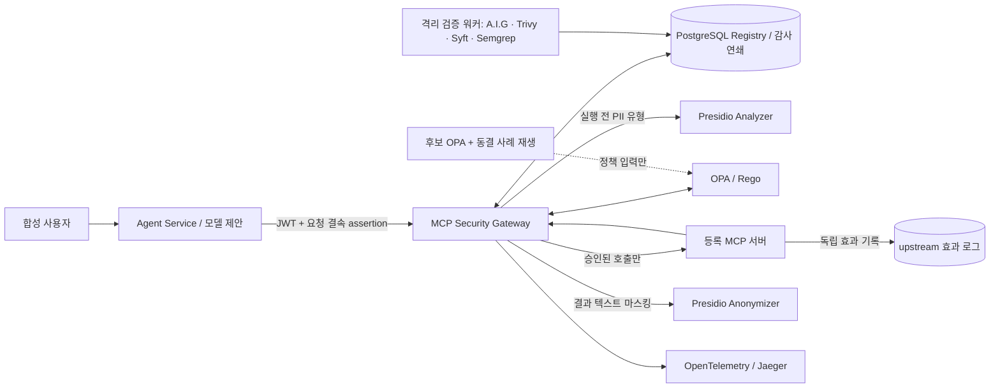

# PDF 반영 설계·재설치·검증 기록 (2026-09-24)

이 문서는 사용자가 제공한 20쪽 PDF의 런타임 통제·정책 수명주기 요구와 [읽기 전용 draw.io 구조도](https://drive.google.com/file/d/1i3WloSS4OpMtd_CuGsfouBLo5AzyG4VS/view)를 `main`의 실제 실행 경로에 대조한 결과다. 원본 PDF와 draw.io 파일은 저장소에 복사하거나 수정하지 않았다. PDF의 미래 작업 메모는 요구사항 후보로만 해석했다.

## 실행 구조



draw.io의 Gateway, OPA, 스캐너, AI-Infra-Guard, OTel, 증적 분석·저장, 대시보드 구성을 현재 서비스에 대응시켰다. 증적 처리와 조회는 현재 PostgreSQL 감사 연쇄·Console·Jaeger가 맡는다. 별도의 Evidence API와 LiteLLM 프록시를 필수 경로에 추가하면 이미 존재하는 경계와 중복되므로 이 배치에는 두지 않았다. 모델은 도구를 제안하고 실행 권한은 Gateway와 OPA가 결정한다.

## PDF 요구사항과 구현

| PDF 구간 | 현재 강제 경로 | 이번 반영 및 검증 |
| --- | --- | --- |
| 1~4쪽 자산·신원·계약 | Registry, 서명된 사용자/Agent 신원, catalog 해시·버전·스키마, 승인 상태 | 기존 경로 유지. 승인되지 않은 도구와 drift는 실행 전 차단 |
| 5~8쪽 정책·연쇄·위험 | OPA의 `Allow/Alert/Approval/Restrict/Block`과 333 권한표 | Tool 수신 도메인에 대한 `MCP-DATA-EGRESS-001`, 동일 서명 세션의 중요 열람→전송에 대한 `P-CHAIN-001`, 0~100 위험 점수 추가. 점수는 조사용 증적이며 허가 근거는 구체적인 Rego 조건 |
| 8~10쪽 민감 입력·출력 | 등록 Tool의 입력 스키마, 결과 크기·우회 문구 검사 | Presidio Analyzer/Anonymizer 원본 컨테이너를 통째로 사용. 외부 목적지에 중요자료 또는 탐지 PII 전송을 실행 전 차단; 출력의 탐지 값을 마스킹. 한국 주민번호·휴대전화·자격 문자열은 request-local 인식기 추가. 검사 장애는 실행 전 차단, 실행 후 검사 장애는 **실행됨/출력 차단**으로 기록 |
| 10~12쪽 강제 경로·감사 | Gateway 전용 MCP 네트워크, PostgreSQL append-only 감사, 독립 효과 로그, OTel/Jaeger | 감사 체인 v5에 정책 입력 스냅샷·위험 점수·PII 유형·연쇄 표지 포함. 원문·수신 주소·파일 경로는 감사 기록에 해시와 길이로 저장. 상태 API에 Presidio 상태 포함 |
| 13~20쪽 정책 수명주기 | 위험/통제 ID가 연결된 정책 관리대장, 예외·승인 만료, 회귀 시험 | 후보 OPA에 저장된 정책 입력과 합성 동결 8사례를 **정책만 재생**. 결과에 새 실행 허용·새 미실행, 합성 공격 미탐·정상 차단 수를 분리. MCP 호출은 하지 않음 |

### 정책 입력과 증적의 경계

Gateway는 원문 PII나 본문을 OPA에 보내지 않는다. OPA는 `destination_host`, `pii_types`, `sequence_flags`, 등록 계약과 역할·자료 등급을 받는다. 승인 판단과 실행 직전 재검증은 같은 Gateway 경로에서 수행한다. 감사 DB의 `policy_input`은 이후 후보 정책 비교에 사용하며 체인 v5 해시에 포함된다. 기존 체인 v4 행도 각 행의 버전으로 계속 검증한다. 응답 유실로 `upstream_attempted=true`, `upstream_executed=false`가 되면 **실행 여부 미확인**이며 차단 증거로 세지 않는다.

수신 주소는 MCP 서버의 endpoint와 별도이다. 예를 들어 `send_external`의 `review@corp.invalid`는 내부 시험 수신처이고 `outside.example`은 외부 시험 수신처다. 도메인 목록은 [`opa/data.json`](../full_stack_lab/opa/data.json)에서 환경에 맞게 변경하고 Rego 시험을 통과시켜야 한다. 현재 `restricted.invalid`로의 전송은 모의 MCP 서버가 효과 로그만 기록한다. 실제 메일·HTTP 송신 및 조직망 전체의 Gateway 강제 통과를 입증하는 구성은 아니다.

## 재사용한 오픈소스

| 구성 | 채택 이유와 출처 |
| --- | --- |
| [Presidio 2.2.364](https://github.com/data-privacy-stack/presidio/blob/main/docs/installation.md) Analyzer·Anonymizer | PII 탐지와 마스킹 REST 서비스를 원본 이미지로 사용. 한국어 시험 식별자의 regex 인식기만 요청에 주입. 컨테이너는 외부 포트 없이 Gateway의 `privacy` 네트워크에만 연결 |
| [OPA 1.20.2](https://www.openpolicyagent.org/docs) | 기존 결정론적 정책 엔진 유지. [decision log의 입력 취급](https://www.openpolicyagent.org/docs/management-decision-logs)을 고려해 원문은 정책 입력에 두지 않음 |
| [Tencent AI-Infra-Guard](https://github.com/Tencent/AI-Infra-Guard), [Trivy](https://github.com/aquasecurity/trivy), [Syft](https://github.com/anchore/syft), [Semgrep](https://github.com/semgrep/semgrep) | 기존 스캔 워커의 고정 버전·commit과 출처별 보고서를 사용. 스캔 결과는 정책의 입력 증적이지 독자적인 실행 허가가 아님 |
| [OpenTelemetry](https://opentelemetry.io/docs/), [Jaeger](https://www.jaegertracing.io/docs/), [PostgreSQL](https://www.postgresql.org/docs/) | trace, 감사 기록, 독립 효과 기록의 기존 역할 유지 |

[ContextForge](https://ibm.github.io/mcp-context-forge/)는 완성된 MCP registry/proxy로 검토했다. 현재 Gateway와 병행해 두 번째 프록시 경로를 열면 정책 우회 여부를 추가로 증명해야 한다. 이번 변경은 이미 강제 경로에 있는 Registry를 유지했다. [LiteLLM](https://docs.litellm.ai/docs/)은 다양한 모델 제공자용 프록시로 검토했으나 이 실습의 Agent가 이미 OpenAI 호환 API를 사용하므로 필수 실행 경로에 중복 배치하지 않았다. 이는 두 프로젝트의 품질 평가가 아니라 이 배치의 경계 선택이다.

## WSL2에서 `main` 클린 설치

Docker Engine/Compose v2와 `curl`, Python 3이 있는 WSL2에서 수행한다. 관리자 비밀번호나 실제 API 키를 저장소에 쓰지 않는다.

```bash
git clone https://github.com/MCP-governance/mcp-gateway.git
cd mcp-gateway
git switch main
git pull --ff-only origin main
cd full_stack_lab
./console.sh up
./console.sh test
./console.sh replay 100
```

기존 **해당 복제본의** 실습 DB/효과 로그/생성 보고서까지 지우고 다시 설치할 때는 `full_stack_lab`에서 `./console.sh reset` 후 위의 `up`, `test`, `replay`를 실행한다. `reset`은 이 복제본의 Compose 프로젝트 볼륨만 지운다. 새 복제본에는 경로 해시 기반의 독립 Compose 프로젝트 이름과 무시된 `.env`의 합성 서명키가 자동 생성된다. 브라우저 Console은 `http://127.0.0.1:8000`, Gateway 상태는 `http://127.0.0.1:8080/api/health`, Jaeger는 `http://127.0.0.1:16686`이다. 합성 관리자 계정은 저장소의 기존 실습값을 사용한다.

`./console.sh test`는 OPA 단위 시험, 실제 HTTP/MCP/DB 실행 경계, catalog drift·OPA 장애, Agent 인증·승인, 응답 유실과 감사 체인을 확인한다. 핵심 합격 신호는 `PASS: 80/80`과 `reports/acceptance.json`, `reports/agent-acceptance.json`, `reports/runtime-acceptance.json`의 `failed: 0`이다. `./console.sh replay 100`은 별도 후보 OPA를 열고 `reports/policy-replay.json`을 만든 뒤 후보 OPA를 멈춘다. `frozen_corpus.missed_attacks`와 `false_blocks`가 0이어야 한다. `compared` 행의 변화는 이전에 저장된 정책 버전·관찰 모드 기록 때문에 별도로 해석한다. 재생 결과는 실제 MCP 실행·개인정보 탐지 정확도 시험이 아니다.

후보 정책 디렉터리를 시험하려면 `REPLAY_POLICY_DIR=./candidate-opa ./console.sh replay 100`을 사용한다. 후보 디렉터리에는 OPA가 읽을 정책과 데이터·관리대장이 있어야 한다. `replay`는 데이터베이스에 저장된 호출 입력과 [`opa/replay_cases.json`](../full_stack_lab/opa/replay_cases.json)의 합성 라벨 사례만 평가한다. 결과의 `input_sha256`는 비교를 위한 해시이며 본문을 내보내지 않는다.

## 기존 네이티브 경로

`run-native.sh`는 이제 두 Presidio REST 서비스의 상태 확인을 필수 선행 조건으로 검사한다. 기본 URL은 Analyzer `http://127.0.0.1:5002`, Anonymizer `http://127.0.0.1:5001`이며 환경 변수 `PRESIDIO_ANALYZER_URL`, `PRESIDIO_ANONYMIZER_URL`로 바꿀 수 있다. 공식 [Python/HTTP 실행 방법](https://github.com/data-privacy-stack/presidio/blob/main/docs/installation.md)을 따라 별도 프로세스로 띄운 뒤 `./run-native.sh up`을 실행한다. 이번 변경에서 재현하고 검증한 클린 설치 경로는 위의 Compose 경로다.

## 검증 범위와 남은 한계

- 실제 Presidio에서 합성 이메일·주민번호·전화번호가 탐지·마스킹되고, PII 외부 전송이 독립 upstream 효과 증가 없이 차단됨을 검사한다. 인식기의 정확도를 실제 한국어 업무 문서 전체에 대해 측정한 결과는 아니다. 미탐지 PII는 마스킹되지 않을 수 있다.
- 정책 재생의 8개 라벨 사례는 **합성 fixture**다. 공격 미탐·정상 차단 0은 이 작은 집합에 대한 결과이며, 현장 공격 탐지율이나 운영 오탐률을 뜻하지 않는다.
- Gateway를 지나지 않는 Shadow MCP와 사용자 단말의 직접 접속은 Endpoint Agent·실제 네트워크 통제로 별도 관리해야 한다. Compose 내부 격리만으로 조직망 전체 강제 통과를 증명할 수 없다.
- A.I.G 스캔의 `test-double` 결과는 실모델 검사 증거로 쓰지 않는다. 원격 GitHub MCP 자격은 기본값에서 비활성화되어 있고 실계정 OAuth/키 회수도 이 합성 설치에서 검증하지 않는다.
- ISO/IEC 42001, 27001/27002/27005, OWASP MCP, NIST AI RMF와의 연결은 정책 관리대장의 위험·통제 ID와 증적 흐름 수준의 **설계 대응**이다. 특정 규격 조항의 인증 충족 판정은 하지 않았다.
