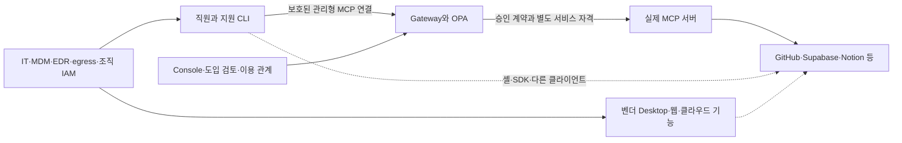

# MCP 통제 범위 재검토 — 조사, 위협 모델, 개선, 실제 서비스 시험

기준일: 2026-09-30. 조사 대상은 지원 버전 Claude Code·Codex의 관리형 정책, Kong, LiteLLM,
Microsoft의 공식 문서다. 시험 대상은 별도 WSL 랩과 허가받은 현장 기기다. 서비스의 광고 문구,
문서상의 지원, 실제 실행 결과를 구분한다. 이후 버전·계정 요금제·조직 정책은 다시 확인해야 한다.

## 1. 판단

Gateway·OPA·계약 고정·이용 관계·종료 모델을 버릴 이유는 없다. 바꿔야 하는 것은
**"직원 AI의 모든 커넥터/플러그인을 승인 화면과 Gateway로 통제한다"는 주장과 그 검증 방법**이다.

Gateway는 자신의 ingress를 통과하는 호출을 통제한다. 지원 CLI의 관리형 설정은 그 CLI가
어떤 MCP 연결·Apps·플러그인 소스를 로드할지 제한한다. 두 가지를 합쳐도 직원 OS 사용자가 실행하는
다른 클라이언트·셸·SDK·웹/클라우드 세션·이미 발급된 SaaS 자격까지 자동 통제되지 않는다.
다운로드, 설치, 로드, 프로세스 실행, 도구 호출, 데이터 전송은 서로 다른 사건이다.

커넥터 승인 화면 자체는 유용하다. 다만 **관측·업무 예외 결정**의 화면으로 써야 한다.
직원이 보낸 목록에서 항목이 없어졌다는 것과 목적지 호출이 차단되었다는 것은 다른 증거다.
벤더가 계정에 붙인 커넥터도 회사의 데이터·자원·목적·사용 기한 승인을 대신하지 못한다.

## 2. 다른 제품은 무엇을 통제하는가

| 제품/평면 | 실제 제어점 | 이 프로젝트에 가져올 것 | 범위의 한계 |
| --- | --- | --- | --- |
| Kong AI MCP Proxy | 프록시를 지나는 MCP 연결과 도구. 인증된 Consumer/Group, 기본 ACL, 도구별 ACL, discovery와 invocation 검사 | 목록 숨김과 실제 호출 거부를 함께 검사. 기본 거부를 명시하고 인증된 주체에 권한 부여 | 직원 단말의 모든 설치·셸·직접 API를 통제하는 제품이 아님. 설정 없는 ACL을 기본 거부로 추정하지 말 것 |
| LiteLLM MCP Gateway | 키·팀·조직의 MCP 서버 접근, 도구 권한·가드. Gateway에서 실행하는 stdio도 포함 | 키의 MCP 접근이 명시되지 않으면 거부하는 설정, 도구/계약 통제, 자격 분리 | 직원이 별도 프로세스에서 실행하는 stdio까지 포괄하지 않음. 팀 상속·빈 정책·실패 처리 등은 버전/설정별 검사 필요 |
| Microsoft Foundry AI gateway / APIM | 설정된 대상 MCP 요청의 인증·제한·관측 | 적용 대상을 분명히 표시하고 실제 통과 여부를 검증 | preview 기능에 지원 연결 유형·등록 시점 제한이 있음. 모든 기존/네이티브 도구가 자동으로 경유하지 않음 |
| Microsoft Power Platform의 data/connector policy | Power Platform 안의 커넥터 조합·이용 정책, 설계/실행 시점 검사 | 관리할 수 있는 플랫폼과 관리할 수 없는 경로를 제품에 명시 | 외부 Claude Code, 임의 바이너리, 직접 HTTP의 범용 차단 장치가 아님 |

출처: [Kong AI MCP Proxy](https://developer.konghq.com/plugins/ai-mcp-proxy/),
[LiteLLM MCP control](https://docs.litellm.ai/docs/mcp_control),
[LiteLLM MCP](https://docs.litellm.ai/docs/mcp),
[Foundry tool governance](https://learn.microsoft.com/en-us/azure/foundry/agents/how-to/tools/governance),
[Power Platform data policy](https://learn.microsoft.com/en-us/power-platform/admin/wp-data-loss-prevention).
위 표는 문서 비교이며 이 제품들을 이 랩에 설치해 우열을 측정한 결과는 아니다.

### Claude Code·Codex에서 가능한 제한

Claude Code의 보호된 `managed-mcp.json`은 관리자가 정한 MCP 연결을 고정한다.
`allowManagedMcpServersOnly`, `allowedMcpServers`, `disableClaudeAiConnectors`,
`allowAllClaudeAiMcps: false`, `strictKnownMarketplaces`를 지원 범위 안에서 사용한다.
계정 커넥터 하나를 승인했다고 `allowAllClaudeAiMcps: true`로 전체 경로를 여는 것은 범위가 너무 넓다.
Desktop의 local/SSH 세션에 in-process SDK로 제공되는 커넥터는 CLI 파일과 다른 통제면이므로
claude.ai 조직 커넥터 정책 등 해당 표면의 설정을 확인해야 한다.
출처: [managed MCP](https://code.claude.com/docs/en/managed-mcp),
[MCP 연결 표면의 차이](https://code.claude.com/docs/en/mcp),
[managed settings](https://code.claude.com/docs/en/managed-settings).

Codex의 `managed_config.toml`은 기본 설정이고 `requirements.toml`이 강제 제약이다.
MCP 이름뿐 아니라 URL/command identity, `features.apps = false`, `features.plugins = false`,
허용 마켓플레이스 소스, 웹 검색·브라우저/컴퓨터 사용 제약을 사용한다.
지원 CLI/Desktop과 웹/모바일/원격 실행의 정책은 동일하다고 가정하지 않는다.
관리형 파일을 일반 사용자가 수정할 수 있으면 이 통제는 관리형이 아니다.
출처: [OpenAI managed configuration](https://learn.chatgpt.com/docs/enterprise/managed-configuration).

어떤 제품도 자기 통제면 밖의 임의 코드 실행을 설정 파일 하나로 모두 지배하지 않는다.
이 결론은 위 제품들의 제어점과 아래 실측을 바탕으로 한 설계 판단이다.

## 3. 현장에서 확인한 구조 차이

솔루션의 당시 배포 커밋은 `65299912a6dfcb70a33ab953e5a172ca05538f66`이었다.
현재 현장 기본 배치는 Caddy를 tailnet IP의 HTTP 443에 게시하며, 내부망 보호는 Tailscale 터널이다.
직원·관리자의 애플리케이션 인증과 Gateway 정책은 별도로 유지된다.

- 솔루션 건강 상태: Gateway·PostgreSQL·OPA·Jaeger·Presidio 정상, 원격 `ms-learn` **1/1 READY**.
- 직원 테스트 PC: Codex **0.158.0**, `/etc/codex`·`/etc/claude-code`의 관리형 정책이 없었음.
- 같은 OS 사용자로 솔루션 건강 확인과 공용 HTTPS 접근에 성공. Docker `office` 격리는 이 PC에 배포되지 않았음.
- 직원 테스트 PC에서 관리자 WSL의 별도 수신 서버로 **합성 데이터 24바이트** 전송 성공.
  수신 서버가 테스트 PC의 peer·일회용 경로·바이트 수를 직접 기록. Gateway 로그를 정답으로 사용하지 않음.
  모델/하네스를 유도한 시험이 아니라 **OS 사용자에게 실제 우회 송신 경로가 있음**을 보인 시험임.
- 솔루션의 다른 높은 포트에 대한 선행 시도는 경로 오류로 실패. 이것은 차단 정책의 성공 증거로 세지 않음.

따라서 "Gateway 로그에는 위반이 없다"와 "등록된 서버가 건강하다"에서
"회사 AI의 모든 외부 연결을 통제한다"를 추론할 수 없다. 문서의 컨테이너 랩과 실제 현장 배치를 분리한다.

## 4. 위협 모델

### 자산·주체·신뢰 경계

보호 대상은 회사 데이터와 쓰기 권한, 직원 SSO, SaaS OAuth/PAT/refresh token,
승인된 서버/도구 계약, 정책과 관리형 파일, 종료 증거와 감사 원장이다.
단순 실수·편의상 개인 연결을 쓰는 직원, 악성 플러그인/도구 설명/검색 결과, 침해된 MCP 서버,
정책을 편집할 수 있는 단말 관리자 등을 별도 주체로 본다.

`clientInfo`, User-Agent, workstation 이름, 벤더 접두어, 키트의 목록은 인증된 앱/장치 증명이 아니다.
현행 Gateway의 transport 토큰으로 사용자 신원을 정하는 불변식은 유지한다.
일반 직원이 보호된 정책을 편집하지 못한다는 가정과 단말 root/admin의 침해는 분리한다.



실선도 등록·배포·검증된 부분만 집행된다. 점선은 이번 변경만으로 차단되었다고 주장하지 않는 경로다.
Gateway→인증이 필요한 원격 SaaS MCP의 자격 연동은 현재 v3 `upstream.py`에 구현되어 있지 않다.
회사 사용자 토큰을 그대로 전달하는 방식으로 이 빈틈을 메우면 안 된다.

| 시나리오 | 잘못된 가정 | 필요한 제어점/증거 | 이번 상태 |
| --- | --- | --- | --- |
| 미등록 HTTP MCP, 같은 이름의 다른 URL | 서버 이름·관리형 기본 설정만으로 충분 | 보호된 요구사항의 정확한 name+URL; 목적지 연결 관측 | 엄격한 파일 생성 구현, 실제 CLI 시험 |
| 임의 stdio, 플러그인의 hook·셸 실행 | MCP 거부가 모든 실행을 거부 | 관리형 MCP/마켓플레이스 + OS 실행 통제·샌드박스 | MCP/소스 제한 구현; OS 통제 미배포 |
| 벤더 계정 커넥터·클라우드 전달 | first-party는 회사가 승인 | 해당 표면의 조직 커넥터 정책·자격 범위 | 자동 신뢰 제거, 클라우드 통제 미검증 |
| 직접 REST/SDK, 다른 하네스 | Gateway에 로그가 없으면 미실행 | 단말 egress와 SaaS의 자격/조직 정책 | 실제 현장 우회 송신 확인 |
| 키트 제거·보고 위조·stale inventory | absent/active는 집행 상태 | 보호된 수집기·장치/앱 식별·신선도·독립 효과 검사 | `enforcement: unverified` 명시 |
| broad OAuth + read-only URL 옵션 | 읽기 프로필이면 토큰도 읽기 전용 | 프로젝트·자원·scope·audience, 서버 측 권한, 별도 자격 | Supabase의 docs/read-only 설정에서도 넓은 OAuth 요청 관찰 |
| 중첩 dispatch 도구 | outer tool allowlist가 모든 행동을 고정 | 내부 action/resource 검증 또는 해당 메타 도구 거부 | Sentry·Zapier·Figma의 동적 실행 도구 실물 확인, 별도 승인 필요 |
| tool poisoning·rug pull·출력 지시 | 설명 검사 통과는 안전 증명 | 승인 계약 고정·변경 재승인·결과를 비신뢰 데이터로 취급·행위 재인가 | 기존 계약/설명 검사 유지; 완전한 주입 방어 주장 금지 |
| LLM 벤더에 보내는 prompt/context | MCP DLP가 LLM 전송도 검사 | 모델 경로의 조직 정책·DLP·데이터 보존·계정 관리 | field는 벤더 로그인 경로(D-44); 현재 Gateway의 검사 범위 밖 |
| 폐기 후 다른 SaaS 자격/세션으로 재사용 | Gateway deny로 회수가 끝남 | 서비스 측 OAuth/PAT/세션 폐기 및 독립 재시도 | 기존 C1~C4 모델 유지, 실제 계정 회수 시험은 별도 |

핵심은 "다운로드 가능한 플러그인 목록을 전부 수집"하는 것이 아니다.
**회사 자격과 자원은 승인된 경로/주체로만 사용할 수 있고, 그 밖의 실행/송신은 조직 통제면이 담당한다**는
불변식을 세워야 한다. 모든 외부 앱 설치를 이 프로젝트가 대체하려 하면 EDR·MDM·IAM을 다시 만들게 된다.

## 5. 유지할 구조와 재설계

### 역할을 나누되 서비스를 새로 늘리지 않는다

1. **기존 Control Plane**: 도입 검토, artifact/버전/계약, 소유자·목적·허용 자원·기한·종료 조건의 근거 보관.
   커넥터 보고와 업무 예외 승인을 여기에 둔다. 설치 허가를 데이터 접근 권한으로 자동 승격하지 않는다.
2. **기존 Gateway + OPA**: transport 신원, 승인 계약과 도구, 자원·행위·DLP·이용 관계·종료 상태를 호출 때 재검사.
   outer dispatch 도구를 단순 r/w 분류로 넓게 승인하지 않는다. 등록한 툴의 결과는 다음 호출의 권한이 아니다.
3. **기존 PC 키트 + 조직 IT**: 보호된 native 정책 배포, 지원 클라이언트/버전 제한, 설치/실행 정책, 권한 없는 사용자,
   단말 관측과 egress. 이 프로젝트는 정책 파일과 검사 증거를 제공하고 관리 제품을 복제하지 않는다.
4. **SaaS/IdP**: 특정 프로젝트·repo·workspace의 최소 권한과 회수. 클라이언트→Gateway 토큰 A와
   Gateway/MCP→SaaS 토큰 B를 구분한다. 토큰 B를 단말에 배포해 놓고 Gateway 강제 경로를 주장하지 않는다.

대표적인 승인 단위는 `(사용자/역할, 장치/지원 클라이언트, transport, endpoint 또는 실행 artifact,
tool/action, tenant/project/resource, 목적, 기한, credential reference)`다.
현재 자기 보고의 hostname 그룹은 **관측·업무 검토 단위**로만 남긴다. hostname 승인만으로
다른 workspace/프로젝트/endpoint 경로나 쓰기 행동까지 허용하는 권한 객체로 사용하지 않는다.
이 필드를 전부 DB에 먼저 추가하지 않고, 실제 적용할 제어점과 데이터가 있을 때 기존 이용 관계·레지스트리에 연결한다.

### 이번에 구현한 최소 변경 (D-53)

- first-party 접두어와 기본 기능도 자동 허용하지 않는다. pending부터 거부 정책의 대상이며 14일은 검토 기한이다.
- 예외 승인 하나 때문에 Claude 계정 커넥터 전체를 다시 열던 동작을 제거했다.
- PC 키트는 인벤토리 정책이 없어도 엄격한 세 파일을 생성한다. Claude는 고정 Gateway MCP·관리형 allowlist·
  계정 커넥터와 마켓플레이스 제한, Codex는 name+URL identity와 Apps/플러그인/웹/브라우저 제약을 받는다.
- 랩 이미지에도 Codex `requirements.toml`을 넣는다. 기본 설정만 복사하던 공백을 없앴다.
- API·Console은 보고와 실제 차단을 구분한다. absent는 미관측, 승인/거부 후에도 집행은 미검증이다.
- 보고 URL은 서버에서도 origin으로 축약해 credentials·path·query가 DB로 들어가는 것을 줄인다.
- 실제 일곱 서비스에 대한 opt-in 시험을 추가했다. 인증 실패·부정확한 성공 판정·미완료는 숨기지 않는다.

단말 전체 방화벽, 조직의 Desktop/웹 정책, 장치 attestation, 원격 OAuth broker,
SaaS 쓰기·폐기 시험을 이 변경으로 구현했다고 주장하지 않는다. 먼저 있는 제품과 계정 정책으로 연결해야 한다.

## 6. 실제 많이 쓰는 MCP로 시험

일곱 공식 원격 서버를 별도 Claude/Codex 프로필에 등록했다. 호스팅된 MCP는 로컬 npm wrapper를
설치하는 대신 공급자가 안내하는 실제 HTTP 엔드포인트에 연결한다. 사용자가 브라우저에서 OAuth를 완료했고,
GitHub는 노트북의 기존 Git 자격을 메모리/표준입력에서만 사용했다. 임의 토큰·가짜 SaaS 응답을 만들지 않았다.

| 실제 서비스 | 실제 서버가 광고한 버전 / 도구 수 | 조회 시험 | 범위 |
| --- | --- | --- | --- |
| GitHub | remote `102990907a…` / 27 | 공식 저장소의 LICENSE 읽기 | readonly endpoint, 공개 파일. 비공개 repo의 경계/쓰기/회수 시험 아님 |
| Supabase | 0.13.0 / 1 | `search_docs` | `read_only=true&features=docs`. 실제 DB·RLS·프로젝트 경계 시험 아님 |
| Sentry | 0.42.0 / 9 | `find_organizations` | 계정 메타데이터. event ingestion·Seer·이슈 변경 시험 아님 |
| Notion | 1.2.0 / 44 | 일회용 무일치 키워드 `notion-search` | 선택한 계정 연결. 문서 생성·다른 workspace 경계 시험 아님 |
| Figma | 1.0.0 / 43 | `whoami` | 인증된 사용자 메타데이터. 디자인 파일 쓰기/다른 팀 경계 시험 아님 |
| Zapier | 1.0.0 / 17 | GitHub action discovery | 실제 Zapier 메타 도구. 연결된 외부 앱 action 실행·메시지 발송 시험 아님 |
| Context7 | 4.1.1 / 2 | 라이브러리 조회와 실제 FastAPI 문서 조회 | 공개 문서. 잘못된 ID의 이동 안내를 문서 조회 성공으로 세지 않음 |

합계 143개는 **이 설정과 계정에서 광고된 outer tools**다. 동적 메타 도구의 내부 action 총수나
모든 도구를 실행해 본 수가 아니다. 서버 버전은 공급자가 광고한 값이고 배포 바이너리의 원격 attestation이 아니다.
읽기 시험은 모델을 호출하지 않았다. 보고에는 응답 크기·SHA-256·MCP `isError` 등만 남기고
계정 응답 본문과 Authorization/refresh token을 쓰지 않는다. MCP transport 성공만으로 업무 의미의 성공을
판정하지 않도록 서비스별 정상 결과도 확인해야 한다.

실제 native 시험은 Codex **0.158.0**, Claude Code **2.1.282**에서 수행했다. 두 CLI 모두 관리 정책 전에는
일곱 서버를 연결했고, 정책 후 Codex의 각 서버 도구 수는 **0**, Claude의 직접 공급자 연결 수도 **0**이었다.
호스트가 해당 일회용 컨테이너 IP의 HTTPS SYN을 관측했으며, 정책 전 92개 관측에서 정책 후 2개로 줄었다.
`any` 인터페이스 캡처의 중복을 포함한 패킷 관측 수이며 고유 요청/연결 수가 아니다.
정책 후 두 패킷은 같은 TCP 연결의 `160.79.104.10:443`으로, 당시 `api.anthropic.com` DNS 주소와 일치했다.
호스트명 대응은 DNS에 근거한 추론이며 요청 내용/용도는 캡처하지 않았다.
따라서 native MCP 로딩 제한은 통과했지만 **"하네스 외부 HTTPS가 전부 0"이라는 더 넓은 검사는 통과하지 않았다**.
정책 후 일곱 MCP에 대한 연결 흔적은 관측되지 않았어도 단말 전체 egress 차단이나 도구의 모든 외부 효과를 증명하지 않는다.

Gateway 경유도 별도로 검사했다. 자격을 제공하지 않는 현행 upstream으로 일곱 공식 endpoint를 discovery했을 때
Context7은 200, 나머지 여섯은 Gateway API에서 502였다. 이 결과를 여섯 서비스에 대한 정책 차단 성공으로 세지 않는다.
별도 인증 프로필에서는 여섯 모두 연결·조회했으므로, 원격 자격 연동을 구현하고 같은 망/SDK 조건에서 다시 검증해야 한다.
502 응답 자체는 공급자의 원래 HTTP 상태를 입증하지 않는다.

별도 랩에서 검토한 Context7 계약 중 `resolve-library-id`만 하루 동안 등록한 뒤, `/mcp/boundary-context7/`으로
실제 FastAPI 조회 결과를 받았다(`P-AUTHZ-ALLOW-001`). 광고되지만 선택하지 않은 `query-docs` 직접 호출은
`MCP-REGISTRY-002`로 거부되었다. 목록은 선택한 도구 하나였고, 임시 등록은 finally에서 제거했다.
`upstream_executed` true/false는 Gateway의 결정 기록이며 공급자의 독립 감사 증거와 구분한다.
일곱 서비스 전부를 Gateway가 성공적으로 중계했다고 주장하지 않는다.

계정 응답·자격 없는 결과 요약은 [2026-09-30-mcp-boundaries.json](evidence/2026-09-30-mcp-boundaries.json)에 보관한다.

공식 설치/범위 근거:
[GitHub](https://github.com/github/github-mcp-server/blob/main/docs/server-configuration.md),
[Supabase](https://supabase.com/docs/guides/ai-tools/mcp),
[Sentry](https://mcp.sentry.dev/),
[Notion](https://developers.notion.com/guides/mcp/get-started-with-mcp),
[Figma](https://developers.figma.com/docs/figma-mcp-server/remote-server-installation/),
[Zapier](https://docs.zapier.com/mcp/overview/how-connections-work),
[Context7](https://context7.com/docs/resources/all-clients).

### 재실행

`tests/real_mcp_check.py setup --profile <새 전용 경로>`는 기존 프로필을 덮어쓰지 않는다.
Codex의 `CODEX_HOME=<전용 경로>/codex`에서 `codex mcp login <서비스>`로 OAuth를 한다.
같은 노트북의 브라우저 callback을 사용하고, 테스트용 계정/자원을 선택한다. 키를 채팅/인자/저장소에 붙이지 않는다.

```bash
# full_stack_lab에서. Gateway 이미지의 기존 SDK를 사용하며 실제 서버로 나갈 테스트 망에서만 실행.
# 인증 파일은 별도 프로필의 0600 파일, 부모 폴더 0700. reports는 gitignored.
docker run --rm --network bridge --user "$(id -u):$(id -g)" --entrypoint python \
  -v "$PWD/tests/real_mcp_check.py:/probe.py:ro" \
  -v "<전용 경로>/codex/.credentials.json:/credentials.json:ro" \
  -v "$PWD/reports:/reports" "$(docker compose images -q gateway)" \
  /probe.py smoke --credentials /credentials.json --contracts /reports/vendor-contracts
```

GitHub는 환경의 `GITHUB_MCP_TOKEN` 또는 `--github-credential-stdin`을 사용한다.
stdout/argv에 토큰을 넣는 명령을 실행하지 않는다. 사용자 SSO를 공급자 자격으로 대신 사용하지 않는다.
모든 연결 또는 선택한 조회가 완료되지 않으면 exit 1이며, 미연결을 PASS로 바꾸지 않는다.
`headers` 하위 명령은 native `headersHelper` 전용으로 Authorization JSON을 stdout에 내보내므로
터미널에서 직접 출력·기록하지 않는다.

`native`는 root + `MCPGW_DISPOSABLE=1`인 **폐기 가능한 workstation 컨테이너에서만** 실행한다.
실제 일곱 서버가 native Codex/Claude에서 연결되는 양성 대조군을 먼저 확인하고, PC 키트가 생성한 Gateway 전용
정책을 시스템 위치에 둔 뒤 직접 공급자 MCP가 로드되지 않는지 확인한다. 정책은 finally에서 원복한다.
독립 판정은 그 컨테이너 IP만 필터한 호스트의 outbound HTTPS SYN 기록을 함께 사용한다.
관리형 파일을 노트북/직원 PC의 실제 시스템 위치에 시험 목적으로 덮어쓰지 않는다.

## 7. 시험을 다시 정의한다

e2e를 쓰는 것 자체가 문제가 아니다. **검증하려는 주장과 관측 지점이 맞지 않는 것**이 문제다.

| 주장 | 필요한 양성/음성 대조군과 독립 증거 |
| --- | --- |
| Gateway가 특정 호출을 거부 | 같은 자원의 허용 호출이 실제로 실행됨 + 거부 `decision/policy_id` + upstream의 효과/상태에 거부 호출이 없음 |
| 지원 CLI에서 미등록 MCP를 제한 | 실제 공급자에 연결하는 baseline + native 관리형 정책 + 같은 클라이언트의 목적지 연결/프로세스 시작 흔적 없음 |
| 현장 직접 경로를 제한 | 같은 OS 사용자·지원/비지원 클라이언트·HTTP/stdio/shell/IPv4/IPv6/QUIC 등 적용 범위 + 독립 수신/망 증거 |
| SaaS 자원을 제한 | 지정한 repo/project/workspace의 허용 작업 + 다른 자원/쓰기 실패 + 공급자 감사/상태 |
| 자격을 폐기 | 새 호출·기존 세션·refresh·다른 자격별 재시도와 서비스 측 회수 증거. 응답 유실은 미확인 |

Gateway 로그는 판정의 좋은 증거다. Gateway 밖 모집단이나 상위 서비스의 실제 효과 전체를 증명하지는 못한다.
`upstream_attempted`, `upstream_executed`, 응답 수신, 출력 차단을 혼동하지 않는다.
막혔다는 이유로 DNS 오류·경로 오류·로그인 실패·다른 정책의 차단을 기대 통제의 성공으로 세지 않는다.

기존 회귀 시험은 유지한다: Rego 96/96, field kit 16/16, Gateway acceptance 18/18,
4 PC × 4 하네스 × 10 MCP 연결, scripted 업무 21건, 종료 흐름, security regression 55/55,
정책 재생과 E1~E3가 별도 WSL 랩에서 통과했다. 합성 IdP/일부 단위 fixture는 회귀 검사의 범위이며
일곱 실제 SaaS의 시험 결과와 합산해 "전체 현장 통제" 숫자로 사용하지 않는다.

## 8. 다음 적용 순서

1. **정책의 정직한 표시와 native 강제 파일**: 이번 변경. 일반 직원이 못 바꾸는 시스템 위치 배포와
   재시작/기존 세션 처리, 지원 클라이언트/버전을 실제 현장마다 검증한 다음에만 해당 단말의 집행을 확인한다.
2. **한정된 회사 자원으로 파일럿**: 회사용 테스트 repo·DB 프로젝트·Notion 페이지·Figma 파일·Sentry 프로젝트·
   Zapier 읽기 action을 지정한다. 허용 작업과 다른 자원·쓰기·폐기를 쌍으로 시험한다. 지금의 메타데이터 조회를 이 단계로 부풀리지 않는다.
3. **원격 MCP의 자격 연동**: 기존 v3는 무자격 내부 upstream 모델이다. 운영의 credential reference와
   서비스별 OAuth/PAT 연동·회수·audience/resource 검증을 설계해 추가한다. 직원 SSO 통과나 URL 속 키로 대체하지 않는다.
   여러 tenant/독립 보안 경계가 실제로 필요해질 때 기존 broker 구조를 재사용한다.
4. **조직 정책·단말·망의 연결**: 이미 쓰는 MDM/EDR/IAM/egress 제품으로 실행·개인 계정 동의·직접 API를 제한한다.
   모델 벤더 연결을 허용하는 조직의 데이터 처리 정책도 함께 정한다.
5. **지원 범위별 증거**: CLI, Desktop local/SSH, 웹/클라우드, 비지원 클라이언트, root/admin, BYOD를 따로 표시한다.
   관측되지 않은 항목은 UNKNOWN으로 두고 전체 플러그인 통제율의 분모를 추정하지 않는다.

제품 설명은 "승인된 AI 도구 접근의 런타임 거버넌스와 조직 통제 연동"으로 잡을 수 있다.
Gateways가 잘하는 실행 전 정책·계약·종료 증거에 집중하면서, 단말·클라우드·SaaS 제어점의 책임을 연결하는 방향이다.
