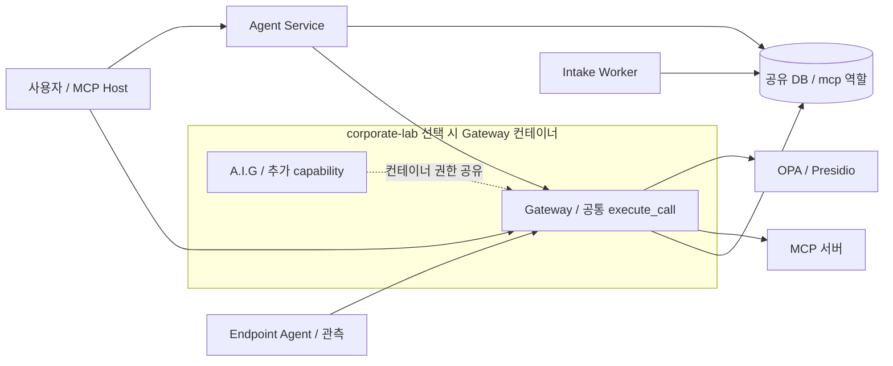
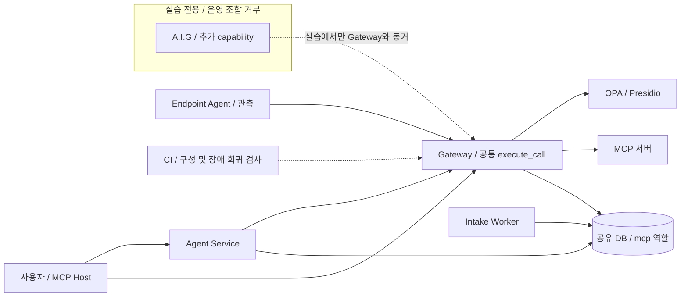
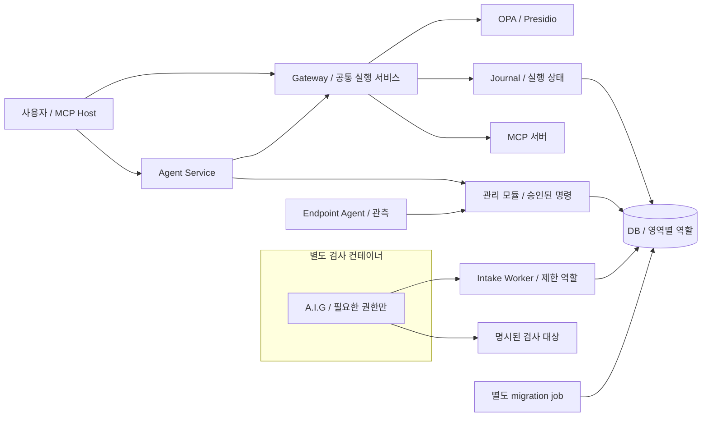

# 아키텍처 구조 개선안: 실행 경로와 권한 경계의 책임 분리

상태: 검토 제안 / 2026-09-24

기준: `MCP-governance/mcp-gateway`의 `45b9f6ed6dd9cb6b6eadfaf2b6cc6ee1ac377967`

범위: 문서 변경. 아래 목표 구조는 아직 구현하거나 성능을 측정한 결과가 아니다.

## Decision

우리의 검토 대상은 이미 모인 실행 경로를 어떻게 유지하면서 변경 책임, 데이터 권한, 장애 복구 경계를 명확히 할지다. 현재 통합 랩을 유지한다는 전제에서 **안 2: 내부 모듈과 권한 경계의 단계적 분리**를 권고한다. 이 PR의 병합은 설계 문서를 추가하는 것이며, 운영 구조 변경이나 구현 완료를 뜻하지 않는다.

## Executive Recommendation

| 선택지 | 내용 | 적합한 상황 |
| --- | --- | --- |
| 안 1: 현 구조 유지와 국소 보강 | 현재 배포와 공용 DB 역할을 유지하고 상태 표시, 회귀 시험, 실습 구성 검사를 보강 | 짧은 시연 일정이 우선이고 합성 랩 밖으로 확대하지 않을 때 |
| 안 2: 내부 모듈과 권한 경계의 단계적 분리 | 공통 실행 서비스 유지, 실행 상태 영속화, migration과 DB 역할 분리, A.I.G 별도 격리, 정책 배포 식별자 연결 | 여러 사람이 기능을 확장하면서 실행 통제와 증적의 일관성을 유지해야 할 때 |

두 안은 배포 전략의 선택지이고, 뒤의 A~D 단계는 안 2를 도입하는 순서다. 저는 현재 코드의 공통 집행 경로를 재사용할 수 있다는 점에서 안 2의 비용이 감당 가능한 수준이라고 판단한다. 다만 소요 기간과 성능 개선 수치는 측정 전에는 제시하지 않는다.

## Evidence

저는 기준 커밋의 ingress, 승인, MCP 호출, 감사 저장, Compose 설정을 직접 읽었다. 가장 중요한 근거는 **집행 함수는 공통이지만 데이터 변경 권한과 실행 상태의 책임은 여러 경로에 걸쳐 있다**는 점이다. 아래 관찰은 정적 코드 확인이며 침해 재현이나 운영 효과 검증이 아니다.

| 근거 | 코드 또는 문서 | 확인한 사실 |
| --- | --- | --- |
| E1 공통 실행 경로 | [core.py](../../../full_stack_lab/gateway/app/core.py), [main.py](../../../full_stack_lab/gateway/app/main.py), [mcp_facade.py](../../../full_stack_lab/gateway/app/mcp_facade.py) | `execute_call`(core 977행)에 REST(main 284~288행), MCP facade(43~78행), Agent와 승인 후 실행이 수렴한다 |
| E2 실행과 증적 저장 순서 | [agent_gateway.py](../../../full_stack_lab/gateway/app/agent_gateway.py), [core.py](../../../full_stack_lab/gateway/app/core.py), [실행 경계 설명](../../runtime-hardening.md) | Agent receipt(34~64행), 승인 claim(core 1225~1231행)은 존재한다. upstream 호출(1171행) 뒤 감사(1209행), 승인 최종 상태(1237~1241행)를 저장한다 |
| E3 공용 DB 역할과 기동 DDL | [compose.yaml](../../../full_stack_lab/compose.yaml), [db.py](../../../full_stack_lab/gateway/app/db.py), [agent_tables.sql](../../../full_stack_lab/gateway/app/agent_tables.sql) | Gateway, SSE, Agent, Worker가 `mcp` 역할을 공유한다. Gateway bootstrap(core 387~390행)과 Agent lifespan(agent_service 70~75행)이 DDL을 수행한다. 감사 trigger는 있으나 앱 역할이 schema owner임을 SQL 57~60행이 명시한다 |
| E4 실습 오버레이의 추가 권한 | [compose.corporate-lab.yaml](../../../full_stack_lab/compose.corporate-lab.yaml) | 기본 구성과 달리 A.I.G를 Gateway 컨테이너에서 실행하고 `SYS_ADMIN`, `seccomp:unconfined`, scanner 망을 추가한다(1~31행) |
| E5 정책과 공용 유틸의 결합 | [core.py](../../../full_stack_lab/gateway/app/core.py), [replay.py](../../../full_stack_lab/gateway/app/replay.py), [agent_service.py](../../../full_stack_lab/gateway/app/agent_service.py) | Agent와 replay가 해시/Schema를 위해 core를 import한다. core 125행은 import 시 tracing을 구성한다. bootstrap은 policy.rego 해시를 기록하고, 관리대장 캐시는 명시적 refresh 전까지 유지한다(675~694행) |
| E6 이미 있는 검증과 한계 | [현재 반영 기록](../../PDF-INTEGRATION-2026-09.md), [통제 평면](../../../full_stack_lab/CONTROL_PLANES.md), [CI](../../../.github/workflows/verify.yml) | Presidio, 감사 체인 v5, 정책만 재생하는 후보 OPA, 장치 자격, 내부망 검사와 전체 acceptance 실행 절차가 있다 |

이 근거에서 도출한 **추론**은 다음과 같다. 모듈 이름만 나누면 프로세스 침해의 영향 범위는 줄지 않는다. DB 역할과 검사 프로세스의 권한도 나눠야 한다. 또한 현재 Agent receipt가 다루는 미확정 실행을 모든 공통 실행 경로의 상태 모델로 확장해야 장애 복구의 해석이 일치한다. 실제 장애 빈도와 권한 오용 가능성의 크기는 이번 검토에서 측정하지 않았다.

유지할 기존 자산은 OPA의 `Allow/Alert/Restrict/Approval/Block`, 잘못된 정책 응답의 기본 차단, 같은 MCP 연결에서의 계약 재검증, 승인 만료 검사, 계정 상태 확인, DB 연결 풀, 감사 append의 트랜잭션과 행 잠금이다. 이 기능들을 신규 구축 항목으로 세지 않는다.

## Current Design And Failure Mode

사용자 입력은 신원과 호출 봉투를 검증한 뒤 공통 실행 함수로 들어간다. 그 함수가 자료 분류, 개인정보 검사, 카탈로그 갱신, 정책 입력 생성, 승인, MCP 실행과 감사 기록을 조정한다. 이 중심 경로 덕분에 transport별 정책 복제를 피하고 있다.

문제는 기능 확장이 같은 실행 모듈과 공유 테이블로 계속 모인다는 점이다. 예를 들어 단순 해시 함수의 재사용에도 tracing 초기화를 포함한 core를 가져온다. 관리 API와 검사 Worker는 서로 다른 역할이지만 DB 자격은 같다. 따라서 우리에게 필요한 것은 두 번째 Gateway가 아니라, 누가 어떤 상태를 변경할 수 있는지 코드와 DB가 함께 표현하는 구조다.

실행 후 응답 유실은 이미 `upstream_attempted`로 구분한다. 그러나 프로세스가 전송 뒤 최종 감사 저장 전에 종료되면 공통 경로에 영속 실행 상태가 충분히 남지 않을 수 있다. 또 승인 최종 상태는 `upstream_executed`가 거짓이면 `REJECTED`로 저장한다. 이것은 미확정 실행과 정책 거절을 같은 의미로 읽을 여지를 만든다. 분산 트랜잭션이 없는 MCP 호출에서 이 간극을 없앴다고 주장할 수는 없고, 간극을 상태와 복구 절차로 드러내야 한다.

## Desired Invariants

- 모든 지원 ingress와 승인 재개는 동일한 실행 서비스를 호출한다. transport adapter가 정책을 건너뛰어 도구를 실행하지 않는다.
- 정책상 허용과 실행 성공을 별도 필드로 표현한다. 출력 차단은 이미 발생한 외부 효과를 취소하지 않는다.
- 전송 전에 실행 의도를 영속화한다. 저장 실패 시 전송하지 않는다. 완료를 확인하지 못한 실행은 미확정으로 남기고 자동 재시도하지 않는다.
- 승인에는 호출 내용, 승인자, 만료, 적용 계약 버전을 결속하고 전송 직전 재검증한다. 종료된 서버와 정지된 계정의 차단을 유지한다.
- 검사 Worker는 Registry 승인, 사용자 역할, 정책 활성화, 감사 수정 권한을 갖지 않는다. 엔드포인트 보고는 계속 관측 자료로만 취급한다.
- 판단 기록에서 적용 정책 코드, 데이터, 관리대장과 계약 버전을 식별할 수 있다. 이전 감사 체인 v1~v5의 검증 의미를 보존한다.
- 조직 전체의 Gateway 우회 방지는 별도 엔드포인트 및 네트워크 검증으로 입증한다. Compose 내부망만으로 보장하지 않는다.

## Constraints And Non-Goals

현재의 단일 저장소, Compose 기본 실습, REST와 MCP 진입점, 기존 응답 필드, 감사 이력을 보존하는 점진적 변경을 가정한다. 처리량, 지연시간, 메모리 상한은 제공되지 않았으므로 균형 잡힌 설계를 기준으로 비교했다.

전면 마이크로서비스화, Kafka 등 새 큐 제품, LiteLLM이나 별도 Evidence API의 필수 경로 추가는 우선 범위에서 제외한다. 후보 정책 재생과 스캔은 비동기 작업으로 유지하고, 실시간 호출마다 LLM 판단을 추가하지 않는다. 별도 SSO, 키 관리, mTLS와 조직 egress 구축은 운영 전제이나 이번 제안의 구현 완료 범위가 아니다.

## Before Architecture

현재 구조를 같은 수준의 구성요소로 요약하면 아래와 같다. A.I.G 상자는 corporate-lab을 선택할 때만 적용되며 기본 Compose Gateway의 권한을 뜻하지 않는다.



Agent와 Worker의 DB 화살표가 같은 역할로 모이고, 실습 모드의 A.I.G는 집행 프로세스와 컨테이너를 공유한다. 네트워크 분리는 이미 존재하지만 이 두 권한 경계는 별도로 검토해야 한다. 구조도는 모든 Compose 네트워크나 서비스의 상세 배치도가 아니다.

## Options

### Option 1: 현 구조 유지와 국소 보강

시연 일정이 우선이면 우리는 현재 배포 단위를 유지하고 상태 표현과 회귀 검사부터 보강할 수 있다. `UNKNOWN`을 승인 화면과 공통 응답에서 구분하고, 전송 후 중단 사례를 검사하며, 운영용 구성 검사에서 실습 오버레이 사용을 거부한다. 기존 API와 DB 구조 변경을 최소화하므로 도입과 되돌리기가 쉽다.

이 안의 장점은 새 프로세스나 동기 통신을 추가하지 않는다는 것이다. 대신 공용 DB 역할과 core 중심 결합은 남는다. 회귀 검사가 빠진 신규 경로는 같은 문제를 다시 만들 수 있고, 전송 전 영속 기록이 없는 경로의 완전한 복구도 약속할 수 없다. 합성 랩 전용이라는 경계를 유지할 때 선택할 만하다.



| Change | Before | After | Security consequence | Cost |
| --- | --- | --- | --- | --- |
| 실패 표현 | 일부 승인 결과가 REJECTED로 수렴 | 미확정 상태를 별도로 표시 | 미확정 실행을 차단 성공으로 오해할 가능성 감소 | 응답 및 UI 호환 검사 |
| 구성 검사 | 실습 옵션 선택에 의존 | 운영용 구성에서 고권한 오버레이 거부 | 잘못된 배치 조합 감소 | 구성 검사 유지 |
| 권한 소유권 | 공용 DB 역할 | 유지 | 프로세스 간 데이터 영향 범위는 남음 | 이관 비용이 작음 |

처음에는 표시와 부정 시험만 적용하고 기존 감사 필드를 유지한다. 회귀가 생기면 해당 변경을 되돌릴 수 있지만, 미확정 건을 성공이나 미실행으로 다시 해석해서는 안 된다.

### Option 2: 내부 모듈과 권한 경계의 단계적 분리

우리는 공통 실행 함수를 진입점으로 유지하면서 순수 계약, 정책 평가, Registry, 승인, 실행 기록, transport를 내부 모듈로 나눌 수 있다. 관리 모듈은 처음에는 같은 배포 단위 안에 둔다. 클래스나 디렉터리 분리는 유지보수 경계이며 보안 격리는 DB 역할과 프로세스 분리로 만든다.

이 안에서는 모든 ingress의 실행 시도를 공통 journal에 기록한다. 전송 직전에 실행 ID와 요청 fingerprint를 저장하고, 응답 및 감사 기록과 연결한다. 데이터베이스와 원격 MCP가 원자적으로 커밋되는 것은 아니다. 기록 직후 전송 전에 죽은 경우도 복구 시 미확정으로 남을 수 있다. 이 보수적인 손실을 받아들이는 대신, 근거 없는 자동 재실행으로 외부 효과를 두 번 만드는 일을 피한다.

DB는 당장 여러 서버로 나누지 않는다. 별도 migration job이 DDL을 소유하고 서비스는 필요한 영역만 접근한다. Worker는 자기 job과 보고서를 갱신하며, 승인된 Registry로의 승격은 관리 모듈이 맡는다. A.I.G Web/Agent는 Gateway 밖의 검사 컨테이너로 옮기고 필요한 권한과 검사 대상만 부여한다. 이는 컨테이너 경계의 개선이며, 동일 호스트 커널까지 독립시키려면 추가 배치 검토가 필요하다.

비용도 분명하다. 전송 전 DB 쓰기가 호출 지연과 저장량을 늘리고, 역할별 쿼리 이관 과정에서 권한 누락으로 기능이 실패할 수 있다. A.I.G 분리는 메모리, healthcheck와 로그 관리 대상을 늘린다. 반면 관리 코드 분리만으로 새로운 네트워크 왕복을 만들 필요는 없다. 먼저 내부 모듈과 역할을 나누고 실제 부하나 운영 책임이 요구할 때 별도 관리 서비스로 옮기는 편이 합리적이다.



관리 모듈과 Journal은 논리적 모듈이며 신규 독립 서버를 뜻하지 않는다. 기존 HTTP/MCP/stdio 진입점은 그대로 유지하고 내부 호출만 위임한다. A.I.G에서 Worker로 향하는 선은 식별된 검사 결과를 수집하는 제안 경로이며, Registry를 직접 승인하는 경로가 아니다.

| Change | Before | After | Security consequence | Cost |
| --- | --- | --- | --- | --- |
| 실행 책임 | core가 여러 책임을 함께 처리 | 단일 실행 서비스가 각 모듈을 조정 | transport별 우회 경로와 중복 통제의 검토 범위를 줄임 | 의존성 추출과 호환 검사 |
| 실행 기록 | Agent receipt 및 사후 감사 | 공통 journal + 기존 receipt/감사 연결 | 장애 후 미확정 실행 식별 범위 확대 | 사전 DB 쓰기, 보존 정책 |
| DB 자격 | 공용 mcp 역할 및 기동 DDL | migration owner와 영역별 runtime 역할 | 검사 프로세스의 승인/감사 변경 권한 축소 | SQL 소유권 및 배포 이관 |
| 실습 검사기 | Gateway와 컨테이너 동거 | 별도 A.I.G 검사 컨테이너 | 검사기 추가 권한을 집행 프로세스에서 분리 | 메모리, 망 규칙, 기동 관리 |
| 정책 식별 | 개별 버전과 rego 파일 해시 | 코드와 데이터의 배포 단위 digest 연결 | 판단 및 재생에 사용한 묶음 확인 | 배포 manifest와 호환 처리 |

#### 제안 모듈 구조

아래 이름은 구현 시 조정할 수 있는 초안이다. 실제 파일을 이 PR에서 이동하지 않는다.

```text
gateway/app/
  contracts/       # Envelope, 정책 응답, 실행 결과의 순수 계약
  application/     # execution, approval, registry, termination 유스케이스
  domain/          # 상태 전이, 요청 fingerprint, 버전 식별자
  ports/           # PolicyEvaluator, RegistryReader, ExecutionJournal
  adapters/
    ingress/       # REST, MCP facade, stdio, SSE
    mcp/           # 같은 연결에서 계약 확인 후 실행
    persistence/   # 영역별 repository와 로컬 트랜잭션
    policy/        # OPA client와 관리대장
    privacy/       # Presidio adapter
  runtime/         # 설정, HTTP client 수명주기, tracing, 조립
```

`agent_service`와 `replay`는 순수 계약/해시만 가져오고 실행 runtime을 import하지 않게 한다. HTTP client 재사용은 OPA 등 지원되는 호출에 먼저 적용한다. MCP 세션 재사용은 별도 검증 없이 도입하지 않으며, 같은 연결에서 계약을 재확인하는 현재 통제를 유지한다.

#### 실행 상태와 승인 경계

| 상태 제안 | 의미 | 허용되는 다음 처리 |
| --- | --- | --- |
| RECEIVED | 실행 ID와 요청 해시를 저장 | 검증 및 정책 평가 |
| WAITING_APPROVAL | 승인 대기, 아직 전송하지 않음 | 유효한 승인 후 재평가 또는 만료 |
| BLOCKED_BEFORE_DISPATCH | 정책/계약/신원 검증 실패, 전송하지 않음 | 새 요청으로 다시 심사 |
| DISPATCHING | 전송 의도를 영속화하고 외부 호출을 시작할 구간 | 완료 기록 또는 UNKNOWN |
| COMPLETED | 응답을 받았고 실행 결과를 기록 | 별도 result_status로 정상 결과와 도구 오류 구분 |
| OUTPUT_BLOCKED | 응답을 받았으나 결과 제공을 차단 | 외부 효과가 이미 있을 수 있으므로 재실행 금지 |
| UNKNOWN | 전송 또는 결과를 확정할 수 없음 | 독립 증거 대조와 운영자 판정, 자동 재실행 금지 |

`COMPLETED`는 업무 성공을 뜻하지 않는다. MCP의 도구 오류 응답도 별도 결과로 남긴다. `DISPATCHING`을 저장한 것만으로 실제 전송을 증명하지 않으며, lease 만료나 프로세스 재시작 시 미완료 건을 `UNKNOWN`으로 분류한다. 기존 `upstream_attempted`, `upstream_executed`와 감사 버전은 호환 필드로 유지하고 새 상태와의 대응표를 시험한다.

승인 상태와 실행 상태는 서로 다른 상태 기계로 둔다. 승인 허가가 있어도 실행은 차단되거나 미확정일 수 있다. `request_id`, `execution_id`, `approval_id`, `decision_id`, `tool_call_id`를 연결하되 요청 내용과 주체도 비교한다. Agent 외 경로는 공통 실행 ID를 발급하며, 클라이언트 재시도를 동일 작업으로 인식하려면 별도 멱등 키 계약이 필요하다.

종료/정지와 전송의 경쟁은 전송 직전 재검증만으로 완전히 없어지지 않는다. DB 상태 변경과 dispatch 허가를 어떤 지점에서 직렬화할지 정하고 진행 중인 호출을 구분해야 한다. 이미 외부에 전달된 호출의 취소와 정확히 한 번 실행은 upstream 지원 없이 보장하지 않는다.

#### 데이터 소유권과 정책 배포

| 역할 제안 | 허용할 책임 | 금지할 책임 |
| --- | --- | --- |
| migration owner | DDL, 버전 이관 | 온라인 요청 처리에 자격 전달 |
| 실행 역할 | 승인 기준 조회, 자기 요청의 PENDING 생성, 자기 실행 상태, 제한된 감사 append | 승인 허가/거부 결정과 다른 요청 변경, 사용자 역할 변경, 정책 승격, 감사 삭제 |
| 관리 역할 | 승인, Registry 변경, 종료 상태 전이 | 임의 MCP 실행으로 공통 경로 우회 |
| Agent 역할 | 사용자 세션과 대화/요청 이력 | Registry 승인, 정책 변경, 감사 수정 |
| Worker 역할 | 할당 job, heartbeat, 출처가 결속된 검사 결과 | principal 변경, 계약 승인, 감사 수정 |
| 조회 역할 | 역할에 맞는 감사 view 조회 | 원장 변경과 raw 비밀 조회 |

Gateway 관리 API가 아직 같은 프로세스에 있다면 역할 분리만으로 그 프로세스 전체의 침해 영향을 제거할 수 없다. 자격별 접근을 제한하는 중간 단계로 보고, 필요 시 관리 프로세스 분리로 확장한다. 감사 writer에는 `decisions` append와 체인 head 갱신을 한 트랜잭션으로 수행할 최소 권한 또는 제한된 DB 함수를 제공한다. trigger만으로 owner의 권한을 제거했다고 간주하지 않는다.

계약 재승인은 기준선 갱신과 변경 이력을 한 DB 트랜잭션에 묶고, 네트워크 카탈로그 재조회는 밖에서 처리한다. 승인과 재조회 실패의 상태를 각각 남겨 관측 실패가 승인 이력을 소거하지 않게 한다.

정책 배포 식별자는 `policy.rego`, `data.json`, `exceptions.json`, `policy_ledger.json`을 하나의 manifest로 묶어 해시한다. 같은 digest를 활성 OPA, Gateway의 관리대장 캐시, 감사와 replay 결과에 연결한다. 단순 설명 메타데이터 조회 장애와, 실제 허가 판단에 쓰는 정책 묶음의 무결성/버전 불일치를 구분한다. 후자의 안전한 처리 규칙은 명시적으로 차단하도록 설계하고 장애 시험으로 확인한다.

[OPA bundle 공식 문서](https://www.openpolicyagent.org/docs/management-bundles)는 정책과 데이터를 함께 배포하고 서명을 검증하는 기반을 제공한다. 하지만 bundle 사용만으로 여러 프로세스의 동시 전환이 보장되지는 않는다. 초기에는 검증한 배포 manifest와 재시작 경계를 사용하고, hot reload를 도입할 때 활성 revision 확인과 캐시 교체를 추가한다.

## Comparison

아래는 측정값이 아닌 예상이다. 방향과 확신 수준은 코드에서 확인한 변화량 또는 설계 가정에 근거한다.

| 차원 | 안 1 | 안 2 | 근거와 확신 | 확인 방법 |
| --- | --- | --- | --- | --- |
| 보안 | 상태 해석과 잘못된 배치 조합 완화 | DB와 검사 프로세스의 권한 범위 축소, 공통 복구 상태 | 소스 기반, 중간 | 역할별 금지 SQL 및 우회 호출 부정 시험 |
| 지연/처리량 | 추가 동기 hop 없음 | journal DB 쓰기 증가, client 재사용 효과는 미측정 | 소스 기반, 중간 | 동일 부하의 p50/p95/p99, 처리량, DB lock 대기 |
| 메모리/저장 | 새 서비스 메모리는 거의 없음 | A.I.G 별도 프로세스, journal 보존량 증가 | 설계 가정, 중간 | 유휴/최대 RSS, 일별 row와 저장량 |
| 가용성과 복구 | 기존 결합 유지 | 검사 장애 격리, journal DB 장애 시 실행 차단 | 소스 기반, 중간 | DB/OPA/검사기 중단과 재기동 시험 |
| 운영/관측 | 현재 로그와 구성 검사 관리 | migration, 역할, 미확정 건, 배포 digest 관리 증가 | 설계 가정, 중간 | 설치/복구 소요시간과 운영 runbook 검증 |
| 이관/호환 | 작은 변경과 쉬운 되돌리기 | API, DB, 상태 전이의 순차 이관 필요 | 소스 기반, 높음 | 이전 client 및 기존 DB 업그레이드 시험 |
| 개발 편의 | 익숙한 구조, core 변경 충돌 지속 | 모듈별 변경 책임 명확, 초기 인터페이스 설계 필요 | 설계 가정, 중간 | import 경계 검사와 같은 요구의 변경 범위 비교 |
| 롤백 | 개별 코드 변경 복원 | 확장 schema를 유지한 호환 코드 복원 필요 | 설계 가정, 중간 | 미확정 건과 v1~v5 감사를 보존한 복구 시험 |

안 2의 성능 비용을 상쇄한다고 가정해서는 안 된다. 전송 전 기록은 안전을 위한 추가 작업이고 client 재사용은 별도 최적화다. 실제 부하에서 두 효과를 각각 측정해야 한다. DB 감사 체인의 단일 head 잠금도 이미 존재하므로, 병목이 관측되기 전에 체인을 분할하지 않는다.

## Recommendation

저는 안 2를 권고한다. 우리는 공통 집행점, DB pool, scanner lease, 후보 정책 재생 같은 기존 기반을 활용할 수 있다. 먼저 모듈 경계를 나누고 실제 권한이 과한 두 지점인 공용 DB 역할과 A.I.G 동거를 좁히면, 전면 재구축보다 작은 변경으로 검토 가능한 경계를 만들 수 있다.

합성 랩 시연만 남았고 구현 변경 시간이 제한되어 있다면 안 1이 적합하다. 독립 배포, 큰 팀의 소유권 분리, 별도 장애 격리가 실제 요구로 확인되면 관리 API를 별도 서비스로 분리하는 후속 설계를 검토한다. 현재 소스만으로 모든 모듈의 마이크로서비스화를 권할 근거는 부족하다.

## Evidence Coverage And Residual Risk

| 근거 | 안 1의 효과 | 안 2의 효과 | 이관 중 유지할 통제와 남는 위험 |
| --- | --- | --- | --- |
| E1 공통 실행 경로 | mitigates: 회귀 검사 | addresses: 소유된 실행 인터페이스 | 정책 응답 검증과 전송 직전 계약 확인 유지. 내부 모듈은 프로세스 격리가 아님 |
| E2 실행과 증적 저장 순서 | mitigates: 미확정 표시 | mitigates: 공통 journal과 복구 | 기존 receipt/승인 claim 유지. 원격 효과와 DB의 원자성은 미해결 |
| E3 공용 DB 역할과 기동 DDL | unaffected | mitigates: 역할과 migration 분리 | 감사 trigger와 트랜잭션 유지. 같은 프로세스에 여러 자격이 있으면 침해 영향이 남음 |
| E4 실습 오버레이 추가 권한 | mitigates: 운영 조합 거부 | mitigates: 별도 검사 컨테이너 | loopback과 망 제한 유지. 호스트 커널/관리자 경계는 별도 |
| E5 정책과 유틸 결합 | unaffected | addresses: 순수 계약과 배포 식별 분리 | 기존 OPA fail-closed 유지. 동시 배포와 캐시 교체 시험 필요 |
| E6 검증 자산과 외부 경계 | unaffected: 기존 자산 유지 | mitigates: 경계별 검증 확장 | 기존 suite 유지. 조직 SSO, 실제 자격 회수와 전체 egress 증명은 별도 |

효과 표시는 제안이 다루는 범위이지 취약점 해결 판정이 아니다. 이번 검토는 취약점 스캔을 수행한 결과가 아니며, 특정 경로의 악용 가능성을 입증하지 않았다.

## Migration And Rollout

| 단계 | 우선순위와 선행 조건 | 변경 단위 | 되돌리기 |
| --- | --- | --- | --- |
| A 계약 고정과 순수 모듈 추출 | P1, 첫 구현 단계 | 공통 응답, 해시, DTO, 설정/lifespan 추출. 기존 함수는 위임 wrapper로 유지 | 공개 API 및 저장 형식 변경 없이 이전 코드로 복원 |
| B 실행 상태와 변경 이력 | P1, A의 계약 확정 후 | journal 추가, ingress/receipt 연결, 승인 상태 분리, 계약 갱신+이력 트랜잭션 | 새 테이블을 삭제하지 않고 호환 코드로 복원. 미완료 건은 UNKNOWN 유지 |
| C 자격 및 검사 환경 격리 | P1, 데이터 변경 주체 목록 확보 후. B와 설계 병행 가능 | 별도 migration, 역할별 DSN, Worker 권한 축소, A.I.G 컨테이너 분리 | 검증 환경에서 단계별 복원. 운영에서 공용 owner 권한 복구를 자동 롤백으로 사용하지 않음 |
| D 정책 배포와 운영 기준 | P2, A~C의 상태/권한 계약 후 | 정책 digest, 캐시 갱신, replay 연결, 성능/복구 기준 | 마지막 검증된 정책 묶음과 호환 앱으로 복원, 증적 보존 |

A에서는 실행 순서와 판단을 바꾸지 않아 변경 원인을 분리한다. B의 journal과 기존 감사의 의미를 검증한 뒤 전 ingress로 확대한다. C에서는 먼저 별도 역할로 같은 기능을 성공시킨 다음 공용 자격을 제거한다. 권한 오류가 나면 영향을 받는 경로를 차단하고 배포를 복구해야 하며, 일괄 owner 부여로 우회하지 않는다.

## Validation Plan

이 PR에서 확인하는 것은 문서의 근거와 구조다. 아래 항목은 **후속 구현의 합격 기준**이며 이번에 실행했다는 뜻이 아니다.

| 검사 | 사례 | 합격 기준 |
| --- | --- | --- |
| 동일 집행 | REST, Agent, MCP HTTP/stdio/SSE, 승인 재개에 같은 사례 입력 | 동일한 허가 의미와 실행 상태. adapter의 직접 호출 경로 없음 |
| 통제 회귀 | OPA 중단/이상 응답, 계정 정지, 승인 만료, catalog drift, Presidio 장애 | 기존 실행 전 차단 유지. 출력 차단과 실제 효과를 별도 판정 |
| 장애 복구 | 승인 claim 직후, DISPATCHING 저장 직후, 외부 전송 후, 감사/승인 결과 저장 전후에 중단 | 미완료 건이 조회되고 자동 재실행 없음. 독립 효과 기록과 결론 일치 |
| DB 최소 권한 | Worker가 principal/Registry/decisions/DDL 변경 시도, 실행 역할의 승인 허가/거부 결정 및 다른 요청 변경 시도 | 금지 작업 거부. 정상 job 처리와 감사 append/체인 검증 성공 |
| 구성 격리 | 기본/실습/로컬 모델의 합성 Compose 구성 검사 | 운영용 조합에서 고권한 Gateway 금지. A.I.G가 policy/data/tools에 불필요하게 닿지 않음 |
| 정책 일치 | data/예외/관리대장만 변경, 활성 revision 불일치, cache 재기동 | digest가 구분되고 판단과 replay가 동일 묶음을 식별. 무결성 불일치 처리 검증 |
| 이력 호환 | 기존 DB 이관 및 감사 v1~v5 검증 | 과거 hash 재작성 없이 검증 성공, 변경 이력 유실 없음 |
| 상태 경쟁 | 승인 중복, 종료/정지와 dispatch 경쟁, 동일 멱등 키의 다른 내용 | 동일 요청의 중복 dispatch를 허용하지 않음. 원래 dispatch의 결과가 확인되지 않을 때만 미확정으로 표시하고 자동 재전송하지 않음 |

기존 `./console.sh test`, `./console.sh replay 100`, `acceptance.py`, `agent_acceptance.py`, `runtime_acceptance.py`, `tests/drift_and_fail_closed.sh`를 계속 사용한다. 문서마다 과거 테스트 수가 다르므로 고정 성공 개수보다 **기준 커밋의 실행 보고서, 실패 0, 실제 실행 경계와 효과 증적**으로 판단한다.

성능 검증은 같은 장비, DB, payload와 동시성으로 기준 코드와 후보를 비교한다. 허용/차단/승인 재개와 scanner 동시 실행 부하에서 지연 분포, 오류율, 처리량, DB lock 대기, RSS, journal 저장 증가량을 기록한다. 운영 전환의 수치 한계는 실제 사용량과 SLO를 정한 뒤 합의한다. 수치 기준이 정해지지 않으면 성능 합격으로 표시하지 않는다.

## Implementation Work Packages

다음은 안 2를 선택할 때 구체화할 작업 묶음이다. 담당자는 아직 배정하지 않았다.

| 작업 | 주요 대상 | 검토 산출물 |
| --- | --- | --- |
| 공통 계약과 모듈 의존성 | core, main, agent_contract, agent_service, replay | 의존성 규칙, 호환 wrapper, transport 대조 결과 |
| 실행 journal과 승인 상태 | core, agent_gateway, DB schema, Console | 상태 전이표, 장애 주입 결과, 미확정 건 조회 |
| DB 권한과 원자적 이력 | db, agent_tables, lifecycle_tables, Compose | 역할별 허용 SQL 표, 이관/복구 기록 |
| A.I.G 배치 분리 | corporate/local-llm overlay, start-with-aig, console | 망 접근표, 이미지/권한 목록, 전체 실습 동작 확인 |
| 정책 묶음 식별 | opa, core, replay, CI | manifest, 활성 digest, 정책 재생 및 rollback 증적 |

초기 도입 검증과 재감사 job의 lease/heartbeat 통일은 후속 검토 후보로 남긴다. 새 큐 제품 도입, 감사 체인 분할, MCP 연결 캐시는 장애나 병목의 측정 결과가 있을 때 별도 결정한다.

## Open Questions

- 운영 대상이 합성 랩에 머무는지, 실제 조직 배치로 확대되는지 확정해야 한다.
- 미확정 실행의 조사 담당자, 보존 기간, upstream 결과 조회 가능 여부를 정해야 한다.
- 관리 API의 독립 프로세스 분리가 필요한지, 내부 모듈과 역할 분리로 충분한지 결정해야 한다.
- 전송 직전 종료/정지의 직렬화 지점과 이미 진행 중인 호출의 처리 기준을 정해야 한다.
- 실제 동시 호출량, 허용 지연, DB 저장 예산을 확보해야 성능 합격선을 정할 수 있다.

MCP Host는 Client를 생성하고 서버별 연결을 관리하는 역할이며, 이 저장소의 Agent Service나 Gateway를 곧바로 표준 Host/Client 하나와 동일시하지 않는다. 용어 기준은 [MCP 2025-11-25 Architecture](https://modelcontextprotocol.io/specification/2025-11-25/architecture)이고, 이 버전 표기는 구현의 전체 명세 적합성 인증을 뜻하지 않는다. DB owner와 runtime 권한 분리의 근거는 [PostgreSQL 권한 문서](https://www.postgresql.org/docs/current/ddl-priv.html)에서 확인할 수 있다.
