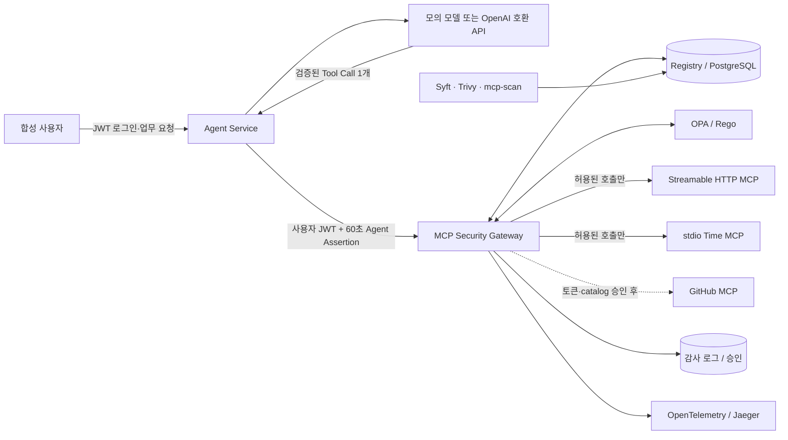

# MCP Governance Console

MCP 도입 요청, 공급망 검증, 정책 집행, 실행·감사 증적을 하나의 운영 콘솔에서 관리하는 WSL2 + Docker Compose 구성입니다. 기본 실행은 외부 LLM·실제 개인정보·GitHub 자격증명을 사용하지 않습니다. Agent가 Tool Call 후보를 만들면 Gateway가 서명된 사용자·입력 Schema·Registry 계약·공급망 증적·OPA/Rego 정책을 검사한 뒤에만 upstream MCP를 호출합니다.

> 가장 빠른 시작: `./console.sh` → <http://localhost:8000>

## 1. 어떤 통제를 제공하는가

이 실습의 핵심 질문은 “정책 응답이 Allow였는가?”에서 끝나지 않습니다.

1. 요청자의 역할과 실제 문서 등급으로 333 `rwx` 권한을 계산했는가?
2. 등록한 MCP 서버·도구·설명·입력 스키마·버전과 현재 catalog가 정확히 같은가?
3. 서버 출처에 연결된 치명적 공급망 이슈가 없는가?
4. `Allow / Alert / Approval / Restrict / Block` 중 어느 통제가 적용됐는가?
5. 차단된 호출은 upstream의 독립 효과 로그를 실제로 증가시키지 않았는가?



MCP 서버는 Docker 내부망에 있고 호스트에는 Agent Service(`127.0.0.1:8000`), Gateway API(`127.0.0.1:8080`), Jaeger UI(`127.0.0.1:16686`)만 공개됩니다. 브라우저 UI는 `8000` Console 하나이며, `8080/`에 접속하면 Console로 이동합니다. 이 Compose 구성에서는 합성 문서 MCP를 직접 호출하지 않고 Gateway 강제 경로를 사용합니다.

## 2. WSL에서 원클릭 실행

요구 사항은 WSL2, Docker Engine(또는 Docker Desktop WSL 통합), Docker Compose v2, `curl`, Python 3입니다.

```bash
wsl -d kali-linux
cd ~/mcp-gateway/full_stack_lab
./console.sh
```

스크립트가 이미지를 빌드하고 서비스 준비까지 기다립니다. 다음 주소를 엽니다.

- MCP Governance Console: <http://localhost:8000>
- Jaeger: <http://localhost:16686>

첫 실행 때 `console.sh`가 커밋하지 않는 `.env`에 합성 JWT용 Ed25519 키쌍을 생성합니다. 별도 복사·설정 단계는 없습니다. 키는 gateway 이미지 안에서 만들기 때문에 host에는 추가 의존성이 필요 없습니다.

| 값 | 받는 서비스 | 이유 |
| --- | --- | --- |
| `AGENT_JWT_PRIVATE_KEY` | `agent-service` | 합성 사용자 JWT와 60초 Agent Assertion의 유일한 발급자 |
| `AGENT_JWT_PUBLIC_KEY` | `gateway`, `gateway-sse`, `agent-service` | 검증만 가능. 검증자는 토큰을 만들 수 없음 |

대칭키를 공유하면 검증자도 발급자가 되므로 Gateway가 스스로 admin 세션을 위조할 수 있습니다. "Agent 인증과 Gateway는 별도 신뢰 경계"라는 주장이 코드가 아니라 **키 자체로** 참이 되게 하는 것이 이 분리의 목적입니다.

`/tool-call`에는 사용자 JWT 외에 `X-Agent-Assertion`도 필요합니다. Agent Service가 `agent:document-agent-test`, 사용자 actor, `mcp:tools/call`, 그리고 정확한 Tool Call envelope의 SHA-256을 다른 audience로 60초 동안 서명합니다. 따라서 사용자 JWT만으로는 이 내부 호출을 만들 수 없고, 다른 actor·agent·envelope에 쓴 assertion도 Gateway에서 `401`입니다. 같은 `tool_call_id`의 안전한 재시도만 기존 receipt가 처리합니다.

상태만 다시 확인하려면 다음을 실행합니다.

```bash
./console.sh status
```

초기화가 필요하면 아래 명령을 사용합니다. 이 실습의 Compose 볼륨과 `reports/` 생성물만 지웁니다.

```bash
./console.sh reset
```

## 3. Console에서 운영 흐름 확인

### 3.1 개발 계정으로 요청하기

Console <http://localhost:8000>에서 다음 개발 계정 중 하나를 고릅니다. 공통 비밀번호는 `test-password`이며 `.env`의 `MOCK_SSO_PASSWORD`로 바꿀 수 있습니다.

| 화면의 역할 | 이메일 | 333 역할 | 대표 관찰 |
| --- | --- | --- | --- |
| 고객 | `customer@bob.local` | `customer` | 공개 읽기는 Allow, 중요 읽기는 Block |
| 직원 | `miso@bob.local` | `employee` | 중요 읽기는 Alert, 비중요 쓰기는 Allow |
| 관리자 | `admin@bob.local` | `admin` | 공개 외부 전송은 Restrict, 중요 외부 전송은 Approval |

로그인 뒤 `MCP 실행` 화면에서 다음 업무 요청을 실행합니다.

| 빠른 시나리오 | 사용할 계정 | 예상 판정 | upstream 효과 | 관찰할 통제 |
| --- | --- | --- | --- | --- |
| 공개 문서 읽기 | 고객 | `Allow` | 1 증가 | 일반적인 최소권한 허용 |
| 중요 문서 읽기 | 고객 | `Block` | 0 | 권한 없는 호출의 실행 전 차단 |
| 중요 문서 열람 | 직원 | `Alert` | 1 증가 | 업무상 허용하되 추적 강화 |
| 내부 메모 수정 | 직원 | `Allow` | 1 증가 | 비중요 자료 쓰기 권한 |
| 공개 자료 외부 전송 | 관리자 | `Restrict` | 1 증가 | 목적지를 `restricted.invalid`, 본문을 80자로 강제 |
| 중요 자료 외부 전송 | 관리자 | `Approval` | 승인 전 0 | 10분 승인, 요청 지문 확인, 정책 재평가 후 실행 |

결과에서 `request_id`, `session_id`, `tool_call_id`, 정책 ID, 판단 이유, Trace ID와 실제 upstream 실행 여부를 확인합니다. 같은 `request_id`나 `tool_call_id`가 다시 들어오면 저장된 응답을 반환하여 중복 실행을 막습니다. 관리자로 로그인했을 때만 승인 대기 목록과 승인·거부 버튼이 보입니다. 거부에는 사유가 필수이며 증적에 남습니다. 거부 없이 만료만 가능한 승인 화면은 "검토 후 거절"과 "아무도 보지 않음"을 감사 로그에서 구분할 수 없게 만듭니다.

### 3.2 공급망·증적 확인하기

Console은 브라우저 기준 `8000` 하나에서 다음 페이지를 제공합니다.

- `운영 현황`: Registry, 정책 판정 분포, LiteLLM 경계, AI-Infra-Guard 상태
- `MCP 도입`: GitHub 저장소 URL 제출과 HOLD/검증 대기 관리
- `검증 파이프라인`: SBOM·SCA·SAST·Catalog·첫 실행 위험 분석의 증적 연결 상태
- `위험 분석`: Trivy, Semgrep, AI-Infra-Guard의 발견 항목과 심각도
- `MCP 실행`과 `감사 기록`: Tool Call 제안, Gateway 판정, 실제 upstream 효과, Trace ID

저장소 URL은 즉시 복제·실행하지 않습니다. 격리된 체크아웃에서 생성한 검증 증적이 연결되기 전에는 활성 Registry에 들어갈 수 없습니다. 이 경계가 있어야 URL 제출 기능이 또 다른 공급망 실행 경로가 되지 않습니다.

## 3.3 관찰 모드로 먼저 재보기

조직에 처음 붙일 때 첫날부터 차단을 켜는 곳은 없습니다. **"우리한테 붙이면 뭐가 막히나"**를 숫자로 보여주지 못하면 도입 논의가 진도가 나가지 않습니다.

Gateway는 두 단계로 동작합니다.

| 모드 | 권한 판정(333, 승인, 제한) | 무결성 판정(Registry, catalog, 공급망, 정책엔진 장애) |
| --- | --- | --- |
| `enforce` (기본) | 그대로 집행 | 그대로 집행 |
| `monitor` | **기록만 하고 실행** | **그대로 집행** |

관찰 모드에서도 무결성 통제는 절대 풀리지 않습니다. 드리프트가 감지된 catalog나 치명적 공급망 이슈가 있는 서버를 "관찰 중이니까" 호출하는 것은 관찰이 아니라 사고입니다. 관찰 대상은 **권한 모델에 대한 의견**뿐입니다.

전환은 관리자만 할 수 있고, 재시작이 필요 없으며, 전환 자체가 기록됩니다.

```bash
curl -sS -X PUT http://localhost:8080/api/enforcement   -H "authorization: Bearer $GW_TOKEN"   -H 'content-type: application/json'   -d '{"mode":"monitor"}'
```

관찰 모드에서 원래 막혔을 호출은 `decision: Allow`, `policy_id: P-MONITOR-001`로 실행되고, `would_decision`과 `would_policy_id`에 **집행 모드였다면 어떻게 됐을지**가 함께 남습니다.

```bash
curl -sS 'http://localhost:8080/api/monitor/summary?hours=168' | python3 -m json.tool
```

```json
{"enforcement": "monitor", "would_have_stopped": 37, "affected_principals": 3,
 "breakdown": [{"would_decision": "Block", "would_policy_id": "P-333-DENY-001",
                "role": "customer", "tool_name": "read_document", "calls": 21}]}
```

Console의 **운영 현황**과 **감사 기록**에서 같은 숫자와 정책별 내역을 확인합니다. 도입 순서는 `monitor`로 한 주 측정 → 내역 검토 → 예외 정리 → `enforce`입니다.

## 4. 확정한 333 Rego 정책

`x`는 **외부 전송 또는 고위험 실행**입니다. 표에 없는 권한은 기본 차단입니다.

| 역할 | public | nonimportant | important |
| --- | --- | --- | --- |
| customer | `r` | `-` | `-` |
| employee | `r` | `rw` | `r` |
| admin | `rwx` | `rwx` | `rwx` |

권한이 있다는 사실만으로 항상 단순 Allow가 되지는 않습니다.

| 결과 | 의미 | 대표 정책 ID |
| --- | --- | --- |
| `Allow` | 계약과 권한을 충족하여 그대로 실행 | `P-333-ALLOW-001` |
| `Alert` | 실행하되 중요 열람 증적을 강조 | `P-IMPORTANT-ALERT-001` |
| `Approval` | 중요정보 `x`를 보류하고 10분 내 승인 또는 거부 요구 | `P-X-APPROVAL-001` |
| `Restrict` | 비중요 `x`의 목적지와 길이를 축소한 뒤 실행 | `P-X-RESTRICT-001` |
| `Block` | 권한·Registry·catalog·공급망·OPA 가용성 문제로 미실행 | `P-333-DENY-001` 등 |

`P-DEPT-001`(부서 축)은 기본 비활성입니다. 아래 "조직 축"을 참고하세요.

### 조직 축 (기본 비활성)

역할 3 × 등급 3은 이 실습의 정책 어휘 전부이지만, 실제 조직은 부서·프로젝트·고객사로도 판단합니다. 그래서 **정책 입력에는 부서 축이 이미 들어갑니다.**

| 입력 | 출처 |
| --- | --- |
| `principal.department` | `principals.department` |
| `resource.owner_department` | `documents.owner_department` |

이 입력을 쓰는 규칙 `P-DEPT-001`(소관 부서가 아닌 중요정보 접근 → 승인)은 [`opa/data.json`](opa/data.json)의 `department_scope.enabled`가 `false`라 **꺼진 채로 배포됩니다.** 27칸 매트릭스와 기존 판정은 그대로입니다. 켜는 것은 조직의 결정이지만, 입력을 미리 넓혀두지 않으면 그때 규칙 전체를 다시 써야 합니다.

```json
{"department_scope": {"enabled": true}}
```

### 데이터 등급 관리대장 (결정 완료)

`data_class`의 정본은 추정 모델이 아니라 PostgreSQL `documents` 관리대장입니다. 각 문서는 `classification_source`, `classification_version`, `classified_at`을 함께 보유하며, 현재 개발 환경의 값은 검토자가 적는 `manual-registry` / `dev-v1`입니다. Gateway는 이 출처를 OPA 입력에 실어 보내고, **출처가 없는 관리대장 문서는 `P-CLASSIFICATION-001`로 기본 차단**합니다. 따라서 새 문서를 넣을 때는 등급만 넣는 것이 아니라 분류 근거·버전도 함께 검토해야 합니다.

이것은 LLM 분류 정확도를 흉내 내는 기능이 아닙니다. 근거 없는 자동 분류는 중요한 문서를 낮은 등급으로 만들 수 있으므로, 실제 분류 자동화가 필요해지면 별도 검토 워크플로에서 관리대장을 갱신한 뒤 이 Gateway가 그 결과만 집행합니다.

### Registry가 정하는 것과 ingress가 정하는 것 (결정 완료)

`mcp_tools.action`이 도구의 `r`·`w`·`x` 단일 정본입니다. Gateway는 더 이상 별도 Python 상수에 행위를 복사하지 않으므로 Registry에서 바꾼 행위가 곧 OPA 입력에 반영됩니다. 다만 Registry만으로 HTTP/MCP 인자를 자동 실행하지는 않습니다. 사용자 입력 정규화, 문서 ID와 데이터 등급 연결, 출력 제한은 보안 경계라서 새 도구에는 **Registry 계약 + 명시적 ingress 어댑터 + acceptance**를 함께 추가합니다. ‘도구가 등록됐으니 자동으로 외부 입력을 통과’시키는 방식은 의도적으로 채택하지 않았습니다.

단건으로 보면 정상인 호출도 쌓이면 다른 이야기가 됩니다. Gateway는 감사 테이블에서 두 신호를 세어 정책 입력으로 넘깁니다. 세는 일은 Gateway가, 판단은 정책이 합니다.

| 신호 | 기본 임계값 | 결과 |
| --- | --- | --- |
| 최근 호출 수 (`RATE_LIMIT_CALLS` / `RATE_LIMIT_WINDOW_SECONDS`) | 60초에 60건 | `P-RATE-001` 차단 |
| 최근 중요정보 접근 수 (`IMPORTANT_BURST_LIMIT` / `IMPORTANT_BURST_MINUTES`) | 5분에 10건 | `P-VOLUME-001` 승인 필요로 승격 |

"중요문서 20건을 1분에 읽기"는 333 권한표만 보면 전부 통과하지만 실제 내부자 유출은 정확히 그 모양입니다. 차단된 호출도 수에 포함됩니다. 거부된 호출이 몰리는 것도 몰리는 것입니다.

호출 수는 프로세스 메모리가 아니라 감사 테이블에서 세므로 Gateway 복제본이 늘어도 상한이 유지됩니다. `P-RATE-001`은 관찰 모드에서도 집행합니다. 호출량 상한은 "누가 무엇을 읽어도 되는가"에 대한 의견이 아니라 Gateway와 upstream을 보호하는 장치이고, 관찰하는 동안 상한이 없어지면 안 됩니다.

합성 로그인은 같은 출처·주소의 **실패**가 `LOGIN_ATTEMPT_LIMIT` 회를 넘으면 `429`입니다. 존재하지 않는 주소도 같이 제한합니다. 그러지 않으면 제한 자체가 "이 주소는 있다"를 알려줍니다. 정상 로그인은 실패 한도를 소진하지 않습니다.

정책 **규칙**은 [`opa/policy.rego`](opa/policy.rego), 정책이 쓰는 **값**은 [`opa/data.json`](opa/data.json), 단위 테스트는 [`opa/policy_test.rego`](opa/policy_test.rego)입니다. 조직은 정책의 모양보다 허용 목적지 같은 값을 훨씬 자주 바꾸므로, `Restrict`의 목적지와 길이 제한은 규칙 본문이 아니라 데이터 문서에 둡니다. 사용자 입력이 주장하는 등급을 믿지 않고 `document_id`에 연결된 PostgreSQL 분류를 사용합니다.

## 5. curl로 직접 확인

브라우저 없이도 `합성 로그인 → Agent → Gateway → OPA → MCP` 전체 경로를 호출할 수 있습니다.

```bash
TOKEN="$(curl -sS http://localhost:8000/auth/mock-login \
  -H 'content-type: application/json' \
  -d '{"email":"miso@bob.local","password":"test-password"}' \
  | python3 -c 'import json,sys; print(json.load(sys.stdin)["access_token"])')"

curl -sS http://localhost:8000/chat \
  -H "authorization: Bearer $TOKEN" \
  -H 'content-type: application/json' \
  -d '{"message":"중요 계약 초안을 읽어줘"}' \
  | python3 -m json.tool
```

`Alert`, `upstream_executed: true`, 서로 연결된 요청·세션·Tool Call ID가 나오면 전체 경로가 동작한 것입니다. 토큰은 30분짜리 합성 JWT이며 모델이 만드는 Tool Call에는 사용자 역할이나 Gateway용 토큰을 넣을 수 없습니다.

Gateway의 짧은 모의 모델 API도 같은 방식으로 비교할 수 있습니다. 이 경로는 로그인 UI가 아니라 정책 동작만 빠르게 시연하기 위한 기존 호환 API이며, **요청자는 서명된 토큰에서만 옵니다.** 본문에 역할이나 principal을 적어 넣을 수 있는 자리는 없습니다.

```bash
GW_TOKEN="$(curl -sS http://localhost:8080/api/session \
  -H 'content-type: application/json' \
  -d '{"email":"customer@bob.local","password":"test-password"}' \
  | python3 -c 'import json,sys; print(json.load(sys.stdin)["access_token"])')"

curl -sS http://localhost:8080/api/calls \
  -H "authorization: Bearer $GW_TOKEN" \
  -H 'content-type: application/json' \
  -d '{"tool_name":"read_document","document_id":"secret-001"}' \
  | python3 -m json.tool
```

결과는 `Block`, `P-333-DENY-001`, `upstream_executed: false`, 동일한 `effect_before/effect_after`가 되어야 합니다.

토큰 없이, 또는 위조한 토큰으로 같은 호출을 보내면 정책 판정까지 가지 않고 `401`입니다.

```bash
curl -sS -o /dev/null -w '%{http_code}\n' http://localhost:8080/api/calls \
  -H 'content-type: application/json' \
  -d '{"tool_name":"read_document","document_id":"notice-001"}'
```

## 6. 실제 모델 API를 연결할 준비

기본값 `MODEL_MODE=mock`은 외부 호출 없이 결정론적으로 동작합니다. OpenAI 호환 `/chat/completions` endpoint를 사용할 준비가 되면 `full_stack_lab/.env`에 다음 네 값을 추가하고 `./console.sh`를 다시 실행합니다.

```dotenv
MODEL_MODE=provider
MODEL_BASE_URL=https://provider.example/v1
MODEL_API_KEY=replace-me
MODEL_NAME=replace-me
```

```bash
./console.sh
curl -sS http://localhost:8000/api/readiness | python3 -m json.tool
```

외부 endpoint는 HTTPS만 허용합니다. 로컬 호환 서버만 `localhost`, `127.0.0.1`, `host.docker.internal`, Compose의 `model-stub`에 HTTP로 연결할 수 있습니다. Agent는 사용자 요청에서 이메일·휴대전화·일반적인 API 키 패턴을 치환하고, 응답은 128 KB·Tool Call 1개·등록된 서버/도구·JSON Schema로 제한합니다. 모델 결과를 신뢰해 권한을 부여하지 않으며, 도구 실행 결과도 모델에 재전송하지 않습니다.

현재 자동 시험은 실제 LLM이 아닌 로컬 HTTP wire stub으로 정상·차단·잘못된 Schema·알 수 없는 도구·복수 호출·401·429·500·timeout·과대 응답을 검증합니다. 따라서 API 형식과 실패 경계는 준비됐지만 특정 상용 모델의 실제 응답 정확도·비용·rate limit은 자격증명을 연결한 뒤 별도 시나리오 시험이 필요합니다.

## 7. 자동 완료 조건 검증

아래 한 줄이 빌드, Rego 단위 테스트, 정책/승인/효과 검증, 세 transport 실호출, catalog 변조와 OPA 장애 회귀 테스트를 실행합니다.

```bash
./console.sh test
```

Agent Console·인증·도입 요청 경계만 빠르게 확인할 때는 다음 명령을 사용합니다.

```bash
./console.sh agent-test
```

정상 기준은 다음과 같습니다.

- Rego 단위 테스트 `17/17 PASS`
- acceptance, Agent/API 경계 acceptance 모두 `0 failed`
- 익명·위조 토큰의 Gateway API 호출이 `401`, 고객 계정의 승인 시도가 `403`
- `/tool-call`은 사용자 JWT와 Agent Assertion을 함께 요구하며, 사용자 JWT 재사용·다른 actor·변조된 envelope는 `401`
- Streamable HTTP, stdio, legacy SSE에서 실제 `tools/call` 성공
- 토큰 없는 Streamable HTTP 호출과 신원이 바인딩되지 않은 stdio 호출이 각각 거부
- Gateway가 노출하는 도구 입력 스키마에 `user_token` 같은 신원 인자가 없음
- 설명·스키마·도구 목록·서버 버전 변조가 각각 `MCP-CATALOG-001`로 차단
- 서버에 귀속된 치명적 공급망 finding이 `MCP-SUPPLY-001`로 차단
- OPA 중단 시 `P-CONTROL-FAIL-CLOSED`로 차단
- 모든 차단 사례에서 독립 upstream 효과 수가 증가하지 않음
- 합성 upstream MCP에 host port가 없음

생성 결과는 `reports/acceptance.json`, `reports/agent-acceptance.json`, `reports/security-regression.txt`에 남고 Git에는 포함되지 않습니다.

같은 명령을 [`.github/workflows/verify.yml`](../.github/workflows/verify.yml)이 `main`과 모든 `feat/**` 푸시, `main`으로 가는 PR마다 실행합니다. 완료 조건은 사람이 기억할 때가 아니라 매 변경마다 확인됩니다. 실행 결과는 workflow artifact로 보관합니다.

## 8. transport 호환 범위

| 구간 | 방식 | 신원 출처 | 검증 방법 |
| --- | --- | --- | --- |
| Client → Gateway | Streamable HTTP | `Authorization` header의 서명된 합성 JWT | `/mcp/`에 실제 MCP SDK `initialize / tools/list / tools/call` |
| Client → Gateway | stdio | 프로세스 기동 시 고정한 `GATEWAY_STDIO_PRINCIPAL` | `python -m app.stdio_entry` subprocess에 실제 호출 |
| Client → Gateway | legacy SSE | `Authorization` header의 서명된 합성 JWT | 내부 `gateway-sse:8081/sse` compatibility adapter에 실제 호출 |
| Agent Service → Gateway | 내부 HTTP `/tool-call` | 사용자 JWT + 60초 `X-Agent-Assertion` | actor·agent ID·정규화한 envelope SHA-256을 Gateway에서 검증 |
| Gateway → 문서 MCP | Streamable HTTP | — | 내부 `mock-http-mcp:9000/mcp/` |
| Gateway → Time MCP | stdio | — | 고정한 `mcp-server-time` subprocess |

Gateway가 중개하는 MCP 메서드는 `initialize`, `server/discover`, `ping`, `tools/list`, `tools/call` 뿐입니다. `resources/*`, `prompts/*`, `sampling/*`, `elicitation/*`, `completion/*`, `logging/*`, `roots/*`는 등록 여부와 무관하게 `MCP-METHOD-001`로 거부합니다.

"등록한 게 없으니 빈 목록이 나간다"는 정책이 아니라 우연입니다. 누군가 resource 하나를 등록하는 날 정책이 생깁니다. 게다가 prompt와 resource 본문은 에이전트로 들어가는 주요 인젝션 경로이므로, Gateway는 그것을 **나르지 않는다**고 분명히 말합니다.

SSE는 신규 기본값이 아니라 구형 client 호환성 시험용입니다. 세 ingress는 모두 같은 `execute_call()` 정책 경로를 사용하고, **모두 같은 신원 경계를 거칩니다.** 도구 인자에는 사용자나 역할을 넣을 자리가 없으므로 client는 자기 신원을 주장할 수 없습니다. stdio는 header가 없는 transport이므로 신원을 spawn 시점에 한 번 고정하고, 고정되지 않은 stdio ingress는 기본 principal로 넘어가지 않고 거부합니다.

## 9. Registry와 공급망 통제

### 런타임 계약

Gateway는 매 호출 직전에 `tools/list`를 다시 읽고 다음 승인 기준과 비교합니다.

- 승인된 서버와 도구인지, 활성 상태인지
- 도구 집합에 추가/누락이 없는지
- 설명 SHA-256, 입력 JSON Schema SHA-256, 서버 버전이 고정본과 같은지
- 설명에 정책 우회·비밀 요구 같은 위험 메타데이터가 없는지
- 서버 `source_ref`에 연결된 치명적 공급망 finding이 없는지

첫 관찰값을 자동 승인하는 TOFU는 사용하지 않습니다. 승인 해시는 [`db/init.sql`](db/init.sql)에 버전 관리합니다. catalog 변조 네 종류는 [`tests/drift_and_fail_closed.sh`](tests/drift_and_fail_closed.sh)가 자동 검증합니다.

### 오픈소스 스캐너

```bash
./console.sh scan
```

이 명령은 다음 도구를 일회성 컨테이너로 실행하고 결과를 Console에 가져옵니다.

| 도구 | 사용 범위 | 결과 |
| --- | --- | --- |
| Syft `v1.51.1` | 저장소 구성요소 inventory | CycloneDX `reports/sbom.cdx.json` |
| Trivy `0.74.0` | vuln, misconfig, secret, license | `reports/trivy.json` |
| Semgrep `1.172.0` | MCP 구성요소 SAST (TLS·shell 경계 규칙) | `reports/semgrep.json` |
| AI-Infra-Guard `mcp-scan` | 선택적 MCP 전용 코드/동적 감사 | `reports/mcp-scan.sarif.json` |

`./console.sh scan`은 두 가지를 합니다.

1. `full_stack_lab/` 전체에 대한 SBOM과 취약점 목록을 `workspace` 증적으로 보관합니다. **인벤토리용이며 아무 호출도 막지 않습니다.**
2. Registry에 `scan_path`가 등록된 서버를 **서버별로 따로** 스캔하고, 결과를 `reports/trivy-<server_id>.json`으로 남깁니다. 가져오기 단계에서 파일 이름의 서버를 찾아 **그 서버의 고정 `source_ref`로 귀속**시킵니다. `_contract()`가 치명점을 세는 키가 바로 그 `source_ref`이므로, 이 경로로 들어온 `CRITICAL > 0`은 실제로 `MCP-SUPPLY-001` 차단이 됩니다.

| 서버 | `scan_path` | 차단 연결 |
| --- | --- | --- |
| `mock-http` | `full_stack_lab/mock_server` | 연결됨 |
| `mock-stdio` | `full_stack_lab/gateway` | 연결됨 (`mcp-server-time`이 gateway 이미지에 고정 설치되므로 gateway의 의존성 집합이 가장 가까운 국소 대리값입니다) |
| `github` | 없음 | 원격이라 국소 스캔 불가 |

전역 스캔 결과를 서버에 귀속시키지 않는 것은 의도된 경계입니다. 잘못된 전역 스캔 한 건이 모든 서버를 자동 격리하면 안 됩니다.

어떤 서버의 스캔이 실제로 차단에 연결돼 있는지는 언제든 확인할 수 있습니다.

```bash
curl -sS http://localhost:8080/api/supply-chain/coverage | python3 -m json.tool
```

`unwired`에 들어 있는 서버는 `scan_path`는 있지만 아직 스캔 결과가 없어 **차단에 연결되지 않은 상태**입니다. Console의 숫자만 보고 "스캔이 막아준다"고 결론내지 않으려면 이 값을 같이 봐야 합니다.

AI-Infra-Guard는 요청대로 전체 플랫폼이 아니라 **`mcp-scan` CLI만**, 커밋 `036c39bd03b39ce4a811f7f125bc3b8f47e39b7c`에 고정해 별도 profile로 빌드합니다.

```bash
docker compose --profile mcp-scan build mcp-scan
docker run --rm mcp-governance-full-mcp-scan --help
```

`mcp-scan`의 실제 코드 감사 단계는 OpenAI 호환 LLM endpoint를 요구합니다. 현재 합의한 무-LLM 기본 모드에서는 `./console.sh mcp-scan`이 키·URL·모델이 없으면 의도적으로 종료합니다. 나중에 로컬 모의 endpoint가 준비됐을 때만 아래처럼 실행합니다.

```bash
MCP_SCAN_API_KEY=dummy \
MCP_SCAN_BASE_URL=http://host.docker.internal:11434/v1 \
MCP_SCAN_MODEL=local-mock \
./console.sh mcp-scan
```

This project integrates AI-Infra-Guard, open-sourced by Tencent Zhuque Lab. 참고: [AI-Infra-Guard mcp-scan](https://github.com/Tencent/AI-Infra-Guard/tree/main/mcp-scan), [Syft](https://github.com/anchore/syft), [Trivy](https://github.com/aquasecurity/trivy).

## 9.1 감사 로그 무결성

기업 미팅에서 반드시 나오는 질문은 "그 감사 로그가 위변조되지 않았다는 건 어떻게 압니까"입니다. `decisions`의 각 행은 **직전 행의 해시**를 함께 기록합니다. 행 하나를 고치거나 지우면 그 뒤의 모든 행을 다시 써야 하므로, 어디가 끊겼는지 행 번호로 드러납니다.

```bash
curl -sS http://localhost:8080/api/audit/verify   -H "authorization: Bearer $GW_TOKEN" | python3 -m json.tool
```

정상이면 `{"intact": true, "checked": N, "head": "..."}`입니다. 관리자 계정만 호출할 수 있습니다.

`decisions`에는 `UPDATE`·`DELETE`를 거부하는 DB trigger가 있습니다. 이 실습의 애플리케이션 역할은 schema owner라 `REVOKE`만으로는 소유자의 암묵 권한을 없앨 수 없습니다. trigger는 평상 애플리케이션 경로의 수정을 fail-closed로 막고, 운영에서는 migration owner와 append-only writer를 분리해야 합니다.

체인이 실제로 변조를 잡는지 보여주려면 **먼저 trigger를 끄고** 한 행을 고칩니다. trigger가 살아 있는 동안에는 소유자의 `UPDATE`도 `decisions is append-only`로 실패하므로, 이 순서가 곧 "통제를 하나 무력화해도 다음 통제가 잡는다"는 시연이 됩니다.

```bash
docker compose exec -T db psql -U mcp -d mcp_governance -c \
  "ALTER TABLE decisions DISABLE TRIGGER decisions_append_only;
   UPDATE decisions SET reason='조작된 사유' WHERE id=(SELECT max(id) FROM decisions);
   ALTER TABLE decisions ENABLE TRIGGER decisions_append_only;"

curl -sS http://localhost:8080/api/audit/verify -H "authorization: Bearer $GW_TOKEN" | python3 -m json.tool
```

`{"intact": false, "broken_at": <행 번호>, "reason": "항목 내용이 기록된 해시와 다릅니다."}`가 나옵니다. 이후 체인은 끊긴 상태로 남으므로 시연 뒤에는 `./console.sh reset`으로 초기화하세요.

## 10. GitHub MCP 연결 절차

[GitHub MCP Server](https://github.com/github/github-mcp-server)는 Registry에 Streamable HTTP 읽기 도구 후보로 등록했습니다. Gateway의 `github_get_file`은 공식 remote endpoint에 Bearer token을 보내고 `X-MCP-Readonly: true`, `X-MCP-Tools: get_file_contents`로 노출 범위를 줄입니다. 저장소도 `GITHUB_ALLOWED_REPOS` 목록으로 한 번 더 제한합니다.

현재는 인증을 나중에 하기로 했으므로 서버와 도구가 `DISABLED`이며 호출하면 `MCP-REGISTRY-002`로 차단됩니다. 토큰을 넣어도 자동 승인하지 않습니다. 자격증명이 준비되면 다음 순서를 그대로 실행합니다.

1. `full_stack_lab/.env`에 최소 권한 토큰과 허용 저장소를 넣습니다. `.env`는 Git에서 제외됩니다.

   ```dotenv
   GITHUB_PERSONAL_ACCESS_TOKEN=replace-me
   GITHUB_ALLOWED_REPOS=MCP-governance/mcp-gateway
   ```

2. 컨테이너에 새 환경값을 적용하고, 제한된 remote catalog를 관찰 파일로 저장합니다.

   ```bash
   ./console.sh
   docker compose exec -T gateway python -m app.github_setup observe \
     > reports/github-reviewed.json
   python3 -m json.tool reports/github-reviewed.json
   ```

3. 운영자가 endpoint·서버 버전·도구 이름이 정확히 `get_file_contents` 하나인지, 설명과 입력 Schema에 과도한 권한이나 정책 우회 문구가 없는지 검토합니다. 검토 중 remote catalog가 바뀌면 다음 단계가 실패합니다.

4. 같은 catalog인지 다시 확인하면서 승인하고 실제 읽기 시나리오를 실행합니다.

   ```bash
   docker compose exec -T gateway python -m app.github_setup \
     activate-reviewed /reports/github-reviewed.json

   curl -sS http://localhost:8080/api/calls \
     -H "authorization: Bearer $GW_TOKEN" \
     -H 'content-type: application/json' \
     -d '{"tool_name":"github_get_file","owner":"MCP-governance","repo":"mcp-gateway","path":"README.md"}' \
     | python3 -m json.tool
   ```

정상 결과는 `Allow`와 파일 내용이며, 허용 목록 밖 저장소는 `MCP-REPOSITORY-001`, catalog 변경은 `MCP-CATALOG-001`, 인증·통신 실패는 `MCP-UPSTREAM-001`입니다. 마지막 경우 remote가 요청을 받았을 수 있으므로 자동 재시도하지 않고 GitHub 감사 증적을 함께 확인해야 합니다. 이 절차의 remote catalog 관찰과 실제 GitHub 호출은 토큰이 없는 현재 상태에서는 실행하지 않았습니다.

## 11. 구성요소와 파일 안내

| 경로 | 역할 |
| --- | --- |
| `compose.yaml` | 네트워크·서비스·scanner profile |
| `console.sh` | `up/test/agent-test/scan/mcp-scan/status/logs/down/reset` 단일 진입점 |
| `gateway/app/core.py` | 계약 확인, Rego 질의, 승인, upstream 실행, 증적 |
| `gateway/app/agent_service.py` | 합성 로그인, 세션, 요청 멱등성, 모델 제안 경로 |
| `gateway/app/agent_gateway.py` | 서명 사용자와 Tool Call envelope를 기존 정책 경로에 연결 |
| `gateway/app/agent_contract.py` | Ed25519 JWT·서버/도구 조합·공유 JSON Schema 경계 |
| `gateway/app/keygen.py` | 이미지 안에서 Ed25519 키쌍 생성 (host에 crypto 의존성 없음) |
| `gateway/app/model_client.py` | 결정론적 모의 모델과 제한된 OpenAI 호환 client |
| `gateway/app/github_setup.py` | GitHub remote catalog 관찰·명시 승인 |
| `gateway/app/agent_static/` | 개발 계정 로그인·단일 MCP Governance Console UI |
| `gateway/app/mcp_facade.py` | 공통 정책 경로를 노출하는 MCP facade |
| `gateway/app/method_scope.py` | 중개하지 않는 MCP 메서드 기본 거부 |
| `gateway/app/db.py` | 프로세스당 하나인 PostgreSQL 커넥션 풀 |
| `gateway/ui/` | Gateway API 검증용 기존 React UI (운영 Console은 8000) |
| `mock_server/server.py` | 실제 SDK 기반 합성 문서 MCP와 catalog 변조 모드 |
| `opa/` | 333 Rego 정책과 단위 테스트 |
| `db/init.sql` | 합성 사용자·부서·Registry·감사/승인/공급망 schema |
| `tests/open_endpoints.py` | 무인증으로 열린 API 목록이 문서와 같은지 대조 |
| `tests/` | acceptance 외 보안 회귀 검사 |
| `supply_chain/` | 고정 버전 Semgrep 규칙과 선택적 mcp-scan 이미지 |

Python과 프런트엔드 의존성은 버전을 고정하고 UI는 lockfile로 재현합니다. `mcp-server-time`은 구형 MCP SDK 의존성을 요구하므로 Gateway의 최신 SDK 환경과 별도 venv로 격리했습니다.

Agent 로그인·업무 공간·chat 흐름은 팀원 저장소 [`MCP-governance/Agent-Service`의 `miso` 브랜치, commit `81177a4`](https://github.com/MCP-governance/Agent-Service/tree/81177a41d917a2c1382485cc8f5ae115637aff89)에서 가져와 이 Gateway의 단일 정책 경로에 맞게 확장했습니다. 팀원 구현의 `read_file` 요청은 승인된 합성 경로만 `read_document`로 변환합니다. 별도로 있던 Gateway·OPA·mock 서버는 정책 원본이 둘로 갈라지는 것을 피하려고 중복 이식하지 않았습니다.

## 12. 여기서 발견해야 할 의의

- **LLM은 집행자가 아니다.** 모의 모델은 Tool Call만 제안하고, 결정론적 정책과 계약 검증이 실행 권한을 정합니다.
- **단건 판정만으로는 유출을 못 본다.** 권한이 있는 열람 20건은 20번의 Allow입니다. 누적을 정책 입력으로 넘겨야 그 20건이 하나의 사건으로 보입니다.
- **집행은 스위치가 아니라 단계다.** 통제를 켜는 비용을 모르면 아무도 켜지 않습니다. 관찰 모드는 권한 판정을 기록만 하고 실행해 영향 범위를 먼저 숫자로 만들고, 무결성 판정은 그 동안에도 집행합니다.
- **정책 응답과 실제 효과는 다른 증적이다.** Gateway DB의 판정과 upstream JSONL 효과를 함께 봐야 “차단 전에 멈췄다”를 주장할 수 있습니다.
- **권한표만으로 공급망 문제를 막을 수 없다.** 허용된 `read_document`라도 설명·스키마·버전·도구 목록이 바뀌거나 서버 귀속 치명점이 생기면 차단됩니다.
- **승인은 단순 버튼이 아니다.** 원 요청 지문, 만료, 관리자 역할을 확인하고 현재 정책으로 재평가한 뒤 한 번 실행합니다. 거부도 같은 자격으로, 사유와 함께 기록합니다.
- **정책의 규칙과 값은 수명이 다르다.** 허용 목적지와 길이 제한은 규칙 본문이 아니라 데이터 문서에 둡니다. 값 하나 바꾸자고 정책 코드를 고치고 재검토하는 조직은 값을 안 바꿉니다.
- **transport가 달라도 통제점은 하나여야 한다.** Streamable HTTP, stdio, legacy SSE 모두 같은 정책 함수로 모입니다.
- **통제점의 신원은 호출자가 정할 수 없다.** 정책 함수가 하나여도 principal을 도구 인자나 요청 본문에서 받으면 통제가 아니라 요청서입니다. 신원은 transport 인증에서만 오고, `/tool-call`은 그 사용자 JWT에 더해 Agent가 서명한 actor·agent·정확한 envelope assertion까지 확인합니다.
- **통제하지 않는 표면은 열어두지 않는다.** MCP는 tools 말고도 resources, prompts, sampling을 실어 나릅니다. 그중 하나라도 정책 없이 통과하면 통제점이 아니라 통로입니다.
- **입력만 보는 통제는 절반이다.** 설명과 스키마를 고정해도 서버가 런타임에 무엇을 돌려주는지는 말해주지 않습니다. Gateway는 결과의 크기와 정책 우회 지시 패턴도 검사하고, 걸리면 `MCP-OUTPUT-001`로 결과를 반환하지 않습니다. 이때 호출 자체는 이미 실행됐으므로 `upstream_executed`는 참으로 남깁니다. 판정과 효과를 일치시키는 것보다 증적을 정직하게 두는 쪽이 중요합니다.
- **감사는 위변조 가능하면 증적이 아니다.** 각 판정은 직전 판정의 해시를 안고 기록되고, Gateway 계정은 `decisions`를 수정할 수 없습니다. "우리 로그는 정확합니다"가 아니라 "몇 번 행에서 끊겼습니다"로 답할 수 있어야 합니다.
- **감사는 사본 보관소가 아니다.** `decisions`에는 문서 본문 대신 해시와 길이, 결과의 앞부분만 남깁니다. 감사 테이블이 조직에서 가장 큰 민감정보 더미가 되면 통제가 아니라 위험입니다.
- **Agent 인증과 모델 제안은 별도 신뢰 경계다.** 모델이 사용자·역할·승인을 주장할 수 없고, 서명된 합성 사용자와 Agent Service가 만든 60초 위임 assertion만 Gateway가 사용합니다.
- **API 실패는 재시도 정책까지 포함해 다뤄야 한다.** timeout이나 연결 단절 뒤에는 upstream 실행 여부가 불확실할 수 있어 요청·Tool Call ID와 receipt를 먼저 확인합니다.
- **Gateway는 경로 통제와 함께 설계해야 한다.** 이 Compose는 upstream port를 숨기지만 조직 전체의 로컬 프로세스·별도 네트워크까지 막는 것은 아닙니다.

## 13. 의도적으로 남긴 경계

- 실제 사용자 SSO/OIDC, RBAC 관리 화면, 실제 GitHub 토큰 위임은 미구현입니다. 합성 JWT와 Agent Assertion은 Ed25519로 서명하고 Agent Service만 개인키를 갖지만, assertion은 workload attestation이 아니며 키 회전·폐기 절차·JWKS 배포·SPIFFE SVID는 아직 없습니다.
- Gateway의 읽기 API는 인증 없이 열려 있습니다: `/api/health`, `/api/state`, `/api/effects`, `/api/policy/matrix`, `/api/integration`, `/api/monitor/summary`, `/api/enforcement`, `/api/supply-chain/coverage`. 상태를 바꾸는 API는 모두 서명된 토큰을 요구하고 승인·거부·집행 전환·공급망 가져오기·감사 검증은 관리자까지 확인하지만, 증적 조회는 `127.0.0.1` 바인딩에만 의존합니다. 이 목록은 `tests/open_endpoints.py`가 코드와 대조합니다. **결정:** 운영에서는 새 로컬 토큰을 덧붙이지 않고, 조직 OIDC를 연결한 reverse proxy에서 이 읽기 경로도 보호합니다.
- 호출량 상한(`P-RATE-001`)과 중요정보 누적 승격(`P-VOLUME-001`)은 감사 테이블 기준이라 Gateway 복제본이 늘어도 유지되지만, 비용·토큰 쿼터는 없습니다. Agent Service의 동시 실행 제한과 로그인 시도 상한은 프로세스 단위라 복제본이 늘면 함께 늘어납니다. **결정:** 현재 배포 단위는 Gateway 1개입니다. 다중 복제본은 Postgres 감사 체인의 전역 잠금이 정확성은 지키지만 처리량을 직렬화하므로, ingress 공용 rate limit·OIDC·SIEM을 함께 설계한 뒤 별도 부하 시험으로 전환합니다.
- 실제 상용 LLM API는 호출하지 않았습니다. 기본 자연어 변환은 규칙 기반 키워드 변환이고, OpenAI 호환 HTTP 경계는 로컬 stub으로만 검증했습니다.
- GitHub MCP는 인증·catalog 승인 전이라 실제 upstream 호출을 하지 않습니다.
- GitHub catalog 승인은 현재 개발 DB 상태입니다. 운영 반영 전에는 검토 파일의 해시를 코드 리뷰와 정책 버전에 남겨야 합니다.
- image tag는 버전 고정이지만 digest/서명 검증과 admission controller까지는 포함하지 않았습니다.
- 전역(`workspace`) 스캔 결과는 인벤토리이며 호출을 막지 않습니다. 차단은 `scan_path`가 등록된 서버의 개별 스캔 결과로만 이어집니다. `github`는 원격이라 국소 스캔 대상이 아닙니다.
- 운영용 HA, TLS 종료, 비밀관리, SIEM 알림, 조직 전체 egress 강제는 별도 운영 설계가 필요합니다. **결정:** 현재 증적 정본은 PostgreSQL 감사 체인과 OpenTelemetry trace이며, 보존 기간·수신 인증·민감정보 마스킹 요구가 확정되기 전 외부 SIEM으로 원문을 내보내지는 않습니다.
- Console의 승인자는 합성 관리자이며 실인증 승인이 아닙니다. 승인자 그룹, 위임, 4-eyes, 알림 채널(Slack/메일)은 미구현입니다.

이 경계 안에서 완료 조건은 자동화되어 있습니다. 기능을 더 붙이기 전에 `./console.sh test`의 정책·효과·변조·장애 검증을 계속 통과시키는 것이 다음 확장의 기준선입니다.
