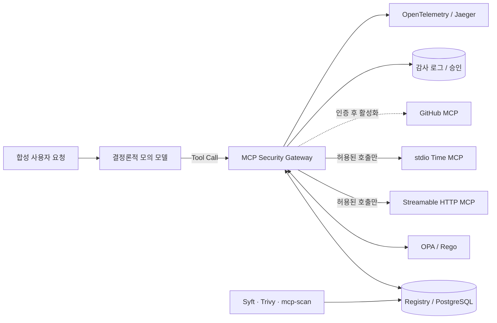

# MCP Security Gateway 전체 실습

멘토가 화면만 보고도 **요청 → 정책 판단 → MCP 실행 → 증적**을 따라갈 수 있도록 만든 WSL2 + Docker Compose 실습입니다. 실제 LLM과 실제 개인정보는 쓰지 않습니다. 합성 사용자와 결정론적 모의 모델로 Tool Call을 만들고, Gateway가 Registry 계약·공급망 증적·OPA/Rego 정책을 검사한 뒤에만 upstream MCP를 호출합니다.

> 가장 빠른 시작: `./demo.sh` → <http://localhost:8080>

## 1. 무엇을 확인하는 실습인가

이 실습의 핵심 질문은 “정책 응답이 Allow였는가?”에서 끝나지 않습니다.

1. 요청자의 역할과 실제 문서 등급으로 333 `rwx` 권한을 계산했는가?
2. 등록한 MCP 서버·도구·설명·입력 스키마·버전과 현재 catalog가 정확히 같은가?
3. 서버 출처에 연결된 치명적 공급망 이슈가 없는가?
4. `Allow / Alert / Approval / Restrict / Block` 중 어느 통제가 적용됐는가?
5. 차단된 호출은 upstream의 독립 효과 로그를 실제로 증가시키지 않았는가?



MCP 서버는 Docker 내부망에 있고 호스트에는 Gateway(`127.0.0.1:8080`)와 Jaeger UI(`127.0.0.1:16686`)만 공개됩니다. 따라서 이 Compose 실습 안에서는 합성 문서 MCP를 직접 호출하지 않고 Gateway 강제 경로를 사용합니다.

## 2. WSL에서 원클릭 실행

요구 사항은 WSL2, Docker Engine(또는 Docker Desktop WSL 통합), Docker Compose v2, `curl`, Python 3입니다.

```bash
wsl -d kali-linux
cd ~/mcp-gateway/full_stack_lab
./demo.sh
```

스크립트가 이미지를 빌드하고 서비스 준비까지 기다립니다. 다음 주소를 엽니다.

- Dashboard: <http://localhost:8080>
- Jaeger: <http://localhost:16686>

상태만 다시 확인하려면 다음을 실행합니다.

```bash
./demo.sh status
```

초기화가 필요하면 아래 명령을 사용합니다. 이 실습의 Compose 볼륨과 `reports/` 생성물만 지웁니다.

```bash
./demo.sh reset
```

## 3. 대시보드에서 3분 실습

`직접 실습` 영역에는 다섯 개의 빠른 시나리오가 있습니다.

| 빠른 시나리오 | 합성 요청자 | 예상 판정 | upstream 효과 | 관찰할 통제 |
| --- | --- | --- | --- | --- |
| 공개 문서 허용 | customer | `Allow` | 1 증가 | 일반적인 최소권한 허용 |
| 중요 열람 경보 | employee | `Alert` | 1 증가 | 업무상 허용하되 추적 강화 |
| 외부 전송 제한 | admin | `Restrict` | 1 증가 | 목적지를 `mentor-demo.invalid`, 본문을 80자로 강제 |
| 중요 전송 승인 | admin | `Approval` | 승인 전 0 | 10분 승인, 요청 지문 확인, 정책 재평가 후 실행 |
| 권한 부족 차단 | customer | `Block` | 0 | 중요자료 읽기 권한 없음 |

결과 카드에서 정책 ID, 판단 이유, 등급/행위, 실제 upstream 실행 여부와 효과 로그의 전후 개수를 함께 봅니다. `Approval`은 화면의 `관리자로 승인 후 재검증` 버튼까지 눌러야 실행됩니다. 모든 계정과 문서는 합성 데이터입니다.

화면 아래쪽에서는 다음을 확인할 수 있습니다.

- `333 정책`: 27개 조합과 기본 DENY
- `Registry + Supply Chain`: 서버 출처·고정 ref·transport·catalog 상태·스캔 결과
- `감사`: 최근 판정, 승인 대기, 효과 개수, Trace ID
- `정확한 해석`: 현재 PoC가 증명하는 범위와 아직 증명하지 않는 범위

## 4. 확정한 333 Rego 정책

`x`는 **외부 전송 또는 고위험 실행**입니다. 표에 없는 권한은 기본 차단입니다.

| 역할 | public | nonimportant | important |
| --- | --- | --- | --- |
| customer | `r` | `-` | `-` |
| employee | `r` | `rw` | `r` |
| admin | `rwx` | `rwx` | `rwx` |

권한이 있다는 사실만으로 항상 단순 Allow가 되지는 않습니다.

| 결과 | 의미 | 대표 정책 ID |
| --- | --- | --- |
| `Allow` | 계약과 권한을 충족하여 그대로 실행 | `P-333-ALLOW-001` |
| `Alert` | 실행하되 중요 열람 증적을 강조 | `P-IMPORTANT-ALERT-001` |
| `Approval` | 중요정보 `x`를 보류하고 10분 내 승인 요구 | `P-X-APPROVAL-001` |
| `Restrict` | 비중요 `x`의 목적지와 길이를 축소한 뒤 실행 | `P-X-RESTRICT-001` |
| `Block` | 권한·Registry·catalog·공급망·OPA 가용성 문제로 미실행 | `P-333-DENY-001` 등 |

정책 원본은 [`opa/policy.rego`](opa/policy.rego), 단위 테스트는 [`opa/policy_test.rego`](opa/policy_test.rego)입니다. 사용자 입력이 주장하는 등급을 믿지 않고 `document_id`에 연결된 PostgreSQL 분류를 사용합니다.

## 5. curl로 직접 확인

모의 모델은 키워드를 고정 JSON Tool Call로 바꿀 뿐 외부 LLM을 호출하지 않습니다.

```bash
curl -sS http://localhost:8080/api/mock-model \
  -H 'content-type: application/json' \
  -d '{"user_token":"emp-demo","message":"중요 계약 초안을 읽어줘"}' \
  | python3 -m json.tool
```

Tool Call을 바로 제출할 수도 있습니다.

```bash
curl -sS http://localhost:8080/api/calls \
  -H 'content-type: application/json' \
  -d '{"user_token":"cust-demo","tool_name":"read_document","document_id":"secret-001"}' \
  | python3 -m json.tool
```

두 번째 결과는 `Block`, `P-333-DENY-001`, `upstream_executed: false`, 동일한 `effect_before/effect_after`가 되어야 합니다.

## 6. 자동 완료 조건 검증

아래 한 줄이 빌드, Rego 단위 테스트, 정책/승인/효과 검증, 세 transport 실호출, catalog 변조와 OPA 장애 회귀 테스트를 실행합니다.

```bash
./demo.sh test
```

정상 기준은 다음과 같습니다.

- Rego 단위 테스트 `7/7 PASS`
- acceptance `25 passed, 0 failed`
- Streamable HTTP, stdio, legacy SSE에서 실제 `tools/call` 성공
- 설명·스키마·도구 목록·서버 버전 변조가 각각 `MCP-CATALOG-001`로 차단
- 서버에 귀속된 치명적 공급망 finding이 `MCP-SUPPLY-001`로 차단
- OPA 중단 시 `P-CONTROL-FAIL-CLOSED`로 차단
- 모든 차단 사례에서 독립 upstream 효과 수가 증가하지 않음
- 합성 upstream MCP에 host port가 없음

생성 결과는 `reports/acceptance.json`, `reports/security-regression.txt`에 남고 Git에는 포함되지 않습니다.

## 7. transport 호환 범위

| 구간 | 방식 | 검증 방법 |
| --- | --- | --- |
| Client → Gateway | Streamable HTTP | `/mcp/`에 실제 MCP SDK `initialize / tools/list / tools/call` |
| Client → Gateway | stdio | `python -m app.stdio_entry` subprocess에 실제 호출 |
| Client → Gateway | legacy SSE | 내부 `gateway-sse:8081/sse` compatibility adapter에 실제 호출 |
| Gateway → 문서 MCP | Streamable HTTP | 내부 `mock-http-mcp:9000/mcp/` |
| Gateway → Time MCP | stdio | 고정한 `mcp-server-time` subprocess |

SSE는 신규 기본값이 아니라 구형 client 호환성 시험용입니다. 세 ingress는 모두 같은 `execute_call()` 정책 경로를 사용합니다.

## 8. Registry와 공급망 통제

### 런타임 계약

Gateway는 매 호출 직전에 `tools/list`를 다시 읽고 다음 승인 기준과 비교합니다.

- 승인된 서버와 도구인지, 활성 상태인지
- 도구 집합에 추가/누락이 없는지
- 설명 SHA-256, 입력 JSON Schema SHA-256, 서버 버전이 고정본과 같은지
- 설명에 정책 우회·비밀 요구 같은 위험 메타데이터가 없는지
- 서버 `source_ref`에 연결된 치명적 공급망 finding이 없는지

첫 관찰값을 자동 승인하는 TOFU는 사용하지 않습니다. 승인 해시는 [`db/init.sql`](db/init.sql)에 버전 관리합니다. catalog 변조 네 종류는 [`tests/drift_and_fail_closed.sh`](tests/drift_and_fail_closed.sh)가 자동 검증합니다.

### 오픈소스 스캐너

```bash
./demo.sh scan
```

이 명령은 다음 도구를 일회성 컨테이너로 실행하고 결과를 Dashboard에 가져옵니다.

| 도구 | 사용 범위 | 결과 |
| --- | --- | --- |
| Syft `v1.51.1` | 저장소 구성요소 inventory | CycloneDX `reports/sbom.cdx.json` |
| Trivy `0.74.0` | vuln, misconfig, secret, license | `reports/trivy.json` |
| AI-Infra-Guard `mcp-scan` | 선택적 MCP 전용 코드/동적 감사 | `reports/mcp-scan.sarif.json` |

Syft/Trivy의 저장소 전체 결과는 우선 `workspace` 증적으로 보관합니다. 특정 MCP 서버를 자동 차단하려면 검토 후 그 서버의 고정 `source_ref`에 귀속시켜야 합니다. 잘못된 전역 스캔 한 건이 모든 서버를 자동 격리하지 않게 한 경계입니다. 서버에 귀속된 `CRITICAL > 0`이 실제 호출을 막는지는 acceptance test가 별도 증명합니다.

AI-Infra-Guard는 요청대로 전체 플랫폼이 아니라 **`mcp-scan` CLI만**, 커밋 `036c39bd03b39ce4a811f7f125bc3b8f47e39b7c`에 고정해 별도 profile로 빌드합니다.

```bash
docker compose --profile mcp-scan build mcp-scan
docker run --rm mcp-governance-full-mcp-scan --help
```

`mcp-scan`의 실제 코드 감사 단계는 OpenAI 호환 LLM endpoint를 요구합니다. 현재 합의한 무-LLM 기본 모드에서는 `./demo.sh mcp-scan`이 키·URL·모델이 없으면 의도적으로 종료합니다. 나중에 로컬 모의 endpoint가 준비됐을 때만 아래처럼 실행합니다.

```bash
MCP_SCAN_API_KEY=dummy \
MCP_SCAN_BASE_URL=http://host.docker.internal:11434/v1 \
MCP_SCAN_MODEL=local-mock \
./demo.sh mcp-scan
```

This project integrates AI-Infra-Guard, open-sourced by Tencent Zhuque Lab. 참고: [AI-Infra-Guard mcp-scan](https://github.com/Tencent/AI-Infra-Guard/tree/main/mcp-scan), [Syft](https://github.com/anchore/syft), [Trivy](https://github.com/aquasecurity/trivy).

## 9. GitHub MCP 상태

[GitHub MCP Server](https://github.com/github/github-mcp-server)는 Registry에 `v1.12.1`, Streamable HTTP, 개별 읽기 도구 후보로 등록했습니다. Gateway에도 `github_get_file` 진입점과 공식 remote endpoint를 준비했습니다.

다만 현재는 인증을 나중에 하기로 했으므로 서버와 도구를 `DISABLED`로 두고, 호출하면 `MCP-REGISTRY-002`로 차단되는 것을 자동 시험합니다. 토큰만 넣었다고 자동 활성화하지 않습니다. 다음 단계에서는 최소 scope 토큰 연결 → remote catalog 관찰 → 설명/스키마/버전 검토 및 승인 해시 커밋 → Registry 활성화 순서로 진행해야 합니다.

## 10. 구성요소와 파일 안내

| 경로 | 역할 |
| --- | --- |
| `compose.yaml` | 네트워크·서비스·scanner profile |
| `demo.sh` | `up/test/scan/mcp-scan/status/logs/down/reset` 단일 진입점 |
| `gateway/app/core.py` | 계약 확인, Rego 질의, 승인, upstream 실행, 증적 |
| `gateway/app/mcp_facade.py` | 공통 정책 경로를 노출하는 MCP facade |
| `gateway/ui/` | 멘토용 React Dashboard |
| `mock_server/server.py` | 실제 SDK 기반 합성 문서 MCP와 catalog 변조 모드 |
| `opa/` | 333 Rego 정책과 단위 테스트 |
| `db/init.sql` | 합성 사용자·Registry·감사/승인/공급망 schema |
| `tests/` | acceptance 외 보안 회귀 검사 |
| `supply_chain/` | 고정 커밋의 선택적 mcp-scan 이미지 |

Python과 프런트엔드 의존성은 버전을 고정하고 UI는 lockfile로 재현합니다. `mcp-server-time`은 구형 MCP SDK 의존성을 요구하므로 Gateway의 최신 SDK 환경과 별도 venv로 격리했습니다.

## 11. 여기서 발견해야 할 의의

- **LLM은 집행자가 아니다.** 모의 모델은 Tool Call만 제안하고, 결정론적 정책과 계약 검증이 실행 권한을 정합니다.
- **정책 응답과 실제 효과는 다른 증적이다.** Gateway DB의 판정과 upstream JSONL 효과를 함께 봐야 “차단 전에 멈췄다”를 주장할 수 있습니다.
- **권한표만으로 공급망 문제를 막을 수 없다.** 허용된 `read_document`라도 설명·스키마·버전·도구 목록이 바뀌거나 서버 귀속 치명점이 생기면 차단됩니다.
- **승인은 단순 버튼이 아니다.** 원 요청 지문, 만료, 관리자 역할을 확인하고 현재 정책으로 재평가한 뒤 한 번 실행합니다.
- **transport가 달라도 통제점은 하나여야 한다.** Streamable HTTP, stdio, legacy SSE 모두 같은 정책 함수로 모입니다.
- **Gateway는 경로 통제와 함께 설계해야 한다.** 이 Compose는 upstream port를 숨기지만 조직 전체의 로컬 프로세스·별도 네트워크까지 막는 것은 아닙니다.

## 12. 의도적으로 남긴 경계

- 실제 사용자 SSO/OIDC, RBAC 관리 화면, 실제 GitHub 토큰 위임은 미구현입니다.
- 실제 LLM API는 호출하지 않습니다. 자연어 변환은 데모용 키워드 규칙입니다.
- GitHub MCP는 인증·catalog 승인 전이라 실제 upstream 호출을 하지 않습니다.
- image tag는 버전 고정이지만 digest/서명 검증과 admission controller까지는 포함하지 않았습니다.
- 운영용 HA, TLS 종료, 비밀관리, SIEM 알림, 조직 전체 egress 강제는 별도 운영 설계가 필요합니다.
- Dashboard의 승인자는 합성 관리자이며 실인증 승인이 아닙니다.

이 경계 안에서 완료 조건은 자동화되어 있습니다. 기능을 더 붙이기 전에 `./demo.sh test`의 정책·효과·변조·장애 검증을 계속 통과시키는 것이 다음 확장의 기준선입니다.
