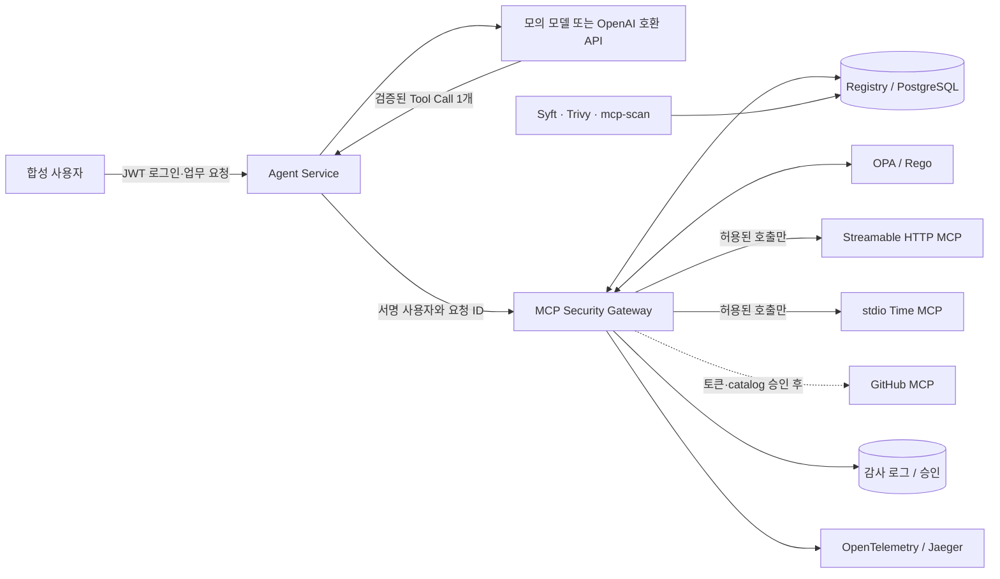

# MCP Security Gateway 전체 실습

멘토가 화면만 보고도 **로그인 → 업무 요청 → Tool Call 제안 → 정책 판단 → MCP 실행 → 증적**을 따라갈 수 있도록 만든 WSL2 + Docker Compose 실습입니다. 팀원의 Agent Service UI를 기존 보안 Gateway에 합쳤고, 기본 실행은 실제 LLM·실제 개인정보·실제 GitHub 자격증명을 쓰지 않습니다. 합성 사용자와 결정론적 모의 모델로 Tool Call을 만들고, Gateway가 서명된 사용자·입력 Schema·Registry 계약·공급망 증적·OPA/Rego 정책을 검사한 뒤에만 upstream MCP를 호출합니다.

> 가장 빠른 시작: `./demo.sh` → 업무 공간 <http://localhost:8000> → 증적 Dashboard <http://localhost:8080>

## 1. 무엇을 확인하는 실습인가

이 실습의 핵심 질문은 “정책 응답이 Allow였는가?”에서 끝나지 않습니다.

1. 요청자의 역할과 실제 문서 등급으로 333 `rwx` 권한을 계산했는가?
2. 등록한 MCP 서버·도구·설명·입력 스키마·버전과 현재 catalog가 정확히 같은가?
3. 서버 출처에 연결된 치명적 공급망 이슈가 없는가?
4. `Allow / Alert / Approval / Restrict / Block` 중 어느 통제가 적용됐는가?
5. 차단된 호출은 upstream의 독립 효과 로그를 실제로 증가시키지 않았는가?



MCP 서버는 Docker 내부망에 있고 호스트에는 Agent Service(`127.0.0.1:8000`), Gateway(`127.0.0.1:8080`), Jaeger UI(`127.0.0.1:16686`)만 공개됩니다. 따라서 이 Compose 실습 안에서는 합성 문서 MCP를 직접 호출하지 않고 Gateway 강제 경로를 사용합니다.

## 2. WSL에서 원클릭 실행

요구 사항은 WSL2, Docker Engine(또는 Docker Desktop WSL 통합), Docker Compose v2, `curl`, Python 3입니다.

```bash
wsl -d kali-linux
cd ~/mcp-gateway/full_stack_lab
./demo.sh
```

스크립트가 이미지를 빌드하고 서비스 준비까지 기다립니다. 다음 주소를 엽니다.

- 업무 공간: <http://localhost:8000>
- 거버넌스 Dashboard: <http://localhost:8080>
- Jaeger: <http://localhost:16686>

첫 실행 때 `demo.sh`가 커밋하지 않는 `.env`에 합성 JWT용 Ed25519 키쌍을 생성합니다. 별도 복사·설정 단계는 없습니다. 키는 gateway 이미지 안에서 만들기 때문에 host에는 추가 의존성이 필요 없습니다.

| 값 | 받는 서비스 | 이유 |
| --- | --- | --- |
| `AGENT_JWT_PRIVATE_KEY` | `agent-service` | 합성 신원의 유일한 발급자 |
| `AGENT_JWT_PUBLIC_KEY` | `gateway`, `gateway-sse`, `agent-service` | 검증만 가능. 검증자는 토큰을 만들 수 없음 |

대칭키를 공유하면 검증자도 발급자가 되므로 Gateway가 스스로 admin 세션을 위조할 수 있습니다. "Agent 인증과 Gateway는 별도 신뢰 경계"라는 주장이 코드가 아니라 **키 자체로** 참이 되게 하는 것이 이 분리의 목적입니다.

상태만 다시 확인하려면 다음을 실행합니다.

```bash
./demo.sh status
```

초기화가 필요하면 아래 명령을 사용합니다. 이 실습의 Compose 볼륨과 `reports/` 생성물만 지웁니다.

```bash
./demo.sh reset
```

## 3. 화면에서 5분 실습

### 3.1 합성 사용자로 요청하기

업무 공간 <http://localhost:8000>에서 다음 합성 계정 중 하나를 고릅니다. 공통 비밀번호는 `test-password`이며 `.env`의 `MOCK_SSO_PASSWORD`로 바꿀 수 있습니다.

| 화면의 역할 | 이메일 | 333 역할 | 대표 관찰 |
| --- | --- | --- | --- |
| 고객 | `customer@bob.local` | `customer` | 공개 읽기는 Allow, 중요 읽기는 Block |
| 직원 | `miso@bob.local` | `employee` | 중요 읽기는 Alert, 비중요 쓰기는 Allow |
| 관리자 | `admin@bob.local` | `admin` | 공개 외부 전송은 Restrict, 중요 외부 전송은 Approval |

로그인 뒤 빠른 시나리오 버튼을 한 번씩 실행합니다.

| 빠른 시나리오 | 사용할 계정 | 예상 판정 | upstream 효과 | 관찰할 통제 |
| --- | --- | --- | --- | --- |
| 공개 문서 읽기 | 고객 | `Allow` | 1 증가 | 일반적인 최소권한 허용 |
| 중요 문서 읽기 | 고객 | `Block` | 0 | 권한 없는 호출의 실행 전 차단 |
| 중요 문서 열람 | 직원 | `Alert` | 1 증가 | 업무상 허용하되 추적 강화 |
| 내부 메모 수정 | 직원 | `Allow` | 1 증가 | 비중요 자료 쓰기 권한 |
| 공개 자료 외부 전송 | 관리자 | `Restrict` | 1 증가 | 목적지를 `mentor-demo.invalid`, 본문을 80자로 강제 |
| 중요 자료 외부 전송 | 관리자 | `Approval` | 승인 전 0 | 10분 승인, 요청 지문 확인, 정책 재평가 후 실행 |

결과에서 `request_id`, `session_id`, `tool_call_id`, 정책 ID, 판단 이유, Trace ID와 실제 upstream 실행 여부를 확인합니다. 같은 `request_id`나 `tool_call_id`가 다시 들어오면 저장된 응답을 반환하여 중복 실행을 막습니다. 관리자로 로그인했을 때만 승인 대기 목록과 승인 버튼이 보입니다.

### 3.2 거버넌스 증적 확인하기

거버넌스 Dashboard <http://localhost:8080>에서 방금 실행한 요청을 다시 찾습니다. 판정 시뮬레이터로 호출을 만들려면 화면에서 합성 계정과 비밀번호(`.env`의 `MOCK_SSO_PASSWORD`, 기본 `test-password`)를 입력합니다. Dashboard도 다른 client와 똑같이 서명된 토큰으로만 Gateway API를 호출합니다.

- `Agent Service 연결`: 모의 모델/API 모드, 인증 경계, 최근 Agent 실행
- `333 정책`: 27개 조합과 기본 DENY
- `Registry + Supply Chain`: 서버 출처·고정 ref·transport·catalog 상태·스캔 결과
- `감사`: 최근 판정, 승인 대기, 효과 개수, Trace ID
- `정확한 해석`: 현재 PoC가 증명하는 범위와 아직 증명하지 않는 범위

두 화면의 같은 요청 ID·세션 ID·Trace ID를 따라가면 “Agent가 무엇을 제안했고, Gateway가 왜 판정했으며, upstream 효과가 실제로 생겼는지”를 분리해서 설명할 수 있습니다. 모든 계정과 문서는 합성 데이터입니다.

## 3.3 관찰 모드로 먼저 재보기

조직에 처음 붙일 때 첫날부터 차단을 켜는 곳은 없습니다. **"우리한테 붙이면 뭐가 막히나"**를 숫자로 보여주지 못하면 도입 논의가 진도가 나가지 않습니다.

Gateway는 두 단계로 동작합니다.

| 모드 | 권한 판정(333, 승인, 제한) | 무결성 판정(Registry, catalog, 공급망, 정책엔진 장애) |
| --- | --- | --- |
| `enforce` (기본) | 그대로 집행 | 그대로 집행 |
| `monitor` | **기록만 하고 실행** | **그대로 집행** |

관찰 모드에서도 무결성 통제는 절대 풀리지 않습니다. 드리프트가 감지된 catalog나 치명적 공급망 이슈가 있는 서버를 "관찰 중이니까" 호출하는 것은 관찰이 아니라 사고입니다. 관찰 대상은 **권한 모델에 대한 의견**뿐입니다.

전환은 관리자만 할 수 있고, 재시작이 필요 없으며, 전환 자체가 기록됩니다.

```bash
curl -sS -X PUT http://localhost:8080/api/enforcement   -H "authorization: Bearer $GW_TOKEN"   -H 'content-type: application/json'   -d '{"mode":"monitor"}'
```

관찰 모드에서 원래 막혔을 호출은 `decision: Allow`, `policy_id: P-MONITOR-001`로 실행되고, `would_decision`과 `would_policy_id`에 **집행 모드였다면 어떻게 됐을지**가 함께 남습니다.

```bash
curl -sS 'http://localhost:8080/api/monitor/summary?hours=168' | python3 -m json.tool
```

```json
{"enforcement": "monitor", "would_have_stopped": 37, "affected_principals": 3,
 "breakdown": [{"would_decision": "Block", "would_policy_id": "P-333-DENY-001",
                "role": "customer", "tool_name": "read_document", "calls": 21}]}
```

Dashboard의 **집행 단계** 패널에 같은 숫자와 정책별 내역이 나오고, 거기서 바로 전환할 수 있습니다. 도입 순서는 `monitor`로 한 주 측정 → 내역 검토 → 예외 정리 → `enforce`입니다.

## 4. 확정한 333 Rego 정책

`x`는 **외부 전송 또는 고위험 실행**입니다. 표에 없는 권한은 기본 차단입니다.

| 역할 | public | nonimportant | important |
| --- | --- | --- | --- |
| customer | `r` | `-` | `-` |
| employee | `r` | `rw` | `r` |
| admin | `rwx` | `rwx` | `rwx` |

권한이 있다는 사실만으로 항상 단순 Allow가 되지는 않습니다.

| 결과 | 의미 | 대표 정책 ID |
| --- | --- | --- |
| `Allow` | 계약과 권한을 충족하여 그대로 실행 | `P-333-ALLOW-001` |
| `Alert` | 실행하되 중요 열람 증적을 강조 | `P-IMPORTANT-ALERT-001` |
| `Approval` | 중요정보 `x`를 보류하고 10분 내 승인 요구 | `P-X-APPROVAL-001` |
| `Restrict` | 비중요 `x`의 목적지와 길이를 축소한 뒤 실행 | `P-X-RESTRICT-001` |
| `Block` | 권한·Registry·catalog·공급망·OPA 가용성 문제로 미실행 | `P-333-DENY-001` 등 |

단건으로 보면 정상인 호출도 쌓이면 다른 이야기가 됩니다. Gateway는 감사 테이블에서 두 신호를 세어 정책 입력으로 넘깁니다. 세는 일은 Gateway가, 판단은 정책이 합니다.

| 신호 | 기본 임계값 | 결과 |
| --- | --- | --- |
| 최근 호출 수 (`RATE_LIMIT_CALLS` / `RATE_LIMIT_WINDOW_SECONDS`) | 60초에 60건 | `P-RATE-001` 차단 |
| 최근 중요정보 접근 수 (`IMPORTANT_BURST_LIMIT` / `IMPORTANT_BURST_MINUTES`) | 5분에 10건 | `P-VOLUME-001` 승인 필요로 승격 |

"중요문서 20건을 1분에 읽기"는 333 권한표만 보면 전부 통과하지만 실제 내부자 유출은 정확히 그 모양입니다. 차단된 호출도 수에 포함됩니다. 거부된 호출이 몰리는 것도 몰리는 것입니다.

호출 수는 프로세스 메모리가 아니라 감사 테이블에서 세므로 Gateway 복제본이 늘어도 상한이 유지됩니다. `P-RATE-001`은 관찰 모드에서도 집행합니다. 호출량 상한은 "누가 무엇을 읽어도 되는가"에 대한 의견이 아니라 Gateway와 upstream을 보호하는 장치이고, 관찰하는 동안 상한이 없어지면 안 됩니다.

합성 로그인은 `LOGIN_ATTEMPT_LIMIT` 회를 넘으면 `429`입니다. 존재하지 않는 주소도 같이 제한합니다. 그러지 않으면 제한 자체가 "이 주소는 있다"를 알려줍니다.

정책 원본은 [`opa/policy.rego`](opa/policy.rego), 단위 테스트는 [`opa/policy_test.rego`](opa/policy_test.rego)입니다. 사용자 입력이 주장하는 등급을 믿지 않고 `document_id`에 연결된 PostgreSQL 분류를 사용합니다.

## 5. curl로 직접 확인

브라우저 없이도 `합성 로그인 → Agent → Gateway → OPA → MCP` 전체 경로를 호출할 수 있습니다.

```bash
TOKEN="$(curl -sS http://localhost:8000/auth/mock-login \
  -H 'content-type: application/json' \
  -d '{"email":"miso@bob.local","password":"test-password"}' \
  | python3 -c 'import json,sys; print(json.load(sys.stdin)["access_token"])')"

curl -sS http://localhost:8000/chat \
  -H "authorization: Bearer $TOKEN" \
  -H 'content-type: application/json' \
  -d '{"message":"중요 계약 초안을 읽어줘"}' \
  | python3 -m json.tool
```

`Alert`, `upstream_executed: true`, 서로 연결된 요청·세션·Tool Call ID가 나오면 전체 경로가 동작한 것입니다. 토큰은 30분짜리 합성 JWT이며 모델이 만드는 Tool Call에는 사용자 역할이나 Gateway용 토큰을 넣을 수 없습니다.

Gateway의 짧은 모의 모델 API도 같은 방식으로 비교할 수 있습니다. 이 경로는 로그인 UI가 아니라 정책 동작만 빠르게 시연하기 위한 기존 호환 API이며, **요청자는 서명된 토큰에서만 옵니다.** 본문에 역할이나 principal을 적어 넣을 수 있는 자리는 없습니다.

```bash
GW_TOKEN="$(curl -sS http://localhost:8080/api/session \
  -H 'content-type: application/json' \
  -d '{"email":"customer@bob.local","password":"test-password"}' \
  | python3 -c 'import json,sys; print(json.load(sys.stdin)["access_token"])')"

curl -sS http://localhost:8080/api/calls \
  -H "authorization: Bearer $GW_TOKEN" \
  -H 'content-type: application/json' \
  -d '{"tool_name":"read_document","document_id":"secret-001"}' \
  | python3 -m json.tool
```

결과는 `Block`, `P-333-DENY-001`, `upstream_executed: false`, 동일한 `effect_before/effect_after`가 되어야 합니다.

토큰 없이, 또는 위조한 토큰으로 같은 호출을 보내면 정책 판정까지 가지 않고 `401`입니다.

```bash
curl -sS -o /dev/null -w '%{http_code}\n' http://localhost:8080/api/calls \
  -H 'content-type: application/json' \
  -d '{"tool_name":"read_document","document_id":"notice-001"}'
```

## 6. 실제 모델 API를 연결할 준비

기본값 `MODEL_MODE=mock`은 외부 호출 없이 결정론적으로 동작합니다. OpenAI 호환 `/chat/completions` endpoint를 사용할 준비가 되면 `full_stack_lab/.env`에 다음 네 값을 추가하고 `./demo.sh`를 다시 실행합니다.

```dotenv
MODEL_MODE=provider
MODEL_BASE_URL=https://provider.example/v1
MODEL_API_KEY=replace-me
MODEL_NAME=replace-me
```

```bash
./demo.sh
curl -sS http://localhost:8000/api/readiness | python3 -m json.tool
```

외부 endpoint는 HTTPS만 허용합니다. 로컬 호환 서버만 `localhost`, `127.0.0.1`, `host.docker.internal`, Compose의 `model-stub`에 HTTP로 연결할 수 있습니다. Agent는 사용자 요청에서 이메일·휴대전화·일반적인 API 키 패턴을 치환하고, 응답은 128 KB·Tool Call 1개·등록된 서버/도구·JSON Schema로 제한합니다. 모델 결과를 신뢰해 권한을 부여하지 않으며, 도구 실행 결과도 모델에 재전송하지 않습니다.

현재 자동 시험은 실제 LLM이 아닌 로컬 HTTP wire stub으로 정상·차단·잘못된 Schema·알 수 없는 도구·복수 호출·401·429·500·timeout·과대 응답을 검증합니다. 따라서 API 형식과 실패 경계는 준비됐지만 특정 상용 모델의 실제 응답 정확도·비용·rate limit은 자격증명을 연결한 뒤 별도 시나리오 시험이 필요합니다.

## 7. 자동 완료 조건 검증

아래 한 줄이 빌드, Rego 단위 테스트, 정책/승인/효과 검증, 세 transport 실호출, catalog 변조와 OPA 장애 회귀 테스트를 실행합니다.

```bash
./demo.sh test
```

정상 기준은 다음과 같습니다.

- Rego 단위 테스트 `7/7 PASS`
- acceptance, Agent/API 경계 acceptance 모두 `0 failed`
- 익명·위조 토큰의 Gateway API 호출이 `401`, 고객 계정의 승인 시도가 `403`
- Streamable HTTP, stdio, legacy SSE에서 실제 `tools/call` 성공
- 토큰 없는 Streamable HTTP 호출과 신원이 바인딩되지 않은 stdio 호출이 각각 거부
- Gateway가 노출하는 도구 입력 스키마에 `user_token` 같은 신원 인자가 없음
- 설명·스키마·도구 목록·서버 버전 변조가 각각 `MCP-CATALOG-001`로 차단
- 서버에 귀속된 치명적 공급망 finding이 `MCP-SUPPLY-001`로 차단
- OPA 중단 시 `P-CONTROL-FAIL-CLOSED`로 차단
- 모든 차단 사례에서 독립 upstream 효과 수가 증가하지 않음
- 합성 upstream MCP에 host port가 없음

생성 결과는 `reports/acceptance.json`, `reports/agent-acceptance.json`, `reports/security-regression.txt`에 남고 Git에는 포함되지 않습니다.

같은 명령을 [`.github/workflows/verify.yml`](../.github/workflows/verify.yml)이 `main`과 모든 `feat/**` 푸시, `main`으로 가는 PR마다 실행합니다. 완료 조건은 사람이 기억할 때가 아니라 매 변경마다 확인됩니다. 실행 결과는 workflow artifact로 보관합니다.

## 8. transport 호환 범위

| 구간 | 방식 | 신원 출처 | 검증 방법 |
| --- | --- | --- | --- |
| Client → Gateway | Streamable HTTP | `Authorization` header의 서명된 합성 JWT | `/mcp/`에 실제 MCP SDK `initialize / tools/list / tools/call` |
| Client → Gateway | stdio | 프로세스 기동 시 고정한 `GATEWAY_STDIO_PRINCIPAL` | `python -m app.stdio_entry` subprocess에 실제 호출 |
| Client → Gateway | legacy SSE | `Authorization` header의 서명된 합성 JWT | 내부 `gateway-sse:8081/sse` compatibility adapter에 실제 호출 |
| Gateway → 문서 MCP | Streamable HTTP | — | 내부 `mock-http-mcp:9000/mcp/` |
| Gateway → Time MCP | stdio | — | 고정한 `mcp-server-time` subprocess |

SSE는 신규 기본값이 아니라 구형 client 호환성 시험용입니다. 세 ingress는 모두 같은 `execute_call()` 정책 경로를 사용하고, **모두 같은 신원 경계를 거칩니다.** 도구 인자에는 사용자나 역할을 넣을 자리가 없으므로 client는 자기 신원을 주장할 수 없습니다. stdio는 header가 없는 transport이므로 신원을 spawn 시점에 한 번 고정하고, 고정되지 않은 stdio ingress는 기본 principal로 넘어가지 않고 거부합니다.

## 9. Registry와 공급망 통제

### 런타임 계약

Gateway는 매 호출 직전에 `tools/list`를 다시 읽고 다음 승인 기준과 비교합니다.

- 승인된 서버와 도구인지, 활성 상태인지
- 도구 집합에 추가/누락이 없는지
- 설명 SHA-256, 입력 JSON Schema SHA-256, 서버 버전이 고정본과 같은지
- 설명에 정책 우회·비밀 요구 같은 위험 메타데이터가 없는지
- 서버 `source_ref`에 연결된 치명적 공급망 finding이 없는지

첫 관찰값을 자동 승인하는 TOFU는 사용하지 않습니다. 승인 해시는 [`db/init.sql`](db/init.sql)에 버전 관리합니다. catalog 변조 네 종류는 [`tests/drift_and_fail_closed.sh`](tests/drift_and_fail_closed.sh)가 자동 검증합니다.

### 오픈소스 스캐너

```bash
./demo.sh scan
```

이 명령은 다음 도구를 일회성 컨테이너로 실행하고 결과를 Dashboard에 가져옵니다.

| 도구 | 사용 범위 | 결과 |
| --- | --- | --- |
| Syft `v1.51.1` | 저장소 구성요소 inventory | CycloneDX `reports/sbom.cdx.json` |
| Trivy `0.74.0` | vuln, misconfig, secret, license | `reports/trivy.json` |
| AI-Infra-Guard `mcp-scan` | 선택적 MCP 전용 코드/동적 감사 | `reports/mcp-scan.sarif.json` |

Syft/Trivy는 현재 권장판인 `full_stack_lab/`을 스캔하고 결과를 우선 `workspace` 증적으로 보관합니다. 이전 단계의 교육용 Dockerfile은 현재 릴리스 수치에 섞지 않습니다. 특정 MCP 서버를 자동 차단하려면 검토 후 그 서버의 고정 `source_ref`에 귀속시켜야 합니다. 잘못된 전역 스캔 한 건이 모든 서버를 자동 격리하지 않게 한 경계입니다. 서버에 귀속된 `CRITICAL > 0`이 실제 호출을 막는지는 acceptance test가 별도 증명합니다.

AI-Infra-Guard는 요청대로 전체 플랫폼이 아니라 **`mcp-scan` CLI만**, 커밋 `036c39bd03b39ce4a811f7f125bc3b8f47e39b7c`에 고정해 별도 profile로 빌드합니다.

```bash
docker compose --profile mcp-scan build mcp-scan
docker run --rm mcp-governance-full-mcp-scan --help
```

`mcp-scan`의 실제 코드 감사 단계는 OpenAI 호환 LLM endpoint를 요구합니다. 현재 합의한 무-LLM 기본 모드에서는 `./demo.sh mcp-scan`이 키·URL·모델이 없으면 의도적으로 종료합니다. 나중에 로컬 모의 endpoint가 준비됐을 때만 아래처럼 실행합니다.

```bash
MCP_SCAN_API_KEY=dummy \
MCP_SCAN_BASE_URL=http://host.docker.internal:11434/v1 \
MCP_SCAN_MODEL=local-mock \
./demo.sh mcp-scan
```

This project integrates AI-Infra-Guard, open-sourced by Tencent Zhuque Lab. 참고: [AI-Infra-Guard mcp-scan](https://github.com/Tencent/AI-Infra-Guard/tree/main/mcp-scan), [Syft](https://github.com/anchore/syft), [Trivy](https://github.com/aquasecurity/trivy).

## 9.1 감사 로그 무결성

기업 미팅에서 반드시 나오는 질문은 "그 감사 로그가 위변조되지 않았다는 건 어떻게 압니까"입니다. `decisions`의 각 행은 **직전 행의 해시**를 함께 기록합니다. 행 하나를 고치거나 지우면 그 뒤의 모든 행을 다시 써야 하므로, 어디가 끊겼는지 행 번호로 드러납니다.

```bash
curl -sS http://localhost:8080/api/audit/verify   -H "authorization: Bearer $GW_TOKEN" | python3 -m json.tool
```

정상이면 `{"intact": true, "checked": N, "head": "..."}`입니다. 관리자 계정만 호출할 수 있습니다.

`decisions`에는 Gateway 계정의 `UPDATE`·`DELETE` 권한도 회수되어 있습니다. 소유자가 다시 부여할 수 있으므로 경계가 아니라 심층 방어이지만, "그냥 저 행만 고치자"는 평범한 편집을 막고 의도를 스키마에 남깁니다.

체인이 실제로 변조를 잡는지 보여주려면 superuser로 한 행을 고친 뒤 다시 확인합니다.

```bash
docker compose exec -T db psql -U mcp -d mcp_governance -c   "UPDATE decisions SET reason='조작된 사유' WHERE id=(SELECT max(id) FROM decisions)"
curl -sS http://localhost:8080/api/audit/verify -H "authorization: Bearer $GW_TOKEN" | python3 -m json.tool
```

`{"intact": false, "broken_at": <행 번호>, "reason": "항목 내용이 기록된 해시와 다릅니다."}`가 나옵니다. 이후 체인은 끊긴 상태로 남으므로 시연 뒤에는 `./demo.sh reset`으로 초기화하세요.

## 10. GitHub MCP 연결 절차

[GitHub MCP Server](https://github.com/github/github-mcp-server)는 Registry에 Streamable HTTP 읽기 도구 후보로 등록했습니다. Gateway의 `github_get_file`은 공식 remote endpoint에 Bearer token을 보내고 `X-MCP-Readonly: true`, `X-MCP-Tools: get_file_contents`로 노출 범위를 줄입니다. 저장소도 `GITHUB_ALLOWED_REPOS` 목록으로 한 번 더 제한합니다.

현재는 인증을 나중에 하기로 했으므로 서버와 도구가 `DISABLED`이며 호출하면 `MCP-REGISTRY-002`로 차단됩니다. 토큰을 넣어도 자동 승인하지 않습니다. 자격증명이 준비되면 다음 순서를 그대로 실행합니다.

1. `full_stack_lab/.env`에 최소 권한 토큰과 허용 저장소를 넣습니다. `.env`는 Git에서 제외됩니다.

   ```dotenv
   GITHUB_PERSONAL_ACCESS_TOKEN=replace-me
   GITHUB_ALLOWED_REPOS=MCP-governance/mcp-gateway
   ```

2. 컨테이너에 새 환경값을 적용하고, 제한된 remote catalog를 관찰 파일로 저장합니다.

   ```bash
   ./demo.sh
   docker compose exec -T gateway python -m app.github_setup observe \
     > reports/github-reviewed.json
   python3 -m json.tool reports/github-reviewed.json
   ```

3. 운영자가 endpoint·서버 버전·도구 이름이 정확히 `get_file_contents` 하나인지, 설명과 입력 Schema에 과도한 권한이나 정책 우회 문구가 없는지 검토합니다. 검토 중 remote catalog가 바뀌면 다음 단계가 실패합니다.

4. 같은 catalog인지 다시 확인하면서 승인하고 실제 읽기 시나리오를 실행합니다.

   ```bash
   docker compose exec -T gateway python -m app.github_setup \
     activate-reviewed /reports/github-reviewed.json

   curl -sS http://localhost:8080/api/calls \
     -H "authorization: Bearer $GW_TOKEN" \
     -H 'content-type: application/json' \
     -d '{"tool_name":"github_get_file","owner":"MCP-governance","repo":"mcp-gateway","path":"README.md"}' \
     | python3 -m json.tool
   ```

정상 결과는 `Allow`와 파일 내용이며, 허용 목록 밖 저장소는 `MCP-REPOSITORY-001`, catalog 변경은 `MCP-CATALOG-001`, 인증·통신 실패는 `MCP-UPSTREAM-001`입니다. 마지막 경우 remote가 요청을 받았을 수 있으므로 자동 재시도하지 않고 GitHub 감사 증적을 함께 확인해야 합니다. 이 절차의 remote catalog 관찰과 실제 GitHub 호출은 토큰이 없는 현재 상태에서는 실행하지 않았습니다.

## 11. 구성요소와 파일 안내

| 경로 | 역할 |
| --- | --- |
| `compose.yaml` | 네트워크·서비스·scanner profile |
| `demo.sh` | `up/test/scan/mcp-scan/status/logs/down/reset` 단일 진입점 |
| `gateway/app/core.py` | 계약 확인, Rego 질의, 승인, upstream 실행, 증적 |
| `gateway/app/agent_service.py` | 합성 로그인, 세션, 요청 멱등성, 모델 제안 경로 |
| `gateway/app/agent_gateway.py` | 서명 사용자와 Tool Call envelope를 기존 정책 경로에 연결 |
| `gateway/app/agent_contract.py` | Ed25519 JWT·서버/도구 조합·공유 JSON Schema 경계 |
| `gateway/app/keygen.py` | 이미지 안에서 Ed25519 키쌍 생성 (host에 crypto 의존성 없음) |
| `gateway/app/model_client.py` | 결정론적 모의 모델과 제한된 OpenAI 호환 client |
| `gateway/app/github_setup.py` | GitHub remote catalog 관찰·명시 승인 |
| `gateway/app/agent_static/` | 합성 사용자 로그인·업무 공간 UI |
| `gateway/app/mcp_facade.py` | 공통 정책 경로를 노출하는 MCP facade |
| `gateway/app/db.py` | 프로세스당 하나인 PostgreSQL 커넥션 풀 |
| `gateway/ui/` | 멘토용 React Dashboard |
| `mock_server/server.py` | 실제 SDK 기반 합성 문서 MCP와 catalog 변조 모드 |
| `opa/` | 333 Rego 정책과 단위 테스트 |
| `db/init.sql` | 합성 사용자·Registry·감사/승인/공급망 schema |
| `tests/` | acceptance 외 보안 회귀 검사 |
| `supply_chain/` | 고정 커밋의 선택적 mcp-scan 이미지 |

Python과 프런트엔드 의존성은 버전을 고정하고 UI는 lockfile로 재현합니다. `mcp-server-time`은 구형 MCP SDK 의존성을 요구하므로 Gateway의 최신 SDK 환경과 별도 venv로 격리했습니다.

Agent 로그인·업무 공간·chat 흐름은 팀원 저장소 [`MCP-governance/Agent-Service`의 `miso` 브랜치, commit `81177a4`](https://github.com/MCP-governance/Agent-Service/tree/81177a41d917a2c1382485cc8f5ae115637aff89)에서 가져와 이 Gateway의 단일 정책 경로에 맞게 확장했습니다. 팀원 구현의 `read_file` 요청은 승인된 합성 경로만 `read_document`로 변환합니다. 별도로 있던 Gateway·OPA·mock 서버는 정책 원본이 둘로 갈라지는 것을 피하려고 중복 이식하지 않았습니다.

## 12. 여기서 발견해야 할 의의

- **LLM은 집행자가 아니다.** 모의 모델은 Tool Call만 제안하고, 결정론적 정책과 계약 검증이 실행 권한을 정합니다.
- **단건 판정만으로는 유출을 못 본다.** 권한이 있는 열람 20건은 20번의 Allow입니다. 누적을 정책 입력으로 넘겨야 그 20건이 하나의 사건으로 보입니다.
- **집행은 스위치가 아니라 단계다.** 통제를 켜는 비용을 모르면 아무도 켜지 않습니다. 관찰 모드는 권한 판정을 기록만 하고 실행해 영향 범위를 먼저 숫자로 만들고, 무결성 판정은 그 동안에도 집행합니다.
- **정책 응답과 실제 효과는 다른 증적이다.** Gateway DB의 판정과 upstream JSONL 효과를 함께 봐야 “차단 전에 멈췄다”를 주장할 수 있습니다.
- **권한표만으로 공급망 문제를 막을 수 없다.** 허용된 `read_document`라도 설명·스키마·버전·도구 목록이 바뀌거나 서버 귀속 치명점이 생기면 차단됩니다.
- **승인은 단순 버튼이 아니다.** 원 요청 지문, 만료, 관리자 역할을 확인하고 현재 정책으로 재평가한 뒤 한 번 실행합니다.
- **transport가 달라도 통제점은 하나여야 한다.** Streamable HTTP, stdio, legacy SSE 모두 같은 정책 함수로 모입니다.
- **통제점의 신원은 호출자가 정할 수 없다.** 정책 함수가 하나여도 principal을 도구 인자나 요청 본문에서 받으면 통제가 아니라 요청서입니다. 신원은 transport 인증에서만 오고, 없으면 기본값으로 떨어지지 않고 거부합니다.
- **입력만 보는 통제는 절반이다.** 설명과 스키마를 고정해도 서버가 런타임에 무엇을 돌려주는지는 말해주지 않습니다. Gateway는 결과의 크기와 정책 우회 지시 패턴도 검사하고, 걸리면 `MCP-OUTPUT-001`로 결과를 반환하지 않습니다. 이때 호출 자체는 이미 실행됐으므로 `upstream_executed`는 참으로 남깁니다. 판정과 효과를 일치시키는 것보다 증적을 정직하게 두는 쪽이 중요합니다.
- **감사는 위변조 가능하면 증적이 아니다.** 각 판정은 직전 판정의 해시를 안고 기록되고, Gateway 계정은 `decisions`를 수정할 수 없습니다. "우리 로그는 정확합니다"가 아니라 "몇 번 행에서 끊겼습니다"로 답할 수 있어야 합니다.
- **감사는 사본 보관소가 아니다.** `decisions`에는 문서 본문 대신 해시와 길이, 결과의 앞부분만 남깁니다. 감사 테이블이 조직에서 가장 큰 민감정보 더미가 되면 통제가 아니라 위험입니다.
- **Agent 인증과 모델 제안은 별도 신뢰 경계다.** 모델이 사용자·역할·승인을 주장할 수 없고, 서명된 합성 사용자와 서버가 만든 context만 Gateway가 사용합니다.
- **API 실패는 재시도 정책까지 포함해 다뤄야 한다.** timeout이나 연결 단절 뒤에는 upstream 실행 여부가 불확실할 수 있어 요청·Tool Call ID와 receipt를 먼저 확인합니다.
- **Gateway는 경로 통제와 함께 설계해야 한다.** 이 Compose는 upstream port를 숨기지만 조직 전체의 로컬 프로세스·별도 네트워크까지 막는 것은 아닙니다.

## 13. 의도적으로 남긴 경계

- 실제 사용자 SSO/OIDC, RBAC 관리 화면, 실제 GitHub 토큰 위임은 미구현입니다. 합성 JWT는 Ed25519로 서명하고 발급자(Agent Service)만 개인키를 갖지만, 키 회전·폐기 절차와 JWKS 배포는 아직 없습니다.
- Dashboard의 읽기 API(`/api/state`, `/api/effects`, `/api/policy/matrix`)는 인증 없이 열려 있습니다. 상태를 바꾸는 API는 모두 서명된 토큰을 요구하지만, 증적 조회는 `127.0.0.1` 바인딩에만 의존합니다.
- Gateway API에는 호출량 제한이나 사용자별 쿼터가 없습니다. Agent Service의 동시 실행 제한은 프로세스 단위라 복제본이 늘면 함께 늘어납니다.
- 실제 상용 LLM API는 호출하지 않았습니다. 기본 자연어 변환은 데모용 키워드 규칙이고, OpenAI 호환 HTTP 경계는 로컬 stub으로만 검증했습니다.
- GitHub MCP는 인증·catalog 승인 전이라 실제 upstream 호출을 하지 않습니다.
- GitHub catalog 승인은 현재 데모 DB 상태입니다. 운영 반영 전에는 검토 파일의 해시를 코드 리뷰와 정책 버전에 남겨야 합니다.
- image tag는 버전 고정이지만 digest/서명 검증과 admission controller까지는 포함하지 않았습니다.
- 공급망 스캔 결과는 `source_ref='workspace'`로 저장되므로, 서버에 귀속시키기 전에는 실제 호출을 막지 않습니다. 차단으로 이어지는 경로는 acceptance test가 fixture로만 증명합니다.
- 운영용 HA, TLS 종료, 비밀관리, SIEM 알림, 조직 전체 egress 강제는 별도 운영 설계가 필요합니다.
- Dashboard의 승인자는 합성 관리자이며 실인증 승인이 아닙니다.

이 경계 안에서 완료 조건은 자동화되어 있습니다. 기능을 더 붙이기 전에 `./demo.sh test`의 정책·효과·변조·장애 검증을 계속 통과시키는 것이 다음 확장의 기준선입니다.
