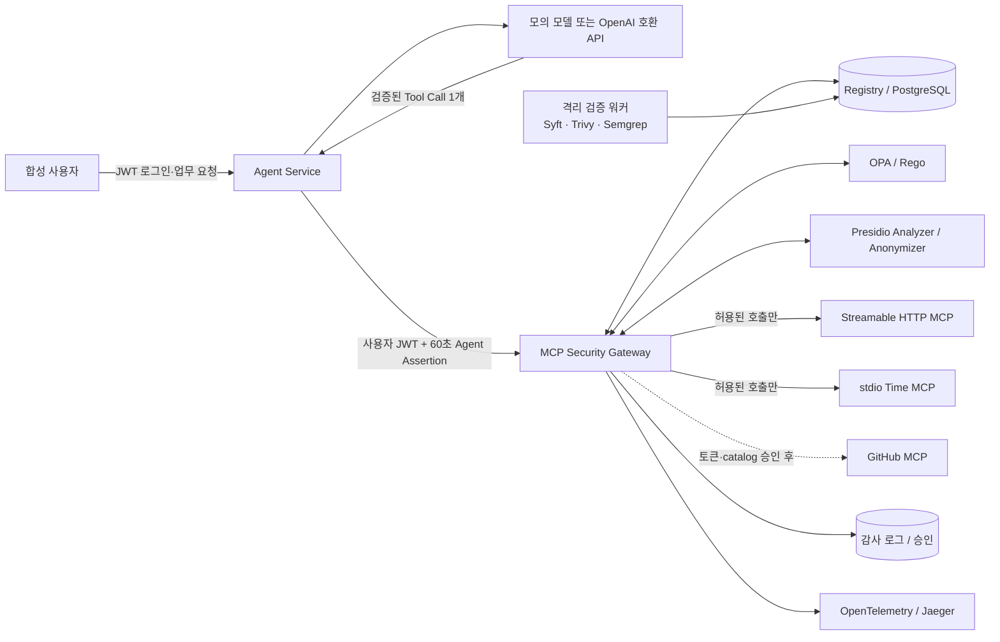

# MCP Governance Console

MCP 도입 요청, 공급망 검증, 정책 집행, 실행·감사 증적을 하나의 운영 콘솔에서 관리하는 WSL2 + Docker Compose 구성입니다. 기본 실행은 외부 LLM·실제 개인정보·GitHub 자격증명을 사용하지 않습니다. Agent가 Tool Call 후보를 만들면 Gateway가 서명된 사용자·입력 Schema·Registry 계약·공급망 증적·OPA/Rego 정책을 검사한 뒤에만 upstream MCP를 호출합니다.

**2026-09 PDF 반영:** Presidio 입력·출력 검사, 외부 수신처·동일 세션 연쇄 정책, 감사 체인 v5, 동결 사례/후보 정책 재생과 클린 재설치 안내는 [전용 기록](../docs/PDF-INTEGRATION-2026-09.md)에 있습니다. `./console.sh replay 100`은 MCP를 실행하지 않고 후보 OPA만 비교합니다.

> 가장 빠른 시작: `./console.sh` → <http://localhost:8000>

## 1. 어떤 통제를 제공하는가

이 실습의 핵심 질문은 “정책 응답이 Allow였는가?”에서 끝나지 않습니다.

1. 요청자의 역할과 실제 문서 등급으로 333 `rwx` 권한을 계산했는가?
2. 등록한 MCP 서버·도구·설명·입력 스키마·버전과 현재 catalog가 정확히 같은가?
3. 서버 출처에 연결된 치명적 공급망 이슈가 없는가?
4. `Allow / Alert / Approval / Restrict / Block` 중 어느 통제가 적용됐는가?
5. 차단된 호출은 upstream의 독립 효과 로그를 실제로 증가시키지 않았는가?



MCP 서버는 Docker 내부망에 있고 호스트에는 Agent Service(`127.0.0.1:8000`), Gateway API(`127.0.0.1:8080`), Jaeger UI(`127.0.0.1:16686`)만 게시됩니다. 기업 실습을 켜면 A.I.G UI(`127.0.0.1:8088`)도 게시됩니다. 브라우저 UI는 `8000` Console 하나이며, `8080/`에 접속하면 Console로 이동합니다. 이 Compose 구성에서는 합성 문서 MCP를 직접 호출하지 않고 Gateway 강제 경로를 사용합니다. 새 복제본은 고유한 Compose 프로젝트와 볼륨을 사용하므로 다른 랩의 DB를 덮어쓰지 않습니다.

## 2. WSL에서 원클릭 실행

요구 사항은 WSL2, Docker Engine(또는 Docker Desktop WSL 통합), Docker Compose v2, `curl`, Python 3입니다.

```bash
wsl -d kali-linux
cd ~/mcp-gateway/full_stack_lab
./console.sh
```

스크립트가 이미지를 빌드하고 서비스 준비까지 기다립니다. 다음 주소를 엽니다.

- MCP Governance Console: <http://localhost:8000>
- Jaeger: <http://localhost:16686>

첫 실행 때 `console.sh`가 커밋하지 않는 `.env`에 합성 JWT용 Ed25519 키쌍을 생성합니다. 별도 복사·설정 단계는 없습니다. 키는 gateway 이미지 안에서 만들기 때문에 host에는 추가 의존성이 필요 없습니다.

`all predefined address pools have been fully subnetted` 오류가 나면 사용을 마친 복제본의 `full_stack_lab`에서 `./console.sh down`으로 **그 복제본의** 컨테이너와 네트워크만 내린 뒤 다시 시작하세요. DB 볼륨은 유지되며, `down`은 새 키나 네트워크를 만들지 않습니다. 여러 복제본을 동시에 실행해야 한다면 [Docker 주소 풀 설정](https://docs.docker.com/engine/network/#automatic-subnet-allocation)을 호스트에 맞게 조정하세요.

| 값 | 받는 서비스 | 이유 |
| --- | --- | --- |
| `AGENT_JWT_PRIVATE_KEY` | `agent-service` | 합성 사용자 JWT와 60초 Agent Assertion의 유일한 발급자 |
| `AGENT_JWT_PUBLIC_KEY` | `gateway`, `gateway-sse`, `agent-service` | 검증만 가능. 검증자는 토큰을 만들 수 없음 |

대칭키를 공유하면 검증자도 발급자가 되므로 Gateway가 스스로 admin 세션을 위조할 수 있습니다. "Agent 인증과 Gateway는 별도 신뢰 경계"라는 주장이 코드가 아니라 **키 자체로** 참이 되게 하는 것이 이 분리의 목적입니다.

`/tool-call`에는 사용자 JWT 외에 `X-Agent-Assertion`도 필요합니다. Agent Service가 `agent:document-agent-test`, 사용자 actor, `mcp:tools/call`, 그리고 정확한 Tool Call envelope의 SHA-256을 다른 audience로 60초 동안 서명합니다. 따라서 사용자 JWT만으로는 이 내부 호출을 만들 수 없고, 다른 actor·agent·envelope에 쓴 assertion도 Gateway에서 `401`입니다. 같은 `tool_call_id`의 안전한 재시도만 기존 receipt가 처리합니다.

상태만 다시 확인하려면 다음을 실행합니다.

```bash
./console.sh status
```

초기화가 필요하면 아래 명령을 사용합니다. 이 실습의 Compose 볼륨과 `reports/` 생성물만 지웁니다.

```bash
./console.sh reset
```

### 2.1 기업 내부망 + Tencent A.I.G 시나리오

초기화 직후에는 아래 명령 하나로 Gateway, OPA, 격리 공급망 워커를 올립니다. Tencent Zhuque Lab의 원본 A.I.G Web·Agent·API Checker는 별도 컨테이너가 아니라 **Gateway 컨테이너 안**에서 실행합니다.

```bash
./console.sh corporate-lab
```

이 오버레이는 다음 경계를 만듭니다.

```text
host loopback ── Console :8000 / Gateway 컨테이너 :8080, A.I.G UI :8088
                                      │
               Gateway API + A.I.G Web·Agent·API Checker
                                      │
          edge · policy · tools · data · telemetry · scanner
                                      │
                aig-targets (internal) ─ 검사 대상 MCP
격리 공급망 워커 ─ scanner / aig-targets (A.I.G mcp-scan CLI)
```

통합 이미지에는 원본 A.I.G Agent의 Chromium 점검을 위해 `SYS_ADMIN`과 `seccomp:unconfined`가 적용됩니다. Gateway API 프로세스는 비특권 사용자로 실행하지만 같은 컨테이너와 네트워크를 공유하므로 기존의 Gateway–A.I.G 컨테이너 격리는 사라집니다. 로컬 실습 전용이며 운영 배포에는 적합하지 않습니다. 이전 A.I.G Web/Agent 컨테이너만 자동 제거하고 이름 있는 A.I.G 데이터 볼륨은 유지합니다.

처음에는 실제 GitHub MCP 저장소 요청을 직원 계정으로 격리 검증 대기열에 넣습니다. 이어서 공식 GHSA 근거가 있는 `@modelcontextprotocol/server-filesystem@0.6.2`을 **메타데이터 전용** controlled exception으로 기록하고 Trivy를 실행합니다. 취약 패키지는 설치하거나 실행하지 않습니다. A.I.G의 mcp-scan 큐와 native JSON/SARIF 결과 경로는 기존 공용 `llm-stub` test double로 검증하며, 결과에는 반드시 `evidence_mode: test-double`이 남습니다. 이 결과는 Gateway 차단 근거가 아닙니다. 차단은 별도로 기록한 공식 advisory와 관리자의 containment 조치로 일어나며, 그 뒤 실제 upstream 효과가 0인지 확인합니다.

시나리오 시작 시 `aig-network-probe`가 현재 Compose가 할당한 **모든 컨테이너 IP**의 허용 포트만 TCP connect로 자산화합니다. Docker CIDR의 비할당 주소, 호스트, 외부망은 범위 밖이며 probe는 HTTP/MCP payload를 보내지 않습니다. 발견된 `9000/tcp` MCP 엔드포인트가 있어야 다음 A.I.G 동적 검사가 진행됩니다.

차단 뒤 Catalog 재확인은 대상에 다시 연결하거나 `READY`로 되돌리지 않으며, 마지막으로 대상 MCP 컨테이너만 제거하고 Gateway의 종료 케이스에서 회수 대상·증거·도달 불가를 확인해 T1로 종결합니다. 생성된 요약은 `reports/corporate-lab-summary.json`입니다. A.I.G 원본 UI의 ClawScan, Agent Scan, AI 인프라 CVE, MCP/Skill scan, Jailbreak 등 모델 의존 기능은 <http://localhost:8088>에서 내부 모델 endpoint를 등록해 사용할 수 있습니다. test double은 배선 검증일 뿐 실제 모델 보안 판단이 아닙니다.

실습 환경과 A.I.G 데이터를 함께 내리려면 다음을 사용합니다.

```bash
./console.sh lab-down
```

세부 후보·증적 구분·제약은 [lab/README.md](lab/README.md)에 기록합니다.

### 2.2 내부망 로컬 모델

```bash
./console.sh local-llm
```

첫 실행은 다운로드 전용 일회성 컨테이너가 Ollama 모델(`qwen2.5:0.5b` 기본값)을 받습니다. 상시 실행되는 Ollama는 인터넷 경로와 호스트 포트가 없는 내부 `model` 망에만 붙습니다. Agent Service의 도구 제안, A.I.G Web·Agent·API Checker, 격리 워커의 mcp-scan이 같은 로컬 모델을 사용합니다. A.I.G Web에는 `mcp-gateway-live`가 자동 등록되고 Console의 연결 시험으로 실제 모델 API 응답을 확인합니다. 소형 모델의 코드 감사는 `advisory`로 저장하며 자동 차단 근거로 쓰지 않습니다. 이 프로필에서는 무거운 정기 재감사를 자동 시작하지 않고 Console에서 명시적으로 요청합니다. 모델 출력은 Gateway의 도구 계약과 OPA 판정을 통과해야 실행됩니다. 중지는 `./console.sh local-stop`이고 DB·모델 볼륨은 유지됩니다.

모델을 바꾸려면 `.env`의 `LOCAL_LLM_MODEL`을 설정하고 다시 `local-llm`을 실행합니다. CPU에서 이 작은 모델은 첫 도구 제안에 수십 초가 걸리거나 유효하지 않은 제안을 낼 수 있습니다. 실행 전 거부와 Gateway 요청 후 응답 유실을 구분해 표시합니다. 자세한 경계는 [NETWORK.md](NETWORK.md)에 있습니다.

### 2.3 실제 모델 API로 계속 쓰는 테스트베드

Windows에서는 `start-live-lab.cmd`를 더블클릭하고 열린 창을 유지합니다. 이 PC의 Kali WSL은 유휴 상태가 되면 Docker도 내려가므로 창이 WSL을 실행 상태로 유지합니다. WSL/Linux에서는 `full_stack_lab`에서 `./console.sh live-lab`을 실행하고 터미널 세션을 유지합니다. 처음 한 번 OpenAI 호환 Base URL, 모델 이름, API 키를 묻습니다. 키 입력은 화면에 나타나지 않고 Git에서 제외된 `.env`에 저장됩니다. 다음 실행부터는 같은 명령 하나로 재기동합니다.

```text
Base URL 예: https://api.openai.com/v1
모델 이름: 사용 중인 공급자의 정확한 모델 ID
API 키: 해당 모델을 호출할 수 있는 실제 키
```

이 명령은 A.I.G가 포함된 Gateway와 공급망 워커를 올리고, 실제 모델에 작은 연결 요청을 한 번 보낸 뒤, A.I.G Web에 `mcp-gateway-live` 모델을 등록합니다. A.I.G의 내장 API Checker도 Web UI에 연결하고, 격리망의 HTTP·사설 주소 검사를 허용합니다. 내부 Compose 자산 IP와 허용 포트도 조사합니다. 운영 콘솔은 <http://localhost:8000>, A.I.G 원본 UI는 <http://localhost:8088>입니다. A.I.G UI에서 `mcp-gateway-live`를 선택하고 대상·데이터셋 등 검사별 입력을 지정할 수 있습니다. Governance Console의 `AI 코드 감사`는 같은 모델로 기존 격리 워커에서 실제 `mcp-scan` 작업을 실행합니다. 모델 연결 확인은 실제 취약점 발견 증거가 아니며, 검사 결과는 작업을 실행한 뒤 확인합니다.

`live-lab`은 DB·A.I.G 데이터를 초기화하거나 MCP 서버를 폐기하지 않습니다. 중지는 `./console.sh live-stop`이며 데이터는 남습니다. API 키를 바꾸려면 `.env`의 `MCP_SCAN_API_KEY`를 수정한 뒤 `live-lab`을 다시 실행합니다. 키는 `.env`뿐 아니라 Docker 컨테이너 환경과 A.I.G의 모델 저장소에도 전달되므로 이 PC와 Docker 접근 권한을 제한해야 합니다. 외부 모델을 쓰면 스캔한 코드나 MCP 응답이 모델 공급자에게 전송됩니다.

## 3. Console에서 운영 흐름 확인

### 3.1 개발 계정으로 요청하기

Console <http://localhost:8000>에서 다음 개발 계정 중 하나를 고릅니다. 공통 비밀번호는 `test-password`이며 `.env`의 `MOCK_SSO_PASSWORD`로 바꿀 수 있습니다.

| 화면의 역할 | 이메일 | 333 역할 | 대표 관찰 |
| --- | --- | --- | --- |
| 관리자 | `kkg@bob.local` 김경곤 (거버넌스팀) · `mks@bob.local` 문광석 (보안운영팀) | `admin` | 공개 외부 전송은 Restrict, 중요 외부 전송은 Approval |
| 직원 | `pse@bob.local` 박소은 · `miso@bob.local` 김미소 (보안기술팀) · `ysg@bob.local` 양승권 (플랫폼개발팀) · `jwj@bob.local` 정원재 (데이터분석팀) | `employee` | 중요 읽기는 Alert, 비중요 쓰기는 Allow |
| 협력사 직원 | `nkk@bob.local` 권노경 (협력사 A) | `partner` | 공개 읽기는 Allow, 중요 읽기는 Block, 감사 사본은 예외로 Alert |

계정은 `db/init.sql`의 `principals` 관리대장 한 곳에만 있습니다. v1.6까지는 같은
목록이 `agent_contract.py`의 Python 상수에도 있어서, 사람이 늘거나 부서가 바뀌면
배포가 필요했고 둘이 갈라지면 "관리대장에는 있는데 로그인은 안 되는 계정"이
생겼습니다. 지금은 서명 검증이 "이 토큰을 이 IdP가 발급했는가"만 보고, 그 주체가
누구인지는 관리대장이 답합니다.

역할은 볼 수 있는 화면이 다릅니다. 메뉴를 감추기만 하면 개발자 도구를 여는 순간 통제가 사라지므로, `/api/console`이 역할에 없는 화면의 **데이터 자체를 응답에서 뺍니다.**

| 화면 | 협력업체 직원 | 직원 | 관리자 |
| --- | --- | --- | --- |
| MCP 실행 | ○ | ○ | ○ |
| MCP 도입 (검색 + 본인 요청) | ○ | ○ | ○ (전체·승인·거부) |
| 감사 기록 | - | ○ (본인 호출만) | ○ (전체) |
| 운영 현황 | - | - | ○ |
| 검증 파이프라인 | - | - | ○ |
| 위험 분석 | - | - | ○ |
| AI 코드 감사 | - | - | ○ |
| 정책 관리대장 | - | - | ○ |
| 신원 관리대장 | - | - | ○ |

내부 직원도 최소권한입니다. 직원에게 필요한 것은 "내가 쓸 MCP가 이미 승인돼 있는가"와 "내 호출이 어떻게 판정됐는가"이지 조직 전체의 정책 관리대장이나 공급망 증적이 아닙니다. 그래서 직원 화면은 셋으로 줄이고, 대신 **MCP 도입 화면 맨 위에 카탈로그 검색**을 뒀습니다. 같은 저장소를 여러 사람이 반복해서 신청하거나 이미 거부된 서버를 모르고 다시 올리는 일을 막는 것은 이 검색뿐입니다.

```bash
curl -sS 'http://localhost:8000/api/mcp-catalog/search?q=github' -H "authorization: Bearer $TOKEN"
```

검색은 Registry 등록 서버와 도입 요청의 **상태**를 돌려주고 신청자 신원과 도입 목적 본문은 돌려주지 않습니다. 필요한 답은 "이미 있는가 / 어떤 상태인가"이지 "누가 왜 냈는가"가 아닙니다.

승인 대기 목록, 공급망 증적, 집행 모드 전환, 감사 체인 검증은 관리자 응답에만 들어갑니다.

로그인 뒤 `MCP 실행` 화면에서 다음 업무 요청을 실행합니다.

| 빠른 시나리오 | 사용할 계정 | 예상 판정 | upstream 효과 | 관찰할 통제 |
| --- | --- | --- | --- | --- |
| 공개 문서 읽기 | 협력업체 | `Allow` | 1 증가 | 일반적인 최소권한 허용 |
| 중요 문서 읽기 | 협력업체 | `Block` | 0 | 권한 없는 호출의 실행 전 차단 |
| 중요 문서 열람 | 직원 | `Alert` | 1 증가 | 업무상 허용하되 추적 강화 |
| 내부 메모 수정 | 직원 | `Allow` | 1 증가 | 비중요 자료 쓰기 권한 |
| 공개 자료 외부 전송 | 관리자 | `Restrict` | 1 증가 | 목적지를 `restricted.invalid`, 본문을 80자로 강제 |
| 중요 자료 외부 전송 | 관리자 | `Approval` | 승인 전 0 | 10분 승인, 요청 지문 확인, 정책 재평가 후 실행 |
| 예외 적용 열람 | 협력업체 | `Alert` | 1 증가 | `EXC-001` 범위 안에서만 `Block`을 완화하고 보완통제를 의무로 부과 |

결과에서 `request_id`, `session_id`, `tool_call_id`, 정책 ID, 판단 이유, Trace ID와 실제 upstream 실행 여부를 확인합니다. 같은 `request_id`나 `tool_call_id`가 다시 들어오면 저장된 응답을 반환하여 중복 실행을 막습니다. 관리자로 로그인했을 때만 승인 대기 목록과 승인·거부 버튼이 보입니다. 거부에는 사유가 필수이며 증적에 남습니다. 거부 없이 만료만 가능한 승인 화면은 "검토 후 거절"과 "아무도 보지 않음"을 감사 로그에서 구분할 수 없게 만듭니다.

### 3.2 공급망·증적 확인하기

Console은 브라우저 기준 `8000` 하나에서 다음 페이지를 제공합니다.

- `운영 현황`: **실시간 정책 판정 흐름**, Registry, 판정 분포, 집행/관찰 모드 전환
- `MCP 도입`: GitHub 저장소 URL 제출과 격리 검증 실행·승인·거부
- `검증 파이프라인`: 도입 요청별 SBOM·SCA·SAST 결과와 운영 MCP의 공급망 연결 상태
- `위험 분석`: Trivy·Semgrep 발견 항목을 심각도로 거르기
- `AI 코드 감사`: mcp-scan 실행 조건·연결 확인·작업 이력·native JSON/SARIF 결과
- `정책 관리대장`: 집행 중인 정책의 Risk·Control·버전·상태·우선순위와 등록된 예외
- `신원 관리대장`: 계정의 역할·부서·상태와 중지·잠금 조치
- `MCP 실행`과 `감사 기록`: Tool Call 제안, Gateway 판정, 실제 upstream 효과, Trace ID, 감사 체인 검증

저장소 URL은 즉시 복제·실행하지 않습니다. 격리된 체크아웃에서 생성한 검증 증적이 연결되기 전에는 활성 Registry에 들어갈 수 없습니다. 이 경계가 있어야 URL 제출 기능이 또 다른 공급망 실행 경로가 되지 않습니다.

## 3.3 실시간 판정 흐름

숫자만 있는 대시보드는 "지금 무슨 일이 일어나는가"에 답하지 못합니다. `운영 현황`의 맨 위는 판정이 들어오는 즉시 갱신되는 흐름입니다.

```bash
curl -sSN http://localhost:8000/api/stream/decisions -H "authorization: Bearer $TOKEN"
```

Server-Sent Events로 2초마다 새 판정만 밀어 보냅니다. **역할 범위는 여기서도 그대로**라 관리자가 아니면 자기 호출만 흘러나옵니다. 연결이 끊기면 화면의 표시등이 "끊김"으로 바뀌고 5초 뒤 다시 붙습니다. `감사 기록` 표도 같은 흐름을 받아 맨 위에 끼워 넣으므로, 보고 있던 스크롤과 검색어가 그대로 남습니다.

## 3.4 관찰 모드로 먼저 재보기

조직에 처음 붙일 때 첫날부터 차단을 켜는 곳은 없습니다. **"우리한테 붙이면 뭐가 막히나"**를 숫자로 보여주지 못하면 도입 논의가 진도가 나가지 않습니다.

Gateway는 두 단계로 동작합니다.

| 모드 | 권한 판정(333, 승인, 제한) | 무결성 판정(Registry, catalog, 공급망, 정책엔진 장애) |
| --- | --- | --- |
| `enforce` (기본) | 그대로 집행 | 그대로 집행 |
| `monitor` | **기록만 하고 실행** | **그대로 집행** |

관찰 모드에서도 무결성 통제는 절대 풀리지 않습니다. 드리프트가 감지된 catalog나 치명적 공급망 이슈가 있는 서버를 "관찰 중이니까" 호출하는 것은 관찰이 아니라 사고입니다. 관찰 대상은 **권한 모델에 대한 의견**뿐입니다.

전환은 관리자만 할 수 있고, 재시작이 필요 없으며, 전환 자체가 기록됩니다.

```bash
curl -sS -X PUT http://localhost:8080/api/enforcement   -H "authorization: Bearer $GW_TOKEN"   -H 'content-type: application/json'   -d '{"mode":"monitor"}'
```

관찰 모드에서 원래 막혔을 호출은 `decision: Allow`, `policy_id: P-MONITOR-001`로 실행되고, `would_decision`과 `would_policy_id`에 **집행 모드였다면 어떻게 됐을지**가 함께 남습니다.

```bash
curl -sS 'http://localhost:8080/api/monitor/summary?hours=168' | python3 -m json.tool
```

```json
{"enforcement": "monitor", "would_have_stopped": 37, "affected_principals": 3,
 "breakdown": [{"would_decision": "Block", "would_policy_id": "P-333-DENY-001",
                "role": "partner", "tool_name": "read_document", "calls": 21}]}
```

Console의 **운영 현황**과 **감사 기록**에서 같은 숫자와 정책별 내역을 확인합니다. 도입 순서는 `monitor`로 한 주 측정 → 내역 검토 → 예외 정리 → `enforce`입니다.

## 3.4.1 화면이 먼저 말하는 것 (v1.5)

숫자 카드가 여덟 개 있어도 "지금 누가 무엇을 해야 하는가"에는 답하지 못합니다. 운영 현황의 **맨 위**는 카드가 아니라 조치가 필요한 항목입니다.

| 배너 항목 | 왜 여기 있는가 |
| --- | --- |
| 승인 대기 N건 | 10분 안에 승인 또는 사유와 함께 거부해야 합니다 |
| 격리 검증 대기 N건 | 제출만 되어 있고 증적이 없습니다 |
| 검증 통과 N건 | Registry 등록 대상으로 올릴지 결정이 남았습니다 |
| 치명 공급망 발견 N건 | 서버에 귀속된 치명점은 호출을 차단합니다 |
| 차단에 연결되지 않은 스캔 대상 N건 | `scan_path`는 있는데 결과가 없어 `MCP-SUPPLY-001`이 세지 못합니다 |
| AI 코드 감사 워커 응답 없음 | 큐에 들어간 감사가 진행되지 않습니다 |
| 관찰 모드 | 권한 판정이 기록만 되고 실행되고 있습니다 |

같은 수가 왼쪽 메뉴에도 배지로 붙습니다. 어느 화면에 처리할 것이 있는지는 그 화면에 들어가기 **전에** 알 수 있어야 합니다.

나머지 변경은 셋입니다.

- **판정을 색으로만 구분하지 않습니다.** `Allow ✓` `Alert !` `Approval ⏸` `Restrict ◑` `Block ✕`로 글머리 기호가 함께 붙어 색각 이상에서도 읽힙니다.
- **다크 테마**를 시스템 설정에 맞춰 따르고, 헤더의 토글이 그것을 덮어씁니다. 선택은 로그인 화면까지 이어집니다.
- **감사 기록 표**에 정렬(시간·요청자·도구·등급·판정·실행)과 더 보기를 넣었습니다. 첫 로딩에는 스켈레톤이, 실패에는 다시 시도 버튼이 나옵니다. 빈 화면과 "불러오는 중"과 "고장"이 같아 보이면 안 됩니다.

## 3.5 신원 관리대장

역할과 계정 상태가 애플리케이션 상수에 있으면 **계정을 끄는 일이 배포가 됩니다.** 배포가 필요한 조치는 필요한 순간에 실행되지 않습니다. v1.5부터 신원은 PostgreSQL `principals` 관리대장이 정본입니다.

| 항목 | 이전 (v1.4) | 지금 (v1.5) |
| --- | --- | --- |
| 이메일·역할 매핑 | Python 상수 `IDENTITIES` | `principals` 테이블 |
| 비밀번호 | 모든 계정이 공유하는 `MOCK_SSO_PASSWORD` 하나 | 계정별 bcrypt 해시(`pgcrypto`). `MOCK_SSO_PASSWORD`는 비어 있는 계정을 처음 채울 때만 씁니다 |
| 계정 정지 | 없음 | `active` / `disabled` / `locked` |
| 정지 반영 시점 | — | **다음 요청.** 토큰 만료를 기다리지 않습니다 |

비밀번호 비교는 애플리케이션이 아니라 DB의 `crypt()`에서 합니다. 해시를 꺼내와 비교하면 "찾았지만 틀림"과 "그런 주소 없음"이 서로 다른 코드 경로가 되어 응답 시간이 주소의 존재 여부를 알려줍니다.

`authenticated_user()`는 매 요청마다 관리대장에서 역할과 상태를 읽습니다. 토큰 안의 역할을 믿으면 "관리자 권한을 내렸다"가 그 사람의 토큰이 만료될 때까지 적용되지 않습니다. 관리대장에서 사라진 신원은 토큰이 유효해도 `401`입니다.

```bash
curl -sS -X PUT http://localhost:8000/api/accounts/user-partner-001/status   -H "authorization: Bearer $TOKEN" -H 'content-type: application/json'   -d '{"status":"disabled"}'
```

관리자는 **자기 계정을 스스로 중지하거나 잠글 수 없습니다.** 마지막 관리자가 자신을 잠그면 되돌릴 사람이 남지 않습니다.

이 구조는 팀원 저장소 [`MCP-governance/Agent-Service`의 `miso` 브랜치](https://github.com/MCP-governance/Agent-Service/tree/miso)가 쓰던 `users` / `sessions` 테이블 모양에서 가져왔습니다. 세션 테이블(불투명 토큰 + `token_hash` + `revoked_at`)은 가져오지 않았습니다. 이 Gateway는 서명된 JWT와 `agent_revoked_tokens` 무효화 목록을 이미 쓰고 있고, 세션 조회를 매 요청에 더하면 stdio·SSE ingress에도 같은 조회가 붙습니다. 신원 경계를 둘로 나누지 않는 편이 낫습니다.

## 3.6 종료·폐기 (전주기의 마지막)

도입은 촘촘한데 폐기가 없으면, 조직이 가진 MCP 목록은 늘기만 합니다. v1.5까지
이 저장소가 나가는 쪽에 가진 것은 `status='DISABLED'` 한 칸이었습니다. **그 한
칸은 "호출을 막았다"만 말하고 "회수했다"는 말하지 못합니다.**

`종료·폐기` 화면(관리자 전용)과 `/api/termination/*`가 그 구간을 담당합니다.
절차와 판정 기준의 정본은 [TERMINATION.md](TERMINATION.md)입니다.

| 단계 | 무슨 일이 일어나는가 |
| --- | --- |
| 종료 개시 | `lifecycle='TERMINATING'` · **즉시 차단**(`MCP-DECOMM-001`) · `cutover_at` 고정 |
| 모집단 수집 | 게이트웨이 원장의 호출 주체 + 엔드포인트 설정 잔존 + 제공자 고지 자리 |
| 회수·증거 | 대상별 회수 상태와, 대상·시점을 특정하는 증거 |
| 판정 | C1~C4 계산 → **T1 종료 / T2 부분 종료 / T3 판단 불가** |
| 종결 | `lifecycle='RETIRED'`. T3는 위험 수용 근거 없이 닫히지 않음 |

차단이 **먼저**입니다. 회수를 먼저 하고 차단을 나중에 하면 그 사이에 호출이
성립하는 구간이 생기고, 그 구간이 바로 연속성(C3)이 세는 대상입니다.

시작하기 전에 **폐기 드릴**로 "끄면 무엇이 남는가"를 먼저 계산합니다. 드릴이
답하는 것은 현재 등급이 아니라 **도달 가능한 최선 등급**입니다 — 증거를 전부 모으고
회수를 전부 마쳐도 T1에 닿지 못하는 서버가 있고, 그 사실은 종료를 시작한 뒤에 알면
늦습니다. 드릴은 케이스를 만들지도 `lifecycle`을 건드리지도 않습니다.

그리고 T3를 줄이는 자리는 종료 단계가 아니라 **도입 단계**입니다. `MCP 도입`
요청 양식의 종료 조건 세 개(제공자 자격 고지·폐기 기록 제출·감사 기록 접근)가
그 서버의 최선 등급을 미리 정합니다. 논문 5.2가 "소급 확보가 어렵다"고 한 증거를
들일 때 약속받는 것이 유일한 완화입니다. `INTAKE_EXIT_TERMS_REQUIRED=1`로 승인
게이트를 켤 수 있습니다.

케이스가 열린 채 `TERMINATION_SLA_DAYS`(기본 14일)를 넘기면 배너와 배지에
올라옵니다. 차단만 하고 회수가 멈춘 상태는 T2도 T3도 아니라 **판정 자체가 없어**
위험 보고에 잡히지 않기 때문입니다.

T3의 원인이 제공자 미고지일 때 조직이 할 수 있는 일은 요청하는 것뿐이고, 그 요청
문서는 판정서에서 자동 생성됩니다(`제공자 고지 요청서`).

```bash
curl -sS -X POST http://localhost:8000/api/termination/cases \
  -H "authorization: Bearer $TOKEN" -H 'content-type: application/json' \
  -d '{"server_id":"github","reason":"계약 종료에 따른 이용 중단"}'
```

판정의 네 기준은 CISC-W'26 투고 논문「원격 MCP 서비스 종료 시 권한 회수의 구조적
한계 및 종료 판정 기준 제안」의 5장을 그대로 옮긴 것입니다.

| 기준 | 누가 답할 수 있는가 |
| --- | --- |
| C1 모집단 | 관리대장 + 엔드포인트 평면 + **제공자 고지** |
| C2 수행 권한 | 관리대장 + 제공자 증명 |
| C3 연속성 | **이 게이트웨이**. 차단 이후 실행된 호출 수는 강제 경로만 셀 수 있다 |
| C4 증거 접근 | 관리대장 |

원격 제공자가 하위 위임 자격을 고지하지 않으면 C1을 충족할 수 없고 판정은 T3입니다.
이 엔진은 그 경우 T1을 주지 않습니다. **모르는 것을 모른다고 말하는 것이 판정입니다.**

## 3.7 엔드포인트 평면

Gateway는 자기를 통과한 호출만 압니다. 사람들의 PC에 있는 MCP 클라이언트 설정은
게이트웨이 기록에 존재하지 않으므로, "우리 조직에서 실제로 쓰이는 MCP"의 모집단을
게이트웨이 혼자서는 열거할 수 없습니다.

```bash
./console.sh endpoint
```

에이전트는 두 가지를 봅니다.

**(1) 클라이언트 설정 파일** — 그 사람이 쓰겠다고 적어 둔 MCP 목록입니다.

| 분류 | 의미 | 이어지는 통제 |
| --- | --- | --- |
| `registered` | 운영 중인 등록 서버 | — |
| `shadow` | 어느 등록 서버와도 대조되지 않음 | `MCP-SHADOW-001`(Alert)로 그 사람의 호출 증적 강화 |
| `retired-residue` | 폐기했는데 설정에 남아 있음 | 종료 케이스의 회수 대상으로 자동 추가 → C1 미충족 |

**(2) 내부망에서 실제로 떠 있는 MCP 리스너** — 설정에 적지 않고 띄운 것입니다.

설정 대조만으로는 못 보는 경로가 있습니다. 터미널에서 `npx some-mcp-server`를 직접
실행하거나, 팀 서버에 MCP를 하나 올려놓고 주소만 공유하면 설정 파일에는 아무 흔적이
없고 게이트웨이도 그 호출을 보지 못합니다.

이 관측은 **게이트웨이 장비에서 할 수 없습니다.** 사원 PC의 루프백은 정의상 그 단말
안에만 있고, 내부 세그먼트는 NAT와 방화벽 뒤에 있습니다. 그 단말의 권한을 가진
프로세스만 답할 수 있는 질문이라 엔드포인트 평면에 둡니다.

| 관측 | 무엇을 보는가 | 왜 단말이라야 하는가 |
| --- | --- | --- |
| `local-socket` | LISTEN 소켓과 그 소켓을 가진 프로세스 | 프로세스 소유자는 그 단말 안에서만 보인다 |
| `network` | 허용된 내부 대역의 TCP 응답 | 세그먼트 너머는 게이트웨이에서 닿지 않는다 |
| `stdio-process` | 포트를 열지 않는 stdio MCP 서버 | 어떤 망 스캔으로도 보이지 않는다 |

MCP 여부는 **`initialize` 한 번**으로 확인합니다. 그 밖의 요청은 만들지 않습니다.
응답이 MCP면 `confirmed`, 프로세스 명령줄의 표지로만 추정되면 `suspected`이고,
둘 다 아니면 올리지 않습니다 — 자산대장이 아니라 MCP 관측이기 때문입니다.
`confirmed`/`suspected`인 미등록 리스너는 `MCP-SHADOW-002`(Alert)로 그 사람의
호출 증적을 올립니다. 설정 기반 발견보다 우선순위가 앞선 이유는, 설정은 지울 수
있지만 떠 있는 리스너는 지금 이 순간 열려 있는 경로이기 때문입니다.

**탐색 범위는 에이전트가 정하지 않습니다.** Console의 '엔드포인트' 화면에서 정하고
에이전트는 받아서 따릅니다. 에이전트가 스스로 대역을 고르면 그것은 조직이 통제하지
못하는 스캐너입니다. 사설 대역만 지정할 수 있고(최대 `/20`), 공인 대역은 게이트웨이와
에이전트 **양쪽**에서 거절합니다 — 범위 통제가 한쪽에만 있으면 그 한쪽이 틀리는 날
통제가 없습니다. 기본값은 꺼짐이고, 대역이 비어 있으면 루프백만 봅니다.

**장치 자격** — 에이전트는 관리자 계정으로 로그인하지 않습니다. v1.6까지는
로그인했고, 그래서 사람들의 PC에 깔린 프로세스 하나가 침해되면 관리자 API 전체가
노출됐습니다. 지금은 관리자가 발급한 장치 키로만 들어오고, 그 키로 할 수 있는 일은
`scopes`에 적힌 보고(`inventory`, `netscan`)뿐입니다. 키 하나로 남의 엔드포인트를
덮어쓸 수도 없습니다.

```bash
./console.sh endpoint-key endpoint-ysg-laptop emp-ysg inventory,netscan
```

평문 키는 발급 응답에만 존재합니다. 저장은 해시로 하고, 잃어버리면 재발급합니다.
다시 보여줄 수 있게 두면 관리 화면이 조직에서 두 번째로 위험한 표가 됩니다.

**이 평면은 아무것도 막지 않습니다.** 설정을 고치거나 프로세스를 죽일 권한을 주면
에이전트가 침해당했을 때 조직의 모든 개발 환경을 조작할 수 있는 경로가 됩니다.
관측만 하는 프로세스는 침해당해도 거짓 인벤토리를 올리는 것이 최대치이고, 그 거짓은
판정을 보수적인 쪽으로만 밉니다.

보내는 것은 서버 이름·전송·주소뿐입니다. `env`와 `headers`는 읽는 즉시 버립니다.
사람들의 API 키가 인벤토리 테이블에 쌓이면 그 테이블이 조직에서 가장 위험한 표가
됩니다.

어느 통제가 엔드포인트단에 깔리고 어느 것이 네트워크단에 깔리는지는
[CONTROL_PLANES.md](CONTROL_PLANES.md)가 정리합니다.

## 4. 확정한 333 Rego 정책

`x`는 **외부 전송 또는 고위험 실행**입니다. 표에 없는 권한은 기본 차단입니다.

| 역할 | public | nonimportant | important |
| --- | --- | --- | --- |
| partner | `r` | `-` | `-` |
| employee | `r` | `rw` | `r` |
| admin | `rwx` | `rwx` | `rwx` |

권한이 있다는 사실만으로 항상 단순 Allow가 되지는 않습니다.

| 결과 | 의미 | 대표 정책 ID |
| --- | --- | --- |
| `Allow` | 계약과 권한을 충족하여 그대로 실행 | `P-333-ALLOW-001` |
| `Alert` | 실행하되 중요 열람 증적을 강조 | `P-IMPORTANT-ALERT-001` |
| `Approval` | 중요정보 `x`를 보류하고 10분 내 승인 또는 거부 요구 | `P-X-APPROVAL-001` |
| `Restrict` | 비중요 `x`의 목적지와 길이를 축소한 뒤 실행 | `P-X-RESTRICT-001` |
| `Block` | 권한·Registry·catalog·공급망·OPA 가용성 문제로 미실행 | `P-333-DENY-001` 등 |

`P-DEPT-001`(부서 축)은 기본 비활성입니다. 아래 "조직 축"을 참고하세요.

### 조직 축 (기본 비활성)

역할 3 × 등급 3은 이 실습의 정책 어휘 전부이지만, 실제 조직은 부서·프로젝트·고객사로도 판단합니다. 그래서 **정책 입력에는 부서 축이 이미 들어갑니다.**

| 입력 | 출처 |
| --- | --- |
| `principal.department` | `principals.department` |
| `resource.owner_department` | `documents.owner_department` |

이 입력을 쓰는 규칙 `P-DEPT-001`(소관 부서가 아닌 중요정보 접근 → 승인)은 [`opa/data.json`](opa/data.json)의 `department_scope.enabled`가 `false`라 **꺼진 채로 배포됩니다.** 27칸 매트릭스와 기존 판정은 그대로입니다. 켜는 것은 조직의 결정이지만, 입력을 미리 넓혀두지 않으면 그때 규칙 전체를 다시 써야 합니다.

```json
{"department_scope": {"enabled": true}}
```

### 데이터 등급 관리대장 (결정 완료)

`data_class`의 정본은 추정 모델이 아니라 PostgreSQL `documents` 관리대장입니다. 각 문서는 `classification_source`, `classification_version`, `classified_at`을 함께 보유하며, 현재 개발 환경의 값은 검토자가 적는 `manual-registry` / `dev-v1`입니다. Gateway는 이 출처를 OPA 입력에 실어 보내고, **출처가 없는 관리대장 문서는 `P-CLASSIFICATION-001`로 기본 차단**합니다. 따라서 새 문서를 넣을 때는 등급만 넣는 것이 아니라 분류 근거·버전도 함께 검토해야 합니다.

이것은 LLM 분류 정확도를 흉내 내는 기능이 아닙니다. 근거 없는 자동 분류는 중요한 문서를 낮은 등급으로 만들 수 있으므로, 실제 분류 자동화가 필요해지면 별도 검토 워크플로에서 관리대장을 갱신한 뒤 이 Gateway가 그 결과만 집행합니다.

### Registry가 정하는 것과 ingress가 정하는 것 (결정 완료)

`mcp_tools.action`이 도구의 `r`·`w`·`x` 단일 정본입니다. Gateway는 더 이상 별도 Python 상수에 행위를 복사하지 않으므로 Registry에서 바꾼 행위가 곧 OPA 입력에 반영됩니다. 다만 Registry만으로 HTTP/MCP 인자를 자동 실행하지는 않습니다. 사용자 입력 정규화, 문서 ID와 데이터 등급 연결, 출력 제한은 보안 경계라서 새 도구에는 **Registry 계약 + 명시적 ingress 어댑터 + acceptance**를 함께 추가합니다. ‘도구가 등록됐으니 자동으로 외부 입력을 통과’시키는 방식은 의도적으로 채택하지 않았습니다.

단건으로 보면 정상인 호출도 쌓이면 다른 이야기가 됩니다. Gateway는 감사 테이블에서 두 신호를 세어 정책 입력으로 넘깁니다. 세는 일은 Gateway가, 판단은 정책이 합니다.

| 신호 | 기본 임계값 | 결과 |
| --- | --- | --- |
| 최근 호출 수 (`RATE_LIMIT_CALLS` / `RATE_LIMIT_WINDOW_SECONDS`) | 60초에 60건 | `P-RATE-001` 차단 |
| 최근 중요정보 접근 수 (`IMPORTANT_BURST_LIMIT` / `IMPORTANT_BURST_MINUTES`) | 5분에 10건 | `P-VOLUME-001` 승인 필요로 승격 |

"중요문서 20건을 1분에 읽기"는 333 권한표만 보면 전부 통과하지만 실제 내부자 유출은 정확히 그 모양입니다. 차단된 호출도 수에 포함됩니다. 거부된 호출이 몰리는 것도 몰리는 것입니다.

호출 수는 프로세스 메모리가 아니라 감사 테이블에서 세므로 Gateway 복제본이 늘어도 상한이 유지됩니다. `P-RATE-001`은 관찰 모드에서도 집행합니다. 호출량 상한은 "누가 무엇을 읽어도 되는가"에 대한 의견이 아니라 Gateway와 upstream을 보호하는 장치이고, 관찰하는 동안 상한이 없어지면 안 됩니다.

합성 로그인은 같은 출처·주소의 **실패**가 `LOGIN_ATTEMPT_LIMIT` 회를 넘으면 `429`입니다. 존재하지 않는 주소도 같이 제한합니다. 그러지 않으면 제한 자체가 "이 주소는 있다"를 알려줍니다. 정상 로그인은 실패 한도를 소진하지 않습니다.

정책 **규칙**은 [`opa/policy.rego`](opa/policy.rego), 정책이 쓰는 **값**은 [`opa/data.json`](opa/data.json), 정책의 **관리정보**는 [`opa/policy_ledger.json`](opa/policy_ledger.json), **예외**는 [`opa/exceptions.json`](opa/exceptions.json), 단위 테스트는 [`opa/policy_test.rego`](opa/policy_test.rego)입니다. 넷을 나눈 이유는 수명이 다르기 때문입니다. 판단조건은 재검토와 재승인을 거쳐 바뀌고, 허용 목적지는 그보다 훨씬 자주 바뀌며, 예외는 기간이 지나면 코드 변경 없이 사라져야 합니다. 사용자 입력이 주장하는 등급을 믿지 않고 `document_id`에 연결된 PostgreSQL 분류를 사용합니다.

### 정책 관리대장 (MCP 보안 관리 프레임워크 V1.0 §11·§12.5)

정책 ID만 남기는 판정은 감사에서 "이 차단이 어떤 위험을 다루는 통제였는지"에 답하지 못합니다. 프레임워크 §11.8은 정책 코드만으로 정책의 목적과 근거를 대신하지 말라고 요구하므로, 이 실습은 정책마다 다음 관리정보를 함께 배포하고 정책 엔진이 그것을 읽습니다.

```text
Risk ID → 보안요구사항 → Control ID → Policy ID → 정책 버전 → 판단 결과 → 집행 결과 → 증적
```

| 항목 | 위치 | 판정에 미치는 영향 |
| --- | --- | --- |
| `status` (운영/제한/중지/폐기) | 관리대장 | **중지·폐기 정책은 집행되지 않습니다.** 중지 결정이 문서에만 있고 실제로는 계속 집행되는 상태를 만들지 않기 위해서입니다. |
| `environments` | 관리대장 | 요청의 `environment`가 목록에 없으면 그 정책은 이 요청에 적용되지 않습니다. |
| `priority` | 관리대장 | 여러 정책이 동시에 성립할 때 **더 제한적인(숫자가 작은) 정책이 최종 판단**이 되고 나머지는 `conflicts`에 남습니다. |
| `exceptionable` | 관리대장 | `false`인 무결성 통제는 예외로 완화할 수 없습니다. |
| `obligations` | 관리대장 | 판정과 함께 집행할 기록·경보 의무입니다. `Allow`에도 붙습니다. |
| `version` | 관리대장 | 판정 결과와 감사 행에 함께 기록됩니다. |

관리대장에 없는 정책이 판단에 관여하면 `P-CONTROL-LEDGER-001`로 차단합니다. 어떤 정책도 성립하지 않으면 `P-CONTROL-DEFAULT-001`로 차단합니다. 이 둘이 없으면 정책 파일 편집 한 번이 조용히 통제를 비활성화할 수 있습니다.

운영 콘솔 **정책 관리대장** 화면과 `GET /api/policy/ledger`가 집행 중인 정본을 그대로 보여줍니다.

```bash
curl -sS http://localhost:8080/api/policy/ledger | python3 -m json.tool
```

### 예외 관리 (§8)

예외는 코드가 아니라 [`opa/exceptions.json`](opa/exceptions.json) 대장에 등록하고, 정책이 §8.6의 금지조건을 그대로 검사합니다. 하나라도 어기면 **등록돼 있어도 적용되지 않고 원래 판단이 그대로 집행됩니다.**

- 종료일이 없는 무기한 예외
- 적용범위가 비어 있는 포괄 예외
- 보완통제가 없는 예외
- 요청자가 스스로 승인한 예외
- 유효기간 밖(시작 전·만료 후)
- `exceptionable: false` 정책을 대상으로 한 예외
- 판단을 **강화**하려는 예외 (완화만 허용하며, 강화는 변경관리 절차입니다)

예외가 적용되면 완화된 판정과 함께 `exception.id`, 유효기간, 보완통제가 증적에 남고, §8.14에 따라 `evidence.enhanced`·`exception.monitored`·`alert.security`가 의무로 추가됩니다. 예외로 완화된 호출이 원래 정책보다 약한 기록을 남기면, 통제를 가장 필요로 하는 호출이 가장 약하게 기록됩니다.

기본 배포에는 `EXC-001`(감사 대응 기간 중 협력업체 직원의 `audit-001` 열람 → `Block`을 `Alert`로 완화)이 적용 상태로, `EXC-002`가 종료 상태로 들어 있습니다. 같은 `important` 등급이라도 범위 밖인 `secret-001`은 그대로 차단됩니다.

### 승인 유효기간 (§11.4.1)

`mcp_tools.approval_valid_until`이 도입·사용 승인의 기한입니다. 기한이 지난 도구는 등록·활성 상태여도 `P-APPROVAL-EXPIRY-001`로 차단하고 재승인을 요구합니다. 기한은 Registry가 들고 판단은 정책이 합니다. 시각(`input.now`)은 Gateway가 넣으며, 만료를 판단해야 하는데 시각이 없으면 통과시키지 않고 `P-CONTROL-INPUT-001`로 차단합니다.

## 5. curl로 직접 확인

브라우저 없이도 `합성 로그인 → Agent → Gateway → OPA → MCP` 전체 경로를 호출할 수 있습니다.

```bash
TOKEN="$(curl -sS http://localhost:8000/auth/mock-login \
  -H 'content-type: application/json' \
  -d '{"email":"miso@bob.local","password":"test-password"}' \
  | python3 -c 'import json,sys; print(json.load(sys.stdin)["access_token"])')"

curl -sS http://localhost:8000/chat \
  -H "authorization: Bearer $TOKEN" \
  -H 'content-type: application/json' \
  -d '{"message":"중요 계약 초안을 읽어줘"}' \
  | python3 -m json.tool
```

`Alert`, `upstream_executed: true`, 서로 연결된 요청·세션·Tool Call ID가 나오면 전체 경로가 동작한 것입니다. 토큰은 30분짜리 합성 JWT이며 모델이 만드는 Tool Call에는 사용자 역할이나 Gateway용 토큰을 넣을 수 없습니다.

Gateway의 짧은 모의 모델 API도 같은 방식으로 비교할 수 있습니다. 이 경로는 로그인 UI가 아니라 정책 동작만 빠르게 시연하기 위한 기존 호환 API이며, **요청자는 서명된 토큰에서만 옵니다.** 본문에 역할이나 principal을 적어 넣을 수 있는 자리는 없습니다.

```bash
GW_TOKEN="$(curl -sS http://localhost:8080/api/session \
  -H 'content-type: application/json' \
  -d '{"email":"nkk@bob.local","password":"test-password"}' \
  | python3 -c 'import json,sys; print(json.load(sys.stdin)["access_token"])')"

curl -sS http://localhost:8080/api/calls \
  -H "authorization: Bearer $GW_TOKEN" \
  -H 'content-type: application/json' \
  -d '{"tool_name":"read_document","document_id":"secret-001"}' \
  | python3 -m json.tool
```

결과는 `Block`, `P-333-DENY-001`, `upstream_executed: false`, 동일한 `effect_before/effect_after`가 되어야 합니다.

토큰 없이, 또는 위조한 토큰으로 같은 호출을 보내면 정책 판정까지 가지 않고 `401`입니다.

```bash
curl -sS -o /dev/null -w '%{http_code}\n' http://localhost:8080/api/calls \
  -H 'content-type: application/json' \
  -d '{"tool_name":"read_document","document_id":"notice-001"}'
```

## 6. 실제 모델 API를 연결할 준비

기본값 `MODEL_MODE=mock`은 외부 호출 없이 결정론적으로 동작합니다. OpenAI 호환 `/chat/completions` endpoint를 사용할 준비가 되면 `full_stack_lab/.env`에 다음 네 값을 추가하고 `./console.sh`를 다시 실행합니다.

```dotenv
MODEL_MODE=provider
MODEL_BASE_URL=https://provider.example/v1
MODEL_API_KEY=replace-me
MODEL_NAME=replace-me
```

```bash
./console.sh
curl -sS http://localhost:8000/api/readiness | python3 -m json.tool
```

외부 endpoint는 HTTPS만 허용합니다. 로컬 호환 서버만 `localhost`, `127.0.0.1`, `host.docker.internal`, Compose의 `model-stub` 또는 `ollama`에 HTTP로 연결할 수 있습니다. Agent는 사용자 요청에서 이메일·휴대전화·일반적인 API 키 패턴을 치환하고, 응답은 128 KB·Tool Call 1개·등록된 서버/도구·JSON Schema로 제한합니다. 모델 결과를 신뢰해 권한을 부여하지 않으며, 도구 실행 결과도 모델에 재전송하지 않습니다.

현재 자동 시험은 실제 LLM이 아닌 로컬 HTTP wire stub으로 정상·차단·잘못된 Schema·알 수 없는 도구·복수 호출·401·429·500·timeout·과대 응답을 검증합니다. 자동 시험에 실제 모델을 넣지 않는 이유는 CI가 모델의 그날 컨디션에 따라 빨강·초록을 오가면 그 신호가 무엇을 뜻하는지 아무도 신뢰하지 않게 되기 때문입니다.

별도로 로컬 LLM(Ollama `qwen3:8b`, `MODEL_BASE_URL=http://127.0.0.1:11434/v1`)에 직접 붙여 provider 경로를 확인했습니다. `readiness()`가 로컬 http endpoint를 provider로 인정하고, 실제 모델이 "공개 문서를 읽어줘" → `read_document{document_id: notice-001}`, "중요 계약 초안을 읽어줘" → `read_document{document_id: secret-001}`을 제안하며, "오늘 점심 메뉴 추천해줘"에는 도구를 만들어내지 않았습니다. 세 제안 모두 `validate_proposal()`의 등록 계약을 통과했고, Gateway가 모델에 노출하는 도구 스키마에는 신원 인자가 하나도 없습니다.

특정 상용 모델의 실제 응답 정확도·비용·rate limit은 여전히 자격증명을 연결한 뒤 별도 시나리오 시험이 필요합니다.

## 7. 자동 완료 조건 검증

아래 한 줄이 빌드, Rego 단위 테스트, 정책/승인/효과 검증, 세 transport 실호출, catalog 변조와 OPA 장애 회귀 테스트를 실행합니다.

```bash
./console.sh test
```

Agent Console·인증·도입 요청 경계만 빠르게 확인할 때는 다음 명령을 사용합니다.

```bash
./console.sh agent-test
```

정상 기준은 다음과 같습니다.

- Rego 단위 테스트 `80/80 PASS` (프레임워크 §11.11이 요구하는 시험 조건: 정상 허용, 비인가 차단, 경계값·누락 입력, 권한·Scope 초과, 미등록 구성요소, 민감정보 접근·외부 전송, 고위험 추가 승인, 예외 적용과 유효기간 만료, 다중 정책 동시 적용, 정책 충돌과 우선순위, 연쇄호출 누적, 27칸 판정 기준선 대조)
- core acceptance와 Agent/API 경계 acceptance 실패 0, 실행 경계 회귀(`runtime_acceptance`) 실패 0. 현재 검증 수치와 범위는 [실행 경계 검증 기록](../docs/runtime-hardening.md) 참고
- 익명·위조 토큰의 Gateway API 호출이 `401`, 협력업체 계정의 승인 시도가 `403`
- `/tool-call`은 사용자 JWT와 Agent Assertion을 함께 요구하며, 사용자 JWT 재사용·다른 actor·변조된 envelope는 `401`
- Streamable HTTP, stdio, legacy SSE에서 실제 `tools/call` 성공
- 토큰 없는 Streamable HTTP 호출과 신원이 바인딩되지 않은 stdio 호출이 각각 거부
- Gateway가 노출하는 도구 입력 스키마에 `user_token` 같은 신원 인자가 없음
- 설명·스키마·도구 목록·서버 버전 변조가 각각 `MCP-CATALOG-001`로 차단
- 서버에 귀속된 치명적 공급망 finding이 `MCP-SUPPLY-001`로 차단
- OPA 중단 시 `P-CONTROL-FAIL-CLOSED`로 차단
- 관리대장에 없거나 `중지` 상태인 정책은 집행되지 않고 `P-CONTROL-LEDGER-001` / `P-CONTROL-DEFAULT-001`로 차단
- 승인 유효기간이 지난 도구가 `P-APPROVAL-EXPIRY-001`로 차단되고 재승인 후 다시 허용
- 등록된 예외가 범위 안에서만 완화하고, 만료·자가승인·보완통제 없음·포괄 범위 예외는 적용되지 않음
- Gateway가 직접 내는 policy_id를 포함해 모든 정책 ID가 관리대장에 존재
- 판정마다 정책 버전·의무·적용 예외·경합 정책이 감사 체인에 기록
- 역할별 화면 목록이 협력업체·직원·관리자에 맞게 나오고, 볼 수 없는 화면의 데이터가 응답에 없음
- 카탈로그 검색이 세 역할 모두에게 동작하고 신청자 신원·도입 목적은 응답에 없음
- AI 코드 감사 API가 관리자 전용이고, endpoint 설정이 없으면 실행을 만들지 못함
- AI 코드 감사 화면이 워커 생존 신호와 대기·실행·lease 만료 수를 함께 보여줌
- 격리 워커 안에서 Syft·Trivy·Semgrep·mcp-scan이 **실제로 실행됨** (의존성 하나가 다른 스캐너를 죽이는 일을 빌드와 회귀 검사 양쪽에서 잡음)
- 등록 서버가 감사 대상 목록에 나오고, 국소 감사 불가한 서버는 실행이 409로 거절됨
- 계정 상태가 신원 관리대장에 있고, `disabled`로 바꾸면 **이미 발급된 토큰도** 다음 요청에서 403
- 사용자별 bcrypt 해시로 검증하므로 다른 비밀번호는 401이고, 관리대장 응답에 해시가 없음
- 관리자가 자기 계정을 스스로 중지·잠금할 수 없음
- 실시간 판정 스트림이 인증을 요구하고 `text/event-stream`으로 열림
- 모든 차단 사례에서 독립 upstream 효과 수가 증가하지 않음
- 종료 절차를 시작하면 그 서버의 호출이 `MCP-DECOMM-001`로 차단되고, **관찰 모드에서도 풀리지 않음**
- 제공자가 하위 위임 자격을 고지하지 않은 원격 서버의 종료 판정이 **T3**이고, C1·C4가 성립 요건으로 동작
- 차단 시각 이후 실행된 호출 수를 게이트웨이가 실측해 C3에 반영 (`post_cutover_executed`)
- T3 케이스가 위험 수용 근거 없이 종결되지 않고, 근거를 갖추면 등급이 올라감
- 종결한 케이스는 다시 판정되지 않고, 종결 시 서버가 `RETIRED`로 내려감
- 종료 API가 관리자 전용이고 직원 토큰은 목록 조회도 `403`
- 엔드포인트 보고가 `registered`/`shadow`를 구분하고, 섀도가 그 사람의 호출을 `MCP-SHADOW-001`로 승격하되 **차단하지는 않음**
- 엔드포인트 보고가 누적이 아니라 교체라, 설정에서 사라진 항목이 인벤토리에서도 사라짐
- AI-Infra-Guard 위험 범주 13개가 모두 실재하는 정책 ID를 가리킴
- 폐기 드릴이 원격·종료조건 미확인 서버의 최선 등급을 T3로, 로컬 stdio를 T1로 계산
- 폐기 드릴이 계약 조건 변화에 반응하고, **케이스나 lifecycle을 바꾸지 않음**
- 제공자 고지 요청서가 계약 근거 유무를 구분해 생성됨
- 합성 upstream MCP에 host port가 없음

생성 결과는 `reports/acceptance.json`, `reports/agent-acceptance.json`, `reports/runtime-acceptance.json`, `reports/security-regression.txt`에 남고 Git에는 포함되지 않습니다.

같은 명령을 [`.github/workflows/verify.yml`](../.github/workflows/verify.yml)이 `main`과 모든 `feat/**` 푸시, `main`으로 가는 PR마다 실행합니다. 완료 조건은 사람이 기억할 때가 아니라 매 변경마다 확인됩니다. 실행 결과는 workflow artifact로 보관합니다.

## 8. transport 호환 범위

| 구간 | 방식 | 신원 출처 | 검증 방법 |
| --- | --- | --- | --- |
| Client → Gateway | Streamable HTTP | `Authorization` header의 서명된 합성 JWT | `/mcp/`에 실제 MCP SDK `initialize / tools/list / tools/call` |
| Client → Gateway | stdio | 프로세스 기동 시 고정한 `GATEWAY_STDIO_PRINCIPAL` | `python -m app.stdio_entry` subprocess에 실제 호출 |
| Client → Gateway | legacy SSE | `Authorization` header의 서명된 합성 JWT | 내부 `gateway-sse:8081/sse` compatibility adapter에 실제 호출 |
| Agent Service → Gateway | 내부 HTTP `/tool-call` | 사용자 JWT + 60초 `X-Agent-Assertion` | actor·agent ID·정규화한 envelope SHA-256을 Gateway에서 검증 |
| Gateway → 문서 MCP | Streamable HTTP | — | 내부 `mock-http-mcp:9000/mcp/` |
| Gateway → Time MCP | stdio | — | 고정한 `mcp-server-time` subprocess |

Gateway가 중개하는 MCP 메서드는 `initialize`, `server/discover`, `ping`, `tools/list`, `tools/call` 뿐입니다. `resources/*`, `prompts/*`, `sampling/*`, `elicitation/*`, `completion/*`, `logging/*`, `roots/*`는 등록 여부와 무관하게 `MCP-METHOD-001`로 거부합니다.

"등록한 게 없으니 빈 목록이 나간다"는 정책이 아니라 우연입니다. 누군가 resource 하나를 등록하는 날 정책이 생깁니다. 게다가 prompt와 resource 본문은 에이전트로 들어가는 주요 인젝션 경로이므로, Gateway는 그것을 **나르지 않는다**고 분명히 말합니다.

SSE는 신규 기본값이 아니라 구형 client 호환성 시험용입니다. 세 ingress는 모두 같은 `execute_call()` 정책 경로를 사용하고, **모두 같은 신원 경계를 거칩니다.** 도구 인자에는 사용자나 역할을 넣을 자리가 없으므로 client는 자기 신원을 주장할 수 없습니다. stdio는 header가 없는 transport이므로 신원을 spawn 시점에 한 번 고정하고, 고정되지 않은 stdio ingress는 기본 principal로 넘어가지 않고 거부합니다.

## 9. Registry와 공급망 통제

### 런타임 계약

Gateway는 매 호출 직전에 `tools/list`를 다시 읽고 다음 승인 기준과 비교합니다.

- 승인된 서버와 도구인지, 활성 상태인지
- 도구 집합에 추가/누락이 없는지
- 설명 SHA-256, 입력 JSON Schema SHA-256, 서버 버전이 고정본과 같은지
- 설명에 정책 우회·비밀 요구 같은 위험 메타데이터가 없는지
- 서버 `source_ref`에 연결된 치명적 공급망 finding이 없는지

첫 관찰값을 자동 승인하는 TOFU는 사용하지 않습니다. 승인 해시는 [`db/init.sql`](db/init.sql)에 버전 관리합니다. catalog 변조 네 종류는 [`tests/drift_and_fail_closed.sh`](tests/drift_and_fail_closed.sh)가 자동 검증합니다.

### 도입 요청 격리 검증 (자동)

저장소 URL 제출은 "가져와서 실행해도 된다"는 뜻이 아닙니다. 제출은 `HOLD`로 남고, 관리자가 **격리 검증 실행**을 누를 때만 별도 컨테이너인 `intake-worker`가 요청을 가져갑니다.

```text
제출(HOLD) → 관리자 실행(VALIDATION_QUEUED) → 격리 워커(VALIDATING)
  → git clone --depth 1 (hook·submodule·symlink 비활성, .git 삭제, 코드 미실행)
  → Syft SBOM · Trivy(vuln·secret·misconfig·license) · Semgrep(MCP 규칙)
  → Critical 0 이면 VALIDATED, 1건 이상이면 자동 REJECTED
  → 관리자 승인(APPROVED) = Registry 등록 대상 확정
```

워커는 `tools`·`policy` 망에 붙지 않고 Gateway와 파일시스템을 공유하지 않습니다. 복제 단계에서 무슨 일이 생겨도 MCP 실행 경로에는 닿지 않습니다.

승인은 연결이 아닙니다. `APPROVED`는 "Registry에 올려도 된다"까지이고, 실제 활성화는 endpoint와 catalog 해시를 고정하는 별도 단계입니다. 승인 버튼 하나로 외부 저장소가 실행 경로에 들어오면 도입 심사가 형식이 됩니다.

검증 증적은 `commit_sha`와 `intake:<owner>/<repo>@<commit>` 형태의 `source_ref`로 요청에 묶여 `검증 파이프라인`·`위험 분석` 화면에 나타납니다. 스캐너 종료코드를 확인하므로 **증적 없이 통과하는 일은 없습니다.** 하나라도 실패하면 요청은 `FAILED`가 되고 실패 사유가 남습니다.

### 워커 안의 도구 격리 (v1.5)

격리 워커 이미지에는 Syft·Trivy·Semgrep·mcp-scan이 함께 들어갑니다. 그런데 이 중 둘이 같은 Python 환경을 쓸 수 없습니다.

| 도구 | 요구 |
| --- | --- |
| `semgrep 1.172.0` | `semgrep mcp` 서브커맨드 때문에 `cli.py`가 import 시점에 `from mcp.server.fastmcp import FastMCP` → **`mcp<2`** |
| `aig-mcp-scan` | **`mcp 2.x`** |

v1.4는 둘을 같은 site-packages에 넣었습니다. pip이 `dependency conflicts` 경고를 출력했지만 설치는 성공했고, 나중에 설치된 mcp-scan이 `mcp`를 2.x로 올렸습니다. 그 결과 **`semgrep --version`조차 `ModuleNotFoundError`로 죽었고, 모든 도입 검증이 `FAILED`가 되었습니다.**

이 실패가 오래 보이지 않은 이유는 자동 검사가 그 경로를 타지 않았기 때문입니다. acceptance는 도입 요청을 `VALIDATION_QUEUED`까지만 확인하고 행을 지웁니다. 실제 복제·스캔은 사람이 Console에서 눌러야만 일어났습니다.

두 군데에서 막습니다.

1. **이미지 빌드**: mcp-scan을 `/opt/mcp-scan-venv`에 따로 설치하고 CLI만 PATH로 노출합니다. 빌드 마지막에 네 도구를 전부 실행해 보고, 하나라도 실패하면 **빌드가 실패합니다.**
2. **회귀 검사**: [`tests/drift_and_fail_closed.sh`](tests/drift_and_fail_closed.sh)가 워커 컨테이너 안에서 네 도구를 실행해 봅니다. 전체 검증을 돌리는 것은 네트워크와 시간을 쓰지만, 도구가 뜨는지 보는 것은 몇 초입니다.

이것은 이 저장소가 이미 내렸던 결론과 같습니다 — 패키지 충돌은 숨기지 않고 환경을 나눕니다. `mcp-server-time`을 Gateway 이미지 안에서 별도 venv로 격리한 것과 같은 이유입니다.

### 오픈소스 스캐너

```bash
./console.sh scan
```

이 명령은 다음 도구를 일회성 컨테이너로 실행하고 결과를 Console에 가져옵니다.

| 도구 | 사용 범위 | 결과 |
| --- | --- | --- |
| Syft `v1.51.1` | 저장소 구성요소 inventory | CycloneDX `reports/sbom.cdx.json` |
| Trivy `0.74.0` | vuln, misconfig, secret, license | `reports/trivy.json` |
| Semgrep `1.172.0` | MCP 구성요소 SAST (TLS·shell 경계 규칙) | `reports/semgrep.json` |

`./console.sh scan`은 두 가지를 합니다.

1. `full_stack_lab/` 전체에 대한 SBOM과 취약점 목록을 `workspace` 증적으로 보관합니다. **인벤토리용이며 아무 호출도 막지 않습니다.**
2. Registry에 `scan_path`가 등록된 서버를 **서버별로 따로** 스캔하고, 결과를 `reports/trivy-<server_id>.json`으로 남깁니다. 가져오기 단계에서 파일 이름의 서버를 찾아 **그 서버의 고정 `source_ref`로 귀속**시킵니다. `_contract()`가 치명점을 세는 키가 바로 그 `source_ref`이므로, 이 경로로 들어온 `CRITICAL > 0`은 실제로 `MCP-SUPPLY-001` 차단이 됩니다.

| 서버 | `scan_path` | 차단 연결 |
| --- | --- | --- |
| `mock-http` | `full_stack_lab/mock_server` | 연결됨 |
| `mock-stdio` | `full_stack_lab/gateway` | 연결됨 (`mcp-server-time`이 gateway 이미지에 고정 설치되므로 gateway의 의존성 집합이 가장 가까운 국소 대리값입니다) |
| `github` | 없음 | 원격이라 국소 스캔 불가 |

전역 스캔 결과를 서버에 귀속시키지 않는 것은 의도된 경계입니다. 잘못된 전역 스캔 한 건이 모든 서버를 자동 격리하면 안 됩니다.

어떤 서버의 스캔이 실제로 차단에 연결돼 있는지는 언제든 확인할 수 있습니다.

```bash
curl -sS http://localhost:8080/api/supply-chain/coverage | python3 -m json.tool
```

`unwired`에 들어 있는 서버는 `scan_path`는 있지만 아직 스캔 결과가 없어 **차단에 연결되지 않은 상태**입니다. Console의 숫자만 보고 "스캔이 막아준다"고 결론내지 않으려면 이 값을 같이 봐야 합니다.

### AI 코드 감사 (AI-Infra-Guard mcp-scan)

[AI-Infra-Guard](https://github.com/Tencent/AI-Infra-Guard)의 `mcp-scan` CLI만 커밋 `036c39bd03b39ce4a811f7f125bc3b8f47e39b7c`에 고정해 격리 워커 이미지에 넣었습니다. SBOM·SCA·SAST와 달리 이 검사는 **OpenAI 호환 LLM endpoint를 요구**하므로 도입 검증과 같은 트랜잭션에 넣을 수 없습니다.

다만 "그래서 관리자가 기억날 때 버튼을 누른다"는 결론이 아닙니다. v1.4까지의 구현이 정확히 그랬고, 세 가지가 동시에 깨져 있었습니다.

| 증상 | 원인 | v1.5에서 |
| --- | --- | --- |
| 한 번 실패한 대상을 **다시는 감사할 수 없음** | 워커가 스캔 중 죽으면 그 행이 영원히 `RUNNING`으로 남고, 실행 API는 `QUEUED`·`RUNNING`을 409로 막았습니다. 통제가 한 번 실패하면 영구히 꺼지는 구조 | `lease_expires_at`·`attempts`로 만료 작업을 회수하고, 한도를 넘기면 `FAILED`로 끝냅니다. 관리자가 실행을 누를 때도 만료된 `RUNNING`을 먼저 회수합니다 |
| 큐에 쌓이기만 하는데 화면은 "설정됨" | 워커 생존 신호가 없어 **"설정이 있다"와 "실행할 사람이 있다"를 구분할 수 없었습니다** | `worker_heartbeats`에 매 회전 신호를 남기고, Console 배지가 `실행 가능`/`워커 없음`/`설정 필요`를 구분합니다 |
| mcp-scan 결과가 0건으로 보임 | 고정한 A.I.G CLI는 `--output`에 native JSON(`results`/`level`/`risk_type`)을 쓰지만, 일부 배포판은 SARIF를 씁니다. 확장자만 보고 SARIF로 간주하면 native JSON 결과를 버려 거짓 음성이 됩니다 | top-level `results`가 있으면 native JSON을, 없으면 SARIF의 `properties.severity` → `security-severity` → `level` 순으로 읽습니다 |

#### 감사가 도는 시점

관리자가 누르는 것 말고도 구조가 정한 시점이 있습니다.

| 시점 | 트리거 | 설정 | 왜 여기여야 하는가 |
| --- | --- | --- | --- |
| T1 격리 검증 통과 직후 | 자동 큐잉 | `MCP_SCAN_AUTO_ON_VALIDATED=1` | 승인을 **판단하기 전에** 증적이 있어야 합니다. 승인한 뒤에야 돌릴 수 있으면 감사는 근거가 아니라 사후 기록입니다 |
| T2 승인 시도 | 게이트 | `MCP_SCAN_REQUIRED_FOR_APPROVAL=1` | 그 commit에 대한 `DONE` 감사가 없으면 `APPROVED`로 올리지 않습니다 |
| T3 재감사 주기 | 자동 큐잉 | `MCP_SCAN_RESCAN_DAYS=30` | 심사한 코드와 지금 도는 코드는 시간이 지나면 갈라집니다. 승인에는 기한이 있는데 그 근거에는 없다면, 먼저 낡는 것은 승인이 아니라 근거입니다 |
| T4 catalog drift | 자동 큐잉 | `drift_observed_at` 기록 시 | 계약이 바뀌면 심사한 코드와 지금 도는 코드가 갈라진 것입니다. v1.6에서 구현했습니다 |
| T5 종료 확인 | 자동 큐잉(동적) | 종료 케이스 개시 시 | 차단 이후 그 주소에 무엇이 남았는지가 연속성(C3)의 반증입니다 |

#### 감사 대상

`target_kind`는 둘입니다.

| 대상 | 무엇 | 차단 연결 |
| --- | --- | --- |
| `intake` | 도입 요청의 고정 commit | **연결 안 됨.** `source_ref`가 `intake:<owner>/<repo>@<commit>`이라 Registry 어느 서버에도 귀속되지 않습니다 |
| `server` | Registry에 등록된 서버의 승인 `source_ref` | **연결됨.** 그 서버의 `source_ref`로 귀속되므로 `CRITICAL > 0`이면 `MCP-SUPPLY-001`로 실제 호출이 막힙니다 |

v1.4까지는 `intake`만 가능했습니다. 이미 호출되고 있는 서버를 감사 대상에서 빼두면 "심사한 코드"와 "지금 도는 코드"가 갈라져도 확인할 방법이 없습니다. `source_url`이 `https://github.com/`로 시작하지 않는 서버(`mock-http`의 `local://`, 원격 전용 서버)는 국소 감사 대상이 아니며 실행 API가 409로 그 사실을 말합니다. 조용히 큐에 넣으면 실패만 반복합니다.

배선 확인용 stub(`llm-stub`)으로 돌린 결과는 **어떤 경우에도 치명점 집계에 들어가지 않습니다.** 배선 확인이 통제처럼 보이기 시작하면 그 순간부터 통제가 아니라 착시입니다.

#### 설정과 화면

`full_stack_lab/.env`에 세 값을 넣고 `./console.sh up`을 다시 실행하면 Console의 `AI 코드 감사` 화면이 "실행 가능"으로 바뀝니다. 로컬 모델을 쓸 수 있습니다.

```dotenv
MCP_SCAN_BASE_URL=http://host.docker.internal:11434/v1
MCP_SCAN_MODEL=qwen3:8b
MCP_SCAN_API_KEY=local
```

화면에서 할 수 있는 것은 다섯입니다.

1. **연결 확인**: endpoint가 실제로 OpenAI 호환 API를 말하는지, 그리고 **워커가 살아 있는지**를 함께 봅니다. "돌려보니 발견 0건"과 "엔드포인트가 죽어 있었다"와 "워커가 없었다"는 서로 다른 사실입니다.
2. **도입 요청 감사**: 격리 검증을 통과해 commit이 고정된 요청을 고르면 워커가 **그 커밋을 다시 복제해** 실행합니다. 마지막 감사가 지금 commit과 다른 코드에 대한 것이면 화면이 그렇게 말합니다.
3. **등록 서버 재감사**: 승인된 `source_ref`로 다시 복제해 실행합니다.
4. **취소·재시도**: 대기 중인 작업은 즉시 취소되고, 실행 중인 작업은 취소 표시 후 현재 회차가 끝나면 반영됩니다. 실패·취소된 작업은 다시 큐에 넣을 수 있습니다.
5. **결과 확인**: 현재 CLI의 native JSON 또는 SARIF 2.1.0 결과를 심각도별로 보여주고, 같은 `source_ref`로 `위험 분석` 화면에도 합류합니다.

결과에는 **어떤 모델이 어느 endpoint로 판단했는지**, **무엇이 이 작업을 만들었는지**(`trigger`), **이 결과가 차단에 연결되는지**(`blocks_calls`)가 항상 함께 남습니다. 모델을 모르는 보안 결과는 증적이 아닙니다.

```bash
docker compose --profile llm-stub up -d llm-stub
# .env: MCP_SCAN_BASE_URL=http://llm-stub:4010/v1, MCP_SCAN_MODEL=wire-stub, MCP_SCAN_API_KEY=wire-stub-key
```

참고: [Syft](https://github.com/anchore/syft), [Trivy](https://github.com/aquasecurity/trivy), [Semgrep](https://semgrep.dev).

#### 발견을 통제로 잇기 — 위험 범주 매핑

스캐너가 "발견 13건"이라고 말했을 때, 그것이 이 조직의 어느 통제로 이어지는지
저장소가 답할 수 있어야 합니다. 답하지 못하면 발견 목록은 읽을거리입니다.

AI-Infra-Guard가 분류하는 13개 범주(MCP01~MCP10과 이름 혼동·러그풀·도구 가리기)를
`aig_risk_catalog` 관리대장에 두고, 각 범주가 **어느 정책으로 집행되는지**와
**치명 등급이 실제 차단으로 이어지는지**(`gate`)를 함께 기록합니다.

```bash
curl -sS http://localhost:8000/api/risk-catalog -H "authorization: Bearer $TOKEN" \
  | python3 -m json.tool
```

| 범주 | 이 저장소의 대응 정책 | 차단 |
| --- | --- | --- |
| MCP03 도구 중독 | `MCP-CATALOG-001` (설명·스키마 해시 고정) | ○ |
| MCP04 공급망 | `MCP-SUPPLY-001` | ○ |
| MCP06 프롬프트 인젝션 | `MCP-OUTPUT-001`, `MCP-METHOD-001` | ○ |
| MCP09 섀도 MCP | `MCP-REGISTRY-001` + 엔드포인트 평면 | 증적 |
| 러그풀 | `MCP-CATALOG-001`, `P-APPROVAL-EXPIRY-001` | ○ |

매핑되지 않은 발견은 `UNMAPPED`로 남습니다. 모르는 것을 임의의 범주에 넣으면 그
범주의 통제가 실제보다 많은 것을 막는 것처럼 보이고, **매핑되지 않은 발견이 몇
건인지가 매핑 규칙의 품질 지표**입니다. `./console.sh test`가 이 표의 모든
`policy_id`가 정책 관리대장에 실재하는지 대조합니다.

#### 동적 점검 (`--server_url`)

정적 감사가 "이 코드가 무엇을 할 수 있는가"를 묻는다면, 동적 점검은 **"지금 이
주소에 있는 것이 무엇인가"**를 묻습니다.

| 시점 | 방식 | 왜 |
| --- | --- | --- |
| 도입 심사 | 정적만 | 아직 들이지 않기로 한 코드를 실행해 붙어보는 것은 격리 원칙과 반대입니다 |
| 운영 중 서버 | 정적 + 동적 | 심사한 코드와 지금 그 주소에 있는 것은 다를 수 있습니다 |
| 종료 확인 | 동적 | 차단 이후 그 주소에 무엇이 남았는지가 C3의 반증입니다 |

종료 케이스가 열린 원격 서버에는 동적 점검이 **자동으로 큐잉**됩니다
(`trigger='termination'`). 결과는 증거가 되지만 판정을 자동으로 바꾸지는 않습니다.
무엇을 증거로 인정할지는 사람이 정합니다.

설치된 CLI가 `--server_url`을 갖고 있는지 먼저 확인하고, 없으면 그 사실을 오류로
말합니다. 없는 플래그를 붙여 실행하면 도구가 사용법을 출력하고 종료하는데, 그
실패는 "스캔했는데 발견이 없었다"와 화면에서 구분되지 않습니다.

#### T4 · catalog 드리프트 재감사 (v1.6에서 구현)

v1.5는 `scan_jobs.trigger`에 `drift` 값만 예약해 두고 구현하지 않았습니다.
**예약된 값은 통제가 아닙니다.** 이제 `refresh_catalog()`가 드리프트를 관측하면
`mcp_servers.drift_observed_at`을 남기고, 워커가 "마지막 감사보다 뒤에 드리프트가
있었는가"를 보고 재감사를 겁니다. 계약이 바뀌었다는 것은 승인 당시 심사한 코드와
지금 도는 코드가 갈라졌다는 뜻이고, 그 순간이 바로 코드 감사를 다시 해야 하는
시점입니다.

| 시점 | 트리거 | v1.5 | v1.6 |
| --- | --- | --- | --- |
| T1 격리 검증 통과 | 자동 큐잉 | 구현 | 구현 |
| T2 승인 게이트 | 게이트 | 구현 | 구현 |
| T3 재감사 주기 | 자동 큐잉 | 구현 | 구현 |
| T4 catalog drift | 자동 큐잉 | **미구현** | **구현** |
| T5 종료 확인 | 자동 큐잉(동적) | — | **구현** |

#### 조직의 판단 기준 주입 (`--prompt`)

`MCP_SCAN_PROMPT`를 주면 검사 지시에 덧붙습니다. 비워 두면 도구의 일반 기준으로만
판단하고, 그 결과를 조직의 판단 근거로 쓰기는 어렵습니다.

#### 별도 운영으로 남은 것

원본 A.I.G UI의 인프라 지문·CVE 스캐너와 Jailbreak 평가는 Gateway 컨테이너 안에서 사용할 수 있습니다. 다만 Governance Console의 자동 큐·승인/차단 증적으로 가져오는 연결은 `mcp-scan` CLI만 구현했습니다. UI에서 수동 실행한 다른 A.I.G 결과를 Gateway 정책 차단 근거라고 주장하지 않습니다. `scan_jobs.kind`도 실제 자동화된 `mcp-scan` 하나만 허용합니다.

## 9.1 감사 로그 무결성

기업 미팅에서 반드시 나오는 질문은 "그 감사 로그가 위변조되지 않았다는 건 어떻게 압니까"입니다. `decisions`의 각 행은 **직전 행의 해시**를 함께 기록합니다. 행 하나를 고치거나 지우면 그 뒤의 모든 행을 다시 써야 하므로, 어디가 끊겼는지 행 번호로 드러납니다.

```bash
curl -sS http://localhost:8080/api/audit/verify   -H "authorization: Bearer $GW_TOKEN" | python3 -m json.tool
```

정상이면 `{"intact": true, "checked": N, "head": "..."}`입니다. 관리자 계정만 호출할 수 있습니다.

`decisions`에는 `UPDATE`·`DELETE`를 거부하는 DB trigger가 있습니다. 이 실습의 애플리케이션 역할은 schema owner라 `REVOKE`만으로는 소유자의 암묵 권한을 없앨 수 없습니다. trigger는 평상 애플리케이션 경로의 수정을 fail-closed로 막고, 운영에서는 migration owner와 append-only writer를 분리해야 합니다.

체인이 실제로 변조를 잡는지 보여주려면 **먼저 trigger를 끄고** 한 행을 고칩니다. trigger가 살아 있는 동안에는 소유자의 `UPDATE`도 `decisions is append-only`로 실패하므로, 이 순서가 곧 "통제를 하나 무력화해도 다음 통제가 잡는다"는 시연이 됩니다.

```bash
docker compose exec -T db psql -U mcp -d mcp_governance -c \
  "ALTER TABLE decisions DISABLE TRIGGER decisions_append_only;
   UPDATE decisions SET reason='조작된 사유' WHERE id=(SELECT max(id) FROM decisions);
   ALTER TABLE decisions ENABLE TRIGGER decisions_append_only;"

curl -sS http://localhost:8080/api/audit/verify -H "authorization: Bearer $GW_TOKEN" | python3 -m json.tool
```

`{"intact": false, "broken_at": <행 번호>, "reason": "항목 내용이 기록된 해시와 다릅니다."}`가 나옵니다. 이후 체인은 끊긴 상태로 남으므로 시연 뒤에는 `./console.sh reset`으로 초기화하세요.

## 10. GitHub MCP 연결 절차

[GitHub MCP Server](https://github.com/github/github-mcp-server)는 Registry에 Streamable HTTP 읽기 도구 후보로 등록했습니다. Gateway의 `github_get_file`은 공식 remote endpoint에 Bearer token을 보내고 `X-MCP-Readonly: true`, `X-MCP-Tools: get_file_contents`로 노출 범위를 줄입니다. 저장소도 `GITHUB_ALLOWED_REPOS` 목록으로 한 번 더 제한합니다.

현재는 인증을 나중에 하기로 했으므로 서버와 도구가 `DISABLED`이며 호출하면 `MCP-REGISTRY-002`로 차단됩니다. 토큰을 넣어도 자동 승인하지 않습니다. 자격증명이 준비되면 다음 순서를 그대로 실행합니다.

1. `full_stack_lab/.env`에 최소 권한 토큰과 허용 저장소를 넣습니다. `.env`는 Git에서 제외됩니다.

   ```dotenv
   GITHUB_PERSONAL_ACCESS_TOKEN=replace-me
   GITHUB_ALLOWED_REPOS=MCP-governance/mcp-gateway
   ```

2. 컨테이너에 새 환경값을 적용하고, 제한된 remote catalog를 관찰 파일로 저장합니다.

   ```bash
   ./console.sh
   docker compose exec -T gateway python -m app.github_setup observe \
     > reports/github-reviewed.json
   python3 -m json.tool reports/github-reviewed.json
   ```

3. 운영자가 endpoint·서버 버전·도구 이름이 정확히 `get_file_contents` 하나인지, 설명과 입력 Schema에 과도한 권한이나 정책 우회 문구가 없는지 검토합니다. 검토 중 remote catalog가 바뀌면 다음 단계가 실패합니다.

4. 같은 catalog인지 다시 확인하면서 승인하고 실제 읽기 시나리오를 실행합니다.

   ```bash
   docker compose exec -T gateway python -m app.github_setup \
     activate-reviewed /reports/github-reviewed.json

   curl -sS http://localhost:8080/api/calls \
     -H "authorization: Bearer $GW_TOKEN" \
     -H 'content-type: application/json' \
     -d '{"tool_name":"github_get_file","owner":"MCP-governance","repo":"mcp-gateway","path":"README.md"}' \
     | python3 -m json.tool
   ```

정상 결과는 `Allow`와 파일 내용이며, 허용 목록 밖 저장소는 `MCP-REPOSITORY-001`, catalog 변경은 `MCP-CATALOG-001`, 인증·통신 실패는 `MCP-UPSTREAM-001`입니다. 마지막 경우 remote가 요청을 받았을 수 있으므로 자동 재시도하지 않고 GitHub 감사 증적을 함께 확인해야 합니다. 이 절차의 remote catalog 관찰과 실제 GitHub 호출은 토큰이 없는 현재 상태에서는 실행하지 않았습니다.

## 11. 구성요소와 파일 안내

| 경로 | 역할 |
| --- | --- |
| `compose.yaml` | 네트워크·서비스·scanner profile |
| `console.sh` | `up/test/agent-test/endpoint/scan/openapi/status/logs/down/reset` 단일 진입점 |
| [`NETWORK.md`](NETWORK.md) | 실제 망 경계와 Tailscale 적용 기준. 게시 포트와 모델 내부망 |
| [`CONTROL_PLANES.md`](CONTROL_PLANES.md) | **무엇이 엔드포인트에 깔리고 무엇이 네트워크에 깔리는가.** 평면별 책임과 배치 결정표 |
| [`TERMINATION.md`](TERMINATION.md) | **전주기의 마지막.** 종료 절차, C1~C4 기준, T1~T3 등급, 판정서 |
| [`../docs/API.md`](../docs/API.md) | 통합용 API 명세. 경계·인증 주체·실패의 의미 |
| `gateway/app/core.py` | 계약 확인, Rego 질의, 승인, upstream 실행, 증적 |
| `gateway/app/decommission.py` | 종료 케이스, 회수 대상, 증거, C1~C4 판정 엔진 |
| `gateway/app/endpoint_plane.py` | 엔드포인트 인벤토리 수신과 Registry 대조 |
| `gateway/app/lifecycle_tables.sql` | 종료·엔드포인트·위험범주 스키마 (매 기동 적용) |
| `endpoint/endpoint_agent.py` | 엔드포인트 평면 에이전트. 표준 라이브러리만 사용 |
| `endpoint/sample-configs/` | 합성 클라이언트 설정. 섀도·잔존 분류 시연용 |
| `gateway/app/agent_service.py` | 합성 로그인, 세션, 요청 멱등성, 모델 제안 경로 |
| `gateway/app/agent_gateway.py` | 서명 사용자와 Tool Call envelope를 기존 정책 경로에 연결 |
| `gateway/app/agent_contract.py` | Ed25519 JWT·서버/도구 조합·공유 JSON Schema 경계 |
| `gateway/app/keygen.py` | 이미지 안에서 Ed25519 키쌍 생성 (host에 crypto 의존성 없음) |
| `gateway/app/model_client.py` | 결정론적 모의 모델과 제한된 OpenAI 호환 client |
| `gateway/app/github_setup.py` | GitHub remote catalog 관찰·명시 승인 |
| `gateway/app/agent_static/` | 로그인·운영 Console UI (역할별 메뉴는 `/api/console`이 정함) |
| `gateway/app/mcp_facade.py` | 공통 정책 경로를 노출하는 MCP facade |
| `gateway/app/method_scope.py` | 중개하지 않는 MCP 메서드 기본 거부 |
| `gateway/app/db.py` | 프로세스당 하나인 PostgreSQL 커넥션 풀 |
| `mock_server/server.py` | 실제 SDK 기반 합성 문서 MCP와 catalog 변조 모드 |
| `opa/policy.rego` | 정책 규칙. 성립한 후보를 모아 관리대장 우선순위로 최종 판단 |
| `opa/data.json` | 정책이 쓰는 값 (허용 목적지, 길이 제한, 부서 축 스위치) |
| `opa/policy_ledger.json` | PaC 정책 관리대장. Risk·Control·소유자·버전·상태·우선순위·의무 |
| `opa/exceptions.json` | 예외 관리대장. 범위·보완통제·유효기간·승인자·종료계획 |
| `opa/policy_test.rego` | 프레임워크 §11.11 시험 조건 단위 테스트 |
| `db/init.sql` | 합성 사용자·부서·Registry·감사/승인/공급망 schema |
| `tests/open_endpoints.py` | 무인증으로 열린 API 목록이 문서와 같은지 대조 |
| `tests/` | acceptance 외 보안 회귀 검사 |
| `supply_chain/intake_worker.py` | 도입 요청 격리 복제·SBOM·SCA·SAST·mcp-scan 워커 |
| `supply_chain/intake-worker.Dockerfile` | git·Syft·Trivy·Semgrep·mcp-scan을 버전 고정한 워커 이미지 |
| `supply_chain/llm_stub.py` | 배선 확인용 OpenAI 호환 stub (`llm-stub` profile 전용) |
| `supply_chain/semgrep-mcp.yml` | 고정 버전 MCP SAST 규칙 |

Python과 프런트엔드 의존성은 버전을 고정하고 UI는 lockfile로 재현합니다. `mcp-server-time`은 구형 MCP SDK 의존성을 요구하므로 Gateway의 최신 SDK 환경과 별도 venv로 격리했습니다.

Agent 로그인·업무 공간·chat 흐름은 팀원 저장소 [`MCP-governance/Agent-Service`의 `miso` 브랜치, commit `81177a4`](https://github.com/MCP-governance/Agent-Service/tree/81177a41d917a2c1382485cc8f5ae115637aff89)에서 가져와 이 Gateway의 단일 정책 경로에 맞게 확장했습니다. 팀원 구현의 `read_file` 요청은 승인된 합성 경로만 `read_document`로 변환합니다. 별도로 있던 Gateway·OPA·mock 서버는 정책 원본이 둘로 갈라지는 것을 피하려고 중복 이식하지 않았습니다.

## 12. 여기서 발견해야 할 의의

- **LLM은 집행자가 아니다.** 모의 모델은 Tool Call만 제안하고, 결정론적 정책과 계약 검증이 실행 권한을 정합니다.
- **단건 판정만으로는 유출을 못 본다.** 권한이 있는 열람 20건은 20번의 Allow입니다. 누적을 정책 입력으로 넘겨야 그 20건이 하나의 사건으로 보입니다.
- **집행은 스위치가 아니라 단계다.** 통제를 켜는 비용을 모르면 아무도 켜지 않습니다. 관찰 모드는 권한 판정을 기록만 하고 실행해 영향 범위를 먼저 숫자로 만들고, 무결성 판정은 그 동안에도 집행합니다.
- **정책 응답과 실제 효과는 다른 증적이다.** Gateway DB의 판정과 upstream JSONL 효과를 함께 봐야 “차단 전에 멈췄다”를 주장할 수 있습니다.
- **권한표만으로 공급망 문제를 막을 수 없다.** 허용된 `read_document`라도 설명·스키마·버전·도구 목록이 바뀌거나 서버 귀속 치명점이 생기면 차단됩니다.
- **승인은 단순 버튼이 아니다.** 원 요청 지문, 만료, 관리자 역할을 확인하고 현재 정책으로 재평가한 뒤 한 번 실행합니다. 거부도 같은 자격으로, 사유와 함께 기록합니다.
- **정책의 규칙과 값은 수명이 다르다.** 허용 목적지와 길이 제한은 규칙 본문이 아니라 데이터 문서에 둡니다. 값 하나 바꾸자고 정책 코드를 고치고 재검토하는 조직은 값을 안 바꿉니다.
- **transport가 달라도 통제점은 하나여야 한다.** Streamable HTTP, stdio, legacy SSE 모두 같은 정책 함수로 모입니다.
- **통제점의 신원은 호출자가 정할 수 없다.** 정책 함수가 하나여도 principal을 도구 인자나 요청 본문에서 받으면 통제가 아니라 요청서입니다. 신원은 transport 인증에서만 오고, `/tool-call`은 그 사용자 JWT에 더해 Agent가 서명한 actor·agent·정확한 envelope assertion까지 확인합니다.
- **통제하지 않는 표면은 열어두지 않는다.** MCP는 tools 말고도 resources, prompts, sampling을 실어 나릅니다. 그중 하나라도 정책 없이 통과하면 통제점이 아니라 통로입니다.
- **입력만 보는 통제는 절반이다.** 설명과 스키마를 고정해도 서버가 런타임에 무엇을 돌려주는지는 말해주지 않습니다. Gateway는 결과의 크기와 정책 우회 지시 패턴도 검사하고, 걸리면 `MCP-OUTPUT-001`로 결과를 반환하지 않습니다. 이때 호출 자체는 이미 실행됐으므로 `upstream_executed`는 참으로 남깁니다. 판정과 효과를 일치시키는 것보다 증적을 정직하게 두는 쪽이 중요합니다.
- **감사는 위변조 가능하면 증적이 아니다.** 각 판정은 직전 판정의 해시를 안고 기록되고, Gateway 계정은 `decisions`를 수정할 수 없습니다. "우리 로그는 정확합니다"가 아니라 "몇 번 행에서 끊겼습니다"로 답할 수 있어야 합니다.
- **감사는 사본 보관소가 아니다.** `decisions`에는 문서 본문 대신 해시와 길이, 결과의 앞부분만 남깁니다. 감사 테이블이 조직에서 가장 큰 민감정보 더미가 되면 통제가 아니라 위험입니다.
- **Agent 인증과 모델 제안은 별도 신뢰 경계다.** 모델이 사용자·역할·승인을 주장할 수 없고, 서명된 합성 사용자와 Agent Service가 만든 60초 위임 assertion만 Gateway가 사용합니다.
- **API 실패는 재시도 정책까지 포함해 다뤄야 한다.** timeout이나 연결 단절 뒤에는 upstream 실행 여부가 불확실할 수 있어 요청·Tool Call ID와 receipt를 먼저 확인합니다.
- **Gateway는 경로 통제와 함께 설계해야 한다.** 이 Compose는 upstream port를 숨기지만 조직 전체의 로컬 프로세스·별도 네트워크까지 막는 것은 아닙니다.

## 13. 의도적으로 남긴 경계

- 역할은 `partner`(협력업체 직원)·`employee`·`admin` 셋이고 볼 수 있는 화면과 응답 데이터가 다릅니다. 역할·계정 상태·비밀번호 해시는 v1.5부터 Python 상수가 아니라 PostgreSQL `principals` 관리대장에 있고 매 요청마다 확인됩니다(계정을 끄는 일이 배포가 되면 아무도 제때 끄지 않습니다). 다만 실제 사용자 SSO/OIDC와 RBAC 관리 화면, 실제 GitHub 토큰 위임은 여전히 미구현입니다. 합성 JWT와 Agent Assertion은 Ed25519로 서명하고 Agent Service만 개인키를 갖지만, assertion은 workload attestation이 아니며 키 회전·폐기 절차·JWKS 배포·SPIFFE SVID는 아직 없습니다.
- Gateway의 읽기 API는 인증 없이 열려 있습니다: `/api/health`, `/api/state`, `/api/effects`, `/api/policy/matrix`, `/api/policy/ledger`, `/api/integration`, `/api/monitor/summary`, `/api/enforcement`, `/api/supply-chain/coverage`, `/api/risk-catalog`. 상태를 바꾸는 API는 모두 서명된 토큰을 요구하고 승인·거부·집행 전환·공급망 가져오기·감사 검증은 관리자까지 확인하지만, 증적 조회는 `127.0.0.1` 바인딩에만 의존합니다. 이 목록은 `tests/open_endpoints.py`가 코드와 대조합니다. **결정:** 운영에서는 새 로컬 토큰을 덧붙이지 않고, 조직 OIDC를 연결한 reverse proxy에서 이 읽기 경로도 보호합니다.
- 호출량 상한(`P-RATE-001`)과 중요정보 누적 승격(`P-VOLUME-001`)은 감사 테이블 기준이라 Gateway 복제본이 늘어도 유지되지만, 비용·토큰 쿼터는 없습니다. Agent Service의 동시 실행 제한과 로그인 시도 상한은 프로세스 단위라 복제본이 늘면 함께 늘어납니다. **결정:** 현재 배포 단위는 Gateway 1개입니다. 다중 복제본은 Postgres 감사 체인의 전역 잠금이 정확성은 지키지만 처리량을 직렬화하므로, ingress 공용 rate limit·OIDC·SIEM을 함께 설계한 뒤 별도 부하 시험으로 전환합니다.
- 실제 상용 LLM API는 호출하지 않았습니다. 기본 자연어 변환은 규칙 기반 키워드 변환이고, OpenAI 호환 HTTP 경계는 로컬 stub으로만 검증했습니다.
- GitHub MCP는 인증·catalog 승인 전이라 실제 upstream 호출을 하지 않습니다.
- GitHub catalog 승인은 현재 개발 DB 상태입니다. 운영 반영 전에는 검토 파일의 해시를 코드 리뷰와 정책 버전에 남겨야 합니다.
- image tag는 버전 고정이지만 digest/서명 검증과 admission controller까지는 포함하지 않았습니다.
- 전역(`workspace`) 스캔 결과는 인벤토리이며 호출을 막지 않습니다. 차단은 `scan_path`가 등록된 서버의 개별 스캔 결과로만 이어집니다. `github`는 원격이라 국소 스캔 대상이 아닙니다.
- 운영용 HA, TLS 종료, 비밀관리, SIEM 알림, 조직 전체 egress 강제는 별도 운영 설계가 필요합니다. **결정:** 현재 증적 정본은 PostgreSQL 감사 체인과 OpenTelemetry trace이며, 보존 기간·수신 인증·민감정보 마스킹 요구가 확정되기 전 외부 SIEM으로 원문을 내보내지는 않습니다.
- AI 코드 감사는 외부 LLM에 **저장소 코드를 보냅니다.** 어떤 endpoint를 쓸지는 조직의 결정이고, 사내 정책상 코드 반출이 불가하면 로컬 모델만 연결해야 합니다. 현재 구현은 endpoint를 검증하지 않고 설정한 곳으로 보냅니다.
- mcp-scan의 동적 점검(`--server_url`)은 **도입 심사 단계에서는** 쓰지 않습니다. 아직 들이지 않기로 한 코드에 붙어보는 것은 격리 원칙과 반대입니다. 운영 중 서버와 종료 확인에만 씁니다.
- 감사 작업의 lease 회수는 시각 기반입니다. 워커가 살아 있는데 시계가 크게 어긋나면 진행 중인 작업이 회수될 수 있습니다. **결정:** 배포 단위가 워커 1개이고 lease가 스캔 상한보다 5분 길어 현재 구성에서는 발생하지 않습니다. 다중 워커로 갈 때 advisory lock으로 바꿉니다.
- 망 경계는 `127.0.0.1` 바인딩과 "upstream MCP에 host port 없음" 두 가지에만 의존합니다. 여러 호스트로 나누거나 원격에서 보려면 [NETWORK.md](NETWORK.md)의 tailnet 설계가 선행되어야 하고, 그 대부분은 아직 미구현입니다.
- 회수 조치 자체는 이 저장소가 수행하지 않습니다. 인가 서버의 `/revoke` 호출과 제공자 콘솔에서의 자격 삭제는 운영자가 하고, 여기에는 그 결과를 기록합니다. **결정:** 게이트웨이가 남의 인가 서버에 폐기를 요청할 수 있는 자격을 갖는 것은 별개의 위험이므로 채택하지 않았습니다.
- 종료 판정의 C1은 제공자 고지에 의존합니다. 고지가 없으면 T3이고, 이 엔진은 그 경우 T1을 주지 않습니다. 이것은 구현의 한계가 아니라 [논문이 규격 조항으로 특정한 구조적 한계](TERMINATION.md)입니다. 조달 문서에 하위 자격 고지·폐기 기록 제출·감사 기록 접근권 존속 기간을 명시하는 것이 유일한 완화입니다.
- `liveness-probe`는 HTTP 도달만 봅니다. 응답이 온다고 회수 실패는 아닙니다 — 그 주소는 다른 고객에게 계속 서비스합니다. 그래서 판정에서는 C3의 반증으로만 씁니다.
- 이용 관계의 식별자는 Registry 서버 하나입니다. 한 서버를 여러 목적으로 쓰는 조직에서는 이용 관계가 서버보다 잘게 쪼개집니다.
- 엔드포인트 에이전트는 **관리자 계정으로 로그인**합니다. 운영에서는 엔드포인트별 자격이어야 하고 그 자격은 인벤토리 보고 외에 아무것도 할 수 없어야 합니다. **결정:** 실습에서만 허용하는 절충이며, 조직 배치 전 반드시 바꿔야 합니다.
- 엔드포인트 커버리지의 **분모를 모릅니다.** 조직 전체 자산 목록이 없으므로 `known_endpoints`로만 말하고 백분율을 산출하지 않습니다.
- 설정 대조는 이름과 주소 기준이라 같은 서버를 다른 주소로 적으면 섀도로 분류됩니다. 오탐이 미탐보다 낫다는 선택이지만, 오탐이 많으면 아무도 목록을 보지 않게 됩니다.
- 섀도 MCP의 **차단**(egress 허용목록·DNS)은 미구현입니다. 발견과 증적 강화까지가 이 저장소이고, 차단은 네트워크 장비 몫입니다 → [CONTROL_PLANES.md](CONTROL_PLANES.md).
- AI-Infra-Guard 원본 UI의 인프라 지문·CVE 스캐너와 Jailbreak 평가는 수동 사용 가능합니다. Governance Console의 자동 작업·차단 근거로 이어지는 것은 `mcp-scan` CLI뿐입니다. 통합 Gateway는 `SYS_ADMIN`·완화된 seccomp·스캔 망을 공유하므로 로컬 실습 전용입니다.
- 도입 요청 격리 검증은 **정적 분석까지만** 합니다. 저장소 코드를 실행하지 않으므로 런타임에만 드러나는 행위는 보지 못합니다. 워커는 GitHub HTTPS와 Trivy DB로 나가는 egress가 필요하고, 체크아웃은 512MB로 제한합니다.
- 자동 판정은 `Critical > 0 → REJECTED`와 `실패 → FAILED`뿐입니다. **자동으로 승인하지는 않습니다.** `VALIDATED`를 `APPROVED`로 올리는 것은 사람의 결정이고, `APPROVED`도 Registry 등록 대상 확정까지입니다. endpoint와 catalog 해시를 고정하는 활성화 단계는 별도입니다.
- 검증 증적 파일은 워커 전용 named volume(`intake_reports`)에 있습니다. 요약은 DB와 Console에 있지만 파일 다운로드 경로는 아직 없습니다.
- Console의 승인자는 합성 관리자이며 실인증 승인이 아닙니다. 승인자 그룹, 위임, 4-eyes, 알림 채널(Slack/메일)은 미구현입니다.

이 경계 안에서 완료 조건은 자동화되어 있습니다. 기능을 더 붙이기 전에 `./console.sh test`의 정책·효과·변조·장애 검증을 계속 통과시키는 것이 다음 확장의 기준선입니다.
